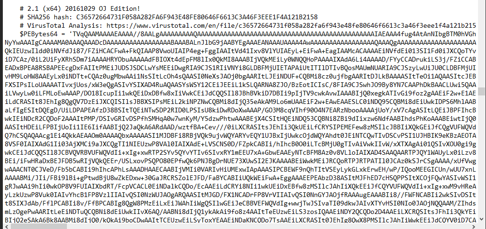

# [LetsDefend - ImageStegano](https://app.letsdefend.io/challenge/imagestegano)
Created: 02/04/2024 11:05
Last Updated: 02/04/2024 12:21
* * *
<div align=center>

ImageStegano

</div>
We are certain that there is something malicious in this image, but we do not know what it is. So we need you to investigate it and see if you can find any evidence.

**File Location**: C:\Users\LetsDefend\Desktop\ChallengeFile\Im493.zip

**WSL Username**: letsdefend
**WSL Password**: letsdefend
* * *
## Start Investigation
>Who is the “Device Manufacturer” according to the metadata?

Lets start by checking what we have first

We got 2 hash calcalators and a PowerShell, there is no Exiftool which mean it will be presented on Ubuntu WSL

There it is

```
Hewlett-Packard
```

>What is the CMM Type?


```
Linotronic
```

>What is the tool that created the payload inside the image?

Just search Google for Powershell Steganography

This is a tool to encodes powershell script into a png file that we're looking for
```
Invoke-PSImage
```

>After decoding the payload, can you find out the function's name?

I took a hint and found that I needed to find a blog from hack 4 career website

I finally found it, this blog subject is [Malicious Image](https://www.mertsarica.com/malicious-image/)

After reading this blog, We finally got a link to a [python script](https://github.com/mertsarica/hack4career/blob/master/codes/psimage_decoder.py) that this editor wrote

After I executed it, It was too much data to look up

Then I piped result to a text file

Which we can see that the embbeded script is a mimikatz, a popular credential dumping tool.
```
Invoke-Mimikatz
```

>There are two hidden executables in the decoded payload. What is the sha256 hash of the 32-bit version of the executable?


I didn't know capability of this tool so I kept scrolling down to search for something and I found that this tool even calculated hash of executables embbeded in this image

So I searched a Virus keyword for VirusTotal which I found 32-bit version of mimikatz as expected

```
BE3414602121B6D23FC06EDB6BD01AD60B584485266120C242877BBD4F7C8059
```

* * *
## Summary
This challenge is about teaching us on steganography which can be used to hide malicious payload inside an image file.

Which we learned that Invoke-PSImage module can be used to create a payload inside image then we also learned that this is a tool to decode it from Hack 4 Career.
<div align=center>


</div>

* * *
