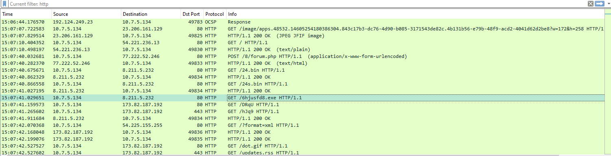

# [LetsDefend - Infection with Cobalt Strike](https://app.letsdefend.io/challenge/infection-cobalt-strike)
Created: 28/02/2024 13:40
Last Updated: 28/02/2024 16:36
* * *
<div align=center>

**Infection with Cobalt Strike**

</div>

We got network traffic from password stealer. You should do root cause analysis.
PCAP File (pass:321): [~~Download~~](https://files-ld.s3.us-east-2.amazonaws.com/5H42K.zip) C:\Users\LetsDefend\Desktop\Files\5H42K.7z

This challenge prepared by [@Bohan Zhang](https://www.linkedin.com/in/bohan-zhang-078751137/)

PCAP Source: malware-traffic-analysis
* * *
## Start Investigation
I got a pcap file to work with so I opened it with Wireshark
<div align=center>


First I opened the Protocol Hierarchy Statistics to see what I should filter and focus on, There are SMB2 and HTTP that worth looking for 
</div>
But there are so much noises so I switched from Wireshark to NetworkMiner
<div align=center>


After screening the Files section I found that [DocuSign](https://www.docusign.com/) the document signing service provider
</div>

There is several news about DocuSign that was used to deliver malware via phishing attack so I think thats the answer of the first question and initial access of the malware.


Now I knew the victim machine (10.7.5.134) so I went back to Wireshark to search anything specific on this IP address
<div align=center>


And this HTTP traffic caught my eyes right away, It is a request to `/swellheaded.php` then I followed TCP stream for the content of this conversation

The request was sent to `ecofiltroform.triciclogo.com` and the response was encoded with gzip

The request was sent again and now there are chunks of it then if not an encrypted text then it should be file transfer? file fetching from C2 server?


I closed Follow TCP Stream and Follow HTTP Stream instead and found the source code of the webserver front-end


Looking at the script it seems like when user enter this page, it sets cookie of the user from the calculated time zone then reloads the page to ensures that cookie is set so that's why we saw 2 requests were sent 

Now after the page has been reloaded the user will face with the other script, maybe because this user got the right cookie? but this new script is used to download a file for sure and the saveAS function takes 2 parameters which is blob and filename 
The second function take no parameter but it should be blob that getting pass for the saveAs function and it use [atob](https://developer.mozilla.org/en-US/docs/Web/API/atob) function which mean the content inside of it must be base64 encoded string

Scrolling to the end of response, and it seems like I was right, the above encoded string are used to create a blob and then pass to saveAs function with `0524_4109399728218.doc` as a file name then it redirects to docusign so It also confirmed that the attacker used docusign to deliver this malware
</div>

I went back to NetworkMiner to find if the malware were captured but sadly there is no doc file were captured so I guessed I need to get this malware and its hash to search on VirusTotal
<div align=center>


I located to where the NetworkMiner assembled files were created and downloads the malware from the largest html file

The MalDoc file was downloaded and I obtained the hash


I also used oletools to do static analysis and found that its has VBA macros and it will be run once it opened.

After reading some of the macro, look like it tries to run shell code with `rundll32.exe`


Searching the hash on [VirusTotal](https://www.virustotal.com/gui/file/0b22278ddb598d63f07eb983bcf307e0852cd3005c5bc15d4a4f26455562c8ec) and found that this malware where label as Valyria But after I did some research about Valyria I think this malware is not exactly Valyria but Hancitor based on this [Any.run](https://any.run/malware-trends/hancitor) and Relations section on the VirusTotal


Same C2 addresses, Same name


After opened, it runs `rundll32.exe` with this command as expected

And it also tries to connect to C2 server but sadly from this report its already downed


I went back to Wireshark and found this request was sent and its response with 200 HTTP Status. look at the body part of HTML request, its send information about the infected host to C2 server 

On this report, There I knew for sure that the last 2 were C2 addresses that the maldoc sent collected information to it but there is one address that remain unknown and its reputation is also malicious 

Which I found it on NetworkMiner and there 6 packets where captured from this address

Sadly nothing useful could be found, look like the connection wasn't establish?
</div>

I tried to do some research about this malware and found [Palo Alto Unit 42 Blog](https://unit42.paloaltonetworks.com/hancitor-infections-cobalt-strike/) that is very informative 
<div align=center>


After reading this blog, I figured it out what did i miss. including how the user was tricked to download the malware



And it turns out, I was blinded by the same filter and should focus on http filter instead also this malware also has a second payload as an executable file


Here after it contacts first C2 server, it also contacts another one and requested for 2 `.bin` files and 1 executable file so this is the second payload that I was looking for

I searched it on NetworkMiner to grab the hash and search on VirusTotal again


Sure enough, It's ficker stealer

The contacted URLs are also similiar 

it also confirmed the public IP address of the victim machine 
</div>

Hancitor malware will send Cobalt Strike when it infects a host that joined Active Directory and from the image below (request that was sent to C2)
<div align=center>


The domain is `STORMRUNCREEK`

These request might related to Cobalt Strike, so now we got the Cobalt Strike C2 server address

The connection were established to port 443 of Cobalt Strike C2 Server but since its encrypted, i guessed its enough for now and go back to the question how did this user get tricked to download the malicious maldoc.


The answer was already covered from the Unit42 blog post, There are some communications with google docs so I think this is the answer
</div>


* * *
> Investigate the PCAP file, what is one of the popular document signing services used by the attacker to deliver the malware?
```
docusign
```

> Investigate the PCAP file, what is the full URL used by the attacker to create the malicious document?
```
http://ecofiltroform.triciclogo.com/swellheaded.php
```

> On the malicious website from the previous question, what kind of encoding technique used by the attacker to create the malicious document?
```
base64
```

> What is the name of the malicious document opened by the user?
```
0524_4109399728218.doc
```

> What malware family this malicious file belongs to?
```
hancitor
```

> After the user interacts with the malicious file, it runs malicious DLL on the system. What is the DLL run command?
```
rundll32.exe c:\users\[username]\appdata\roaming\microsoft\word\startup\ket.t,EUAYKIYBPAX
```

> What is the C2 URL?
```
http://euvereginumet.ru/8/forum.php
```

> What is the URL that serves the payload?
```
http://gromber6.ru/6hjusfd8.exe
```

> What is the name of the malware this payload links back to?
```
ficker stealer
```

> What is the popular hacking framework being used in this campaign?
```
cobalt strike
```

> What is the popular storage service used by the attacker to deliver the malware?
```
google docs
```

* * *
## Summary
The URL of phishing google docs was sent to user and tricked user to download the Malicious Document (Hancitor malware) that contains malicious VBA macros which will be executed when it opens and user opened it then `rundll32.dll` command was ran, Its send the information about the user machine to C2 server which this machine was also joined the domain then the requests was made to another C2 server to download ficker stealer malware and cobalt strike C2 server connection were established.

<div align=center>


</div>

* * *
