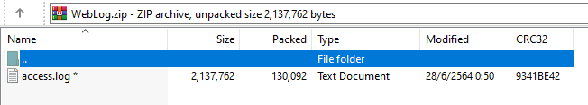
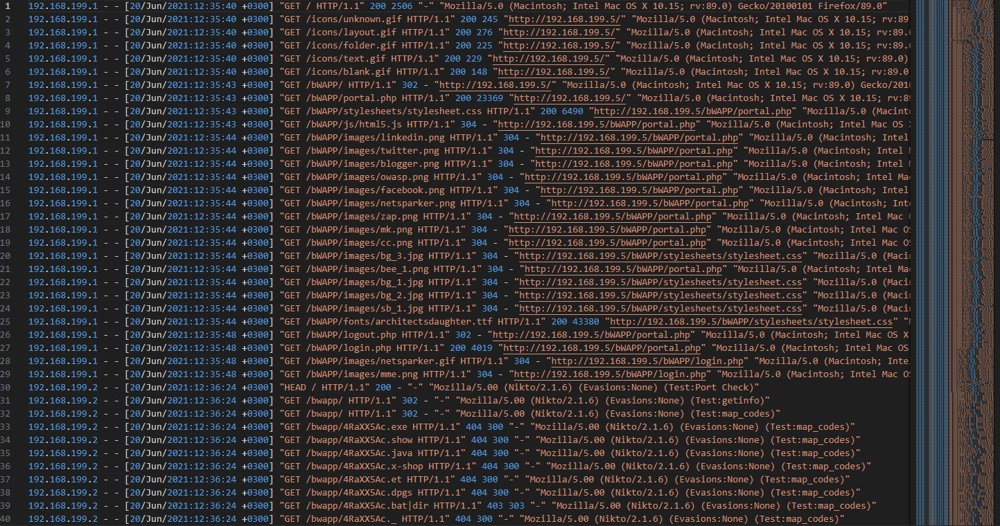
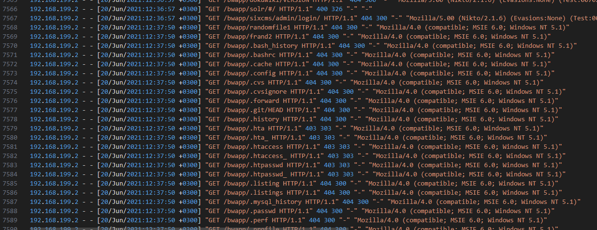
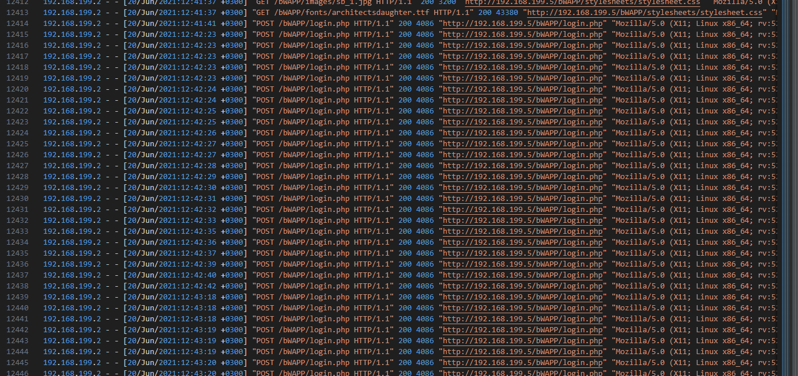
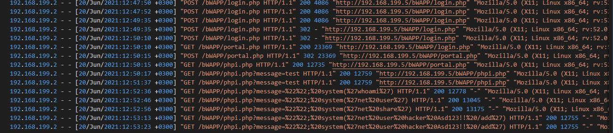
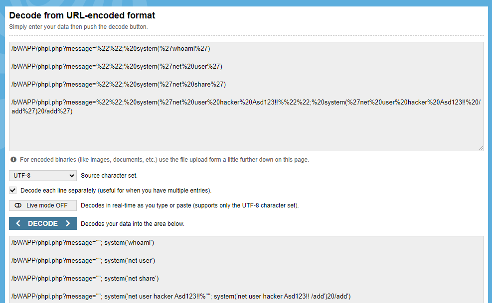
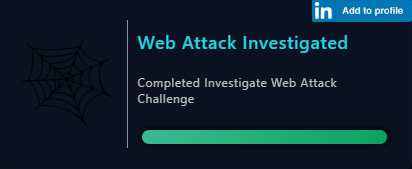

# [LetsDefend - Investigate Web Attack](https://app.letsdefend.io/challenge/investigate-web-attack)
Created: 15/01/2024 12:02
Last Updated: 19/01/2024 08:52
* * *
<div align=center>

**Investigate Web Attack**

</div>

We detected some web attacks and need to deep investigation.

Challenge Files (pass:infected): [Download](https://files-ld.s3.us-east-2.amazonaws.com/WebLog.zip)

* * *
## Start Investigation
Let's start unzip and open this log file!

<div align=center>



At first glance, it seems that this website has been targeted by Nikto, a web vulnerability scanner, as indicated by the user-agent identified in the web server logs.

The observed activity aligns with characteristics typically associated with the Nikto tool. The tool seems to be conducting web reconnaissance through directory brute-forcing.

After discovering directories, it appears that there have been multiple attempts at accessing `/bWAPP/login.php`. This suggests the possibility of a brute force attack targeted at the login page.

After scrolling through the logs, I found a HTTP 302 status codes (Redirects), indicating that the attacker has successfully brute-forced their way through.


After successfully gaining access to the website through brute force attacks, the attacker identified a code injection vulnerability through `whoami` command. Subsequently, they attempted to exploit this vulnerability to inject code and establish persistence by adding a user to the system.
</div>

* * *
>Which automated scan tool did attacker use for web reconnansiance?
```
nikto
```

>After web reconnansiance activity, which technique did attacker use for directory listing discovery?
```
directory brute force
```

>What is the third attack type after directory listing discovery?
```
brute force
```

>Is the third attack success?
```
yes
```

>What is the name of fourth attack?
```
code injection
```

>What is the first payload for 4rd attack?
```
whoami
```

>Is there any persistency clue for the victim machine in the log file ? If yes, what is the related payload?
```
%27net%20user%20hacker%20Asd123!!%20/add%27
```

* * *
## Summary

<div align=center>


Badge Acquired
</div>

* * *