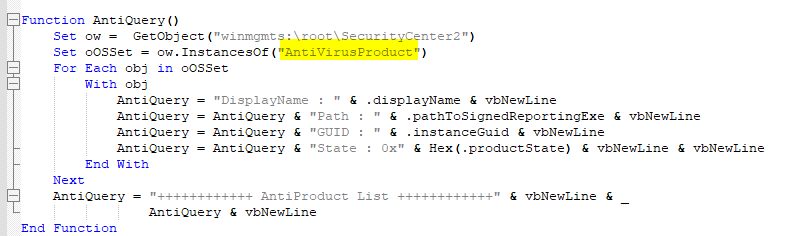
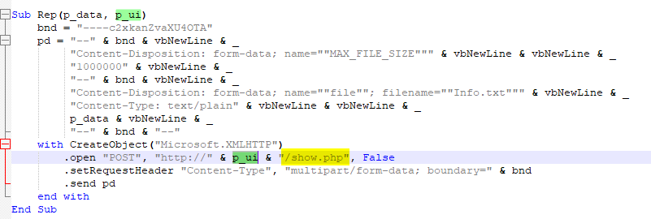

# [LetsDefend - Kimsuky APT Group](https://app.letsdefend.io/challenge/kimsuky-apt-group)
Created: 22/03/2024 12:24
Last Updated: 22/03/2024 13:13
* * *
<div align=center>

**Kimsuky APT Group**

</div>
You work as a malware analyst for a cybersecurity company that has received a sample of malware. The malware is believed to be distributed by the threat group Kimsuky, which has targeted various organizations in the past. Your task is to analyze the sample and answer the following questions.

**Malware location**: Desktop/Kimsuky/Kimsuky.vbs
**Note**: You can install any tools on the system.

This challenge prepared by [@MalGamy12](https://twitter.com/MalGamy12)

* * *
## Start Investigation
>What is number of information that is retrieved from the "SyInf" function?

We got a VBscript file to work with so just open with NotePad++ or VSCode to analyze the script


SyInf is the first function that use WMI to queried from `Win32_ComputerSystem`,`Win32_OperatingSystem` and `Win32_Processor` for 9 information about an endpoint that executed this script
```
9
```

>Which WMI class is used in the "AntiQuery" function to retrieve antivirus product information?


Inside AntiQuery function, WMI will be used to get an instance of `AntiVirusProduct` and then get a list of all AntiVirusProduct on an endpoint
```
AntiVirusProduct
```

>What is the name of the file that the "Rep" subroutine includes with the data when sending it to a specified URL?


This function is used to send all the information that collected using this script inside `Info.txt` to C2 server 
```
Info.txt
```

>Which registry key is modified by the "SetIEState" subroutine to have a value of "no"?


This function is modify registry keys of Internet Explorer to 
- not check file type and will open any file directly without checking
- not prompt the user to customize settings or perform any initial configuration steps the first time it is launched.
- Users will not be redirected from Internet Explorer to Microsoft Edge during migration processes.

```
HKCU\Software\Microsoft\Internet Explorer\Main\Check_Associations
```

>Which shell operation is used to retrieve the root directory path?


This function is used to retrieve directories of an endpoint.
```
osa.Self.Path
```

>What is the property that lists the recent files retrieved in the "FInf" function?


This function is used to retrieve Word Application Recent Files that was opened and specific folder which is `\Downloads`
```
obWord.RecentFiles
```

>Which WMI class is used in the "QProc" function to retrieve the list of running processes?


This function used to retrieve information about process on an endpoint
```
Win32_Process
```

* * *
## Summary

To summarize what this VBscript can do, ChatGPT is a nice tool to sum up this VBscript for us 
>**ChatGPT 3.5**: This VBScript appears to be collecting system information, including computer details, operating system information, processor details, recent files in Word, directory contents, process list, and antivirus product information. It then encodes this information in base64 format, sends it to a specified URL via HTTP POST request, and schedules the script to run periodically. <br>
Here's a breakdown of what each function does: <br>
>1. **SyInf**: Collects basic system information such as computer name, owner name, manufacturer, computer model, system type, operating system details, and processor information.
>2. **SpDir**: Retrieves the contents of specified directories, including subdirectories and files.
>3. **FInf**: Retrieves recent files in Word and directory contents of specific folders.
>4. **QProc**: Queries and retrieves a list of running processes along with their process IDs and session IDs.
>5. **AntiQuery**: Queries and retrieves information about installed antivirus products.
>6. **CStr2Bin**: Converts a string to binary data.
>7. **b64**: Encodes binary data in base64 format.
>8. **Rep**: Sends data to a specified URL via HTTP POST request.
>9. **TF**: Formats a given date and time into the required format.
>10. **Reg**: Registers the script as a scheduled task to run periodically.
>11. **SetIEState**: Modifies registry settings related to Internet Explorer. 

>The script concludes by collecting system information, encoding it in base64, sending it to the specified URL, and scheduling the script to run again in the future. <br>
It's important to note that this script appears to collect sensitive system information and transmit it over the internet, potentially violating privacy and security policies. Additionally, modifying registry settings and scheduling tasks should be done cautiously and with proper authorization.

After learning what these function do, you can go back to the script to study how it really works

<div align=center>


</div>

* * *
