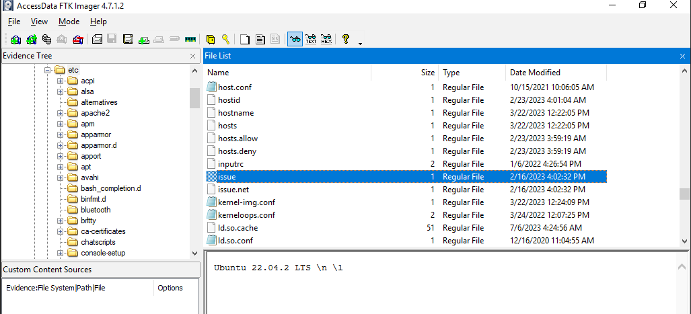
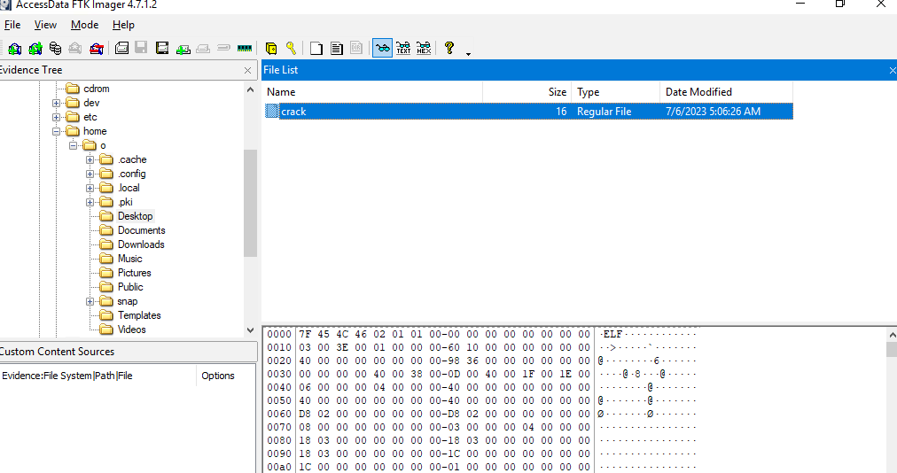
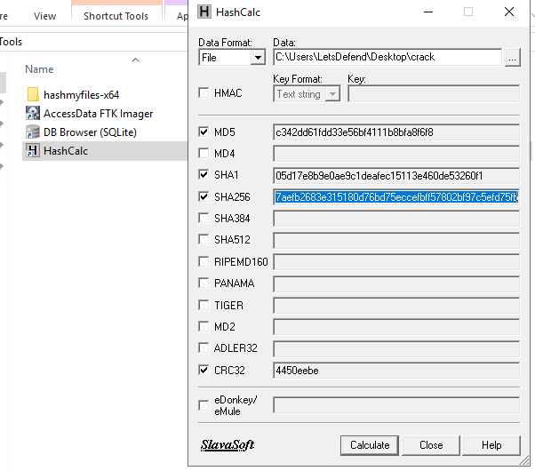
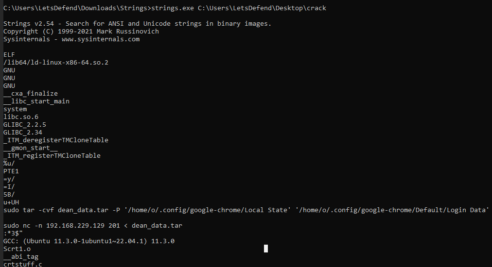
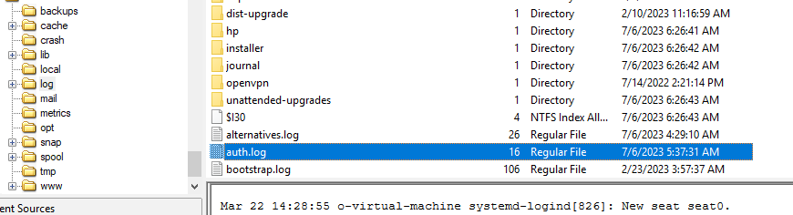

# [LetsDefend - Linux Disk Forensics](https://app.letsdefend.io/challenge/linux-disk-forensics)
Created: 02/04/2024 15:26
Last Updated: 03/04/2024 08:48
* * *
<div align=center>

**Linux Disk Forensics**

</div>
Dean downloaded a cracked software application from an unofficial source and subsequently discovered that his personal data has been leaked. An investigation is now underway to determine the cause of the data leak and mitigate any potential damage.

**Evidences:**`C:\Users\LetsDefend\Desktop\L34K.7z`
* * *
## Start Investigation
> What distribution system was used by the victim, including its version?

We can see which linux distro of this system by reading `/etc/issue` content

```
Ubuntu 22.04.2 LTS
```

>What is the SHA256 hash of the crack file that was downloaded?


There is only 1 user directory, most of directories are empty except for Desktop which have a ELF file there

Export the file and calculate hash the way you want.
```
d73e103c7a980417aefb2683e315180d76bd75eccefbff57802bf97c5efd75fb
```

> What is the IP address and port used by the attacker?
**Answer Format:** IP:Port


I used `strings` for this question and it was very effective, we can see that this file aimed to compress google chrome's data to `dean_data.tar` then send to a specific IP address using netcat, it was designed for this user only.
```
192.168.229.129:201
```

> What is the specific tool or software employed by the attacker?
```
netcat
```

> Which was the year of the last use of the Dean account?


Lastest Updated on `auth.log` is 2023 so its 2023
```
2023
```

* * *
## Summary
The cracked software that was downloaded is a malware that designed especially to collect Google Chrome data of Dean then send them back using netcat.

<div align=center>


</div>

* * *
