# [LetsDefend - Linux Forensics](https://app.letsdefend.io/challenge/linux-forensics)
Created: 20/03/2024 13:01
Last Updated: 21/03/2024 12:18
* * *
<div align=center>

**Linux Forensics**

</div>
An ex-employee, who appears to hold a grudge against their former boss, is displaying suspicious behavior. We seek assistance in uncovering their intentions or plans.

Image file location: /home/analyst/hackerman.7z
Or directly download: [Image file](https://letsdefend-images.s3.us-east-2.amazonaws.com/Challenge/Linux-Forensics/hackerman.7z)

This challenge prepared by [@MMOX](https://www.linkedin.com/in/0xMM0X)
* * *
## Start Investigation
>What is the MD5 hash of the image?

If you investigated on LetsDefend platform, you can just use `7z x hackerman.7z` to decompress image file then use `md5sum` to calculate hash of this image file
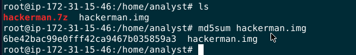
```
6be42bac99e0fff42ca9467b035859a3
```

>What is the SHA256 hash of the file in the "hackerman" desktop?

To investigate an image file on Linux, First we need to mount and image and to do that this [stackexchange question](https://unix.stackexchange.com/questions/82314/how-to-find-the-type-of-an-img-file-and-mount-it) will help you
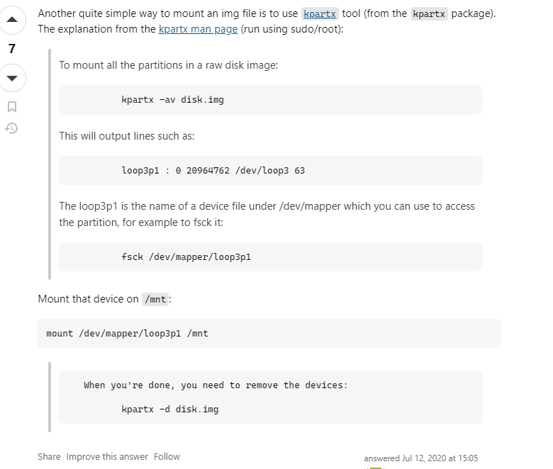
I used this method to mount an image file to `/mnt` directory
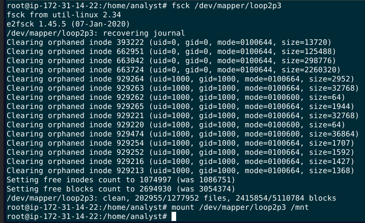
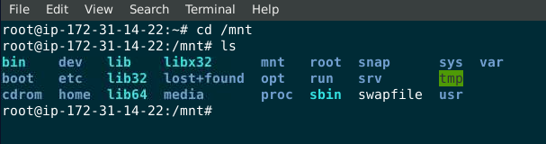
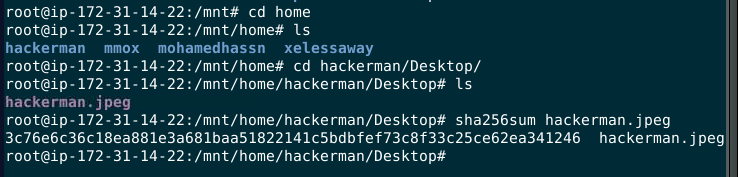
Then when we successfully mounted an image file, go to `/home/hackerman/Desktop` you will find a jpeg file then use `sha256sum` to calculate SHA256 hash of this jpeg file

```
3c76e6c36c18ea881e3a681baa51822141c5bdbfef73c8f33c25ce62ea341246
```

>What command did the user use to install Google Chrome?

on user's home directory there is `.bash_history` that likely to log command histories of this user to lets grab that 
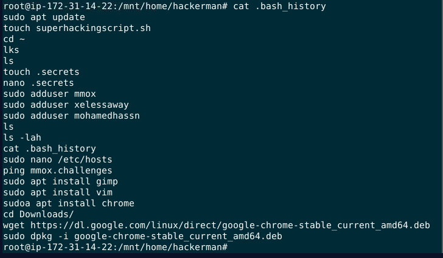
This user installed google chrome stable via `dpkg`
```
sudo dpkg -i google-chrome-stable_current_amd64.deb
```

>When was the Gimp app installed? Answer format: yyyy-mm-dd hh:mm:ss

When installed something on linux there are 1 or 2 package management software that came by default depending on Linux Distroburtion, `apt` is one of them and it logs every software installed using this software at `/var/log/apt/history.log`
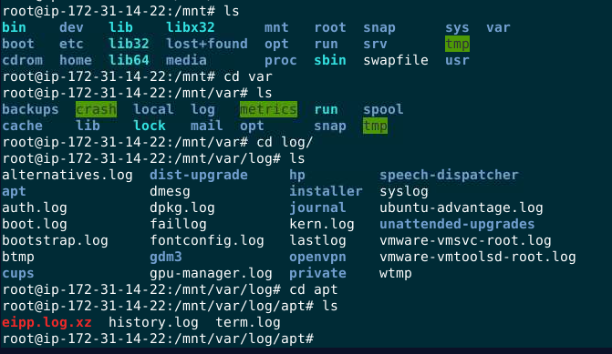
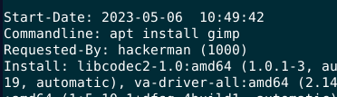
read `history.log` we can see when gimp was installed
```
2023-05-06 10:49:42
```

>What is the hidden secret that the attacker believes they have successfully concealed in a secret file?

When I searched for `.bash_history`, I also found `.secret` file on `/home/hackerman` directory
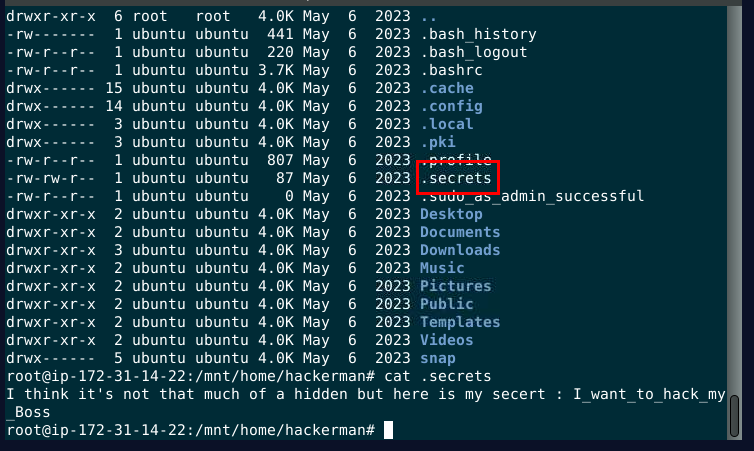
```
I_want_to_hack_my_Boss
```

>What was the UUID of the main root volume?

I did some [research](https://unix.stackexchange.com/questions/658/linux-how-can-i-view-all-uuids-for-all-available-disks-on-my-system) and found that I can obtain the answer from `/etc/fstab`
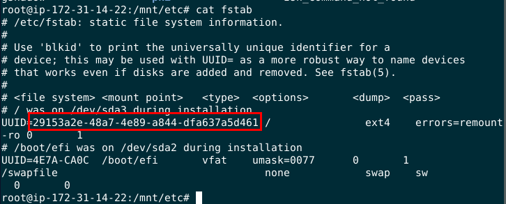
```
29153a2e-48a7-4e89-a844-dfa637a5d461
```

>How many privileged commands did the user run?

from `.bash_history`, I knew for sure that `sudo` is priviledge command so I used `grep` on `auth.log` with `COMMAND=` to find how many sudo command was ran
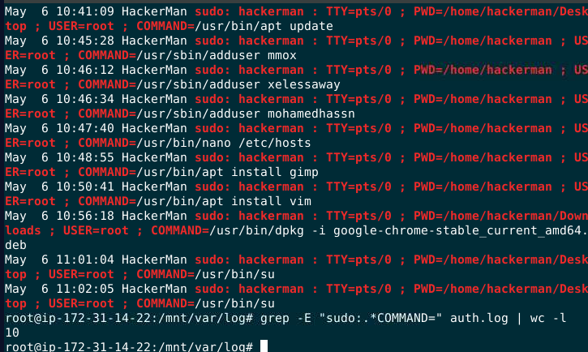
10 but when I submitted, look like sudo is not the only command that being used here
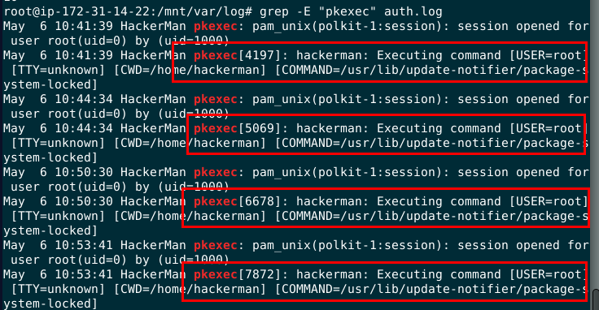
I did some more research and found that `pkexec` is also a priviledged command
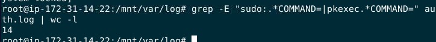
Count both of them, got 14 in total
```
14
```

>What is the last thing the user searches for in the installed browser?

hackerman installed google chrome so the browser artifact will be presented on user's home directory under `.config` directory
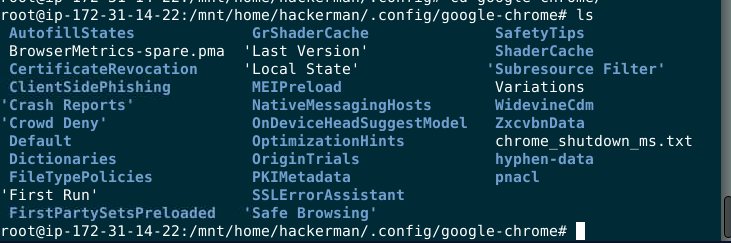
Went to `/home/hackerman/.config/google-chrome/Default`, then you will see `History` file which is a database file
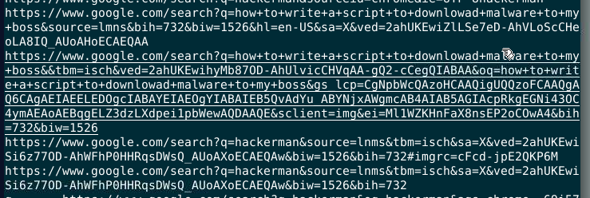
I used `string` command then I found that this is the lastest search url of this user
```
how to write a script to downlowad malware to my boss
```

>From Q8 we know that the user tried to write a script, what is the script name that the user wrote?

on `.bash_history`, I saw that there is a shell script that was created
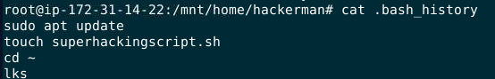
I got a name
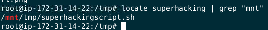
and it was located at `/tmp` directory
```
superhackingscript.sh
```

>What is the URL that the user uses to download the malware?

Print out the content of the script
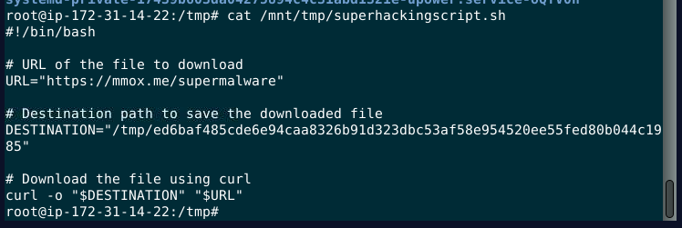
We got a URL and something like a hash of this malware?
```
https://mmox.me/supermalware
```

>What is the name of the malware that the user tried to download?

To confirm my speculation, I searched that string that look like hash to VirusTotal
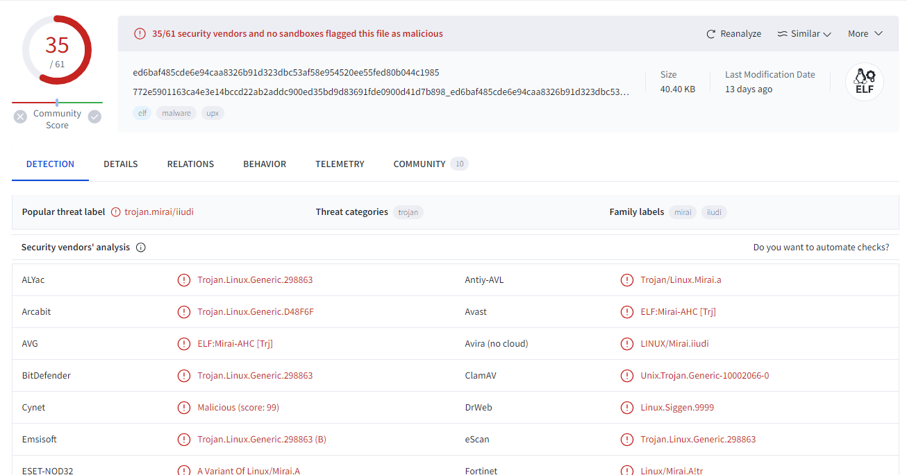
It is a hash of Mirai botnet
```
mirai
```

>What is the IP address associated with the domain that the user pinged?

There is no log when user pinged something but there is `/etc/hosts` that used in matching an FQDN with the server IP hosting a specific domain.
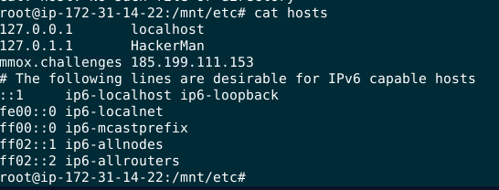
```
185.199.111.153
```

>What is the password hash of the "hackerman" user?

grab the `/etc/shadow`
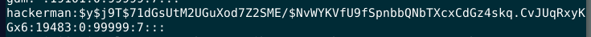
```
$y$j9T$71dGsUtM2UGuXod7Z2SME/$NvWYKVfU9fSpnbbQNbTXcxCdGz4skq.CvJUqRxyKGx6
```

* * *
## Summary

From this disk/image analysis we're learned that this image has a user named hackerman who likely to be an employee from certain organization, which has sudo priviledge on the machine and could be an insider threat of this organization based on evidence found from google search history and a script that will download Mirai botnot on his boss machine.
<div align=center>

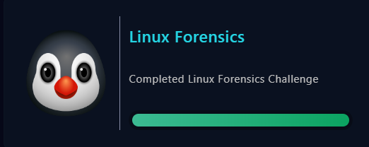
</div>

* * *
