# [LetsDefend - Linux Memory Forensics](https://app.letsdefend.io/challenge/linux-memory-forensics)
Created: 11/05/2024 14:11
Last Updated: 07/06/2024 08:58
* * *
<div align=center>

**Linux Memory Forensics**

</div>

Ghazy, my friend, is new to web development and started his website, but it seems that the website was vulnerable and one of the attackers was able to get root access. Could you examine this memory dump for us?

**File Location:** /root/Desktop/ChallengeFile/MyW3B.7z
**Volatility2 Command:** vol.py
**Volatility3 Command:** vol
* * *
## Start Investigation
> What is the Linux kernel version of this memory dump?

There are 2 ways to archive this 

First by using strings and search for "BOOT_IMAGE" like this
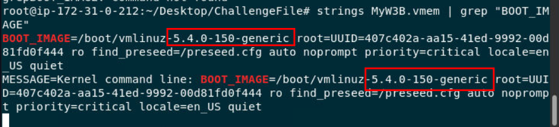

Second is to grab the banners from memory file

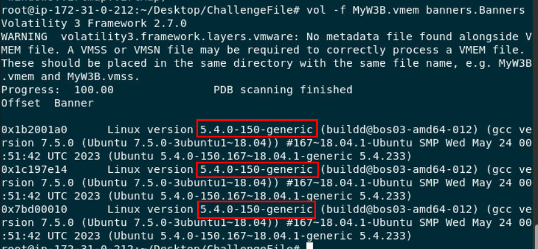
we will use `vol.py -f MyW3B.vmem banners.Banners` to grab Linux banners

```
5.4.0-150-generic
```

> What was the command that our friend Ghazy used to run his website?

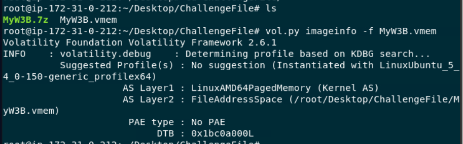
But we need to determine which memory profile we should use first ( `vol.py -f MyW3B.vmem imageinfo`)

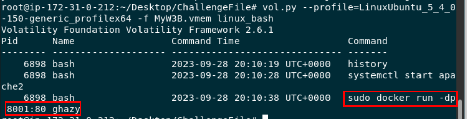
Then use `vol.py --profile=LinuxUbuntu_5_4_0-150-generic_profilex64 -f MyW3B.vmem linux_bash` to recover bash history then we can see that user ghazy used docker to run his website
```
sudo docker run -dp 8001:80 ghazy
```


> We are sure that the attacker has uploaded a shell to the site. Can you get the Inode address?

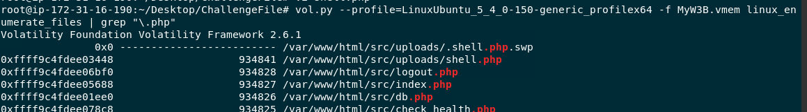

I used `vol.py --profile=LinuxUbuntu_5_4_0-150-generic_profilex64 -f MyW3B.vmem linux_enumerate_files | grep "\.php"` to enumerate all files as much as possible then find for ".php" since its a shell for web server to execute so I expected it to be php file which I was right  

```
0xffff9c4fdee03448
```


> What is the attacker's IP address and port?
**Answer Format:** IP:Port

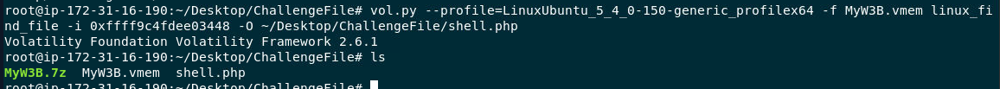

I used netstat plugin but couldn't find anything so I have to use `vol.py --profile=LinuxUbuntu_5_4_0-150-generic_profilex64 -f MyW3B.vmem linux_find_file -i 0xffff9c4fdee03448 -O ~/Desktop/ChallengeFile/shell.php` to dump `shell.php` to read the content inside

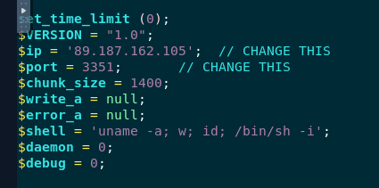
Its a typical php reverse shell that many hackers are used so it won't be hard to find where IP address and Port are declared

```
89.187.162.105:3351
```

> According to the IP address you got, what is the country of the attacker?

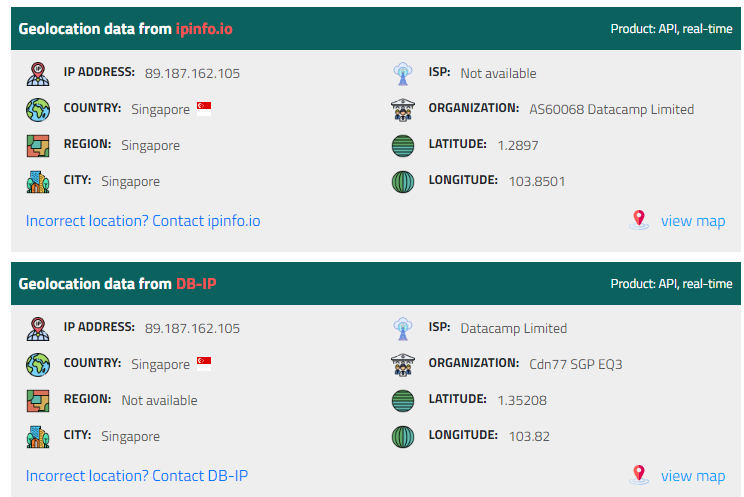
According to IP location, This IP address located in Singapore 

```
Singapore
```

> What is the name of the user with UID value 1000?

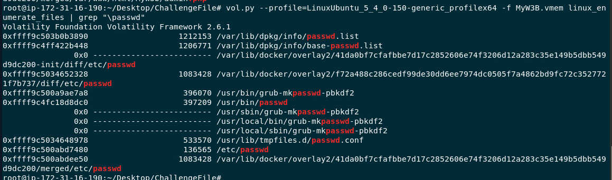

We need to use `vol.py --profile=LinuxUbuntu_5_4_0-150-generic_profilex64 -f MyW3B.vmem linux_enumerate_files | grep "passwd"` to grab Inode of `/etc/passwd` file which contain uid of all users

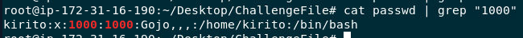

Then use `vol.py --profile=LinuxUbuntu_5_4_0-150-generic_profilex64 -f MyW3B.vmem linux_find_file -i 0xffff9c500abd7480 -O ~/Desktop/ChallengeFile/passwd` to dump it which we can see that UID 1000 is kirito user

```
kirito
```

> What is the IP address of the victim?

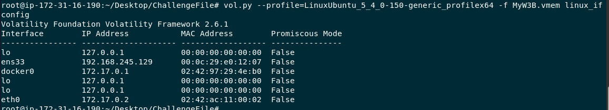

Luckily for us that `vol.py --profile=LinuxUbuntu_5_4_0-150-generic_profilex64 -f MyW3B.vmem linux_ifconfig` could be used and the IP address that match answer format is from ens33 interface

```
192.168.245.129
```


* * *
## Summary

On this challenge, we used volatility to analyze Linux memory dump which hosted a website with docker and eventually attacked by an attacker via well shell that uploaded to a site then we will use volatility plugin to dump files and look up for network interface on this memory dump while it was captured.

<div align=center>


</div>

* * *
