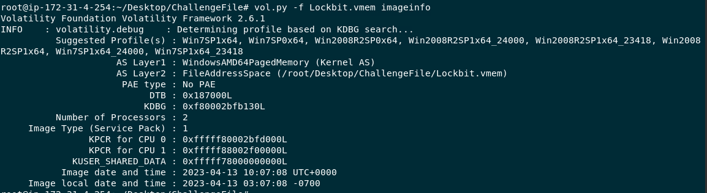

# [LetsDefend - LockBit](https://app.letsdefend.io/challenge/lockbit)
Created: 19/06/2024 17:25
Last Updated: 23/09/2024 08:21
* * *
<div align=center>

**LockBit**

</div>

You are a Digital Forensics and Incident Response (DFIR) analyst tasked with investigating a ransomware attack that has affected a company's system. The attack has resulted in file encryption, and the attackers are demanding payment for the decryption of the affected files. You have been given a memory dump of the affected system to analyze and provide answers to specific questions related to the attack.


Memory dump (password: infected): /root/Desktop/ChallengeFile/Lockbit.zip

This challenge prepared by [@MMOX](https://www.linkedin.com/in/0xMM0X)
* * *
## Start Investigation
>Can you determine the date and time that the device was infected with the malware? (UTC, format: YYYY-MM-DD hh:mm:ss)



After determine which profile to use with `vol.py -f Lockbit.vmem imageinfo` then we can use pstree plugin or other similar plugin related to process to list all processes to find which process is the most suspicious one


After using `vol.py -f Lockbit.vmem --profile=Win7SP1x64 pstree`, we can see that malware process doesn't hide itself at all

```
2023-04-13 10:06:45
```

>What is the name of the ransomware family responsible for the attack?


I used `vol.py -f Lockbit.vmem --profile=Win7SP1x64 cmdline` to find full path of this malware


Then I used `vol.py -f Lockbit.vmem --profile=Win7SP1x64 filescan > filescan.txt` and  `grep "mal.exe" filescan.txt` to find an offset of this file then dump it with `vol.py -f Lockbit.vmem --profile=Win7SP1x64 dumpfiles -Q 0x000000007cde5320 -D .`


Then search filehash on VirusTotal, we can see that its lockbit ransomware just like the name of this challenge

```
lockbit
```

>What file extension is appended to the encrypted files by the ransomware?


Go to dropped files under Relations and Behavior tab then we can see that all encrypted files have `.lockbit` extension 

```
.lockbit
```

>What is the TLSH (Trend Micro Locality Sensitive Hash) of the ransomware?


Go to Details tab for this question

```
T119E3163DB459E165C8CF04B57E2516BAD671F83C037989F3EBD38C299420EE86626B07
```

>Which MITRE ATT&CK technique ID was used by the ransomware to perform privilege escalation?


This malware has many activities falls under Privilege Escalation tactic but an answer of this question is Windows Service

```
T1543
```

>What is the SHA256 hash of the ransom note dropped by the malware?


Go to Behavior tab, and find a file dropped that look like ransomnote and append details for SHA256 

```
67c6784a5296658ac4d633f4e8c0914ecc783b1cf2f6431818c4e2f3cdcce91f
```

>What is the name of the registry key edited by the ransomware during the attack to apply persistence on the infected system?


Under Registry Edited section, we can see that this weird value was added to Run registry key

```
XO1XADpO01
```

* * *
## Summary

Its an easy challenge that can be solved using Volatility and VirusTotal or other malware analysis platform to solve and the ransomware that infected this system is LockBit ransomware.

<div align=center>


</div>

* * *
