# [LetsDefend - Log Analysis With Sysmon](https://app.letsdefend.io/challenge/log-analysis-with-sysmon)
Created: 02/09/2024 22:37
Last Updated: 03/09/2024 00:38
* * *
<div align=center>


**Log Analysis With Sysmon**
</div>
Our company has experienced a breach on one of its endpoints. Your task is to investigate the breach thoroughly by analyzing the Sysmon logs of the compromised endpoint to gather all necessary information regarding the attack.

**File location**: C:\Users\LetsDefend\Desktop\ChallengeFile\Sysmon_chall.zip

**File Password**: infected
* * *
## Start Investigation
>Which file gave access to the attacker?

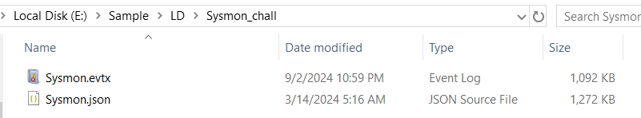

We were given 2 files, one is sysmon event log file and another one is the same but in json so you might want to import that json file to splunk which will make this challenge a lot easier.

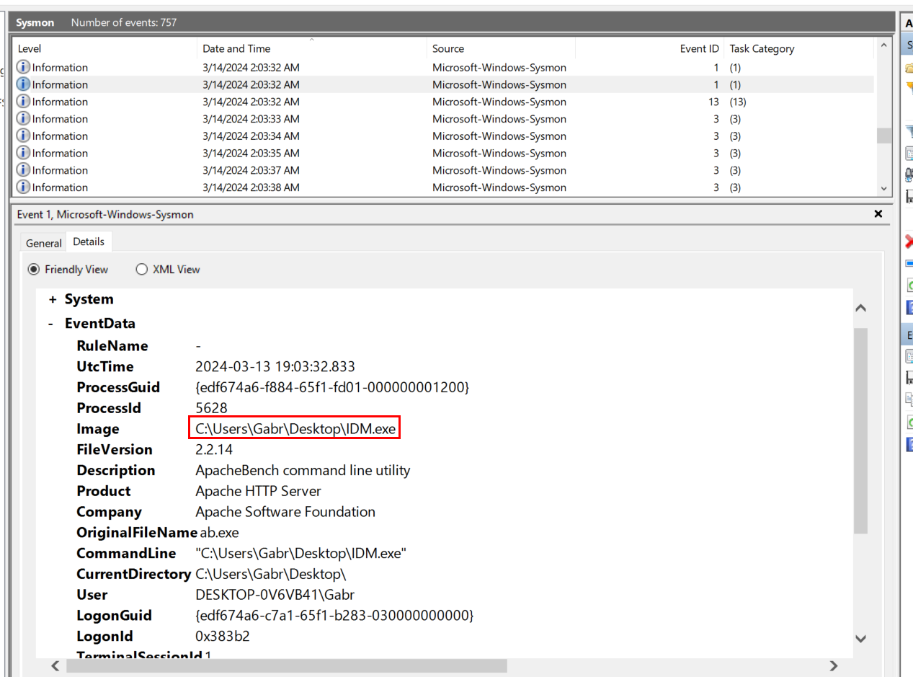

I started by filtering Sysmon Event ID 1 (Process Created) to find a process that should not be there and find a context of that proces, which we can see that there is one process that picked my interest which is `IDM.exe`.

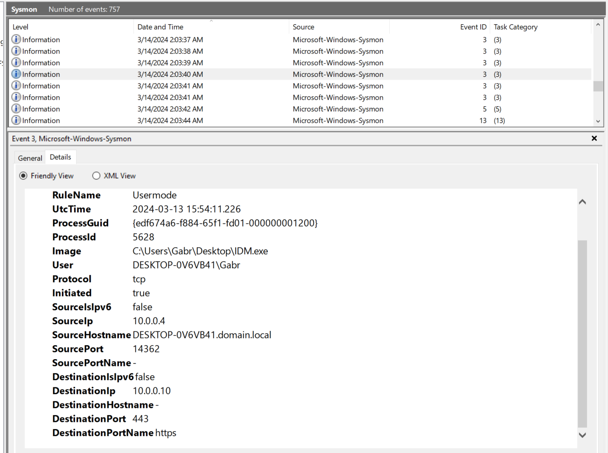

So after this process started, there are sevaral Sysmon Event ID 3 (Network connection detected) tried to establish a connection to "10.0.0.10"

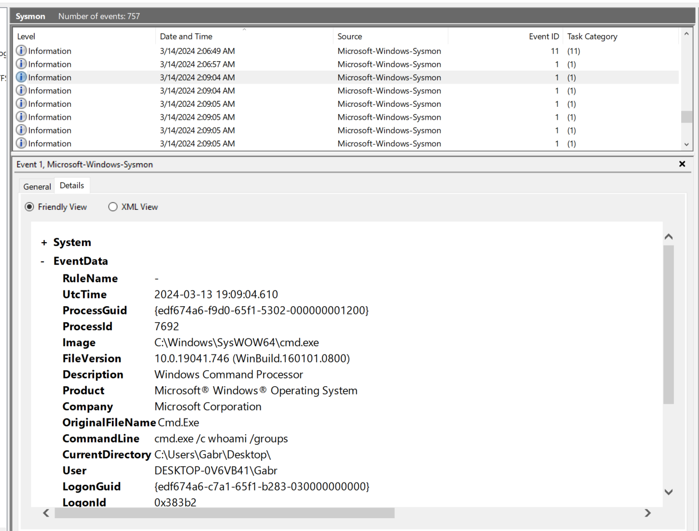

Which eventually leaded me to here, command execution via CMD so `IDM.exe` is the payload that made connection back to the attacker as reverse shell.

```
IDM.exe
```

>What did the attacker use to bypass UAC? Mention the EXE.

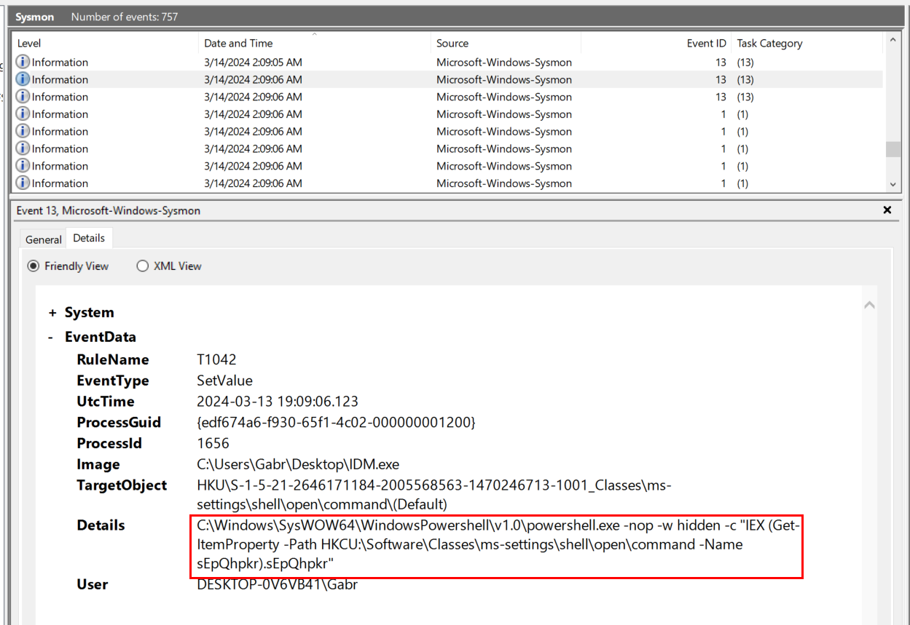

Since we already know payload name, then we could use "find" or keep scrolling to find what happened next after command execution by the attacker, which we can see that there was a command shell command attempted to set a registry key (Sysmon Event ID 13 - RegistryEvent (Value Set))

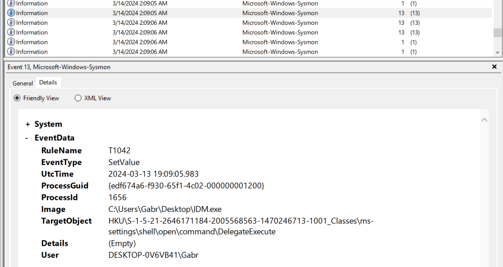

There is another registry key set event here.

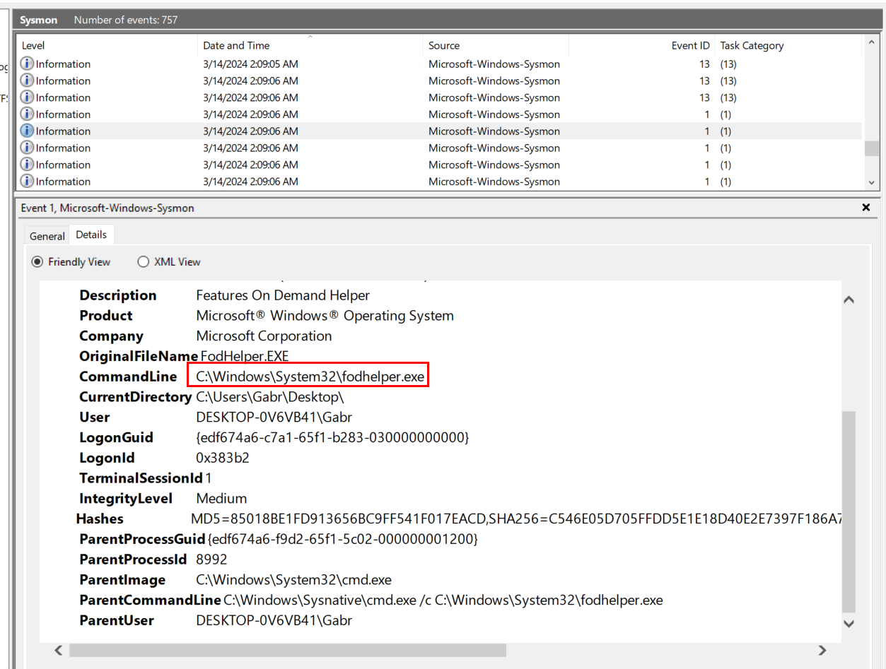

And the executable file that was executed at the same time as those registry key set is `fodhelper.exe`

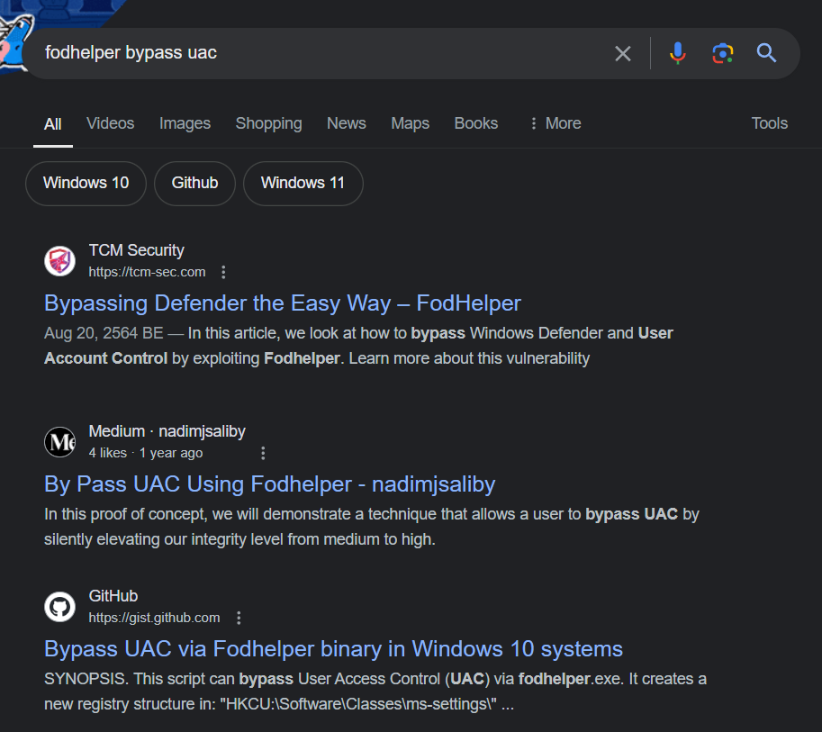

Which is popular trusted binary of Windows being known for Bypassing UAC and execute commands as Administrator and those registry keys set are the indicators that UAC bypassing was actually happened.

```
fodhelper.exe
```

>What registry path and value was used by the above EXE to gain higher privileges? (path\value)
```
HKCU:\Software\Classes\ms-settings\shell\open\command\sEpQhpkr
```

>The attacker dropped a file. What is the file location?

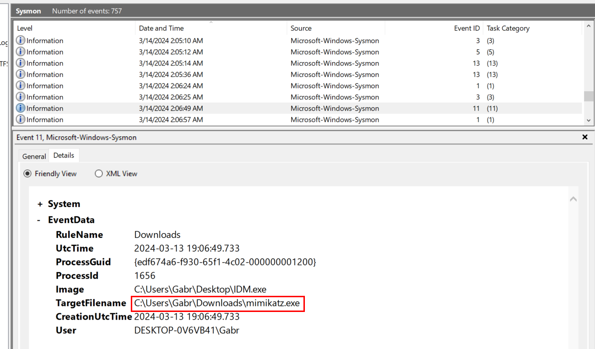

Filtered by Sysmon Event ID 11 (FileCreate) then we could see that `IDM.exe` downloaded mimikatz to infected system.

```
C:\Users\Gabr\Downloads\mimikatz.exe
```

>What are the technique name and ID used by the dropped EXE?

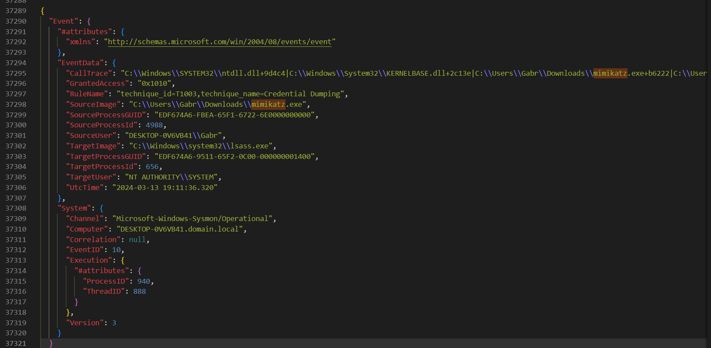

Sysmon usually logged RuleName which based on MITRE ATT&CK framework but I could not find credential dumping event from event log file (Mimikatz is well-known for credential dumping) so I searched for `mimikatz` on json file and then we can see both technique name and ID used by `mimikatz`.  

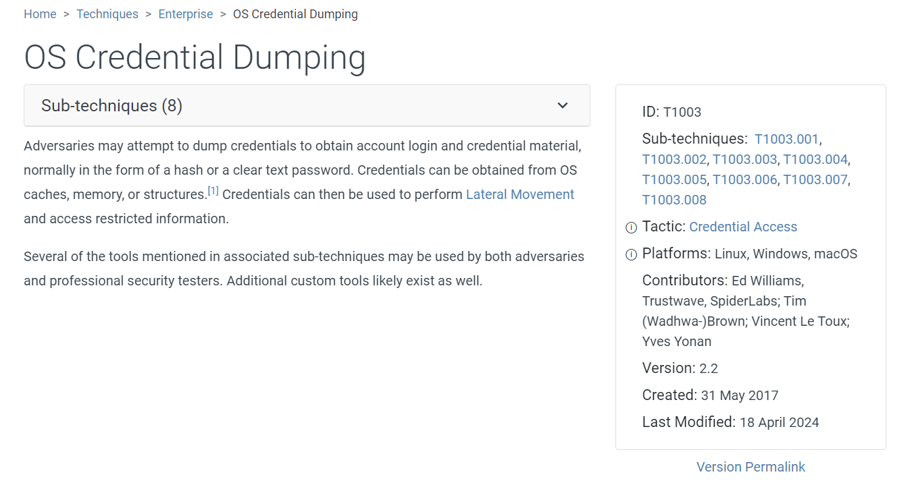

You can read more about this technique [here](https://attack.mitre.org/techniques/T1003/).

```
Credential Dumping: T1003
```

>What is the name of the attack?

Mimikatz is also known for "pass the hash" which use NTLM hash dumping from lsass to authenticate and launch another process (normally cmd or powershell) as that user (Read more about Pass The Hash attack [here](https://www.netwrix.com/pass_the_hash_attack_explained.html?source=post_page-----edb6fb3022b7--------------------------------))

```
pass the hash
```

>What EXE did the attacker run using elevated privileges from the above attack?

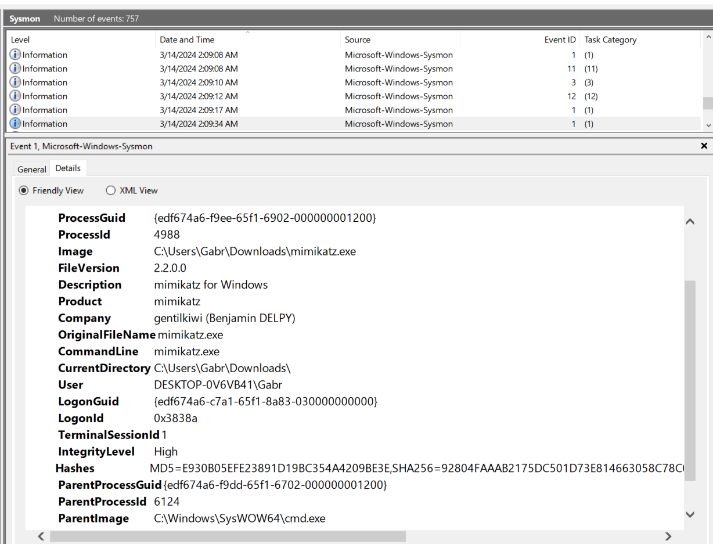

So we need to know "ProcessId" of `mimikatz` process first then we can use this "ProcessId" to find for child process of `mimikatz` process and in this case, "ProcessId" of `mimikatz` is "4988"

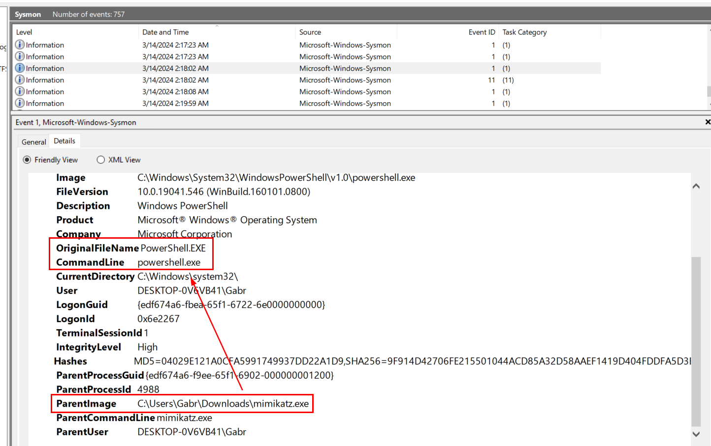

Search for "ParentProcessId 4988" which we can see that `powershell.exe` is a process spawned by pass the hash attack.

```
powershell.exe
```

>The attacker downloaded and ran a file. What is the filename?

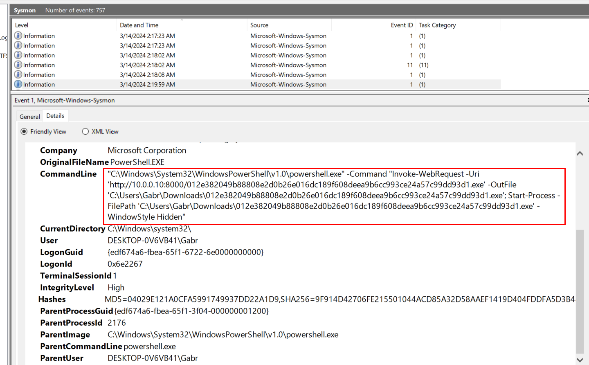

We already know ProcessID of powershell process so we could use that to find any commands used by the attacker or file download event which will leads us to this payload being downloaded with PowerShell IWR cmdlet and executed it with `Start-Process`.

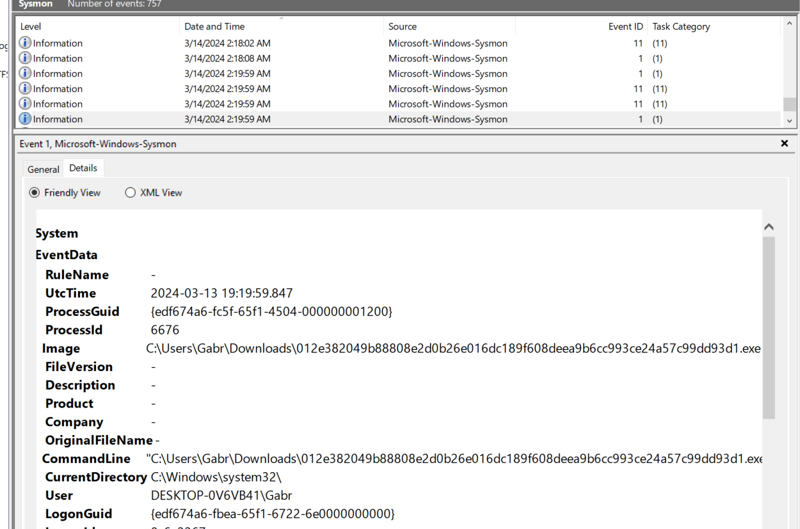

And here is ProcessID of this process

```
012e382049b88808e2d0b26e016dc189f608deea9b6cc993ce24a57c99dd93d1.exe
```
* * *
## Summary
On this challenge, we investigated sysmon log to uncover reverse shell activities started from a initial payload that made a connection to the attacker then leads to mimikatz execution to dumping NTLM hash and finally use that hash to spawn another powershell process to download and execute another payload.

<div align=center>


</div>

* * *
