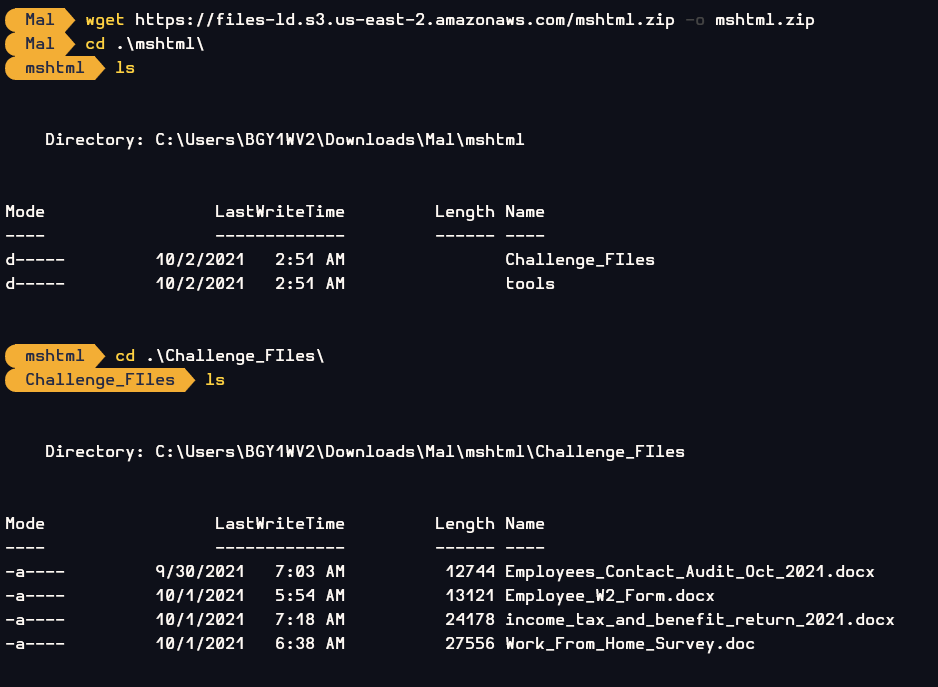
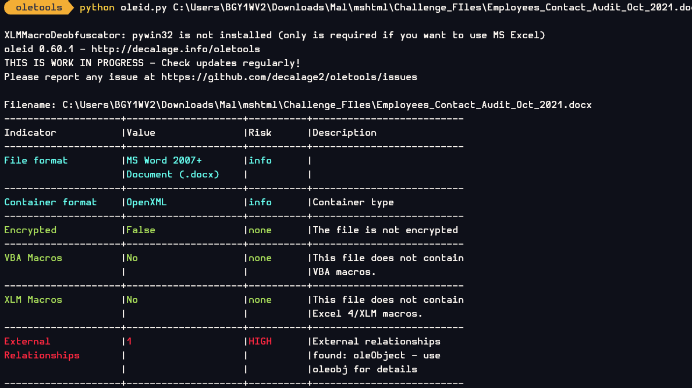
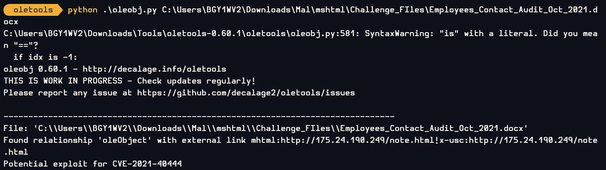
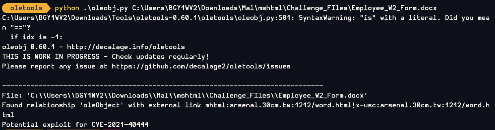
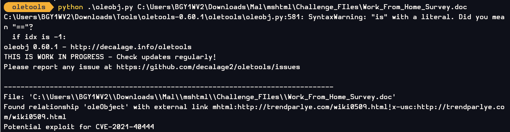
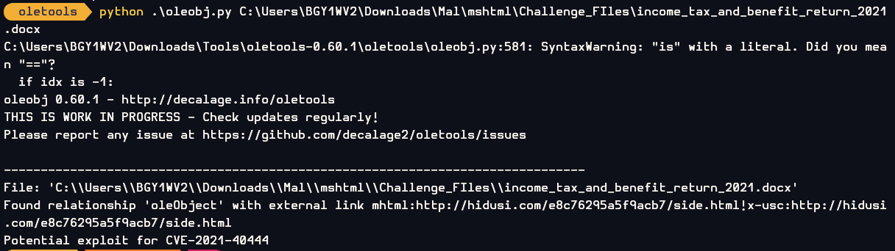
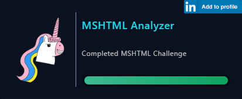

# [LetsDefend - MSHTML](https://app.letsdefend.io/challenge/mshtml)
Created: 15/01/2024 12:02
Last Updated: 19/01/2024 15:14
* * *
<div align=center>

**MSHTML**

</div>

2021's 0-Day MSHTML

Challenge Files (pass: infected): [Download](https://files-ld.s3.us-east-2.amazonaws.com/mshtml.zip)

This challenge prepared by [@Bohan Zhang](https://www.linkedin.com/in/bohan-zhang-078751137/) Malware samples: [MalwareBazaar](https://bazaar.abuse.ch/)
* * *
## Start Investigation
Upon extracting the file, we received two folders: one containing challenge files and another containing tools that can be utilized for their analysis.

<div align=center>




I began by using oleid.py from the Oletools suite. Now that we've confirmed there's no VBA script embedded
</div>

we can move forward and use oleobj for the remaining tasks.

<div align=center>


After run oleobj with `Employees_Contact_Audit_Oct_2021.docx`, We got an IP address.
</div>

The results obtained from Oletools also confirm that this could be a potential exploit for the [CVE-2021-40444 (Microsoft MSHTML Remote Code Execution Vulnerability)](https://msrc.microsoft.com/update-guide/vulnerability/CVE-2021-40444) vulnerability.

Now let's dig the rest of challenge files with oleobj
<div>


With `Employee_W2_Form.docx`, We got a domain name.

With `Work_From_Home_Survey.doc`, We got an URL.

With `income_tax_and_benefit_return_2021.docx`, We got an another URL.
</div>

for futher analysis, you can read it from here 
- [VirusTotal](https://www.virustotal.com/gui/file/ed2b9e22aef3e545814519151528b2d11a5e73d1b2119c067e672b653ab6855a/behavior)

* * *
> Examing the `Employees_Contact_Audit_Oct_2021.docx file`, what is the malicious IP in the docx file?
```
175.24.190.249
```

> Examing the `Employee_W2_Form.docx` file, what is the malicious domain in the docx file?
```
arsenal.30cm.tw
```

>Examing the `Work_From_Home_Survey.doc` file, what is the malicious domain in the doc file?
```
trendparlye.com
```

>Examing the `income_tax_and_benefit_return_2021.docx`, what is the malicious domain in the docx file?
```
hidusi.com
```

>What is the vulnerability the above files exploited?
```
CVE-2021-40444
```

* * *
## Summary
This challenge was designed for us to gain a basic understanding of MSHTML vulnerability and how we can detect them from Microsoft Office documents.

<div align=center>


Badge Acquired
</div>

* * *