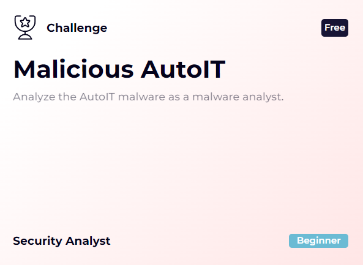

# [LetsDefend - Malicious AutoIT](https://app.letsdefend.io/challenge/malicious-autoit)
Created: 09/09/2024 21:46
Last Updated: 17/09/2024 14:16
* * *
<div align=center>


</div>
Our organization's Security Operations Center (SOC) has detected suspicious activity related to an AutoIt script. Can you analyze this exe and help us answer the following questions?

**File Location**: `C:\Users\LetsDefend\Desktop\ChallengeFile\sample.zip`

**File Password**: infected
* * *
## Start Investigation
>What is the MD5 hash of the sample file?


After extracted sample file out of 7z archive then we can use given HashCalc tool to calculate MD5 of this sample

```
5e53b40cf972f4eb08990999ce17c5c8
```

 

And according to VirusTotal, this sample was written with AutoIt and What is **AutoIt** exactly? its a scripting language used primarily for automating the Windows GUI and has been used for by some popular malware such as [DarkGate](https://www.vmray.com/darkgate-from-autoit-to-shellcode-execution/) to inject shellcode and so on.

>According to the Detect It Easy (DIE) tool, what is the entropy of the sample file?


Open the sample with DIE then we should be able to see Entry point address (Q5) and Time date stamp (Q4) of this sample but to get an entropy of this sample, we need to click "Entropy" button right there


Entropy window will pop up and it will show entropy of every regions(sections) and total entropy of this sample.

```
6.58565
```

>According to the Detect It Easy(DIE) tool, what is the virtual address of the “.text” section?


For this one, we have to go back to DIE main screen then click at "Sections" then a new window will pop up.


Now we can see Virtual Address of `.text` section but to answer this question, we need to add 0x indicating its hex value.

```
0x1000
```

>According to the Detect Easy tool, what is the “time date stamp”?
```
2020-02-26 21:41:13
```

>According to the Detect It Easy (DIE) tool, what is the entry point address of the executable?
Answer Format: 0x000000
```
0x42800a
```

>What is the domain used by the malicious embedded code?

Well.. we can answer this question easily but go to VirusTotal and find domain that was contacted by this sample but we still need to learn how to "unpack" AutoIt sample right?


We know that this malware was packed from DIE but how to unpack it? the answer lying in Tools folder.


[AutoIt-Ripper](https://github.com/nazywam/AutoIt-Ripper) is a python script that can extract compiled AutoIt sample and on lab VM, we can use `autoit-ripper` within a powershell like this to extract AutoIt script from compiled sample which we will have autoit 3 script to be investigated next.


We can see that this script will download 2 files from specific domain to specific path (path was written in hex) and also called [CallWindowsProcW](https://learn.microsoft.com/en-us/windows/win32/api/winuser/nf-winuser-callwindowproca) from `user32.dll`.

```
office-cleaner-commander.com
```

>What is the file path encoded in hexadecimal in the malicious code?


decode hex to string then we can see a path that malicious file will be downloaded into.

```
:\Windows\System32\
```

>What is the name of the DLL called by the malicious code?
```
user32.dll
```

* * *
## Summary
On this challenge, we analyzed and decompiled AutoIT binary that will download malicious code from C2 server and execute it. 

<div align=center>


</div>

* * *
