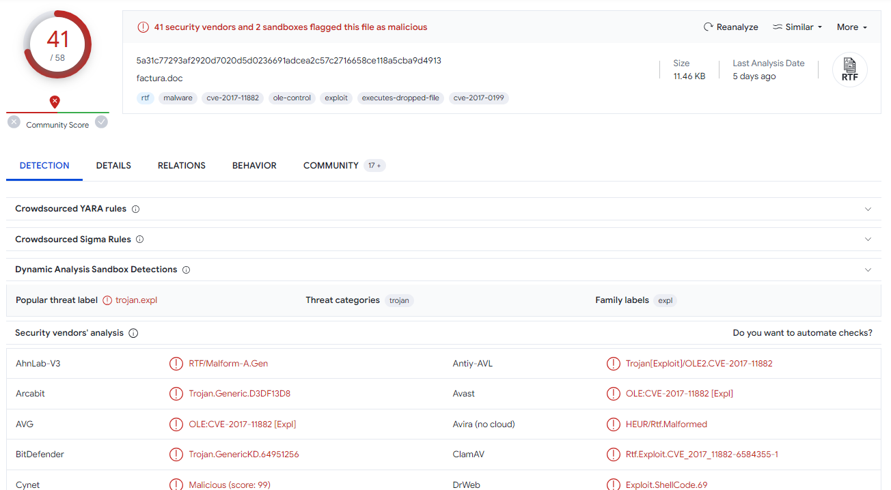
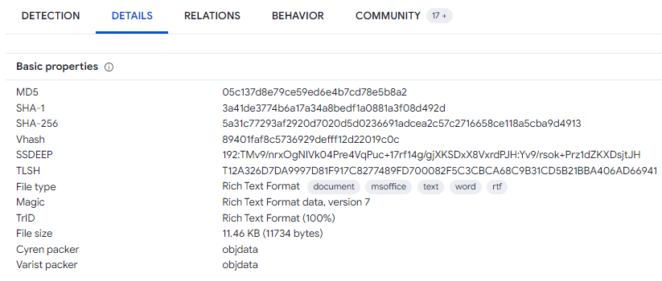
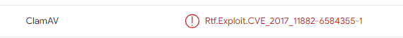
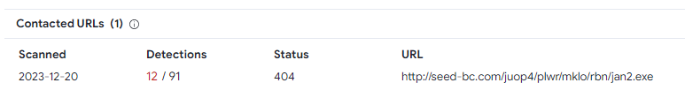
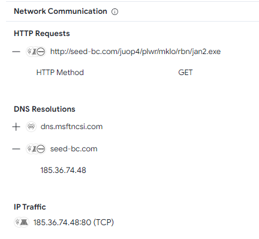
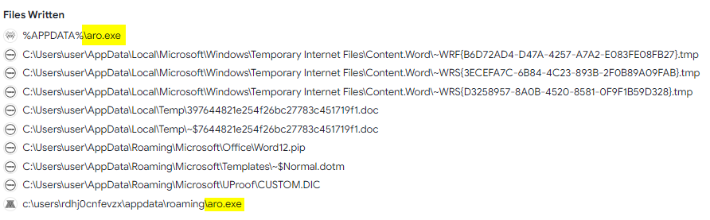
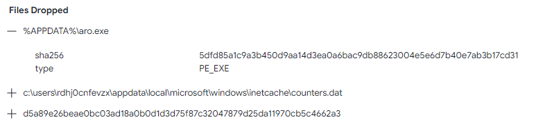
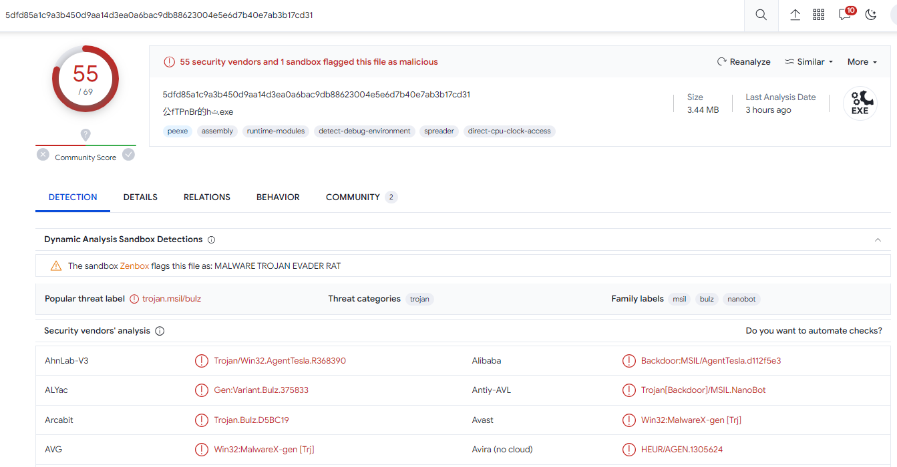
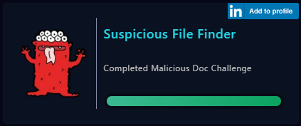

# [LetsDefend - Malicious Doc](https://app.letsdefend.io/challenge/malicious-doic)
Created: 10/01/2024 14:04
Last Updated: 05/06/2024 20:03
* * *
<div align=center>

**Malicious Doc**

</div>

Analyze malicious .doc file
~~File link: [factura.zip](https://files-ld.s3.us-east-2.amazonaws.com/factura.zip)~~ 
File: /root/Desktop/ChallengeFiles/factura.zip
Password: infected

NOTE: Do not open on your local environment. It is malicious file.
* * *
## Start Investigation
### VirusTotal
Uploaded sample doc file to [VirusTotal](https://www.virustotal.com/gui/file/5a31c77293af2920d7020d5d0236691adcea2c57c2716658ce118a5cba9d4913) or if you prefer you can use this [anyrun report](https://app.any.run/tasks/634a8b0d-22a2-4a3f-9df9-dbc5351066fe/) as an alternative
<div align=center>


**41** security venders flagged this file as malicious and it might exploit a system using [**CVE-2017-11882**](https://cve.mitre.org/cgi-bin/cvename.cgi?name=CVE-2017-11882)


This type of exploit is **rtf.exploit**


It contacts a HTTP C2 server to download a payload stage as a real malware.


It writes [**aro.exe**](https://www.virustotal.com/gui/file/5dfd85a1c9a3b450d9aa14d3ea0a6bac9db88623004e5e6d7b40e7ab3b17cd31) after it runs.

File that dropped is also flagged as malcious by **55** security vendors
</div>

* * *
> What type of exploit is running as a result of the relevant file running on the victim machine?
```
rtf.exploit
```

> What is the relevant Exploit CVE code obtained as a result of the analysis?
```
CVE-2017-11882
```

> What is the name of the malicious software downloaded from the internet as a result of the file running?
```
jan2.exe
```

> What is the ip address and port information it communicates with?
```
185.36.74.48:80
```

> What is the exe name it drops to disk after it runs?
```
aro.exe
```
* * *
## Summary
This doc file is a crafted rtf file to exploit remote code execution vulnerability to a system using **CVE-2017-11882**. It is a stager that once it opened it tries to download an actual malware from a certain URL using HTTP GET method and It also drops a file after it runs. 

<div align=center>


Badge Acquired
</div>

* * *
