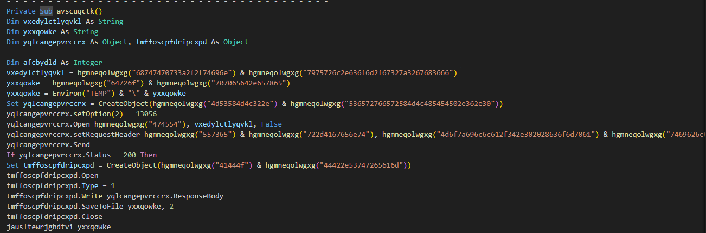

# [LetsDefend - Malicous VBA](https://app.letsdefend.io/challenge/Malicious-VBA)
Created: 10/01/2024 14:04
Last Updated: 05/06/2024 20:07
* * *
<div align=center>

**Malicious VBA**

</div>

One of the employees has received a suspicious document attached in the invoice email. They sent you the file to investigate. You managed to extract some strings from the VBA Macro document. Can you refer to CyberChef and decode the suspicious strings?

Please, open the document in Notepad++ for security reasons unless you are running the file in an isolated sandbox.

~~Malicious Macro (pass: 321): [Download](https://files-ld.s3.us-east-2.amazonaws.com/invoice.zip)~~
Malicious Macro: /root/Desktop/ChallengeFiles/invoice.vb

This challenge prepared by [@RussianPanda](https://www.linkedin.com/in/an-fam-868921105/)
* * *
## Start Investigation
<div align=center>


This file is obviously obfuscated.

This function look like it tries to send requrest to a specific URL.

And I was right. it also include payload name, method and user-agent.

Move to the last function, it also contains a lot of string that hex-encoded.

And it is a WMI namespace and class reference.
</div>

* * *
>The document initiates the download of a payload after the execution, can you tell what website is hosting it?
```
https://tinyurl.com/g2z2gh6f
```

> What is the filename of the payload (include the extension)?
```
dropped.exe
```

> What method is it using to establish an HTTP connection between files on the malicious web server?
```
MSXML2.ServerXMLHTTP
```

> What user-agent string is it using?
```
Mozilla/4.0 (compatible; MSIE 6.0; Windows NT 5.0)
```

> What object does the attacker use to be able to read or write text and binary files?
```
ADODB.Stream
```

>What is the object the attacker uses for WMI execution? Possibly they are using this to hide the suspicious application running in the background.
```
winmgmts:\\.\root\cimv2:Win32_Process
```

* * *
## Summary
This visual basic script once it executed, It will try to connect to a certain URL to download an actual malware. It also created a suspicious hidden process running in the background probably for persistence. 

<div align=center>


Badge Acquired
</div>

* * *