# [LetsDefend - Malicious Web Traffic Analysis](https://app.letsdefend.io/challenge/malicious-web-traffic-analysis)
Created: 06/08/2024 18:14
Last Updated: 07/08/2024 18:31
* * *
<div align=center>

**Malicious Web Traffic Analysis**

</div>
During a cybersecurity investigation, analysts have noticed unusual traffic patterns that may indicate a problem. We need your help finding out what's happening, so give us all the details.

**File Location**: /root/Desktop/ChallengeFile/capture.7z
* * *
## Start Investigation
>What is the IP address of the web server?

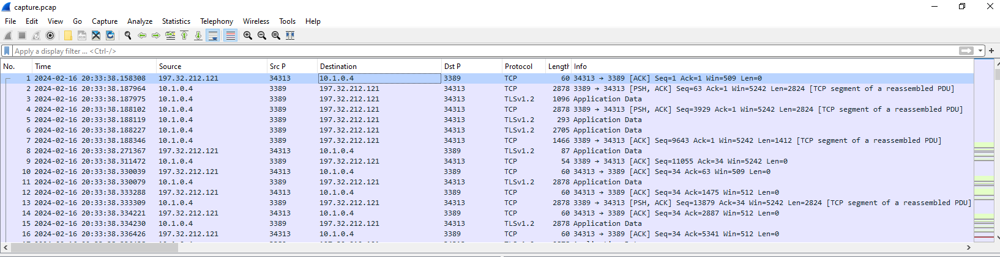

After opened provided pcap file, first thing we could see is RDP traffic between `197.32.212.121` and `10.1.0.4` but we could not confirm yet that both IP has something to do web server

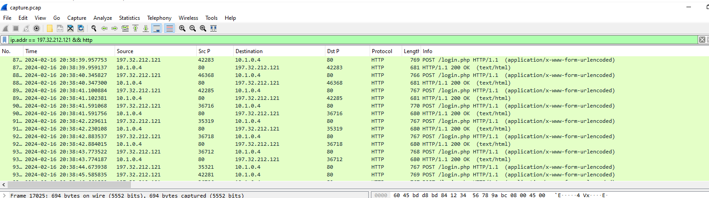

But when I filtered for `http` and 1 of these IP address, we can see that there are some sort of bruteforce attack happening and `10.1.0.4` is our web server.

```
10.1.0.4
```

>What is the IP address of the attacker?
```
197.32.212.121
```

>The attacker first tried to sign up on the website, however, he found a vulnerability that he could read the source code with. What is the name of the vulnerability?

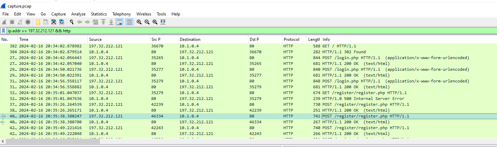

We need to inspect each POST request to `/register/register.php` to find any indicator that related to specific vulnerability

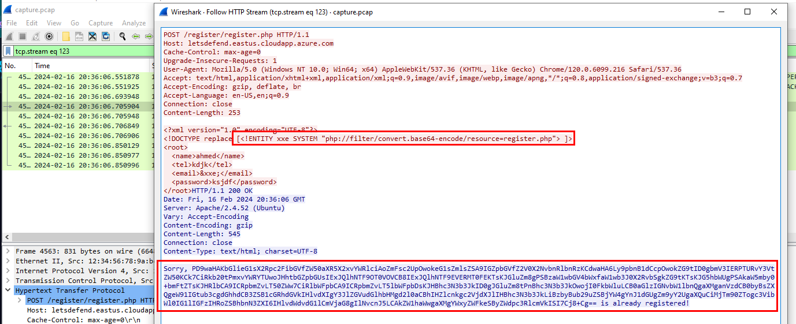

Which we will eventually found one right there, Its XXE vulnerability which allow the attacker to get the source code in base64

```
xxe
```

>There was a note in the source code, what is it?

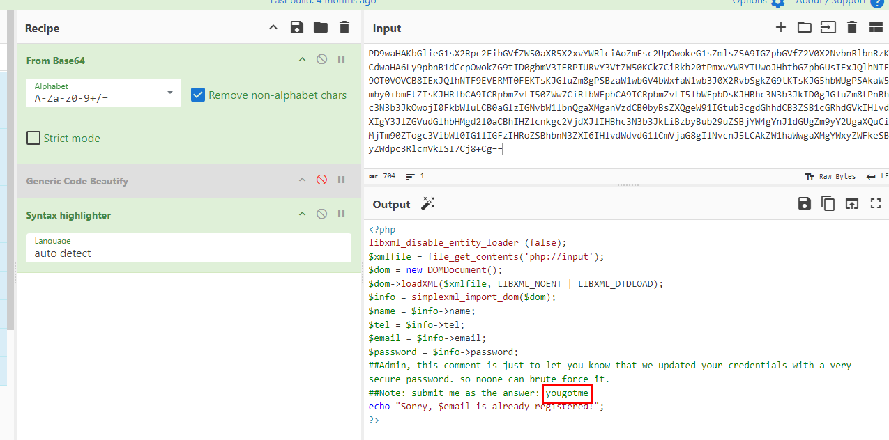

Decode base64 we got then we can see that there is a comment telling us to submit it as the answer

```
yougotme
```

>After exploiting the previous vulnerability, the attacker got a hint about a possible username. What is the username that the attacker found?

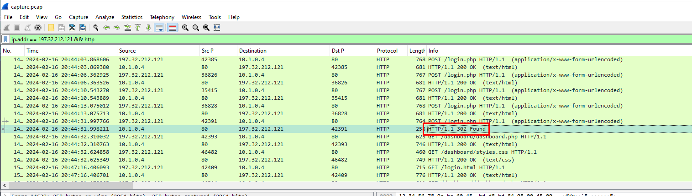

Most of failed bruteforce attacks resulting in 200 HTTP Response so we have to find anything that has different size or different HTTP Status Code and we will find one with 302 HTTP Response

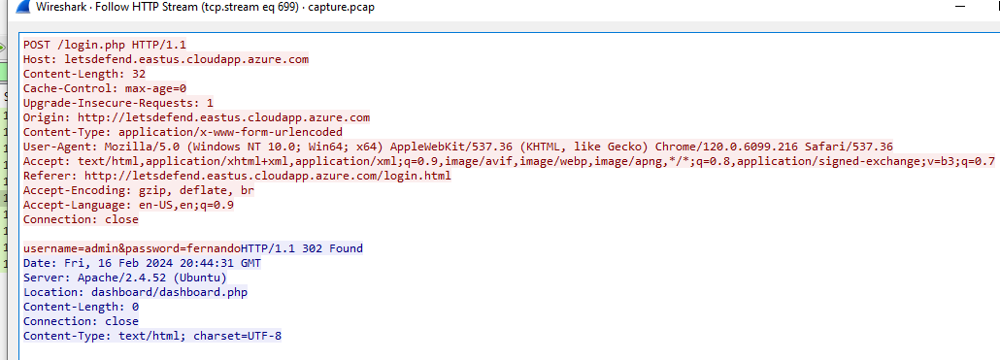

Inspect it then we can see credential that successfully logged in to this website

```
admin
```

>The attacker tried to brute-force the password of the possible username that he found. What is the password of that user?
```
fernando
```

>Once the attacker gained admin access, they exploited another vulnerability that led the attacker to read internal files that were located on the server. What payload did the attacker use?

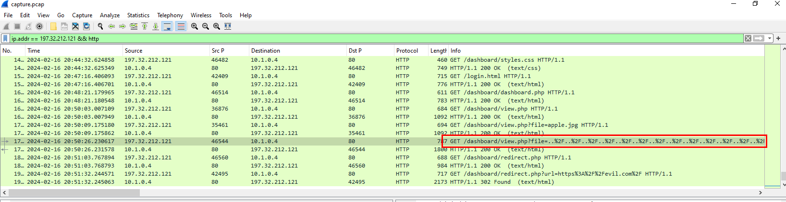

I found this weird request that look like Local File Inclusion (LFI) vulnerability had been tested 

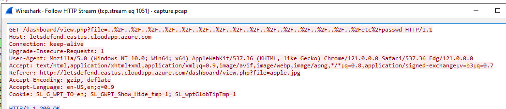

We can see that the attacker attempted to exploit LFI vulnerability to read `/etc/passwd` file

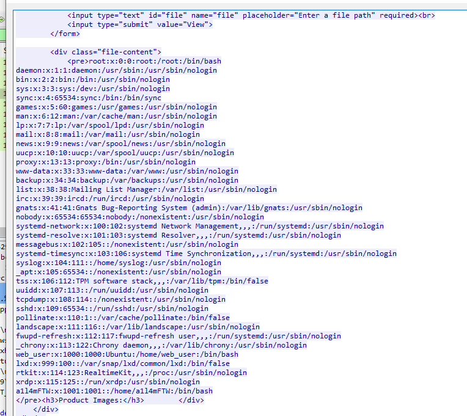

And it was successful

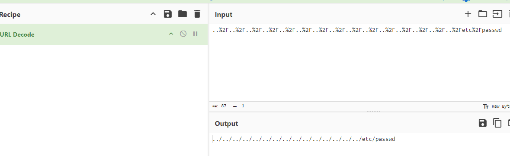

Use URL Decode to get the answer for submission

```
../../../../../../../../../../../../../../../etc/passwd
```

>The attacker was able to view all the users on the server. What is the last user that was created on the server?

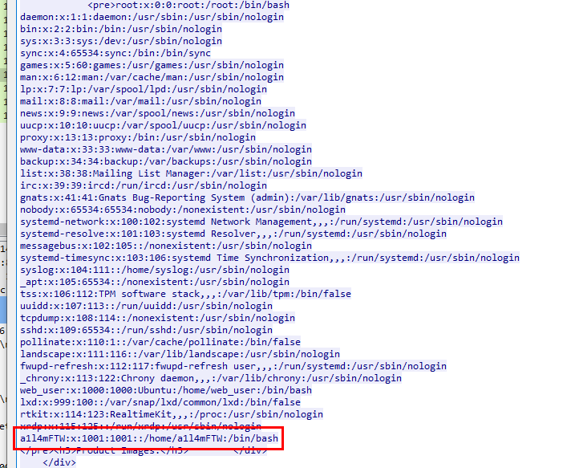
```
a1l4mFTW
```

>The attacker also found an open redirect vulnerability. What is the URL the attacker tested the exploit with?

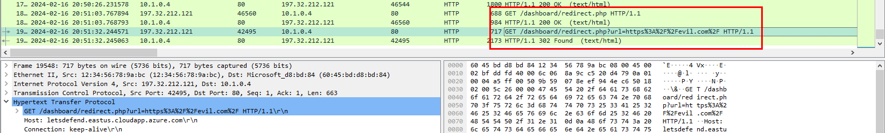

We can see that `https://evil.com/` was tested on `/dashboard/redirect.php?url=` and looking at HTTP Response code, this exploit was successful

```
https://evil.com/
```

* * *
## Summary
On this challenge, we investigated web attack via pcap file and here is what we found
- The attacker using XXE vulnerability to get php source code which vulnerable to XXE attack and also gave a hint to an attacker that "admin" username is existed and should be able to bruteforce for admin's password
- The attacker successfully bruteforced admin's password and logged in as an "admin" user to website
- The attacker successfully exploited local file inclusion vulnerability on `file` variable in `dashboard.php` revealing content of `/etc/passwd`
- Lastly, the attacker successfully exploited open redirect vulnerability on `url` variable in `redirect.php` redirecting to `evil.com`

<div align=center>


</div>

* * *
