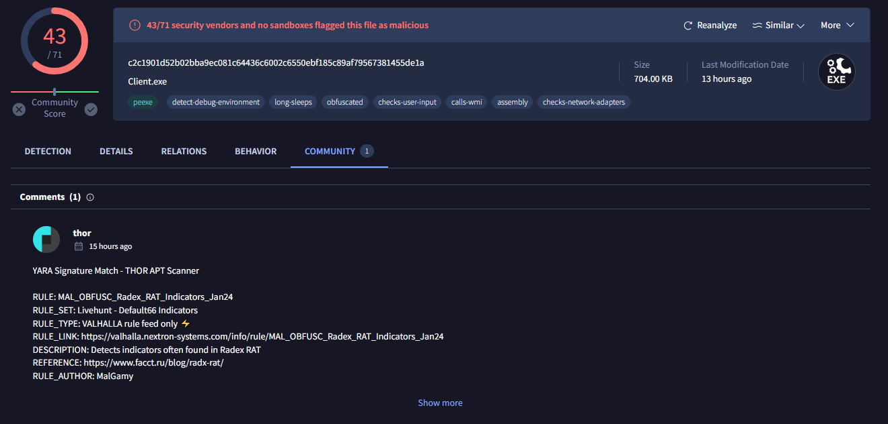
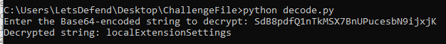

# [LetsDefend - Obfuscated RAT](https://app.letsdefend.io/challenge/obfuscated-rat)
Created: 11/06/2024 15:02
Last Updated: 11/06/2024 16:35
* * *
<div align=center>

**Obfuscated RAT**

</div>

We have obfuscated binary, can you help us to deobfuscate it and find the answers.

**File Location**: C:\Users\LetsDefend\Desktop\ChallengeFile\sample.7z

**File Password**: infected
* * *
## Start Investigation
>What is the name of the function that was used to decode the base64 string and decrypt string?


First we need to determine which disassembler we could use base on file type, and look like this malware is using .NET 


We can use dotPeek to decomplie this and we can see there there are a function that seem to process all base64 strings of this malware


It is a function to decrypt given Base64-encoded string using TripleDES encryption in ECB mode with a specific key derived from an MD5 hash and return value back to function calls

```
0xb11a1
```

>What is the mod that is used in the process of decryption?


This snippet clearly declared that it used TripleDES ECB Mode

```
ECB
```

>What is the port number that is used by the RAT with C2 connection?
**Note**: You should create a custom python script for solving the following questions.

Put decrypt function to ChatGPT then tell it to write a python script for us

```
import base64
import hashlib
from Crypto.Cipher import DES3
from Crypto.Util.Padding import unpad

def decrypt(encoded_string):
    # The key used in the original C# function
    key_str = "JSO1vWfZKGreBMi07GTXg2eLHyy97CkTF5YzJQ06zRDIqslajWFFHBHhAE"

    # Generate MD5 hash of the key
    md5_hash = hashlib.md5(key_str.encode('utf-8')).digest()

    # Decode the Base64 encoded input string
    input_buffer = base64.b64decode(encoded_string)

    # Create a TripleDES cipher object with the given key
    cipher = DES3.new(md5_hash, DES3.MODE_ECB)

    # Decrypt and unpad the data
    decrypted_data = unpad(cipher.decrypt(input_buffer), DES3.block_size)

    # Convert decrypted bytes to UTF-8 string
    return decrypted_data.decode('utf-8')

# Example usage
if __name__ == "__main__":
    encrypted_string = input("Enter the Base64-encoded string to decrypt: ")
    decrypted_string = decrypt(encrypted_string)
    print("Decrypted string:", decrypted_string)

```

Then we have this script ready to decrypt any base64 string from this malware


Alternatively you can search filehash on VirusTotal and still got the right answer but to answer last question from this challenge, we need to have a python script to decrypt it


dotPeek didn't get the code inside main function for me so I switched to ILSpy then we can see that `serverURL` string is declared here and after review other functions, I learned that this malware collect many informations from infected system and send them to `serverURL` so lets decrypt it


There it is

```
4321
```

>What is the name of RAT?



On VirusTotal, Go to Community tab and follow Reference url


It is DarkCrystal RAT or rad-x 

Alternatively, you can also decrypt those base64 from main function too

```
rad-x
```

>What is the decrypt value of this string “SdB8pdfQ1nTkMSX7BnUPucesbN9ijxjK”?



```
localExtensionSettings
```

* * *
## Summary

On this challenge, we analyzed DarkCryptal RAT or RAD-X malware that have many capabilities involving collection of important information on infected system without being detected and we also used a python script to decrypt base64 strings from this malware.

<div align=center>


</div>

* * *
