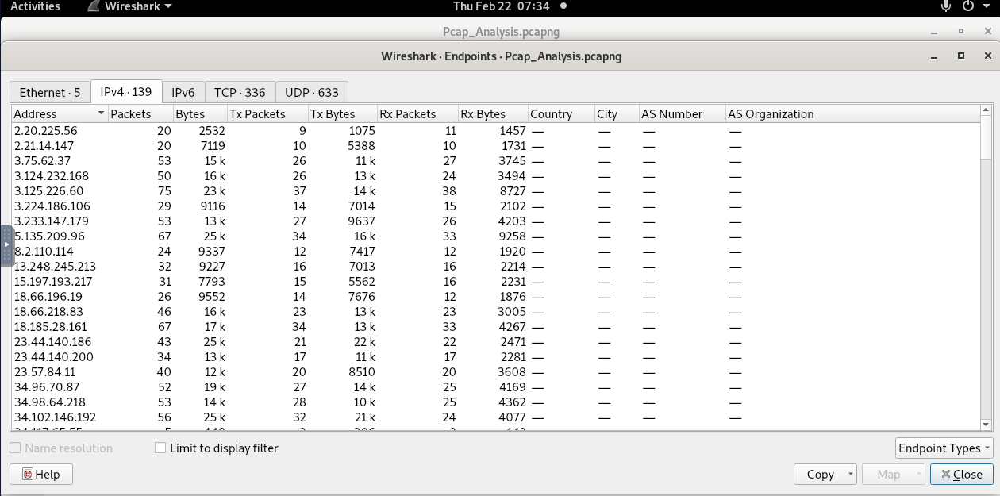

# [LetsDefend - PCAP Analysis](https://app.letsdefend.io/challenge/pcap-analysis)
Created: 22/02/2024 14:28
Last Updated: 22/02/2024 15:16
* * *
<div align=center>

**PCAP Analysis**

</div>
We have captured this traffic from P13's computer. Can you help him?

**File Location:** `/root/Desktop/ChallengeFile/Pcap_Analysis.pcapng`

* * *
## Start Investigation
I started by looking at the statistics of this pcapng file
<div align=center>


There are a lot of IP addresses that were captured.

Protocol that was used the most is UDP Data and there are also a bunch of TCP protocol including HTTP that got captured as well
</div>

I don't think I can get the valuable information from TLS and UDP so I shifted my focus on TCP and Follow TCP stream
<div align=center>


Look like I found a chat? look like P13 and Cu713 has a communicatation.
</div>
Cu713 had created a new file encryption scrip and challenge P13 to find it so the script might be found on this pcapng as well and might upload to the server so HTTP it is

<div align=center>


I filtered with `192.168.235.137` as a source and found out that this IP address uploaded file to an Apache web server (`192.168.1.7`) which was saved at `uploads` directory
</div>

Look like We got most of the question done

* * *
> In network communication, what are the IP addresses of the sender and receiver? <br>
Answer Format: SenderIPAddress,ReceiverIPAddress
```
192.168.235.137,192.168.235.131
```

> P13 uploaded a file to the web server. What is the IP address of the server?
```
192.168.1.7
```

>What is the name of the file that was sent through the network?
```
file
```

>What is the name of the web server where the file was uploaded?
```
apache
```

>What directory was the file uploaded to?
```
uploads
```

> How long did it take the sender to send the encrypted file?

This question can be answered by looking at Conversations of the sender IP and server IP address at Statistics
<div align=center>


</div>


```
0.0073
```

* * *
## Summary
A communication between 2 user P13 and Cu713 was captured, There was a challenge to found a new encryption script that was hiding somewhere and that somewhere is the Apache web server on the same local network and that file was named `file` and upload via `/panel.php` to the `uploads` directory

<div align=center>


</div>

* * *