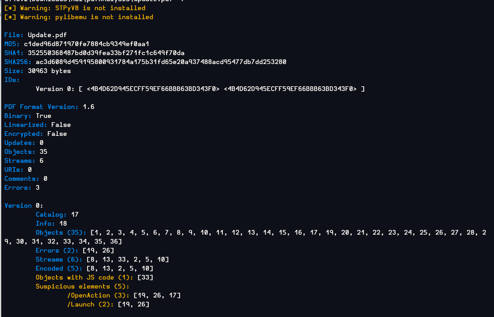

# [LetsDefend - PDF Analysis](https://app.letsdefend.io/challenge/pdf-analysis)
Created: 29/02/2024 13:14
Last Updated: 05/06/2024 21:02
* * *
<div align=center>

**PDF Analysis**

</div>
An employee has received a suspicious email:

**From:** SystemsUpdate@letsdefend.io
**To:** Paul@letsdefend.io 
**Subject:** Critical - Annual Systems UPDATE NOW 
**Body:** Please do the dutiful before the deadline today. 
**Attachment:** [Update.pdf](https://drive.google.com/file/d/1_P5rsU1LCHYW--36TbhYqA841VeAZ6VE/view?usp=sharing) 
**Password:** letsdefend

The employee has reported this incident to you as the analyst which has also forwarded the attachment to your SIEM. They have mentioned that they did not download or open the attachment as they found it very suspicious. They wish for you to analyze it further to verify its legitimacy.

~~**File link:** [Download](https://drive.google.com/file/d/1_P5rsU1LCHYW--36TbhYqA841VeAZ6VE/view?usp=sharing).~~ 
C:\Users\LetsDefend\Desktop\Files\PDF_Analysis.7z
**Password:** letsdefend

NOTE: Do not open in your local environment. It is a malicious file.

This challenge prepared by [@DXploiter](https://twitter.com/DXploiter)
* * *
## Start Investigation

Once I got the file, I downloaded [DidierSteven Suite](https://blog.didierstevens.com/didier-stevens-suite/) which have sevaral tools that could be useful when analyzing PDF file.

But before going for the investigation, [Here](https://prtksec.github.io/posts/MA_PDF_Notes/) is the useful note about How to analyze malicious pdf documents written by Pratik Patel, I recommend you to read it before tackle this challenge and read the rest of this write-up
<div align=center>


I started with pdfid.py to triage this this pdf file by inspecting suspicious objects and properties on this file and there are OpenAction and Launch that caught my eyes right aways

</div>

- **OpenAction** will make a pdf file perform a certain action when the document is opened in a pdf viewer.
- **Launch** works similarly to OpenAction, It can be used to run a script embedded in this pdf file
 <div align=center>


After I knew what to look for, I used pdf-parser.py from DidierSteven Suite to parse objects for both OpenAction and Launch which you can see that 2 objects shared the same action 


The other tool that can be used to analyze pdf file is [**peepdf**](https://github.com/jesparza/peepdf) and after using this tool, I found something that pdfid missed which is JavaScript that was embedded 


Then I parsed the raw content of the objects 19 and it is a suspicious powershell command right there with base64 encoded

I also parse raw content of the object 26 and look like it is another commands there so I stopped right here and went back to object 19 base64 to decode.

Its not just base64 but it also in reverse and after decoding, you can see that it is a powershell command to create an archive zip file of Document and the zip file that will be created is name `D0csz1p` and it will be overwrite the existing file with the same name if its already exists
  

Then after that I used pdf-parser to parse object 17 and 33 but there is no useful result


But I also remembered that peepdf found JS code inside this pdf so I continued to investigate with this tool


I used `-fli` to force mode to ignore errors, loose parsing mode to catch malformed objects and interactive mode, [here](https://stackoverflow.com/questions/10220497/extract-javascript-from-malicious-pdf) is the useful stackoverflow about how to extract JS from malicious pdf

It is confirmed that JS code is located in object 33

I parsed this object directly and got the JS code I wanted

I putted it in https://beautifier.io/ to beautify JS code for me, then you can see that the eval function is used to execute the command

So I cut out eval(), put the output of function in variable, print out variable to inspect the return output and ran this js script on https://www.w3schools.com/js/tryit.asp?filename=tryjs_editor, So it made HTTP POST request to send the compressed zip file to the filebin website


Now its time for object 26 which I knew for sure that it is command to run something, Invoke-Expression is a command to execute string as command


So just put out the Invoke-Expression and output the LoadCode variable that store the string to execute is enough, and look like this string combined 3 commands together to stay persistence

Here is the first command summary by the ChatGPT

The second command is to use LOLBAS to download `wallpaper482.scr` from the C2 , a screensaver file is also one of popular way to embedded malicious cmd command inside of it and lastly it will execute that screensaver file to stay persistence 

Then I used IP2Location to find the location of this IP address and it is in China
</div>


* * *
>What local directory name would have been targeted by the malware?
```
C:\Documents\
```

> What would have been the name of the file created by the payload?
```
D0csz1p
```

> What file type would this have been if it were created?
```
zip
```

> Which external web domain would the malware have attempted to interact with?
```
filebin.net
```

> Which HTTP method would it have used to interact with this service?
```
POST
```

> What is the name of the obfuscation used for the Javascript payload?
```
eval
```

> Which tool would have been used for creating the persistence mechanism?
```
wmic
```

> How often would the persistence be executed once Windows starts? (format: X.X hours)?
```
2.5 hours
```

> Which LOLBin would have been used in the persistence method?
```
Powerpnt.exe
```

> What is the filename that would have been downloaded and executed using the LOLbin?
```
wallpaper482.scr
```

> Where would this have been downloaded from? (format: IP address)
```
60.187.184.54
```

> Which country is this IP Address located in?
```
China
```

* * *
## Summary
An email was sent to an employee, once an employee download and open this pdf document file, It will execute several commands including create zip file of documents folder then upload it to the website and lastly it will stay persistence on the employee machine by using LOLBAS to download a screensaver file from C2 server and then executes it.

<div align=center>


</div>

* * *
