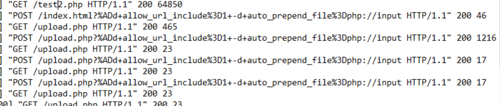

# [LetsDefend - PHP-CGI (CVE-2024-4577)](https://app.letsdefend.io/challenge/php-cgi-CVE-2024-4577)
Created: 17/06/2024 23:26
Last Updated: 18/06/2024 00:51
* * *
<div align=center>

**PHP-CGI (CVE-2024-4577)**

</div>

You will confront an attempted exploitation of a newly discovered and unpatched vulnerability (CVE-2024-XXXX) in a critical software component within your organization's infrastructure. The CVE allows for remote code execution, posing a significant threat if successfully exploited. At 12:05 PM UTC, an alert is generated by the Intrusion Detection System (IDS) and Intrusion Prevention System (IPS), indicating an attack on one of your web servers. Your task is to analyze the provided artifacts, confirm the exploitation attempt, and answer the provided questions.

**File Location**: C:\Users\LetsDefend\Desktop\ChallengeFile\artifacts.7z
* * *
## Start Investigation

This vulnerability was discovered by [DEVCORE](https://devco.re/blog/2024/06/06/security-alert-cve-2024-4577-php-cgi-argument-injection-vulnerability-en/?ref=labs.watchtowr.com) so it would be the best to read this first to understand how this vulnerability could be exploited and then you can read this blog posted by [Aliz Hammond from Watchtowr Labs](https://labs.watchtowr.com/no-way-php-strikes-again-cve-2024-4577/) to understand how an attacker can exploit this vulnerability

And [here](https://github.com/watchtowrlabs/CVE-2024-4577?tab=readme-ov-file) is POC script written by Watchtowr Labs to demonstrate it 

>What version of PHP was running on the server during the incident?


I found 2 ways to solve this, First  is to read `news.txt` that stored all php update news.


another way to solve this is to run `php.exe -v` to print out version of this php executable file directly

```
8.2.19
```

>When PHP is configured to run as CGI, which directive in httpd.conf specifies the scripts that handle requests for PHP files?


`httpd.conf` is in `/Apache24/conf` folder


Find for `php-cgi.exe` then you can see that this action will allow this vulnerability to be exploited directly by sending HTTP request to `php-cgi.exe`

```
Action
```

>What is the IP address of the attacker who attempted to exploit our server?


Go to `\Apache24\logs` folder then you can see that we have `access.log` to investigate


After investigating this log file then you can see that "192.168.110.1" sent multiple HTTP POST requests that match payload designed to exploit this vulnerability 

```
192.168.110.1
```

>The attacker targeted a specific page on the server with malicious payloads. Which page did the attacker target with malicious payloads?



The main functionality of the application targets the `/upload.php` page. However, for testing purposes, an `/index.html` file may be utilized.

```
upload.php
```

>What version of Apache is running on the server?


We can open `error.log` to obtain the answer of this question.

```
2.4.59
```

>The attacker managed to execute commands on the server. What was the first process initiated by the attacker’s commands during their successful attempt?


They gave us `Prefetch` folder and `PECmd` from Eric Zimmerman tools to work with so we will have this use it to determine which executable was executed after payload was sent by an attacker

Here is the command I used `PECmd.exe -d "C:\Users\LetsDefend\Desktop\ChallengeFile\artifacts\Prefetch" --csv output`

After we got an output as csv file then open it in Timeline Explorer 


But I didn't find any suspicious executable was executed during this time


So I went back to `access.log` and also correlate time to `error.log` then I came the the conclusion that those request we found results in error


So I scrolled down a little bit more and found these HTTP requests that were not triggered any error which mean these attacks are successful


Go back to timeline explorer, We can see that these 2 executable files were executed after an attacker successfully sent payload to apache server.

```
whoami.exe
```

>Before the attacker was detected and blocked, they executed another command, launching a new process. What process was launched by this command?
```
calc.exe
```

>What is the CVE number of the exploit used by the attacker?
```
CVE-2024-4577
```

* * *
## Summary
On this challenge, we learned about CVE-2024-4577 and 
- find php and apache version
- find out how php that were given is vulnerable 
- how an attacker exploit this vulnerability 
- using prefetch to detect commands that were executed by this vulnerability

<div align=center>


</div>

* * *
