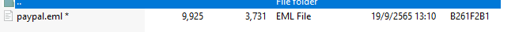
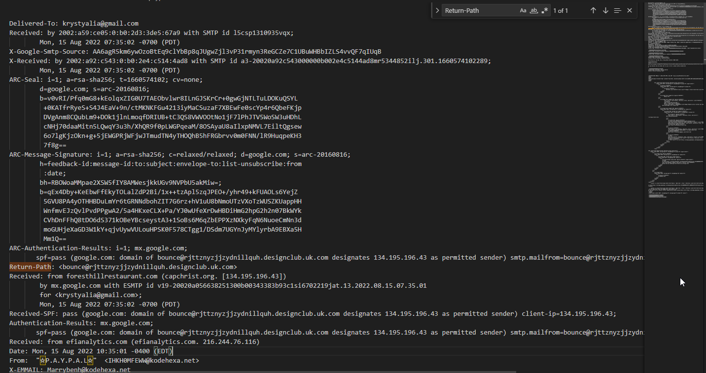
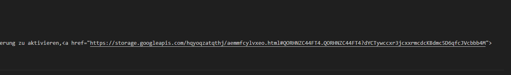
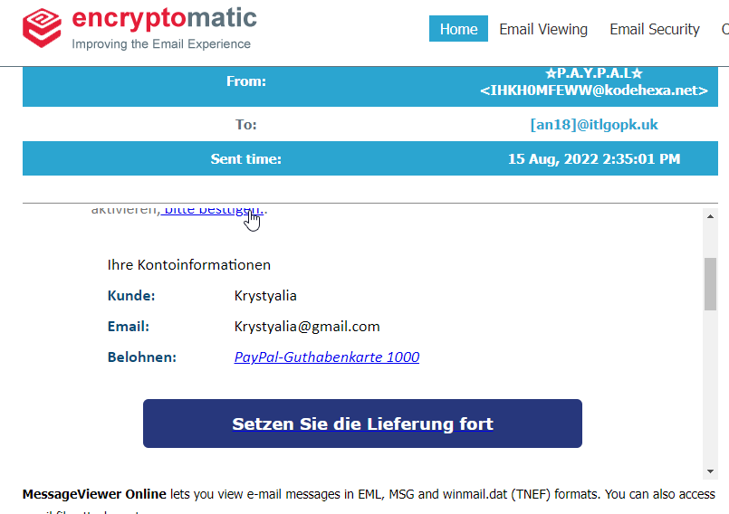
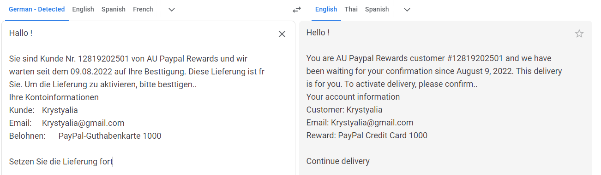
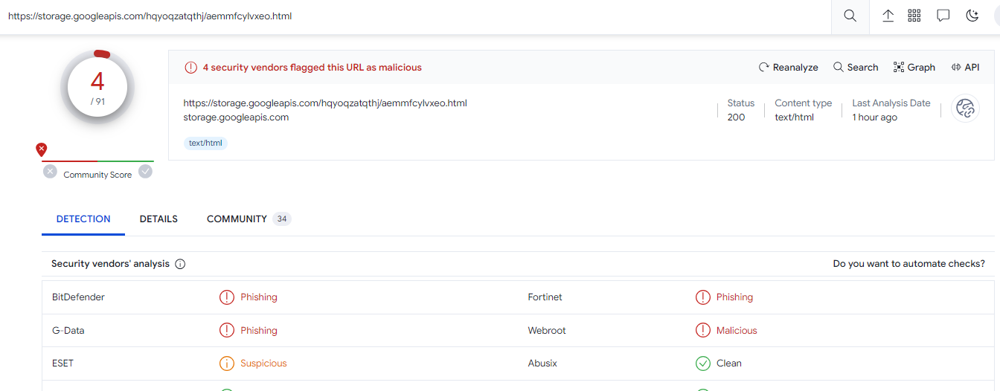
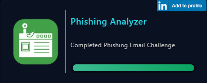

# [LetsDefend - Phishing Email](https://app.letsdefend.io/challenge/phishing-email)
Created: 16/01/2024 10:45
Last Updated: 05/06/2024 20:38
* * *
<div align=center>

**Phishing Email**

</div>
Your email address has been leaked and you receive an email from Paypal in German. Try to analyze the suspicious email.

**File Location**: [~~Download~~](https://files-ld.s3.us-east-2.amazonaws.com/PhishingChallenge.zip) C:\Users\LetsDefend\Desktop\Files\PhishingChallenge.zip **Password**: infected

This challenge prepared by [@Fuuji](https://www.linkedin.com/in/sylvain-meurot-b34050161)
* * *
## Start Investigation
<div align=center>


Here we got an eml file to work with.


Here are the header of the email. judging from Return-Path and From, It look very suspicious!


There is an google api to possible a phishing site in a text found in body of this email.


I use encryptomatic to open this eml file as it should appear, there are several link that redirect to the url we've found.


The language used in this email is German and look like it trying to trick user to get a paypal reward.


Scan this url in [VirusTotal](https://www.virustotal.com/gui/url/368c807550a0b3938b38f126a35cd732b211bb0f174638234670b84a5299af96/detection) and it was flagged as phishing which is the same as our initial analysis. 
</div>

* * *
> What is the return path of the email?
```
bounce@rjttznyzjjzydnillquh.designclub.uk.com
```

> What is the domain name of the url in this mail?
```
storage.googleapis.com
```

> Is the domain mentioned in the previous question suspicious?
```
yes
```

> What is the body SHA-256 of the domain?
```
13945ecc33afee74ac7f72e1d5bb73050894356c4bf63d02a1a53e76830567f5
```

* Note: This is not body SHA-256 hash of the full URL we scanned in VirusTotal but the body SHA-256 hash of google api.

> Is this email a phishing email?
```
yes
```

***
## Summary
This email was made to trick a german user to click a certain URL by telling user that he got an unclaimed reward on paypal. 

<div align=center>


ฺBadge Obtained
</div>

* * *