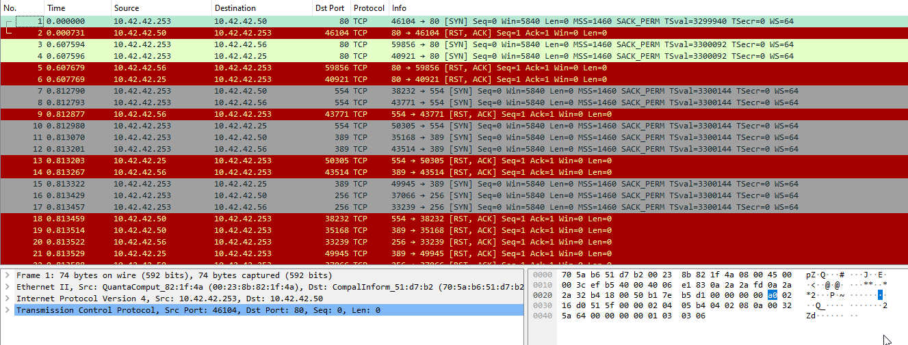

# [LetsDefend - Port Scan Activity](https://app.letsdefend.io/challenge/port-scan-activity)
Created: 12/01/2024 12:13
Last Updated: 05/06/2024 20:17
* * *
<div align=center>

**Port Scan Activity**

</div>
Can you determine evidences of port scan activity?

Log file: ~~https://files-ld.s3.us-east-2.amazonaws.com/port+scan.zip Pass: 321~~ /root/Desktop/ChallengeFile/port_scan.pcap

Note: pcap file found public resources.
* * *
## Start Investigation
Let's open this pcap file in Wireshark
<div align=center>


A lof of TCP packet were captured.
</div>

As this challenge was named, this network activity indicate that `10.42.42.253` was TCP port scanning to other system in the network.

Using this filter `tcp.flags.syn == 1 && tcp.flags.ack == 1 && ip.dst == 10.42.42.253`, I got the result of this scan since this scan was likely to be a TCP port scanning so the active host will response back with **SYN, ACK**.
<div align=center>


`10.42.42.50` was responsed.
</div>

Go to `Statistics > Resolved Addresses` to find out more about devices that were detected in this network activity.
<div align=center>


There was 1 Apple device that standout.


There was also a Quanta Computer too.
</div>

After doing some research I found [this blog](https://www.netresec.com/?page=Blog&month=2011-11&post=Passive-OS-Fingerprinting) , It was useful to find out that a Quanta Computer we found earlier is Windows system or not

We can use `ip.ttl == 128` to check if this system is using Windows.
<div align=center>


`10.42.42.50` was running Windows.
</div>

Or we can just check from Port Scanning result, if port 139 (Microsoft RPC) was responsed back.

* * *
> What is the IP address scanning the environment?
```
10.42.42.253
```

> What is the IP address found as a result of the scan?
```
10.42.42.50
```

> What is the MAC address of the Apple system it finds?
```
00:16:cb:92:6e:dc
```

> What is the IP address of the detected Windows system?
```
10.42.42.50
```

* * *
## Summary
This pcap file was captured while System `10.42.42.253` was conducted port scanning and a Windows system `10.42.42.50` was responsed back at port 135 and 139.

<div align=center>


Badge Acquired
</div>

* * *