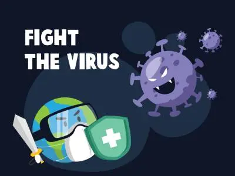
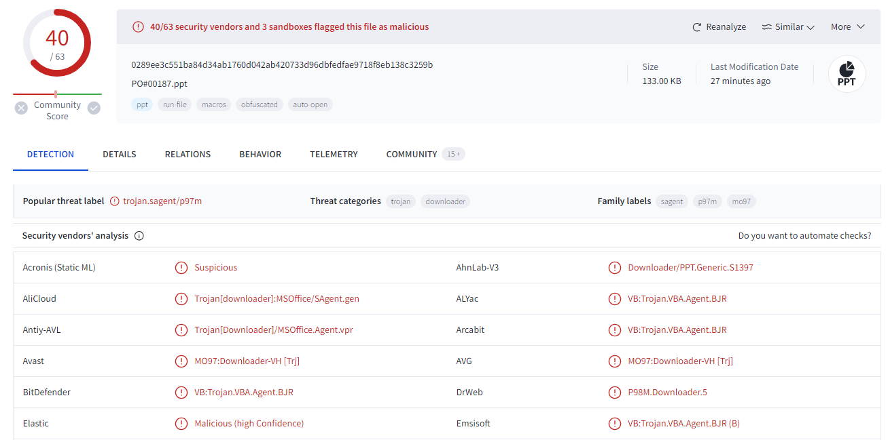
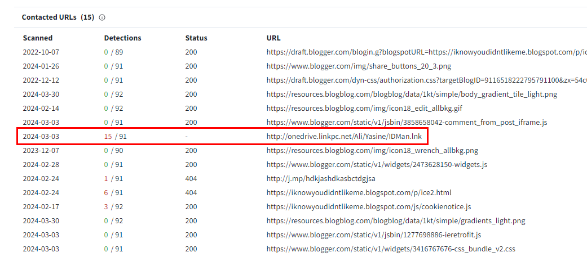
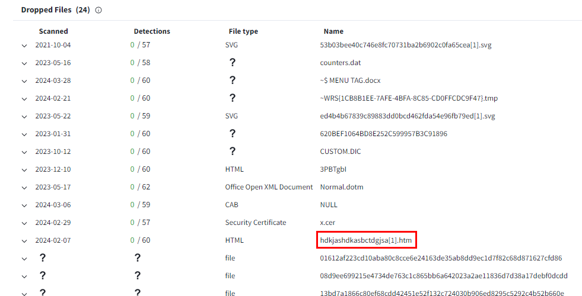
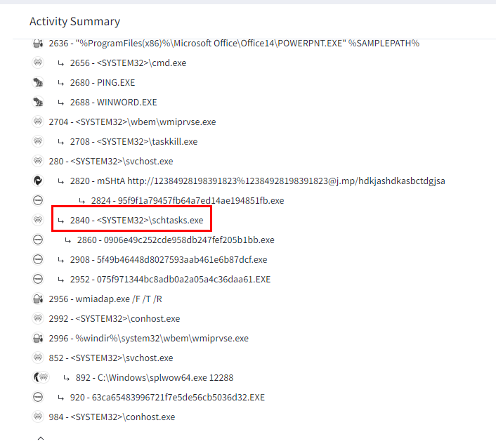
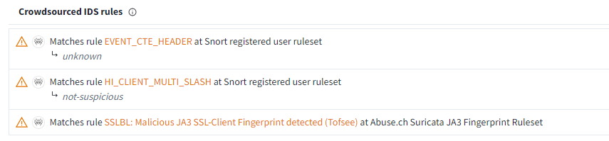

# [LetsDefend - Presentation As a Malware](https://app.letsdefend.io/challenge/Presentation-As-a-Malware)
Created: 01/04/2024 14:40
Last Updated: 08/06/2024 11:48
* * *
<div align=center>

**Presentation As a Malware**

</div>
Can ppt file be malware?

File link: ~~[Download link](https://files-ld.s3.us-east-2.amazonaws.com/PO00187.zip)~~ /root/Desktop/ChallengeFiles/PO00187.zip 
Password: infected

NOTE: Do not open on your local environment. It is malicious file.

* * *
## Start Investigation
>What was the general name / category of the malicious file in the analyzed ppt file?

Generated filehash using anything you have or upload it directly into VirusTotal

Looking at answer format, the answer is VB:Trojan
```
VB:Trojan
```

> Which of the url addresses it communicates with has been detected as harmful by sandboxes?

Lets go to Relations tab

There is one url that has the most vendors flagged as malicious, look like it tried to download suspicious lnk file
```
http://onedrive.linkpc.net/Ali/Yasine/IDMan.lnk
```

> What is the name of the htm file that drops to disk?

Scroll down to Dropped Files section

There is a file that has htm extension which match answer format of this question
```
hdkjashdkasbctdgjsa[1].htm
```

> Which process is running to persistent under mshta.exe after the relevant malware runs?

Go to Processes Tree section under Behavior Tab

There is a task scheduler process that could be used to stay persistence here so the answer is 
```
schtasks.exe
```

> If there was a snort IDS in the environment at the time of the incident, which rules would it match?

Go to Crowdsourced IDS rules Under Behavior Tab

```
EVENT_CTE_HEADER
```

* * *
## Summary

On this challenge, we learn how to analyze a malicious PPX file on VirusTotal which we will go through
- threat label
- contact urls/domains
- file dropped
- persistent behavior 
- IDS Snort rules

<div align=center>


</div>

* * *
