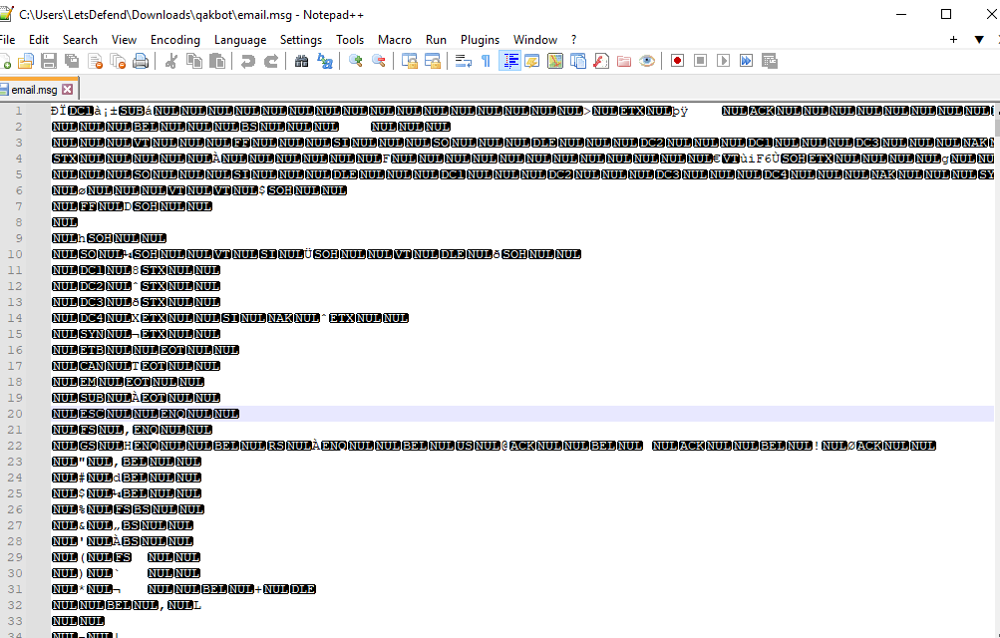

# [LetsDefend - QakBot Malware](https://app.letsdefend.io/challenge/qakbot-malware)
Created: 22/03/2024 10:37
Last Updated: 22/03/2024 11:53
* * *
<div align=center>

**QakBot Malware**

</div>
During an incident, you find a Phishing Email with an email attachment that targets your organization. Your goal is analyzing this malicious attack and identifying Indicators of Compromise (IOCs).

**File Link**: [Download](https://letsdefend-images.s3.us-east-2.amazonaws.com/Challenge/QakBot/qakbot.zip)
**Password**: infected

Or you can directly connect to the machine.

**File location**: C:\Users\LetsDefend\Downloads\
**Password**: infected
* * *
## Start Investigation
>What is the file type inside the phishing email attachment?

We got 2 files to work with, first one is `.one` file which an extension of OneNote file and the second one is `.msg` which is an email itself

There are a lot of NULL byte in msg file

You can use Cyberchef to filter them out

But I didn't want to search for the treasure in the sea, I went to [encryptomatic](https://www.encryptomatic.com/viewer/) an online email reader to find an attachment for me 

So this phishing mail came with onenote file as expected
```
onenote
```

>ApplicationReject_70161(Jan31).one designed to trick victim user click on which file type?

As soon as I opened onenote file with OneNote application, I saw a little icon there expected to be click which embbeded with hta file

```
hta
```

>What is the embedded URL?

I opened onenote file with Notepad++ to find HTML script embbeded

and there it is 
```
http://103.214.71.45/86204.dat
```

>What is the full path of the created registry key after the victim clicks on the attachment inside ApplicationReject_70161(Jan31).one?


```
HKCU\SOFTWARE\Firm\Soft\Name
```

>Identify the full file path metadata inside ApplicationReject_70161(Jan31).one attachment

Back to onenote application, when you move your cursor on an attachment, there is a metadata which are filename, inserted from and size

Inserted from is what we needed
```
Z:\build\one\attachment.hta
```

>What is the content of h1 tag inside ApplicationReject_70161(Jan31).one attachment?

Back to Notepad++, inside first script tag there is variable h1 there

```
5cd5058bca53951ffa7801bcdf421651
```

* * *
## Summary

This challenge familarize user with knowledge of OneNote file which is a medium that was used to be an initial access of a popular Qak Bot malware. We also learned that OneNote file can also embbeded with HTML, JavaScript and VBscript to download a second payload of the malware and do a lot of things that in power of those programming languages.
<div align=center>


</div>

* * *
