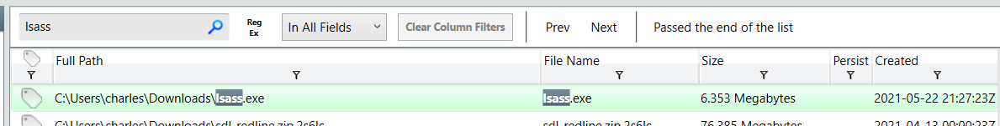

# [LetsDefend - Ransomware Attack](https://app.letsdefend.io/challenge/ransomware-attack)
Created: 02/06/2024 22:00
Last Updated: 02/06/2024 22:47
* * *
<div align=center>

**Ransomware Attack**

</div>
We have extracted the memory dump from the compromised machine. Find the evidence of the ransomware attack.

Memory Dump (pass: infected): C:\Users\LetsDefend\Desktop\Files\AnalysisSession1.7z

This challenge prepared by [@RussianPanda](https://www.linkedin.com/in/an-fam-868921105/)

* * *
You can also download memory dump file from [Download](https://files-ld.s3.us-east-2.amazonaws.com/AnalysisSession.zip) (pass: 321), This is a legitimate file that LetsDefend provided before they implemented built-in investigation lab on this challenge

And if you're not familiar with RedLine, [here](https://www.youtube.com/watch?v=tCIEYCWTdk4) is a video posted by 13Cubed which he taught about this software and demonstrate it.

## Start Investigation
> Please you find the dropped dll, include the whole path including the dll file


First we will need to open .mans file, after open Redline then click "Open Previous Analysis" then select file and click "Next"


.. wait for a sec then we're good to go


First thing I always want to check is File Download History and right there, its the hugh red flag since lsass should not be downloaded because its a core windows process


Go to File System and search for this file, then we can copy it hash to search on VirusTotal


There it is, look like its a trojan or even a ransomware


Next, I checked for process which I found this "MsMpEng.exe" (Microsoft Malware Protection Engine) was executed from user temp directory which is not the right place for it


Check out for ports and look like this process was used to established a connection to external IP address


This IP address is owned by Amazon AWS, it still didn't make sense why Microsoft Malware Protection contacted this IP address


An executable file is legitimate so the problem should come from dll sideloading


Go to File System > Imports then serach for this process then we will have "mpsvc.dll" and "KERNEL32.dll" was imported with this process, later is the legitimate one so we only need to check for the first one


Go to File System to grab it hash


This dll is a ransomware so its the one we're looking for
```
C:\Users\charles\AppData\Local\Temp\MpsVc.dll
```

> What is the MD5 hash for the dll?
```
040818b1b3c9b1bf8245f5bcb4eebbbc
```

> What is the name of ransomware note that got dropped?


On File System, I searched with ".txt" that we have this ransomnotes on sevaral locations
```
2s6lc-readme
```

> What is the URL that the initial payload was downloaded from? (Include the whole URL with the payload)


```
http://192.168.75.129:8111/Documents/lsass
```

> The ransomware drops the copy of the legitimate application into the Temp folder. Please provide the filename including the extension


We already know that "MsMpEng.exe" is legitimate file but was executed from user temp directory that is not where its belong
```
MsMpEng.exe
```

> What is name of the ransomware?


Sodinokibi or it also known as REvil ransomware
```
Sodinokibi
```

* * *
## Summary

On this challenge, we learn how to use Redline for memory analysis looking for an initial attack of Sodinokibi ransomware which will be known later as REvil

<div align=center>


</div>

* * *
