# [LetsDefend - RegistryHive](https://app.letsdefend.io/challenge/registryhive)
Created: 21/03/2024 11:28
Last Updated: 22/03/2024 13:52
* * *
<div align=center>

**RegistryHive**

</div>
You're a forensics analyst and have a registry dump. Try to analyze the evidence and answer the questions.

Registry Files Location: C:\Users\LetsDefend\Desktop\RegistryHive\Regs
* * *
## Start Investigation
>What is the Computer name of this machine?

We got all the registry hives that needed to complete this challenge
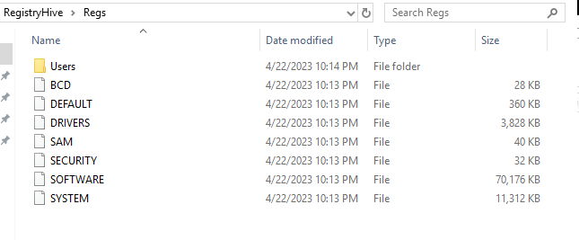
There are 3 tools that we can used which are RegRipper 2.8 and 3 and lastly RegistryExplorer from EZ tools
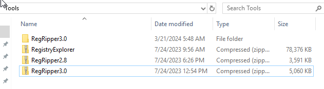
I started by using RegRipper 3 with SYSTEM hive which hold system information
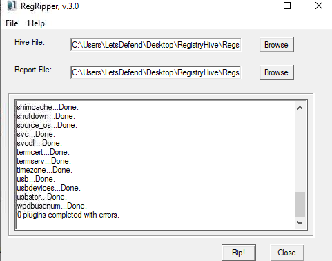
Search for ComputerName
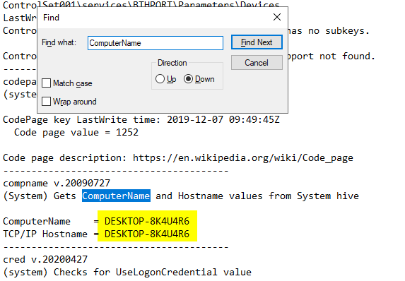

```
DESKTOP-8K4U4R6
```

>What is the last shutdown time for this machine? <br>
Format: YYYY/MM/DD HH:MM:SS

Search by shutdown on the system hive output
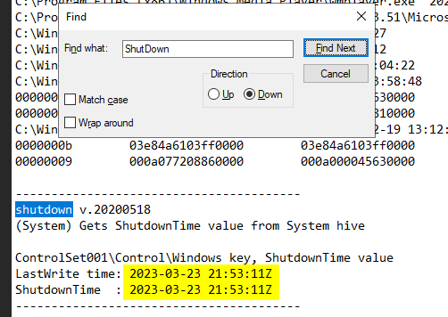
```
2023-03-23 21:53:11
```

>What is the time zone name that the machine uses?

Search by timezone on the system hive output
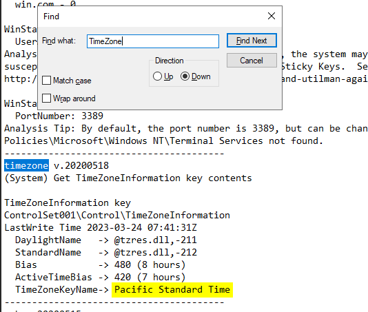
```
Pacific Standard Time
```

>What is the IP address of the default gateway?

Search by gateway on the system hive output, We got only DHCP Default Gateway here
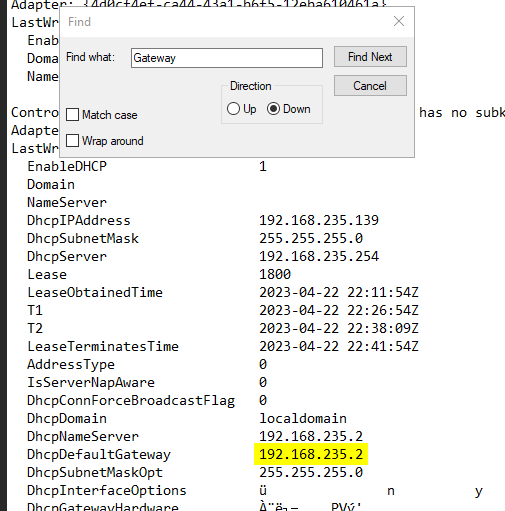
```
192.168.235.2
```

>What is the last login date for the user “Work”? <br>
Format: DD/MM/YYYY HH:MM:SS

Now move to SAM hive for user information
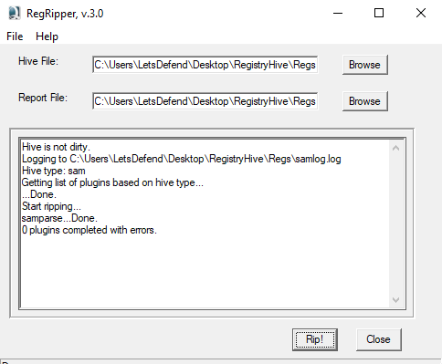
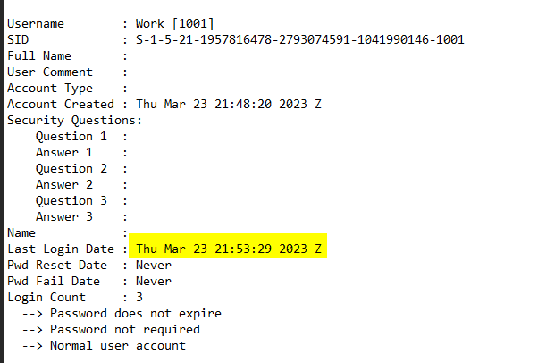

```
23/03/2023 21:53:29
```

>How many logins did the “Work” user have?

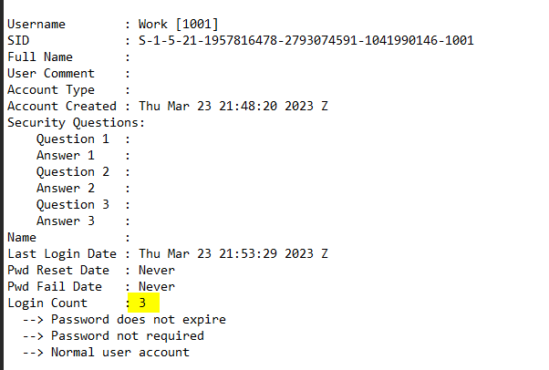
```
3
```

>What is the OS “ProductName”?

use Registry Explorer to load Software Hive then go to `HKEY_LOCAL_MACHINE\SOFTWARE\Microsoft\Windows NT\CurrentVersion` which hold information about Windows OS and Product
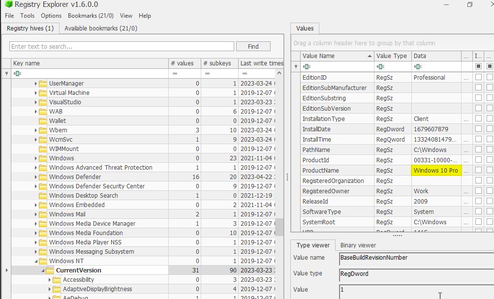
```
Windows 10 Pro
```

>What is the OS “BuildNumber”?

Still on `HKEY_LOCAL_MACHINE\SOFTWARE\Microsoft\Windows NT\CurrentVersion`
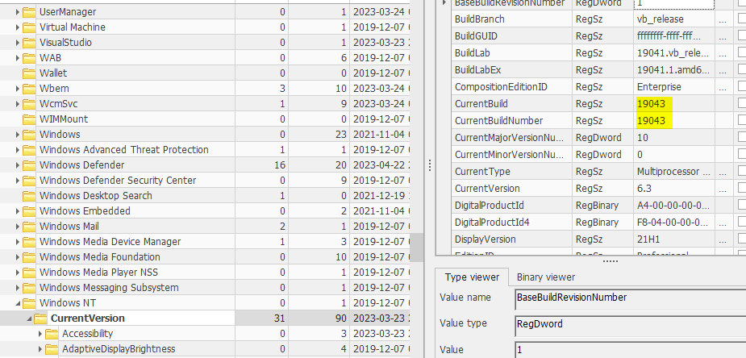
```
19043
```

>How many programs run on startup for any user?
 
`HKEY_CURRENT_USER\Software\Microsoft\Windows\CurrentVersion\Run` registry holds information for programs that will be run on startup
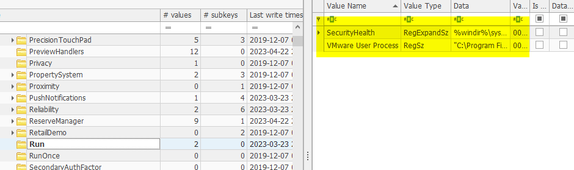
```
2
```

>What is the last installed app?

`HKEY_CURRENT_USER\Software\Microsoft\Windows\CurrentVersion\Uninstall` registry holds this information despite it names 
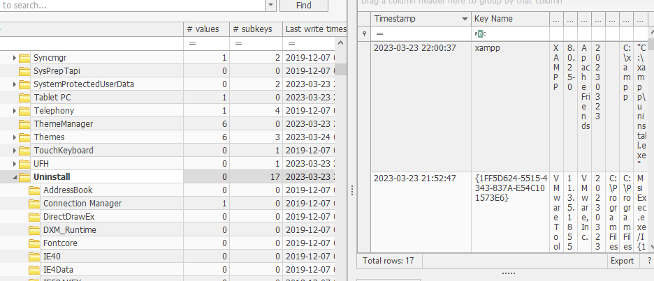
```
xampp
```

>What is the “DefaultGatewayMac”?

Registry NetworkList holds this information, so just search for this
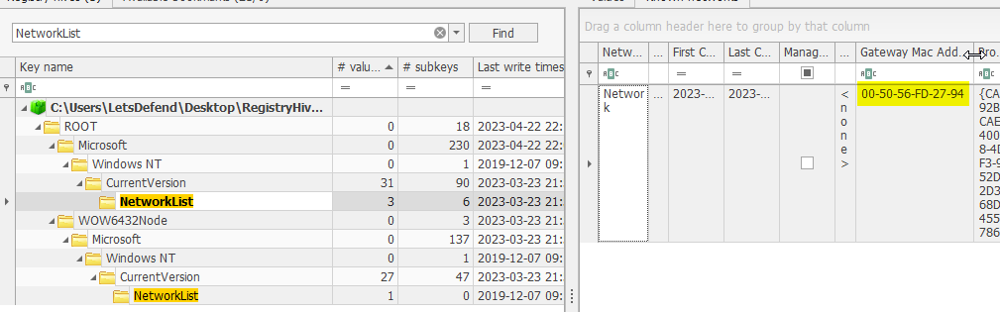
```
00-50-56-FD-27-94
```

>What is the Machine SID?

This question can obtained by using RegRipper 2.8 only, and the hive that hold this information is SECURITY Hive
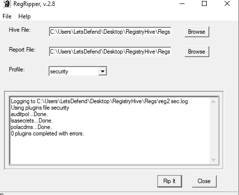
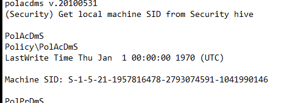
```
S-1-5-21-1957816478-2793074591-1041990146
```

* * *
## Summary

This challenge was designed for user to practice registry analysis and find basic information about system from 4 registry hives.
<div align=center>


</div>

* * *
