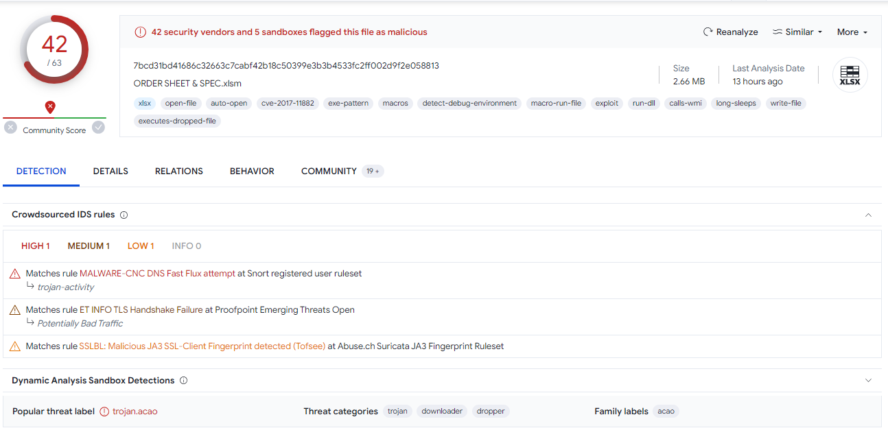
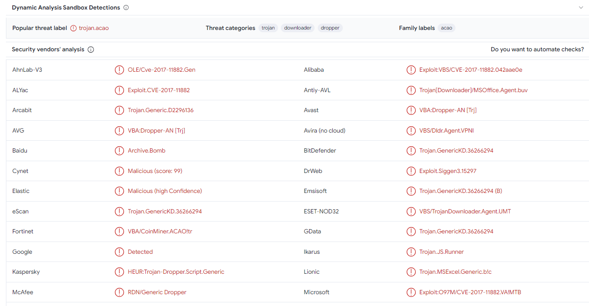
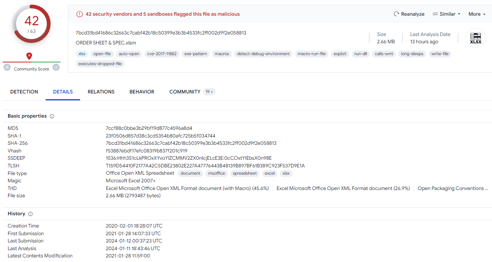
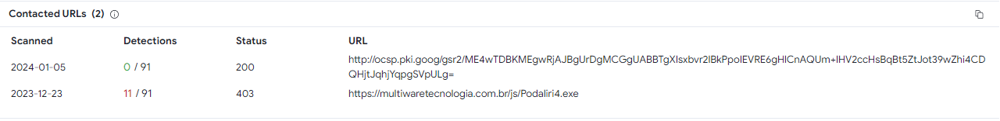
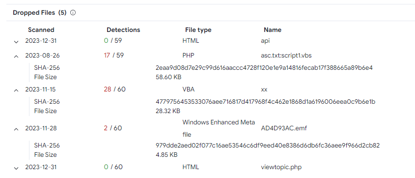
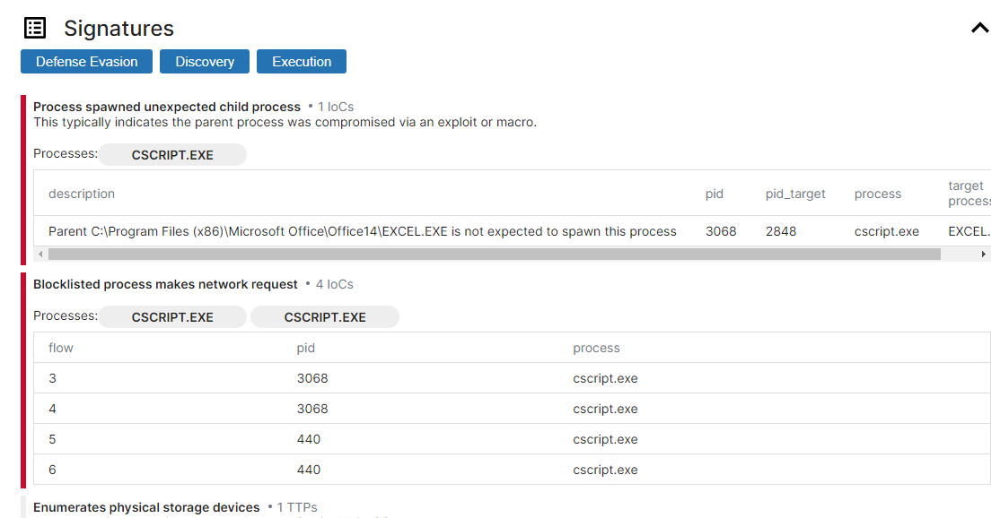
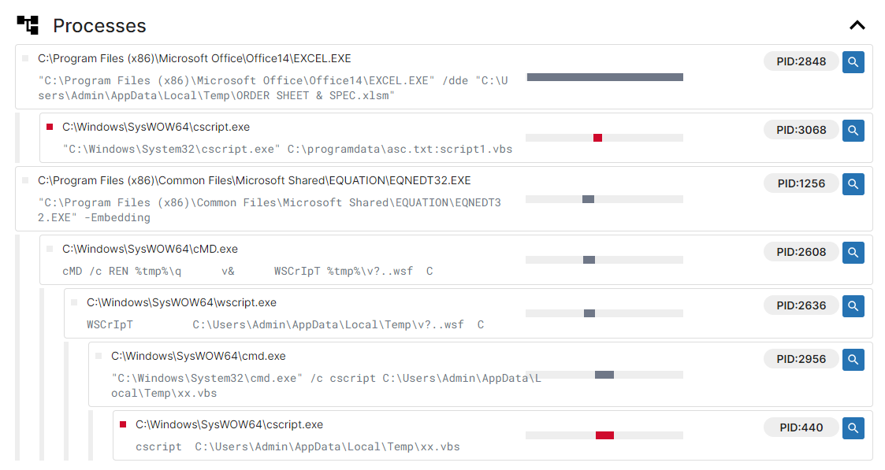

# [LetsDefend - Remote Working](https://app.letsdefend.io/challenge/remote-working)
Created: 10/01/2024 14:05
Last Updated: 05/06/2024 20:12
* * *
<div align=center>

**Remote Working**


</div>
Analysis XLS File

File link: /root/Desktop/ChallengeFiles/ORDER_SHEET_SPEC.zip Password: infected

NOTE: Do not open on your local environment. It is a malicious file.
* * *
## Start Investigation
### VirusTotal
Uploaded sample xlsm file to [VirusTotal](https://www.virustotal.com/gui/file/7bcd31bd41686c32663c7cabf42b18c50399e3b3b4533fc2ff002d9f2e058813) 
<div align=center>


This file was flagged as malicious by **42** security vendor


Some security vendors labeled this file as a **Trojan**


It was created on `2020-02-01 18:28:07` UTC


Found **1** contacted URL that seem suspicious and might be a payload stage


It drop **3** files on the disk 
</div>

## Record Future Triage
Uploaded this file to [Triage](https://tria.ge/240112-ka134scear/behavioral1) 

<div align=center>


Once this file is opened, a child process is spawned and it was a cscript that tries to connect to make a network request to download an actual malware


</div>

* * *
> What is the date the file was created?
```
2020-02-01 18:28:07
```

> With what name is the file detected by Bitdefender antivirus?
```
Trojan.GenericKD.36266294
```

> How many files are dropped on the disk?
```
3
```

> What is the sha-256 hash of the file with emf extension it drops?
```
979dde2aed02f077c16ae53546c6df9eed40e8386d6db6fc36aee9f966d2cb82
```

> What is the exact url to which the relevant file goes to download spyware?
```
https://multiwaretecnologia.com.br/js/Podaliri4.exe
```
* * *
## Summary
This XLS File is a microsoft excel with VBA macro embedded. It is a stager that once it opened it tries to download an actual malware from a certain URL.
<div align=center>


Badge Acquired
</div>

* * *