# [LetsDefend - Revenge RAT](https://app.letsdefend.io/challenge/revenge-rat)
Created: 30/07/2024 23:31
Last Updated: 02/08/2024 10:53
* * *
<div align=center>

**Revenge RAT**
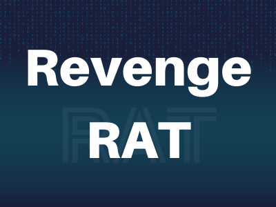
</div>
An attack on a company employed a Remote Access Trojan (RAT) disguised in seemingly harmless files. The RAT infiltrated the network and operated as fileless malware.

DFIR analysts have extracted the malware. Now they need you to analyse the sample and uncover its secrets. By dissecting the binary, we can understand its behaviour, assess the damage, and devise a strategy to eradicate the threat, ensuring the organization's security.

**File Location**: C:\Users\LetsDefend\Desktop\ChallengeFile\sample.7z
**File Password**: infected
* * *
## Start Investigation
>What compiler is used for this sample?

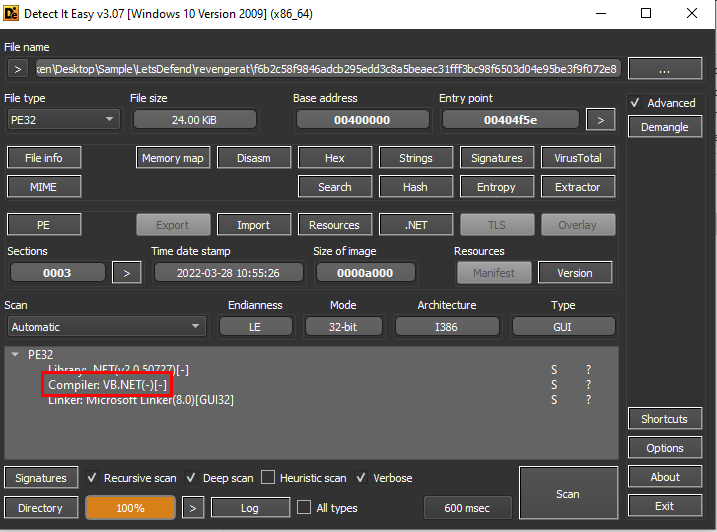

We can use DIE to get an answer of this question like this, then we can see that this sample is .NET based malware so we can use .NET decompiler such as JetBrains dotPeek, dnSpy or ILSpy to decompile this sample and analyze code and behavior of this sample

```
VB.NET
```

>What is the mutex name checked by the malware at the start of execution?

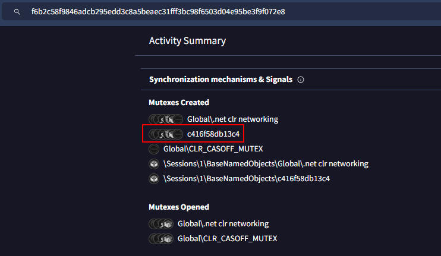

This one can be easily obtained by searching sample hash on VirusTotal and go to Behavior tab which you can see that there is a mutex which this random string, and since we got our .NET decompiler then we can check if this one is really random string per host or a constant value for all hosts

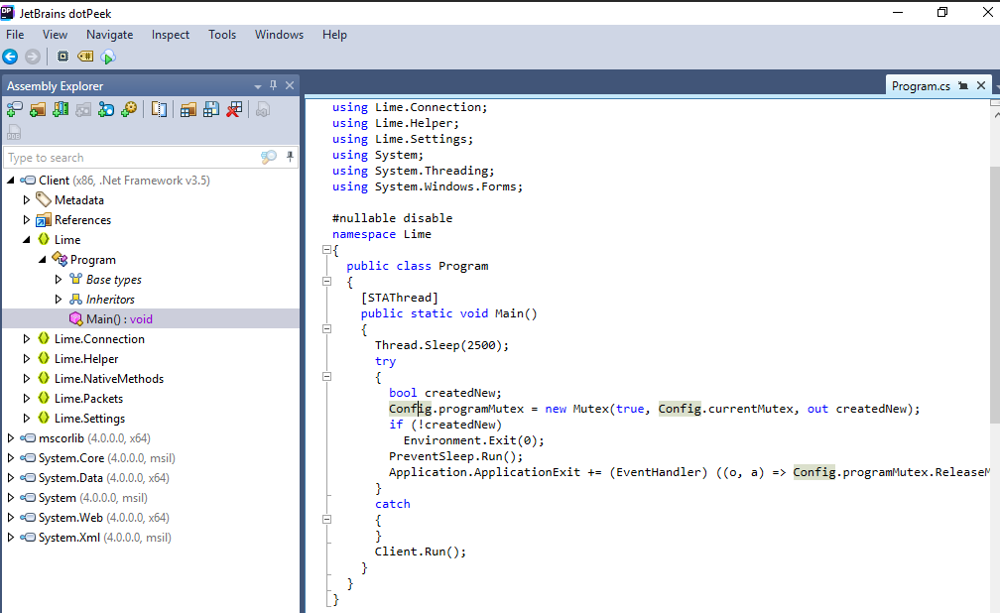

After decompiled sample, go to `Lime` namespace and `Main()` function then we should see that this malware will sleep for 2500 millisec then proceed to create Mutex and will retrieve a name from `Config`

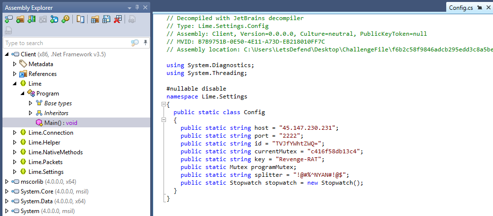

Followed to `Config` class, we can also see other information related to this malware such as C2 IP and port, ID that look like base64 encoded, Mutex name, key and etc.

```
c416f58db13c4
```

>What function was used to get information about the CPU?

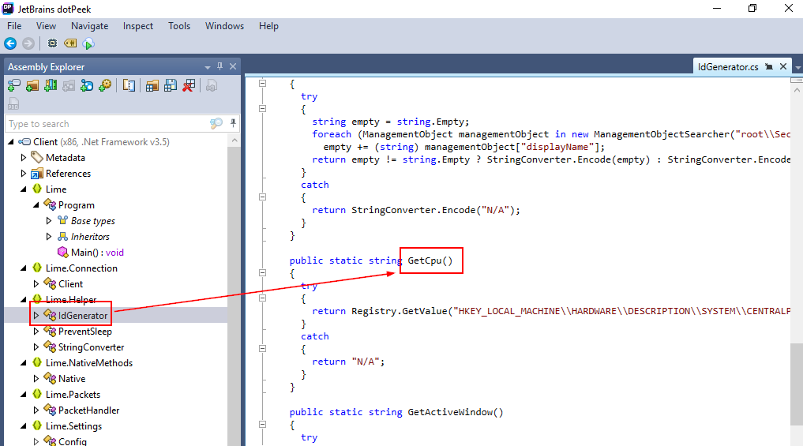
Inside there is an `idGenerator` class within `Lime Helper` namespace that declares many functions to retrieve information on infected host and `GetCpu` is the one responsible for getting CPU information via registry key

```
GetCpu
```

>What key was used during the “SendInfo” function?

Remember `key` varible in `Config`?, we just have to confirm that `SendInfo` function really uses that key 

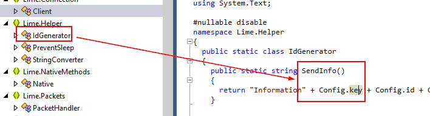

Which you can see that this function is under `IdGenerator` class and it retrieve `Config.key` to send information

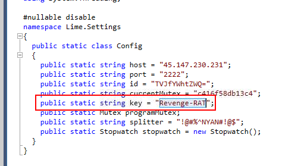

Get the key and submit the answer 

```
Revenge-RAT
```

>What API was used by the malware to prevent the system from going to sleep?

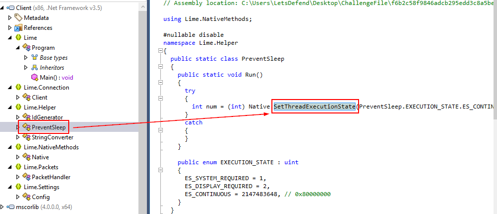

We can also see that there is one class that responsible for prevent the system from going to sleep which is `PreventSleep` then after examined this class, We can see that [SetThreadExecutionState](https://learn.microsoft.com/en-us/windows/win32/api/winbase/nf-winbase-setthreadexecutionstate) is used under `Run` function. 

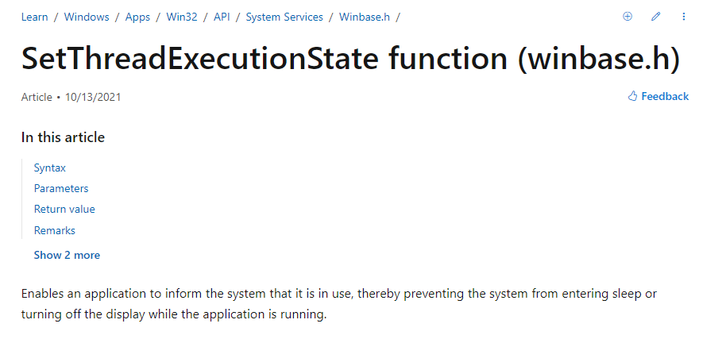

its a Windows API that capable of doing this job  

```
SetThreadExecutionState
```

>What variable stores the volume name and the function that imported the "GetVolumeInformationA" api?

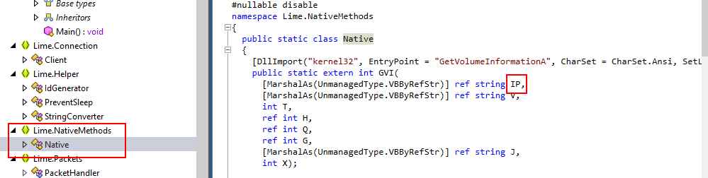
We can see that [GetVolumeInformationA](https://learn.microsoft.com/en-us/windows/win32/api/fileapi/nf-fileapi-getvolumeinformationa) is imported from `kernel32.dll` then `GVI` function will be responsible for storing each information retrieve by `GetVolumeInformationA` and `IP` stored volumn name
```
IP
```

>What function was used to retrieve information about installed video capture drivers?

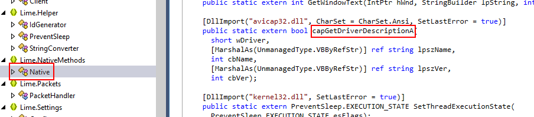

We can that there are another dll imports and the one that related to video capture driver is `apicap32.dll` then let `capGetDriverDescription` function stores information about video capture driver found on infected system then we need to find implementation of this method 

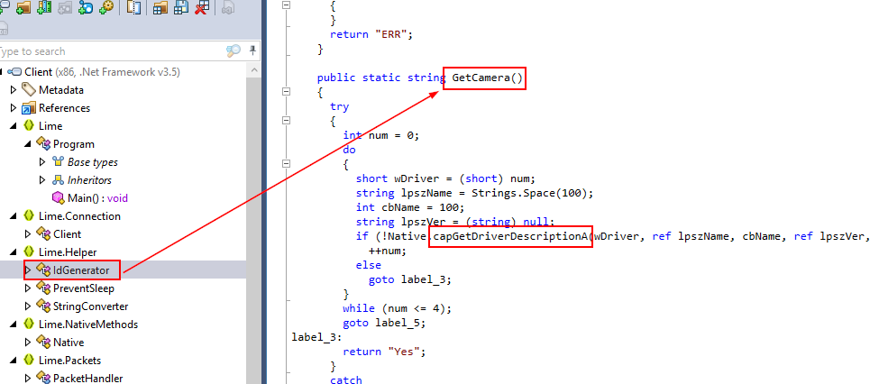
Then we can see that `GetCamera` is the only function that called `capGetDriverDescription` hence the answer of this question

```
GetCamera
```

>What is the value of the ID after removing obfuscation?

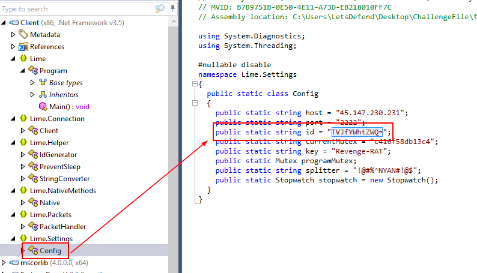

Remember id varible? lets grab it and decode it

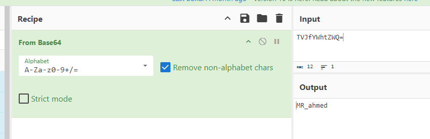
```
MR_ahmed
```

* * *
## Summary
On this challenge, we analyzed Revenge RAT malware that is a freely available remote access tool written in .NET and analyze what it could do to our system once it got executed

Here are useful resources if you want to learn more about this RAT
- https://perception-point.io/blog/revenge-rat-back-from-microsoft-excel-macros/
- https://attack.mitre.org/software/S0379/
<div align=center>

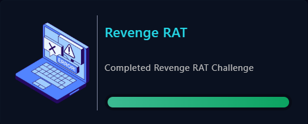
</div>

* * *
