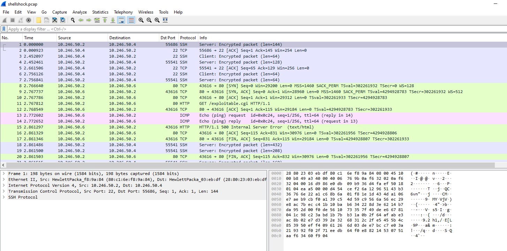
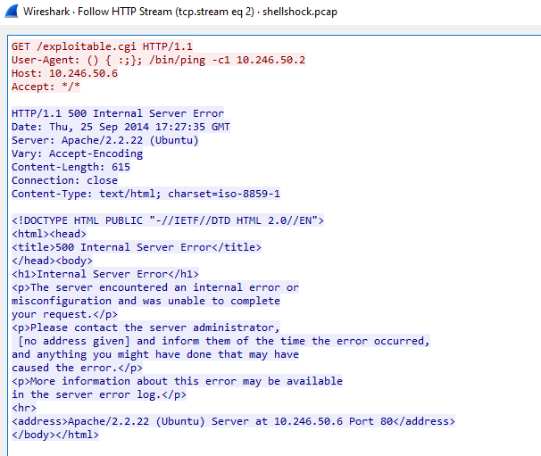
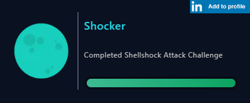

# [LetsDefend - Shellshock Attack](https://app.letsdefend.io/challenge/shellshock-attack)
Created: 12/01/2024 12:13
Last Updated: 16/01/2024 14:15
* * *
<div align=center>

**Shellshock Attack**

</div>
You must to find details of shellshock attacks

Log file: https://files-ld.s3.us-east-2.amazonaws.com/shellshock.zip Pass: 321

Note: pcap file found public resources.
* * *
## Start Investigation
Let's open this pcap file in Wireshark
<div align=center>


At first sight, There were some SSH,TCP,HTTP and ICMP packets in this pcap file
</div>

I followed HTTP/TCP stream to find out about some basic server information
<div align=center>


And jackpot! We also found all the answers including payload that trying to exploit shellshock vulnerability.
</div>

* * *
> What is the server operating system?
```
ubuntu
```

> What is the application server and version running on the target system?
```
Apache/2.2.22
```

> What is the exact command that the attacker wants to run on the target server?
```
/bin/ping -c1 10.246.50.2
```

* * *
## Summary
This pcap file captured a moment where system `10.246.50.2` tried to use shellshock vulnerability to exploit an Apache server hosted on Ubuntu system (`10.246.50.6`)

<div align=center>


Badge Acquired
</div>

* * *