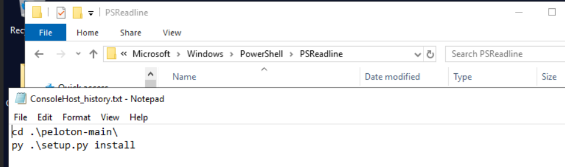

# [LetsDefend - Suspicious Python Package](https://app.letsdefend.io/challenge/suspicious-python-package)
Created: 01/10/2024 08:56
Last Updated: 01/10/2024 10:46
* * *
One of our employees attempted to install a Python package, and shortly afterward, someone logged into his work account. He doesn't know how it happened and needs your help as a forensics investigator to determine what occurred.

**File Location**: C:\Users\LetsDefend\Desktop\ChallengeFile\MalPy.zip
* * *
## Start Investigation
>The attacker downloaded a malicious package. What is the full URL?


After extracted content of zip file, I got relevant artefacts to analyze but the question ask for "downloaded" a malicious package so It might reside on one of user's download folder and the only user of this machine (not include Guest and Public) is Administrator and this is suspicious python package that might be extracted from archive file.


I also found chrome browser artefacts so I opened History file with DB Browser then we can see that there is suspicious zip file downloaded from Github.

```
https://github.com/0xMM0X/peloton
```

>What is the name and version of the downloaded package?
**Answer Format**: package-name111:0.0.01


We will find this information in `PKG-INFO` (package information) file 

```
peloton-client123:0.8.10
```

>What is the exact time that this package was downloaded?
**Answer Format**: YYYY-MM-DD HH:MM:SS

I tried to get download end time chrome browser history but thats not accept as the answer of this question so it seems like we need to parse Master File Table to get Created0x10 timestamp.


Go back to chrome history database again to get name of malicious archive package.


Use `MFTECmd.exe` from EZ tools to parse `$MFT` file.


Now search for malicious package archive to get create timestamp which also the exact time this file was downloaded successful.

```
2024-01-22 20:00:11
```

>What file in the package contains malicious code?



Another interesting artefacts that I found is PowerShell History that indicate this user executed `setup.py` via PowerShell


So lets take a look at `setup.py`, we can see a lot of red flag here since it got base64 encode strings that need to be reversed and decompressed so lets do that in CyberChef and find out what this file really does


Now we can see that it exfiltrate chrome's login data database file -> `temp_file.zip` -> send to C2 server -> delete `temp_file.zip` (clean up)

```
setup.py
```

>What was the name of the archive file created for exfiltration and then deleted?
```
temp_file.zip
```

>When did the zip file get deleted?
**Answer Format**: YYYY-MM-DD HH:MM:SS


We will need to parse UsnJournal (`$J`) for this one, we could still use `MFTECmd.exe` for this


After search for this file from output, we can see that it got 5 records from Create to Delete so we have to get the last record timestamp


Turn out... there is no need since this file was created and deleted in such short amount of time so it appeared with the same timestamp.

```
2024-01-22 20:00:42
```

>What exactly did the attacker steal from the victim's machine? (Name of the file)
```
Login Data
```

>The stolen file contains some sensitive data. What is the full URL of the website and the victim’s username?
**Answer Format**: URL_username


Lets see whats important in `Login Data` database file which we could see that attacker could get saved login credential of app.letsdefend.io (self-promo)

```
https://app.letsdefend.io/_all4m
```

>What is the IP and PORT number of the attacker C2?
**Answer Format**: IP:Port
```
172.31.78.151:8000
```
* * *
## Summary
On this challenge, we analyzed 
- Browser artefacts to find download url of malicious python package and also user that was affected by this exfiltration.
- Master File Table to find the download timestamp of malicious package archive file.
- Malicious payload that got executed.
- UsnJournal to find deleted timestamp of temporary file that sent to C2 server

<div align=center>


</div>

* * *
