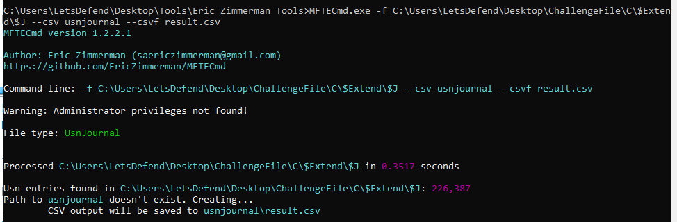

# [LetsDefend - TeamViewer Forensics](https://app.letsdefend.io/challenge/teamviewer-forensics)
Created: 09/07/2024 10:31
Last Updated: 07/08/2024 19:42
* * *
<div align=center>

**TeamViewer Forensics**

</div>
During a workday, an employee noticed strange unauthorized activity on his computer, with applications opening and the mouse moving. Quickly realizing that someone was remotely accessing his machine via TeamViewer, the employee acted quickly, changing his TeamViewer password and alerting the security team. However, the employee must still clarify how the breach occurred and how far the threat actor has gone. Your challenge is to unravel this mystery and discover how the intruder gained access and what they did.

**File Location**: C:\Users\LetsDefend\Desktop\ChallengeFile\teamviewer_triage.7z
* * *
## Start Investigation
>What is the intruder’s username?


Since we need to investigate TeamViewer so [here](https://benleeyr.wordpress.com/2020/05/19/teamviewer-forensics-tested-on-v15/) is the useful resource that might come in handy for us


`Connections_incoming.txt` stores ID, timestamp and username of remote user and local user so we can see that there is only 1 remote user connected to this system but was connected for 2 times

```
a1l4m
```

>What is the “user ID” associated with the intruder's username?


```
565955529
```

>The attacker has joined more than one time. When did the intruder first access 
the victim's machine? <br>
Answer Format: (yyyy-MM-dd HH:mm:ss.SSS)

We need to investigate `TeamViewer15_Logfile.log` for this one and find for "incoming remote control" log which is a log generated when new remote connection will be established (some negotiation need to be done first)


Here is the first access of the attacker and you can see that after this timestamp, negotiating session encryption client hello were received from the attacker's user ID
 
```
2024-07-04 04:34:16.699
```

>What is the “session ID” of the intruder's second access to the computer?


Find second "incoming remote control", then we will see the session ID for this connection

```
536169703
```

>What was the duration of the second session in seconds.milliseconds? <br>
Answer Format: 351.453

From previous question, we know that second access happened at `2024/07/04 04:35:03.631` and we need to find where this session was terminated


We can search for "SessionTerminate" for this which indicates a time when session will be terminated but as you can see that session will be really removed at `2024/07/04 04:45:11.202` (which is 1 millisec later)


Search for "time calculator with millisec" which will land us with https://datetimecalculator.net/time-calculator, then we can subtract timestamps we got to get the answer of this question 

```
607.571
```

>What is the IP address of the server to which the intruder exfiltrated data?


When navigated to targeted file system, I found `ConsoleHost_history.txt` which is a log that stores PowerShell command of each user and we can see that there is a command to compress files in `\Condidental` folder to `output.zip` then send it to `116.203.186.178` with `HTTP POST` method

```
116.203.186.178
```

>How many files did the intruder exfiltrate?



We can use `UsrJournal` which a feature of NTFS file system that keep track of changes to files and folders on Windows for this one, but we need to parse it with `MFTECmd.exe -f C:\Users\LetsDefend\Desktop\ChallengeFile\C\$Extend\$J --csv usnjournal --csvf result.csv` first


Then after open result file in Timeline explorer and find for `Condidential` folder, we can see that there are 3 files inside this folder
```
3
```

>When did the intruder delete the confidential data from the system? <br>
Answer Format: 2023-02-24 05:12:03


Find for `FileDelete` then we can see that 3 files we just found from previous question were deleted from this system including zip file that might be a file that was exfiltrated to C2 server

```
2024-07-04 04:42:09
```

* * *
## Summary
On this challenge, we discovered username and user ID of an attacker connected to breached machine and also found timestamp when those connection occurred and how long of each connection

then we discovered that compressed file that contained files from `Condidental` data was exfiltrated via PowerShell and eventually deleted from breached machine.

<div align=center>


</div>

* * *
