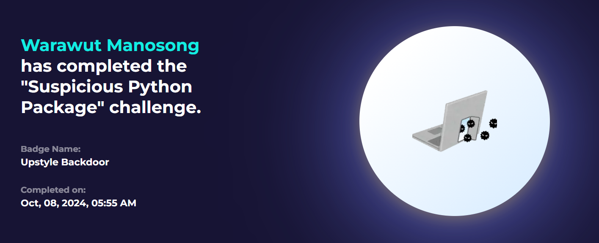

# [LetsDefend - Upstyle Backdoor](https://app.letsdefend.io/challenge/upstyle-backdoor)
Created: 08/10/2024 09:32
Last Updated: 08/10/2024 11:29
* * *
Help us to analyze specifically targeting a backdoor known as UPSTYLE and its relation to CVEs (Common Vulnerabilities and Exposures) that affect Palo Alto Networks' products.
* * *
On this challenge, we will have to analyze python script that used to exploit CVE-2024-3400 so we have to know make this a CVE

[Here](https://www.volexity.com/blog/2024/04/12/zero-day-exploitation-of-unauthenticated-remote-code-execution-vulnerability-in-globalprotect-cve-2024-3400/) and [here](https://www.zscaler.com/blogs/security-research/look-cve-2024-3400-activity-and-upstyle-backdoor-technical-analysis) are the resource that I cited to


<--credit to Volexity Threat Research-->

To put it simply, it will exploit Palo Alto GlobalProtect VPN by 
- Sending payload in web request that will be logged in `/var/log/pan/sslvpn_ngx_error.log`
- It will look for `img\[([a-zA-Z0-9+/=]+)\]` pattern in this log file to find base64 encoded string 
- Decode and execute commands from base64 string
- The output of the execution will be appended to bootstrap CSS at `/var/appweb/sslvpndocs/global-protect/portal/css/bootstrap.min.css` so the threat actor could get the result of command.
- After command executed, payload in log file will be removed and change last access and modification timestamp
- Delete license file with `/opt/pancfg/mgmt/licenses/PA_VM*` 
- Original bootstrap will also be restored and change last access and modification timestamp.
- Payload now will be in `/usr/lib/python3.6/site-packages/system.pth` as a backdoor and actively monitoring log for another command execution. 
- It also sets up a signal handler (`SIGTERM`) that restores the malicious code in system.pth if it is deleted or tampered with, protecting itself from removal.

So now we can analyze malicious python script used for this exploit with knowing these crucial information.

## Start Investigation
>What function is responsible for monitoring a log file for embedded commands and executing them, while also restoring the file to its original state?
**Answer Format**: functionname()


We can see that inside `check()` function, it does everything we learned from our research

```
check()
```

>What is the system path that is used by the threat actor?


Here is a path that backdoor will be installed

```
/usr/lib/python3.6/site-packages/system.pth
```

>What is the CSS path used by the script?


```
/var/appweb/sslvpndocs/global-protect/portal/css/bootstrap.min.css
```

>Where does the script attempt to remove certain license files from?


```
/opt/pancfg/mgmt/licenses/
```

>What specific signal does the protection function respond to?


```
SIGTERM
```

>What function is responsible for protecting the script itself?
**Answer Format**: functionname()
```
protect()
```

>What type of pattern does the script search for within the log file?
```
img\[([a-zA-Z0-9+/=]+)\]
```

>Which specific log file does the script read from?
```
/var/log/pan/sslvpn_ngx_error.log
```
* * *
## Summary
On this challenge, we analyzed a script use to exploit CVE-2024-3400 or Upstyle Backdoor and learn how this script can achieve command execution and stay persistence on the infected system.

<div align=center>


</div>

* * *
