# [LetsDefend - WannaCry Ransomware](https://app.letsdefend.io/challenge/wannacry-ransomware)
Created: 22/03/2024 14:06
Last Updated: 22/06/2024 13:36
* * *
<div align=center>

**WannaCry Ransomware**

</div>
MMOX Company GOT infected with ransomware, as one of our new employees was not aware enough of the phishing campaigns. Can you track what happened to answer the following questions?


File Link: [Download](https://letsdefend-images.s3.us-east-2.amazonaws.com/Challenge/WannaCry-Challenge/WannaStory.7z)

Or you can directly connect to the machine.

**File location(Windows)**: C:\Users\LetsDefend\Desktop\WannaStory
**File location(WSL-Ubuntu)**: C:\Users\LetsDefend\AppData\Local\Packages\CanonicalGroupLimited.UbuntuonWindows_79rhkp1fndgsc\LocalState\rootfs\home\letsdefend\WannaStory

**WSL-Ubuntu username**: letsdefend
**WSL-Ubuntu password**: letsdefend

**Note**: If you want to transfer a file to WSL-Ubuntu firstly you should transfer the file and then you should restart Windows "LxssManager" service and re-open the WSL-Ubuntu shell. Then give permission to transfer file on WSL-Ubuntu.

**Note**: Use python2 to run the oledump tool. If necessary, you can download and install analysis tools.
* * *
## Start Investigation
>What is the md5 of the desk and memory images? Answer format: Desk hash_ Memory hash

We got HashMyFiles on Windows so throw both files into HashMyFile to calculate MD5 hash 
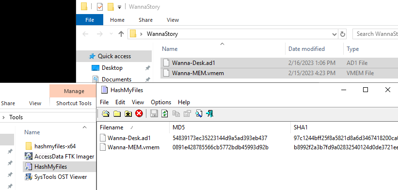
```
54839173ec35223144d9a5ad393eb437_0891e428785566cb5772bdb45993d92b
```

>What is the suitable profile for the memory dump?

Volatility was nowhere to be found on Windows system but on Ubuntu WSL, We got both volatility 2 (vol2) and volatility 3 (vol3) along with oledump from EZ tools
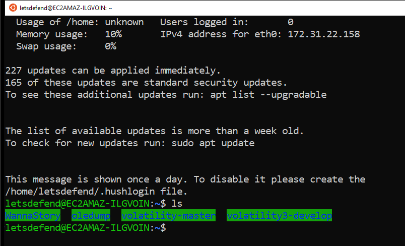
vol3 doesn't have profile anymore so vol2 is an only tool here, just use it with `imageinfo` to let vol2 determine suitable profile for this memory
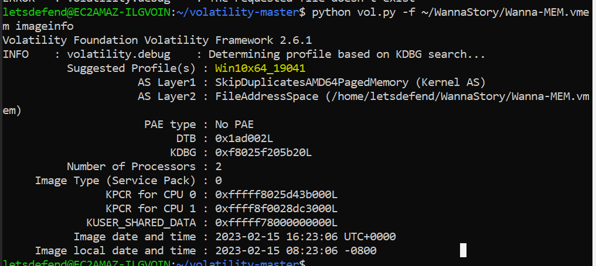
```
Win10x64_19041
```

>When was the memory image captured?

The answer of this question could also be found on vol2 `imageinfo` result
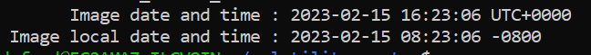
```
2023-02-15 16:23:06
```

>What are the attacker's email address and the infected user's email address? Answer format: attacker email_infected user email

Back to Windows with FTK Imager provided, I opened an image file then determine which user got infected
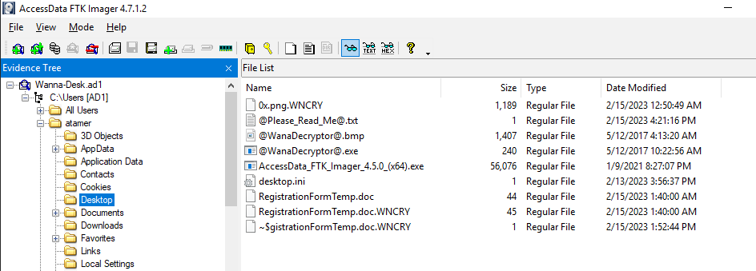
The result shows that user atamer was infected by this ransomware
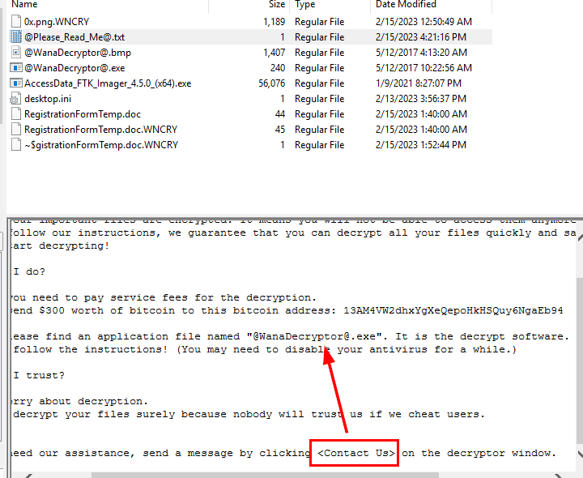
I also read ransomnote but look like contact info can also be found on decryptor

I also noticed that there is a tool provided by this challenge to view OST file so I went to `AppData\Microsoft\Outlook` to find an OST file of this user
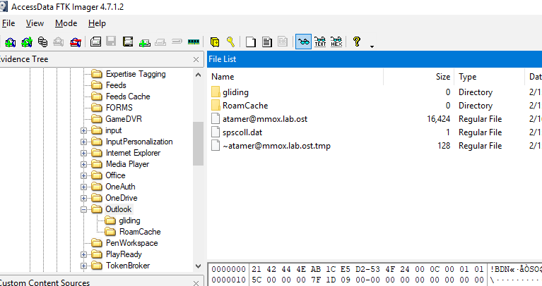
As expected, this user used Microsoft Outlook to open an email so now we can use SysTools OST Viewer to open this file
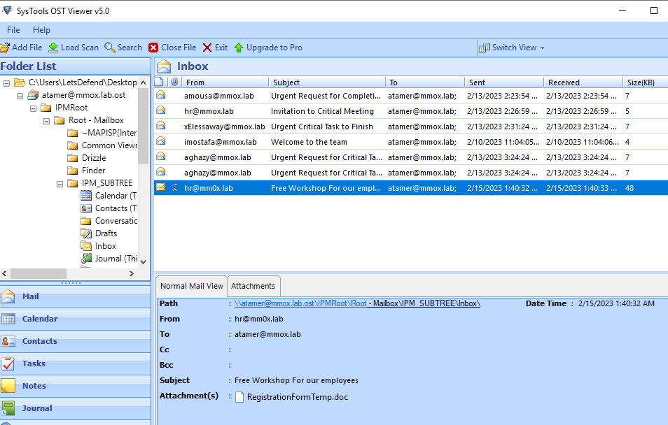
Last email is obviously a phishing email by switching domain name from o to 0 and it also have an attachment with the same name as we found eariler
```
hr@mm0x.lab_atamer@mmox.lab
```

>What is the SHA-256 of the initial access file?

FTK Imager has Export File Hash List function but the limitation is it can only calculate for MD5 and SHA1 so the only way is to export it then using HashMyFile
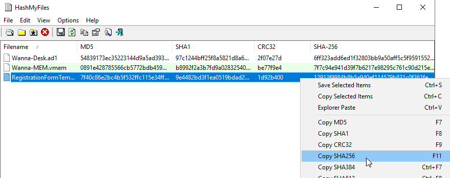
```
12913f9984b8b5a940ef114579b831c0f361feb5f5618ccea11f5cb166a08c47
```

>What are the IP and the port that the attacker used to deliver the ransomware? Answer format: IP:Port

We got a malicious document file from an image so export it and then sent to Ubuntu WSL using python basic http server and wget 
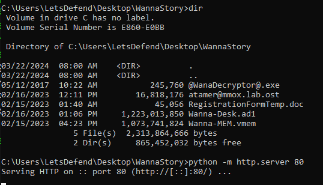
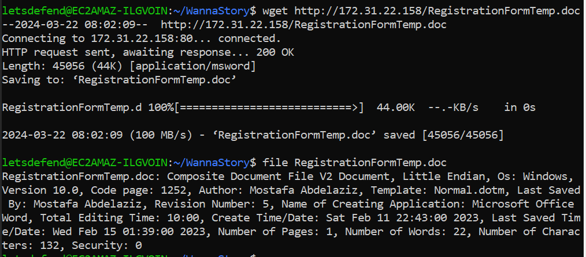
After downloaded maldoc, we can use oledump to dump malicious macro from this maldoc file
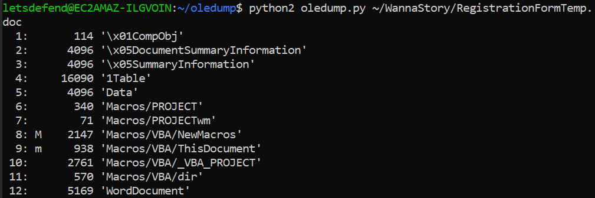
Result shows that stream 8 and 9 are where the Macro was embbeded then we can use `-s 8` or `-s 9` to select a stream to dump
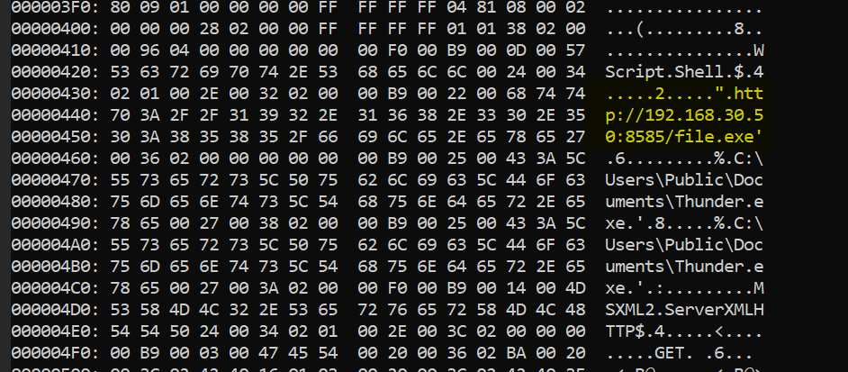
There is an IOC there so This ransomware was downloaded from `192.168.30.50` on port `8585` and was renamed it to `Thunder.exe` so this is an actual ransomware.
```
192.168.30.50:8585
```

>What is the PID of the 3 malicious processes that are related to the ransomware (Numerical order) Answer format: PID_PID_PID

Use vol2 or vol3 with pstree plugin to list process tree

Vol2: `python2 vol.py -f ~/WannaStory/Wanna-MEM.vmem --profile=Win10x64_19041 pstree`
Vol3: `python3 vol.py -f ~/WannaStory/Wanna-MEM.vmem windows.pstree.Pstree`

then find the explorer.exe or Thunder.exe
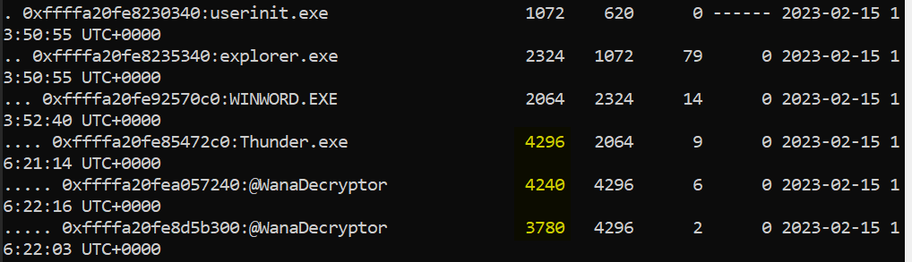
As expected, word was spawned from explorer when user opened maldoc then `Thunder.exe` (an actual ransomware) was downloaded and executed, which also spawn 2 more processes that have the same name
```
3780_4240_4296
```

>What is the Bitcoin address that will be used to pay the ransom?

There is a ransomnote on infected user's Desktop which will provide user a bitcoin address for their payment.
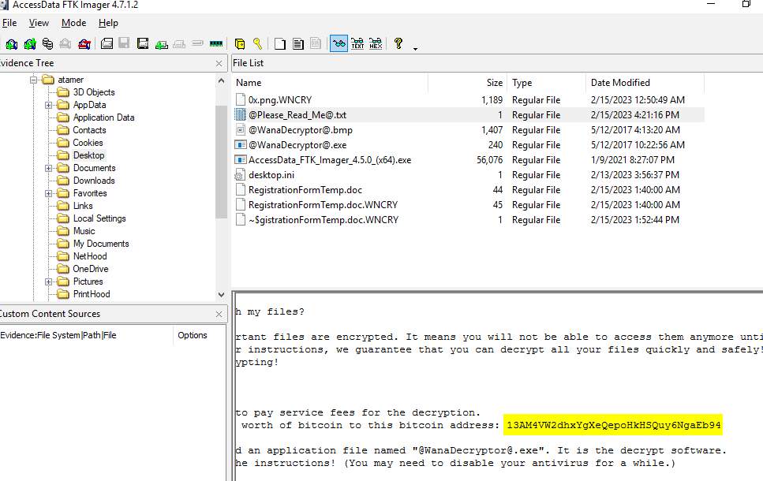
```
13AM4VW2dhxYgXeQepoHkHSQuy6NgaEb94
```

>There is a suspicious file that the main malicious process dumps what is the file's name and its offset Format: offset_name

Use handles plugin to understanding how processes interact with system resources, detecting suspicious activity, and uncovering hidden artifacts during memory analysis of Windows systems
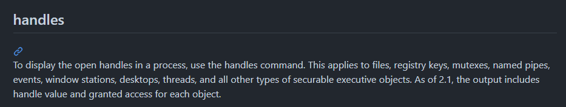
Then we also know that a ransomware is named `Thunder` so add more filter to output of the vol3 
`python3 vol.py -f ~/WannaStory/Wanna-MEM.vmem windows.handles.Handles | grep "Thunder"`
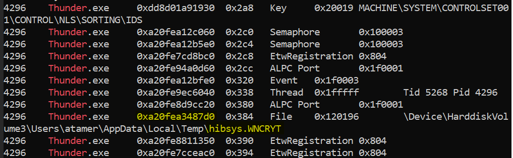
There is a file created on Temp directory 
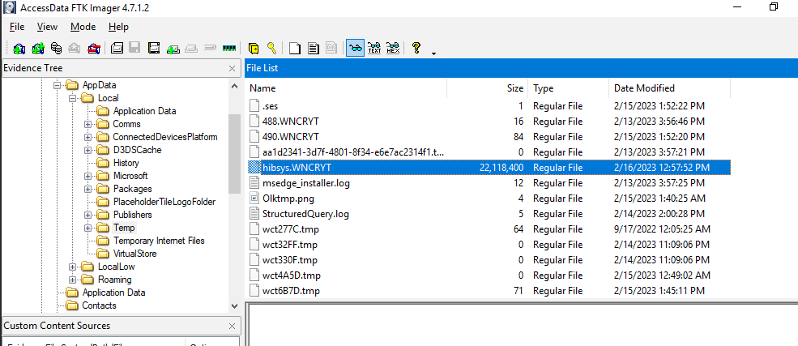
Confirmed on disk, its a huge file!
```
0xa20fea3487d0_hibsys.WNCRYT
```

>There is a mutex that the malware checks for to stop if it exists what is its name?

To find mutex, we need to add filter for `Mutent` from the previous command 
`python3 vol.py -f ~/WannaStory/Wanna-MEM.vmem windows.handles.Handles | grep "Thunder" | grep "Mutant"`
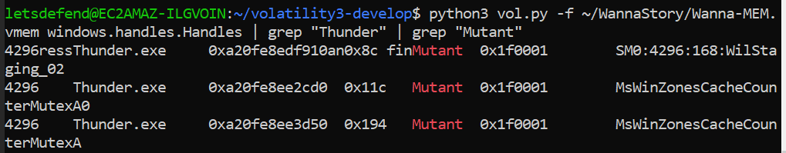
There were 2 mutexes
```
MsWinZonesCacheCounterMutexA0_MsWinZonesCacheCounterMutexA
```

* * *
## Summary

Phishing email was sent to a new employee named `atamer` which he downloaded a malicious document from an email then opened it and when malicious document was opened, It downloaded a wannacry ransomware from C2 server and named it `Thunder.exe` which executed once downloading was completed
<div align=center>


</div>

* * *
