# [LetsDefend - Windows Memory Dump](https://app.letsdefend.io/challenge/windows-memory-dump)
Created: 19/06/2024 07:59
Last Updated: 19/06/2024 10:30
* * *
<div align=center>

**Windows Memory Dump**

</div>

Our friend fell victim to a suspicious crack tool. But it seems it didn't go in the right path so investigate it to find any evidence.

**File Location**: /root/Desktop/ChallengeFile/vLP.vmem
* * *
## Start Investigation
>How many users are on the machine?

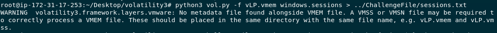

There are several ways to answer this question mine is to use `python3 vol.py -f vLP.vmem windows.sessions` then pipe output to ` ../ChallengeFile/sessions.txt`

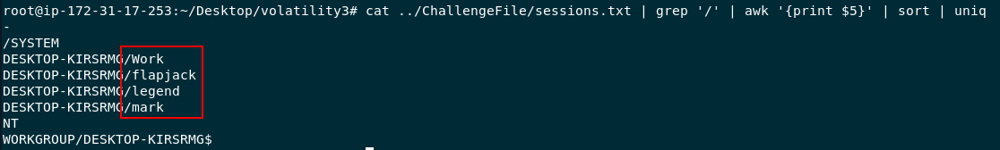

Then use `cat ../ChallengeFile/sessions.txt | grep '/' | awk '{print $5}' | sort | uniq` to display all unique user process username from sessions then we will have 4 users have sessions on this system

```
4
```

>Which user is the infected one?

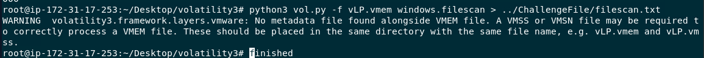

Scenario gave us a hint that victim fell to a suspicious crack tool which might be found on one of these 4 users Downloads folder so I used `python3 vol.py -f vLP.vmem windows.filescan > ../ChallengeFile/filescan.txt` to keep output from filescan plugin to a text file first

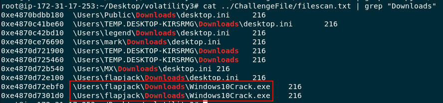

Then use `cat ../ChallengeFile/filescan.txt | grep "Downloads"` to find all files inside Downloads folder then we can see there is `Windows10Crack.exe` inside flapjack's Downloads folder

```
flapjack
```

>Which file dropped the ransomware?
```
Windows10Crack.exe
```

>How did that file drop the ransomware [URL]?

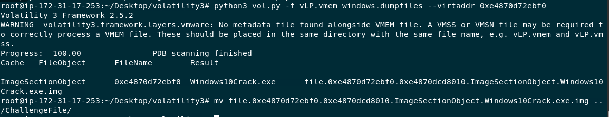

Lets dump `Windows10Crack.exe` from memory dump with `python3 vol.py -f vLP.vmem windows.dumpfiles --virtaddr 0xe4870d72ebf0`

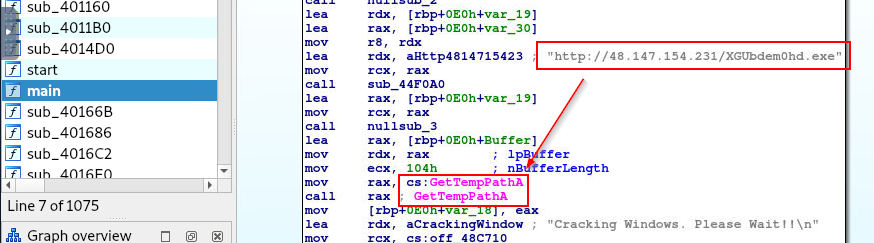

Then use IDA Free to decompile this file which you will see that this file will drop ransomware to temp folder

```
http://48.147.154.231/XGUbdem0hd.exe
```

>What is the virtual offset of that ransomware?

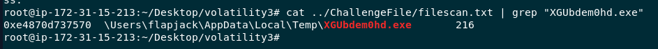

Using `cat ../ChallengeFile/filescan.txt | grep "XGUbdem0hd.exe"` then we will have virtual offset of this ransomware

```
0xe4870d737570
```

>The ransomware edited one of the primary hash manager registry key. Find the key that got modified.

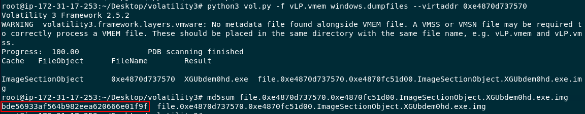

Lets dump it with `python3 vol.py -f vLP.vmem windows.dumpfiles --virtaddr 0xe4870d737570` then use `md5sum` to calculate file hash for us and we will search this hash on VirusTotal

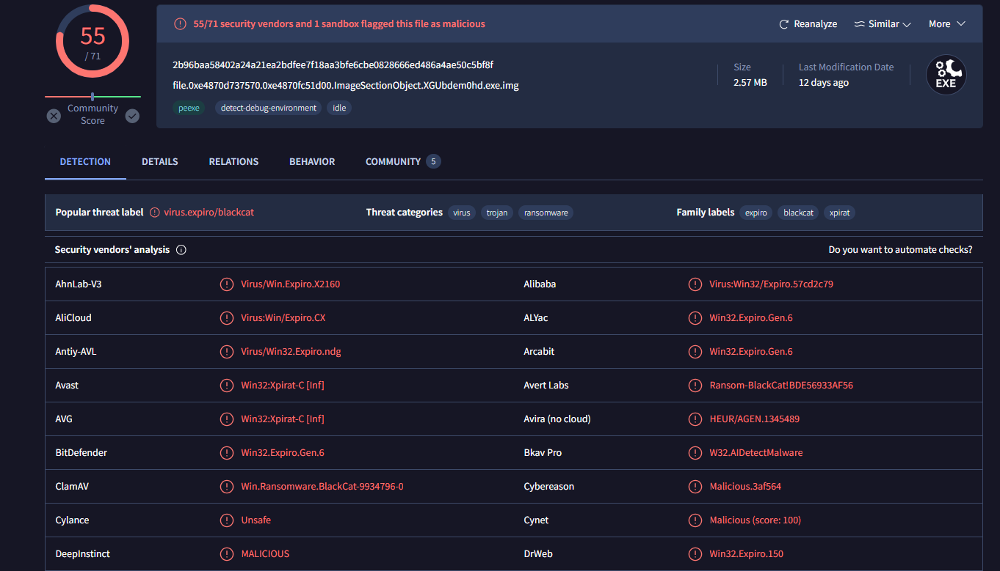

Then we will see that this ransomware is called Blackcat ransomware

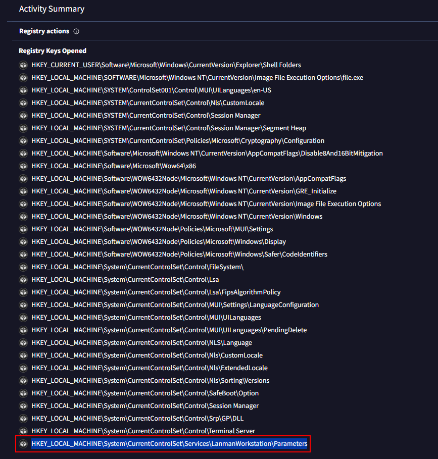

Go to behavior tab, under Registry actions and you will see that registry at the bottom of this list 

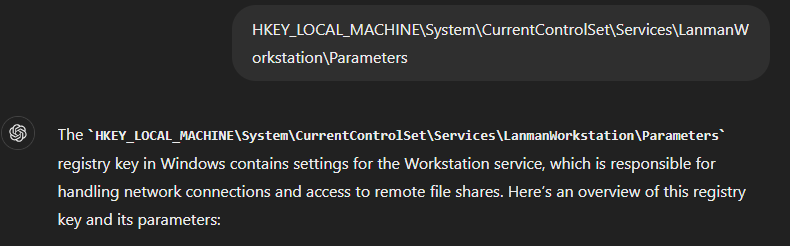

Here is the explaination about this key

```
HKEY_LOCAL_MACHINE\System\CurrentControlSet\Services\LanmanWorkstation\Parameters
```

>What is the credential of the AdminRecovery?

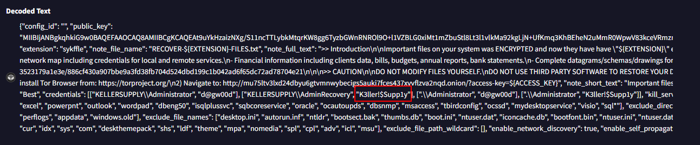

Go to the last section under behavior tab, we will see Decoded Text that has AdminRecovery's credential

```
K3ller!$Supp1y
```

* * *
## Summary

On this challenge, We've done several things as follows
- We used volatility 3 to dump malicious crack file and ransomware file
- We used IDA Free to analyze malicious crack file
- We used VirusTotal to determine edited registry key and credential of AdminRecovery

<div align=center>


</div>

* * *
