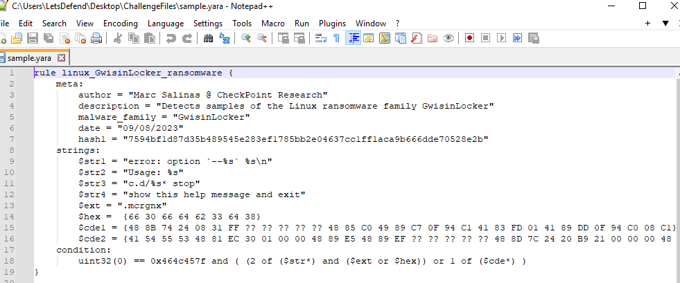
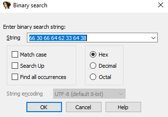
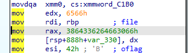
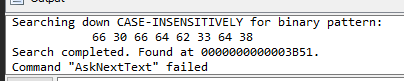
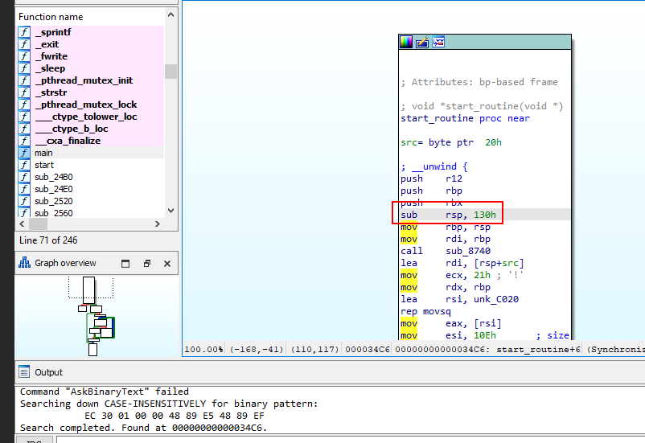
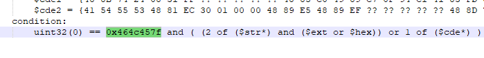
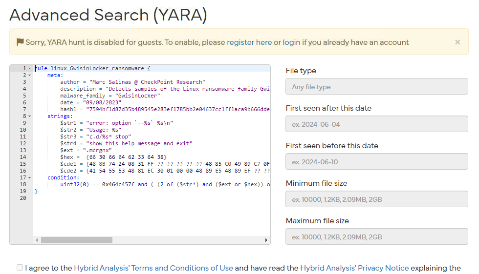
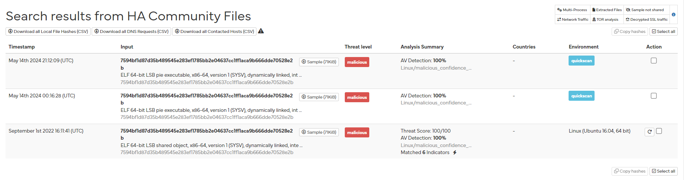
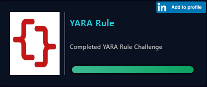

# [LetsDefend - YARA Rule](https://app.letsdefend.io/challenge/yara-rule)
Created: 11/06/2024 10:48
Last Updated: 11/06/2024 11:48
* * *
<div align=center>

**YARA Rule**

</div>
Welcome to the YARA Rules Challenge! This exercise is designed to introduce you to the basics of YARA rules and how they work.

**File Location-1:** C:\Users\LetsDefend\Desktop\ChallengeFiles\sample.7z

**File Location-2:** C:\Users\LetsDefend\Desktop\ChallengeFiles\sample.yara

**File Password:** infected
* * *
## Start Investigation
>What is the name of this YARA rule?



There are malware sample and YARA rule files inside Challenge folder, Open `sample.yara` with Notepad++ then we can see that this YARA rule is designed to detect Linux ransomware family GwisinLocker. 

```
linux_GwisinLocker_ransomware
```

>What is the name of the author of this YARA rule?
```
Marc Salinas @ CheckPoint Research
```

>What is the extension of the encrypted file?
```
.mcrgnx
```

>What is the assembly instruction that stores the $hex opcode in the YARA rule?



Disassemble malware sample with IDA freeware then use binary search to find for value inside $hex



Search result lead us to this instruction, it means that 64-bit hexadecimal value `3864336264663066h` or `66 30 66 64 62 33 64 38` will be moved to rax register using `mov` instruction

```
rax
```

>What is the address that we can find with $hex opcode with the IDA tool?
Answer Format: 0x0000



Open Output windows, we can see that our search were found at specific address which is the answer of this question

```
0x3B51
```

>What is the name of the function that has $cde2?



$cde1 and $cde2 are hex pattern in wildcards so we need to copy specific part of it to search which eventually lead us to this instruction inside start_routine function

```
start_routine
```

>What is the file signature in the YARA rule?
Answer Format: 0x00000000



Looking at condition of this YARA rule, we can see that author of this rule want to match ELF magic number with other conditions that can determine GwisinLocker which is Linux ransomware.

```
0x464c457f
```

>Hunt on a [hybrid-analysis](https://www.hybrid-analysis.com/) site with Yara rules. What is the "threat level" of the sample timestamped September 1, 2022, 16:11:41 (UTC)?



We need to use YARA search but we need to login to use this function



Then after logged in and search for all samples with this YARA rule, you can see that there is one report that match timestamp of this question and it was labeled as Malicious

```
malicious
```

* * *
## Summary

On this challenge, We used YARA rule that was designed by Marc Salinas @ CheckPoint Research to detect GwisinLocker which is Linux ransomware with IDA freeware and lastly, we used Advanced Search for YARA hunt on hybrid analysis to test how effective of this YARA rule and find relevant samples that were already analyzed on hybrid analysis

<div align=center>


</div>

* * *
