# [LetsDefend - cl0p Malware](https://app.letsdefend.io/challenge/cl0p-malware)
Created: 22/03/2024 07:30
Last Updated: 22/03/2024 10:22
* * *
<div align=center>

**cl0p Malware**
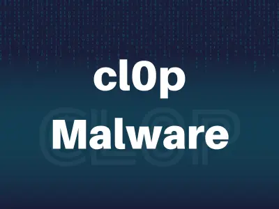
</div>
A company has been hit by a cl0p ransomware attack, and all of its critical data has been encrypted. The attackers have demanded a large ransom payment in exchange for the decryption key. The company has hired a team of security researchers to analyze the ransomware and develop a solution to recover its data without paying the ransom.

**File Location**: C:\Users\LetsDefend\Desktop\ChallengeFile\sample.7z
**File Password**: infected
* * *
## Start Investigation
>What is the SHA256 hash of the sample?

We got a file without an extension after decompressed 7zip file then just throw them to HashCalc or HashMyFile (both tools are provided) to calculate hash
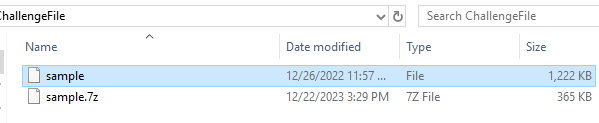
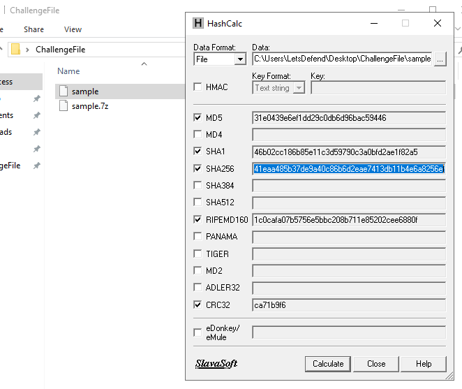

```
09d6dab9b70a74f61c41eaa485b37de9a40c86b6d2eae7413db11b4e6a8256ef
```

>What is the number of folders that ransomware encrypted?

I used Detect It Easy to see if this file is packed or not and I found that this file is ELF file, an executable file for Linux 
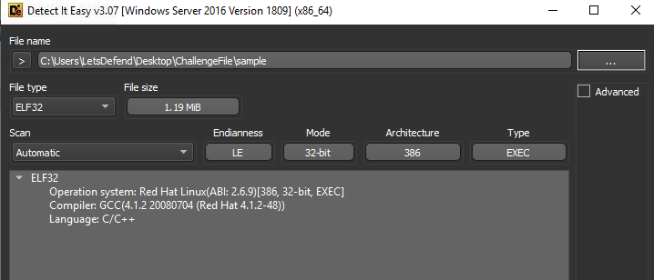
Then I used IDA Freeware that was provided by this room to disassembly this ELF file, then on `do_heartbeat()` function there are many directories were listed so these are the targeted directories
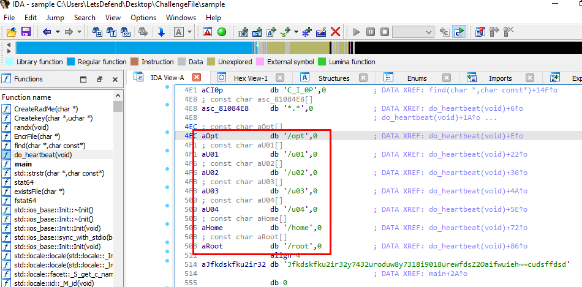
```
7
```

>What is the extension that is used by the ransomware after the encrypted file?

On the `do_heartbeat()` function, there are a lot of information could be found here including ransomnote and file extension
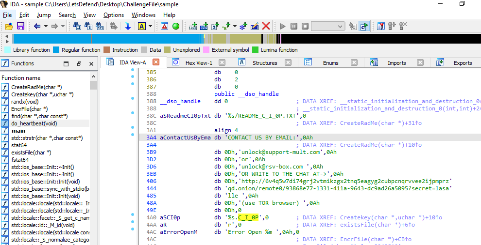
```
.C_I_0P
```

>What is the key that is used by the ransomware?

A key was found on `do_heartbeat()` under key variable
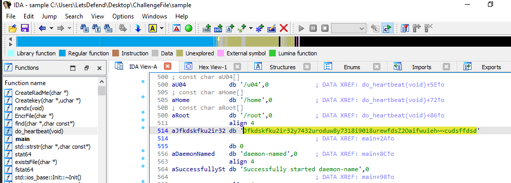
```
Jfkdskfku2ir32y7432uroduw8y7318i9018urewfdsZ2Oaifwuieh~~cudsffdsd
```

>How many emails exist that are used by the ransomware in the ransomware note?

There are 2 emails that will be written on ransomnote and 1 onion site
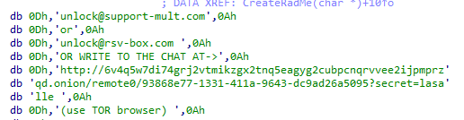
```
2
```

>What is the onion link that is used by the ransomware?
```
http://6v4q5w7di74grj2vtmikzgx2tnq5eagyg2cubpcnqrvvee2ijpmprzqd.onion/ 
```

>What is the name of the ransomware note file that was dropped by ransomware?

Alternatively, If you are not familiar with IDA you can use pestudio to find this answer but that not that best option in my opinion
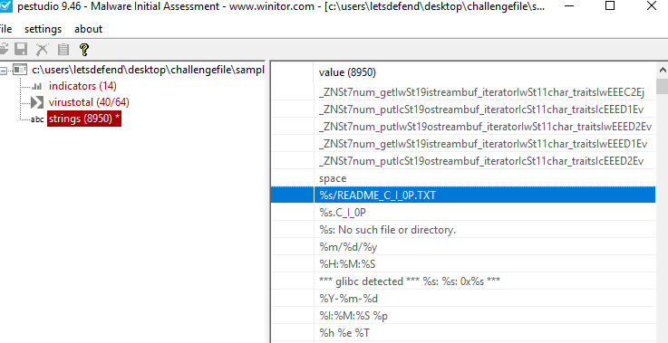
```
README_C_I_0P.TXT
```

>Can you give me the offset of “do_heartbeat” function?(Answer Format: 0x********)

Went to when the `do_heartbeat()` function will be called, on IDA there is an offset showed at the bottom of thse instructions
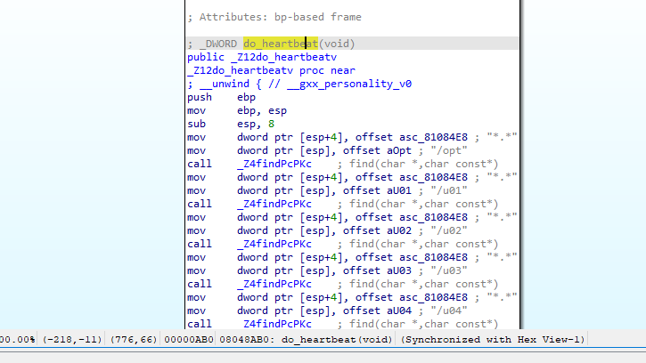
```
0x08048AB0
```

* * *
## Summary

This challenge will familarize user with IDA freeware to analyze cl0p ransomware, We learned how to find a key, directories it going to encrypt and ransomnote by reverse engineering ELF file that is the executable file for Linux. 
<div align=center>

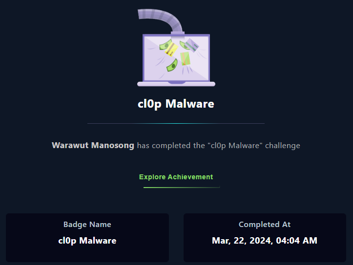
</div>

* * *
