# [Blue Team Labs Online - Anakus](https://blueteamlabs.online/home/investigation/anakus-dfea6f86e0)
Created: 14/05/2024 13:58
Last Updated: 02/06/2024 17:57
* * *
<div align=center>


</div>

>It looks like the assessment will take place virtually, and I will be given a VM, with plenty of tools to analyze “Threat logs” and “Malware(s)”.

>**Tags**: CyberChef, Detect it Easy, Regshot, SysinternalsSuite, Thunderbird, Timeline Explorer, Wireshark
* * *

**Scenario**
Loda Sukana, that’s me! My big brother Desi Sukana—who’s currently based in Australia and working at Tesserent as a Senior DFIR Analyst—sparked my interest in cybersecurity! Yasss, I know, I know, everyone is trying to break into the field, the market is rough, companies are not hiring…. blah, blah, blah! Enough of the doom and gloom, I am going to break in another way—interestingly, hehe.

My brother has managed to pull some strings, which got me a referral to a Malware Analyst role at his company. They respect him a lot over there, but he still doesn’t trust me… his little sister. He thinks I am going to bring shame to the family name “Sukana” if I don’t perform well on this OA. Shhh, I have not told him this: I have been practicing my reverse engineering skills this whole time, haha.

Ok, I got off the phone with the recruiter; his name was Mr. Gula. Not going to cap, but he sounded so hot!!! Oh, gosh, sorry! I should erase that from my journal lol. Back to the task: it looks like the OA will take place virtually, and I will be given a VM, with plenty of tools to analyze “Threat logs” and “Malware(s)”.

All right, final entry in my journal before I get started! I may not be as talented as my brother Desi, but I am determined to pass this OA and gain his trust. I know everything changed when Dad died—regardless, I will not bring shame to the Sukana family! Watch me, Desi.
* * *
## Investigation Submission
>Q1) Using Detect it Easy, what is the SHA256 hash of the malware in question, and what language was it written in? Feel free to utilize VirusTotal to garner more information (Format: SHA256, Language)

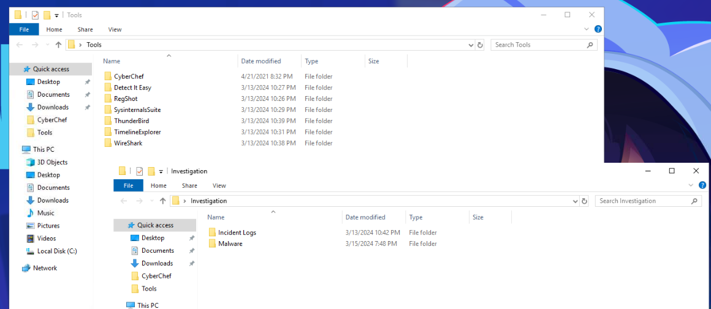
We got whole sysinternals suite, CyberChef, Detect It Easy, RegShot, ThunderBird, Timeline Explorer and WireShark as our forensic tools

And we got 3 files to investigate, 1 csv file in Incident Logs folder, 1 exe and 1 dll file in Malware folder

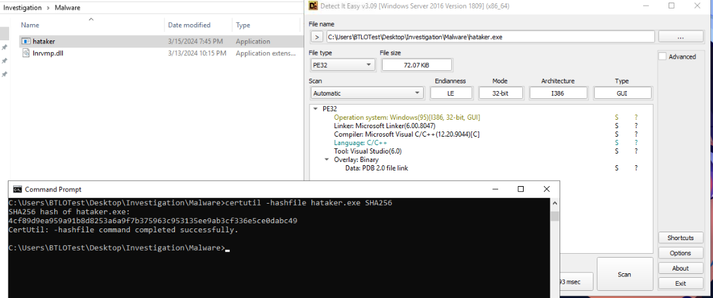
I used certutil to generate hash and Detect it easy to find which language was used to write this malware.

Turn out this malware was written in C but VirusTotal return no result for this hash.

I also searched this hash on VirusTotal and there is no result sooooo we gonna need to analyze dll file too 
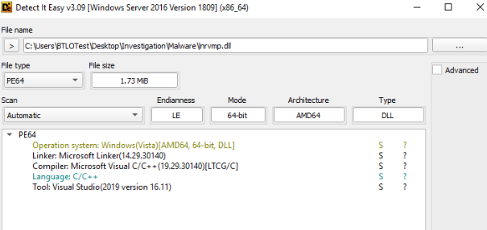
It was written in C, same as exe file 
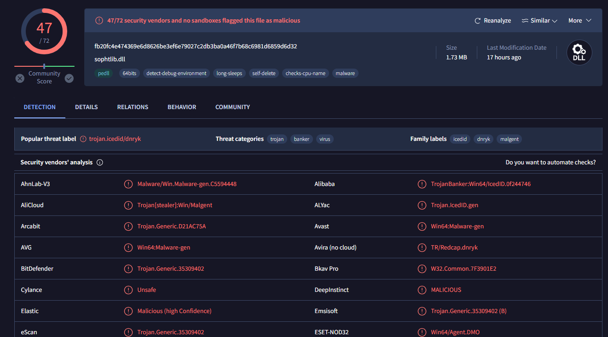
But after searching its hash on VirusTotal, its a different story
This dll file is totally labeled as IcedID malware

Using `certutil -hashfile inrvmp.dll SHA256` or go to Details in VirusTotal to obtain SHA256 hash of this dll file which is the correct answer of this question

```
fb20fc4e474369e6d8626be3ef6e79027c2db3ba0a46f7b68c6981d6859d6d32, C
```

>Q2) The total entropy value in Detect it Easy gives us a general indication of the randomness across the entire file, but the presence of a highly entropic-packed section indicates a portion of the file containing data that has been compressed—packed. Usually, an entropy above 7.2 is considered malicious, what is the name of this section in question? (Format: .xxxx)

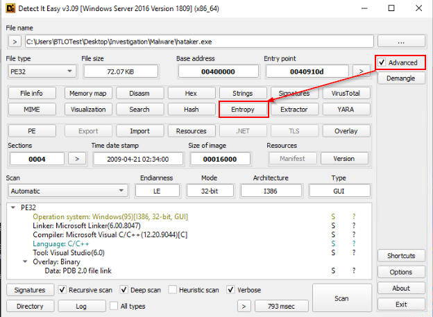
On Detect It Easy software, click "Advanced" to show advanced function then click "Entropy"
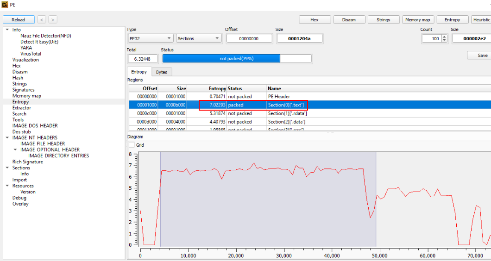
The highest entropy of this exe file is not reaching 7.2 so we have to inspect dll file too

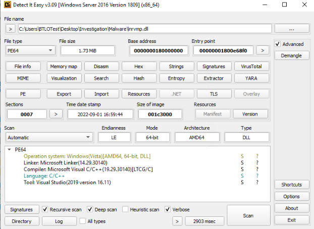
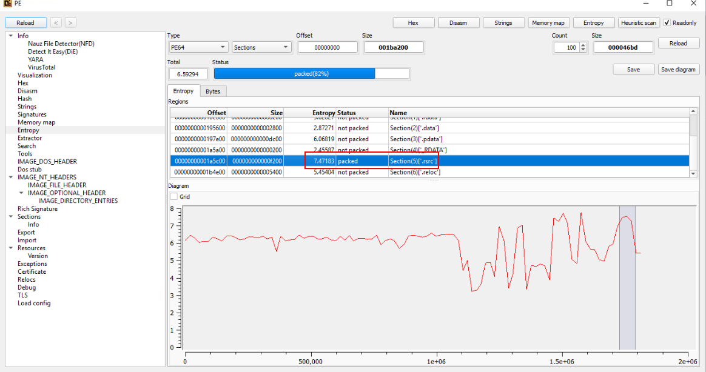
And there is only 1 section that has Entropy higher than 7.2 which is this section

```
.rsrc
```

>Q3) Given the file’s entropy level, reputation on VirusTotal, and weird characteristics, it is clear that is malicious. However, attackers will sometimes use the names of security companies in their malware to bypass detection. In this case, what product name is this malware impersonating? (Format: Product Name)

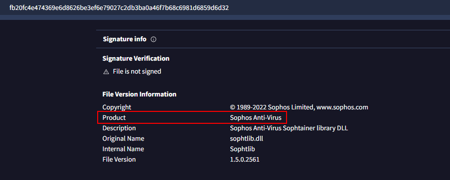
On dll file's [VirusTotal](https://www.virustotal.com/gui/file/fb20fc4e474369e6d8626be3ef6e79027c2db3ba0a46f7b68c6981d6859d6d32/details) result, Go to Details then scroll down a bit 

You will see that this dll was made to mimick Sophos Anti-Virus dll

```
Sophos Anti-Virus
```

>Q4) Using SigCheck, let's see if the file has been signed with a code-signing certificate—proving its validity. Include the “Verified” status and “Signing date” also known as Link Date (Format: Status, X:XX PM X/X/XXXX)

SigCheck is a program from SysinternalsSuite so You will need to execute it from SysinternalsSuite folder
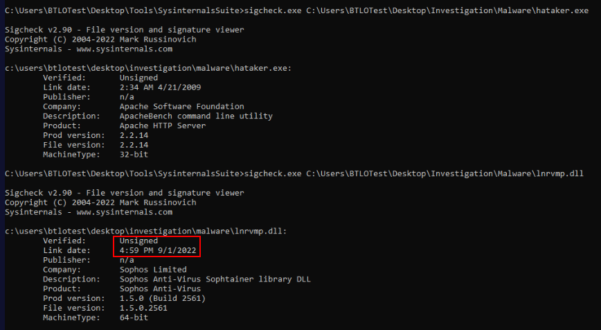
Used sigcheck on both files, but since all of previous questions refered to IcedID malware file then the answer has to be the one from dll file
```
Unsigned, 4:59 PM 9/1/2022
```

>Q5) Let’s look at the alleged malware “hataker.exe”. Judging from its hash, it is not apparent on most malware platforms—albeit, it does not exclude its maliciousness. Turn on Windows Defender and run the malware until it picks it up. What is the name given to this alleged, malicious trojan-type program? (Format: Trojan:full name)

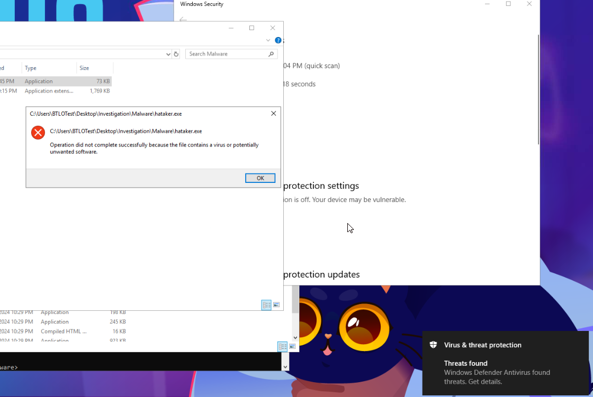
Enable Virus & Threat protection then run an exe file, you can see it got blocked by Microsoft Defender
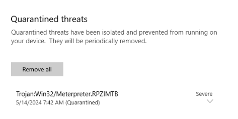
Go to Quarantined threats to find threat name, Now it make sense why we didn't get any result from VirusTotal because it was created for this investigation and not uploaded to VirusTotal (yet)
```
Trojan:Win32/Metrepreter.RPZ!MTB
```

>Q6) Interestingly, now knowing the trojan type for the “hataker.exe”, we can safely assume the attacker was planning to initiate a connection from the victim’s endpoint to its command and control server. What is this method called? (Format: Xxxxxxx Xxxxx)

Its a metrepreter for Metasploit which obviously means reverse shell 
```
Reverse Shell
```

>Q7) Sticking to the same context, let’s dissect the malware further. What dynamic domain is the malware “hataker.exe” using to establish a connection back to the attacker’s system? (Format: Domain name)

There is no disassembly or decomplier tool so we will have to use Wireshark to detect any connection.

I'll also use Process Monitor, Process Explorer and TCPView from sysinternals suite at the same time just in case
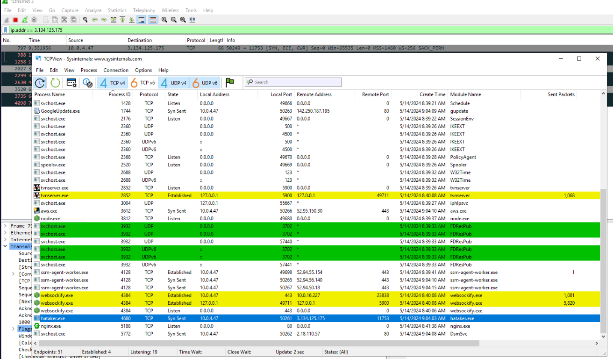
On TCPView, we can see that metrepreter tried to connect to this IP address
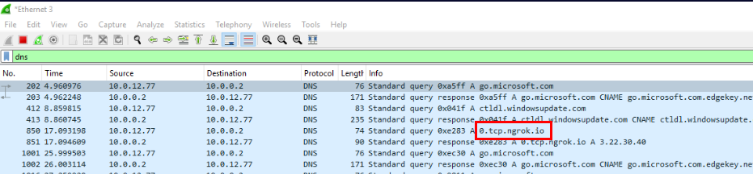
Then I used `dns` filter on Wireshark, and we can see that dns query and response were captured which grant us a domain name of this IP address

Dont forget to kill the process before proceeding to next question
```
0.tcp.ngrok.io
```

>Q8) Using Timeline Explorer, look at the “Threat Logs” from the incident, how many high-risk alerts were tracked? (Format: Count)

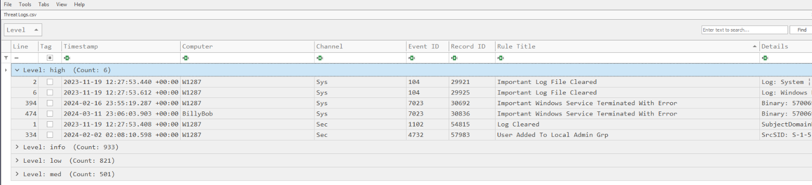
Use Drag and Drop feature on Timeline Explorer, it will automatically count them for you
```
6
```

>Q9) What are the two “Rule Titles” with the highest count under the high-risk alerts level group—in respective order? (Format: Rule Title 1, Rule Title 2)

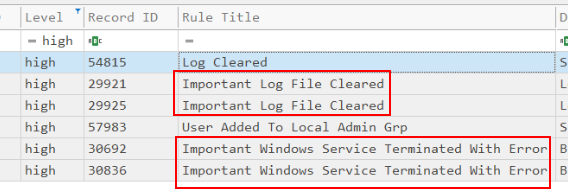
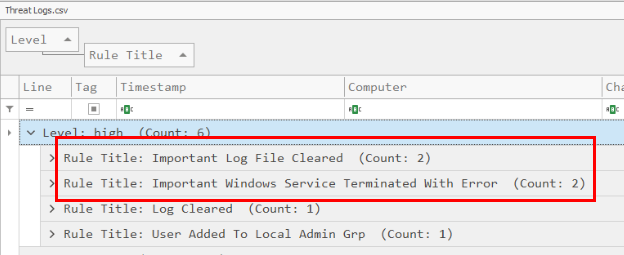
You can drag other column under first column (Level) then it will count it for you as well
```
Important Log File Cleared, Important Windows Service Terminated With Error
```

>Q10) Examine the last “Rule Title” for the high-risk alerts level group: what MITRE ID does this correspond to and what is the TgtGrp in question? (Format: TechniqueID, TgtGrp)

the last is a bit misleading (for those who didn't properly sort Rule Title), we should focus on TgtGrp (which should refered to Target Group) instead
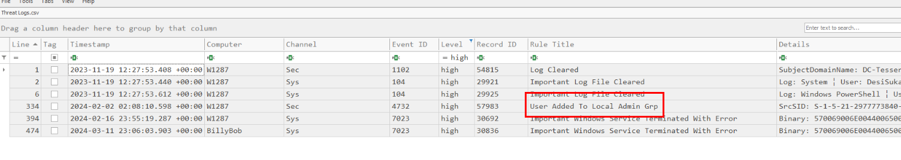
Take a look at Rule name "User Added to Local Admin Grp"
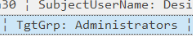
Then after reading details, you can see target group and take a look at Rule Title again then you will figure it out what "last" mean

*I accidentally sorted Rule Title and figured it out so now you know what "last" mean
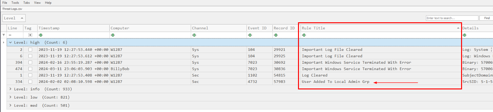

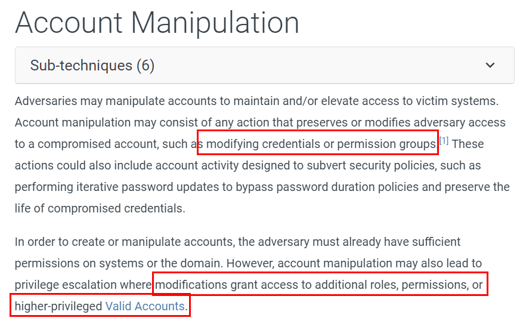
This event is most likely fit to "[Account Manipulation](https://attack.mitre.org/techniques/T1098/)" from "Persistence" tactic the most 
```
T1098, Administrators
```

>Q11) Looking at the medium-risk level alerts, what is the “Rule Title” and count of the popular alert group? (Format: Rule Title, Count)

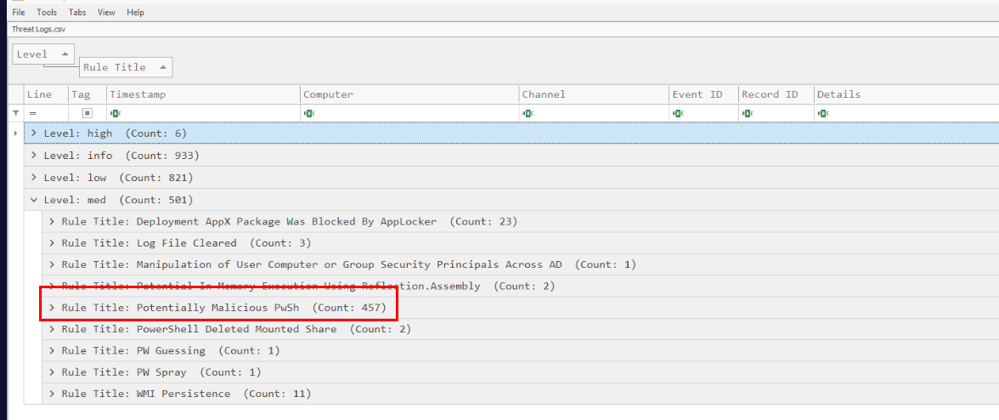
Drag and Drop feature make your life easier!
```
Potentially Malicious PwSh, 457
```

>Q12) What module was used for the password spray attack? Lists its MITRE ID for this type of attack as well (Format: powershell-module, TXXXX.xxx)

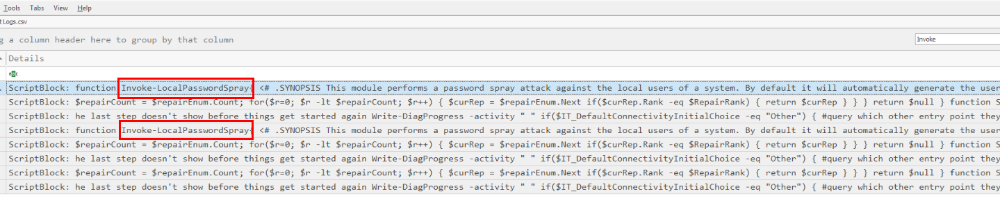
When using any PowerShell module, we need to "Invoke" so I searched just then we got PowerShell module that was used to conduct password spraying attack

Now what left is MITRE ID

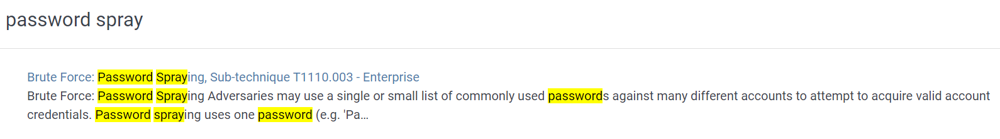
Just searching for password spray on MITRE ATT&CK then you will have this [Sub-technique](https://attack.mitre.org/techniques/T1110/003/) come out on top 

```
Invoke-LocalPasswordSpray,T1110.003
```

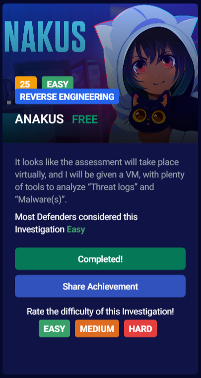
* * *