# [Blue Team Labs Online - Countdown](https://blueteamlabs.online/home/investigation/countdown-2c3cc56daf)
Created: 15/05/2024 08:53  
Last Updated: 15/05/2024 11:57
* * *
<div align="center">


</div>

> In a race against time, can you investigate a laptop seized by law enforcement to identify if a bomb threat is real or a hoax?
> **Tags**: Autopsy, Window File Analyzer, WinPrefetchView, Jumplist Explorer, SQLite DB Browser, T1573
* * *

**Scenario**  
NYC Police received information that a gang of attackers has entered the city and are planning to detonate an explosive device. Law enforcement have begun investigating all leads to determine whether this is true or a hoax.

Persons of interest were taken into custody, and one additional suspect named ‘Zerry’ was detained while officers raided his house. During the search they found one laptop, collected the digital evidence, and sent it to NYC digital forensics division.

Police believe Zerry is directly associated with the gang and are analyzing his device to uncover any information about the potential attack.

Disclaimer: The story, all names, characters, and incidents portrayed in this challenge are fictitious and any relevance to real-world events is completely coincidental.

* * *

## Investigation Submission

> Verify the Disk Image. Submit SectorCount and MD5

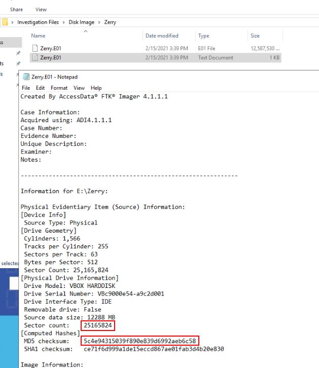  
Go to "Investigation Files" folder on the desktop, you will see 2 folders

Go to "Disk Image/Zerry", image file is there along with FTK log file which could be used to answer this question

```
25165824, 5c4e94315039f890e839d6992aeb6c58
```

> What is the decryption key of the online messenger app used by Zerry?

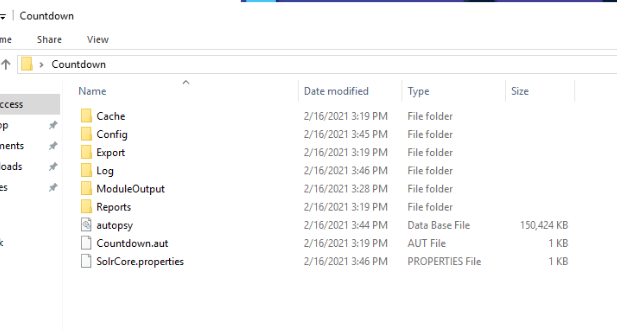  
Go to "Countdown" folder, its a folder used for Autopsy, now we confirmed where `.aut` file is stored

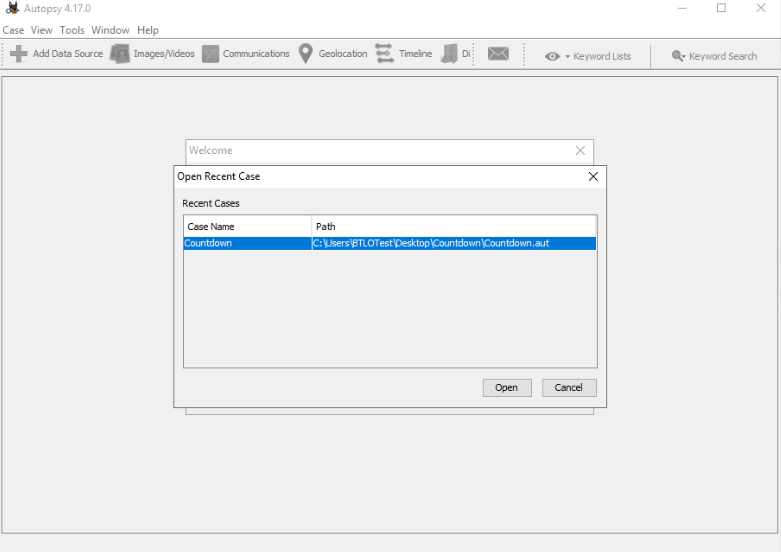  
Lets open Autopsy and click on "Open Recent Case", and Open aut file we found ealier

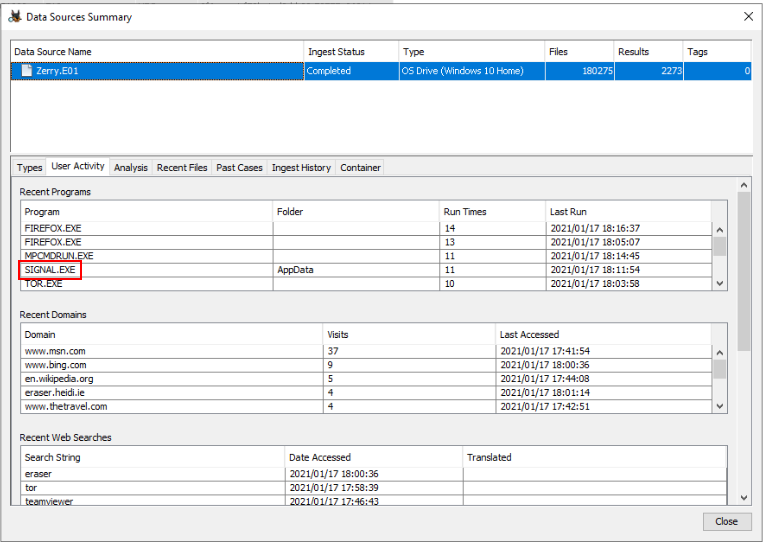  
I checked for Image Summary first, I found that `SIGNAL.EXE` was listed on Recent Programs which mean user was using signal as an online messager app

I did some research about how to find signal decryption key on a file system and I found [this](https://www.bleepingcomputer.com/news/security/signal-desktop-leaves-message-decryption-key-in-plain-sight/)! which is a news from bleepingcomputer that report about Signal Desktop app store decryption key in plaintext and can be used to decrypted sqlite database to read outgoing messages that store on system.

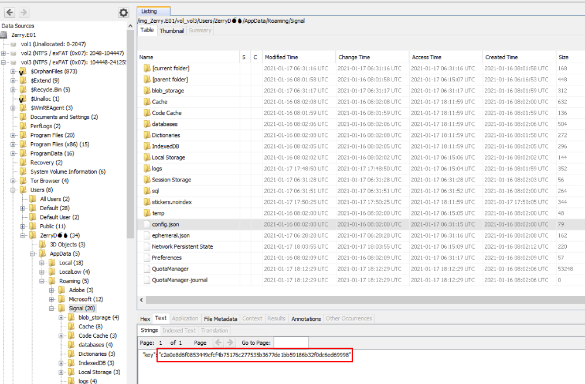  
Lets grab the artifact in `vol_vol3/Users/ZerryD/AppData/Roaming/Signal/config.json` and there you can see signal decryption raw key

```
c2a0e8d6f0853449cfcf4b75176c277535b3677de1bb59186b32f0dc6ed69998
```

> What is the registered phone number and profile name of Zerry in the messenger application used?

the news on bleeping article we found earlier also told us that we can use DB Browser for SQLite with decryption key to read content of sqlite database in `vol_vol3/Users/ZerryD💣🔥/AppData/Roaming/Signal/sql/db.sqlite`  
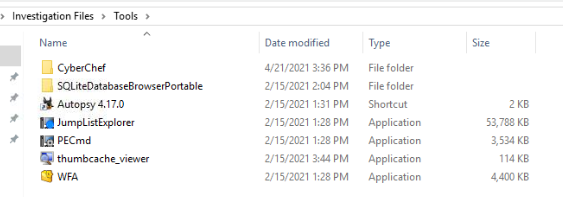  
Tool avaliable in `~/Desktop/Investigation Files/Tools/SQLiteDatabaseBrowserPortable`  
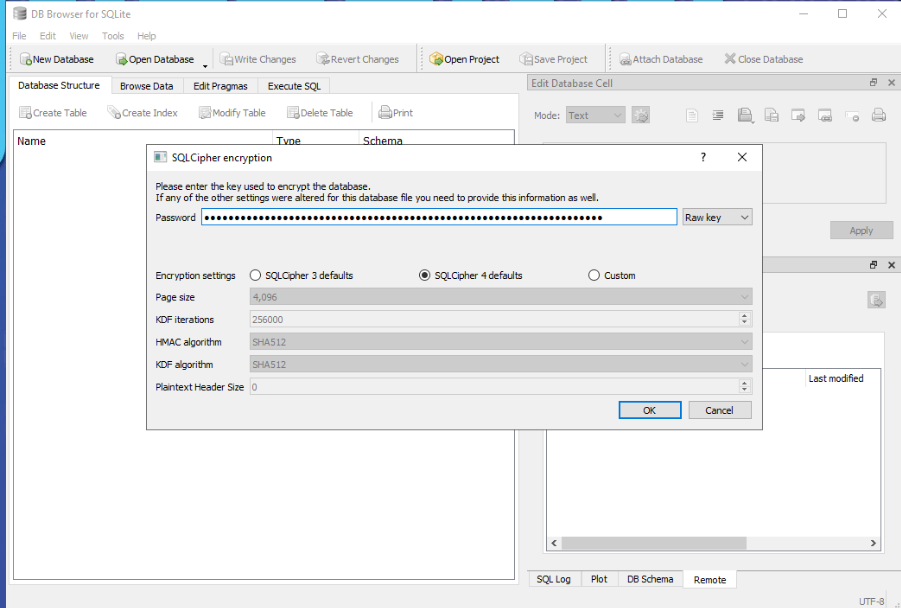  
Use `0xc2a0e8d6f0853449cfcf4b75176c277535b3677de1bb59186b32f0dc6ed69998` as raw key then click OK  
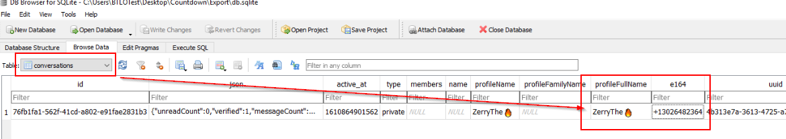  
Go to "conversations" table then you will eventually find both info here

```
13026482364,ZerryThe🔥
```

> What is the email id found in the chat?

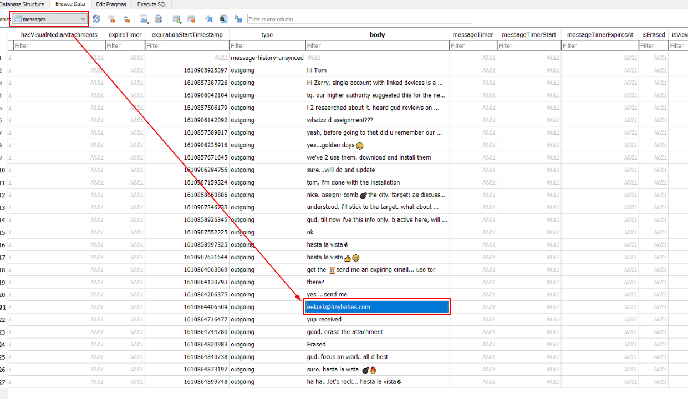  
On the same database, go to "messages" table then you will find a conversation between 2 entities (Tom and Zerry kinda like Tom and Jerry but in infosec) here

After reviewing this conversation, an attacker used Tor to browse website and Eraser to securely delete sensitive data and he even provided an email address to receive a file from other entity.

```
eekurk@baybabes.com
```

> What is the filename(including extension) that is received as an attachment via email?

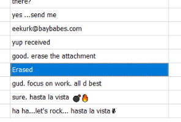  
Since it was erased using Eraser so I don't expect it to be found on Recycle Bin  
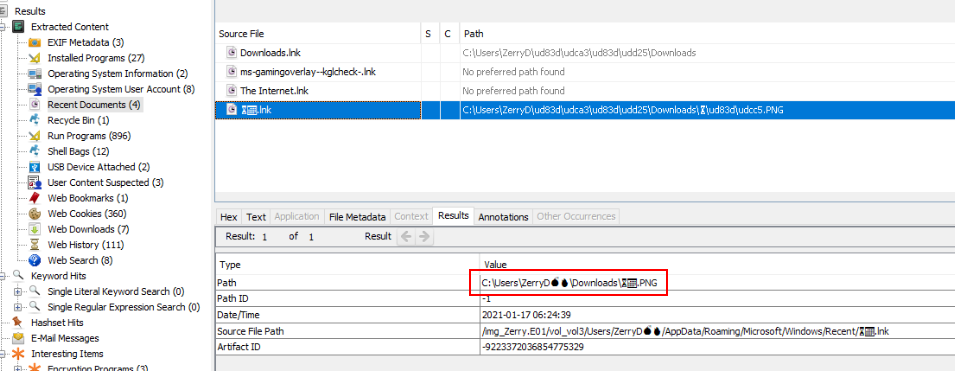  
But Recent Documents caught a shoutcut file for me and now we can see that it was an image file

```
⏳📅.png
```

> What is the Date and Time of the planned attack?

I assumed that Date and Time was stored in an image file but it was securely deleted

But there is 1 artifact that will cache all images thumbnail on Windows which is [Windows thumbnail cache](https://en.wikipedia.org/wiki/Windows_thumbnail_cache)  
Which should be located in `%userprofile%\AppData\Local\Microsoft\Windows\Explorer`  
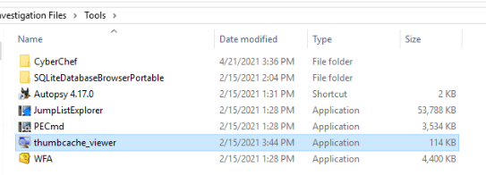  
There is a tool available for this one (it also gave us a hint to solve this question)  
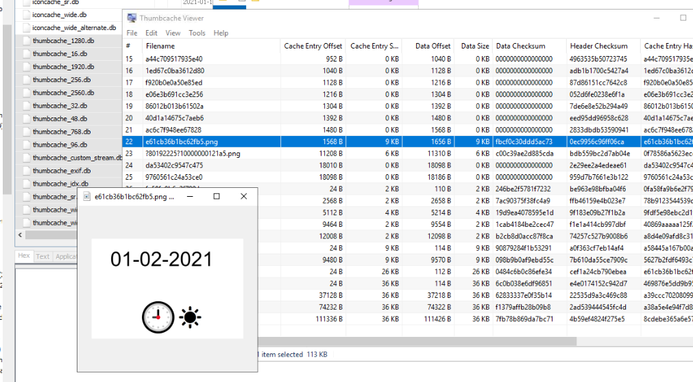  
I exported them all and open it with Thumbcache Viewer, then find for png file

There are 2 png files and the first one (on the above image) is the right one, you can see that its 01-02-2021 0900 with a sun which mean AM

```
01-02-2021 9:00 AM
```

> What is the GPS location of the blast? The format is the same as found in the evidence . \[Hint: Encode(XX Degrees,XX Minutes, XX Seconds)\]

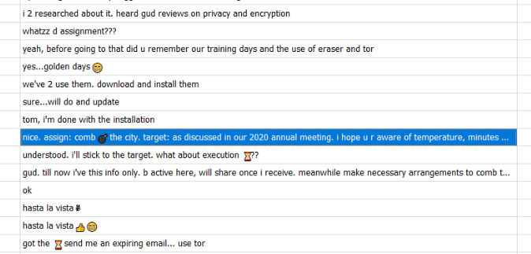  
Location was mentioned in meeting  
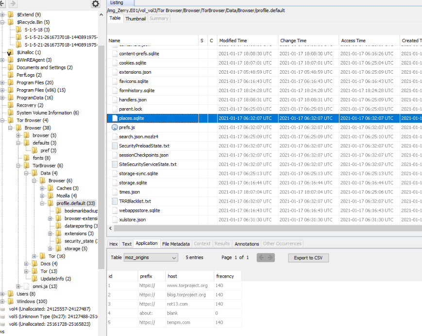  
I did search through Web History provided by Autopsy and found nothing then I found `rot13.com` from Tor Browser History, it could mean something?

Now i'm stuck but someone gave me a hint that when it comes to meeting, it possible that user will write a note somewhere on his system

And note software that came with Microsoft is sticky note and to my surprise, there is a blog that talk about sticky note artifact [here](https://forensafe.com/blogs/stickynotes.html ) 
Lets grab stickey note artifact on `C:\Users\%UserProfile%\AppData\Local\Packages\Microsoft.MicrosoftStickyNotes_8wekyb3d8bbwe\LocalState\plum.sqlite`  
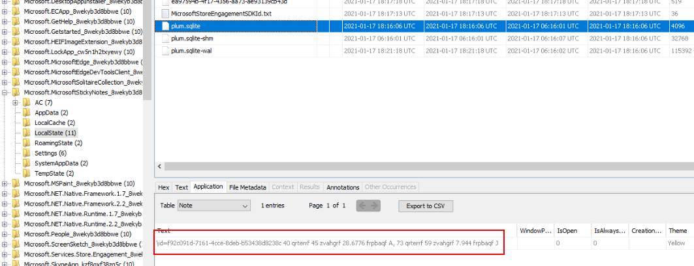  
We got this `\id=f92c091d-7161-4cce-8deb-b53438d8238c 40 qrterrf 45 zvahgrf 28.6776 frpbaqf A, 73 qrterrf 59 zvah`  weird looking text but it does look like a coordinate but need a little bit more decoding

Then ROT 13 we found eariler comes into play to decode it back to its original from
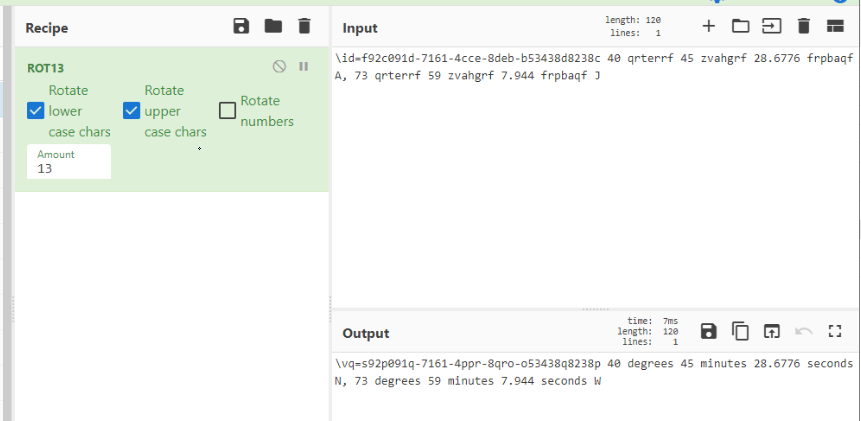
There we go
```
40 degrees 45 minutes 28.6776 seconds N, 73 degrees 59 minutes 7.994 seconds W
```

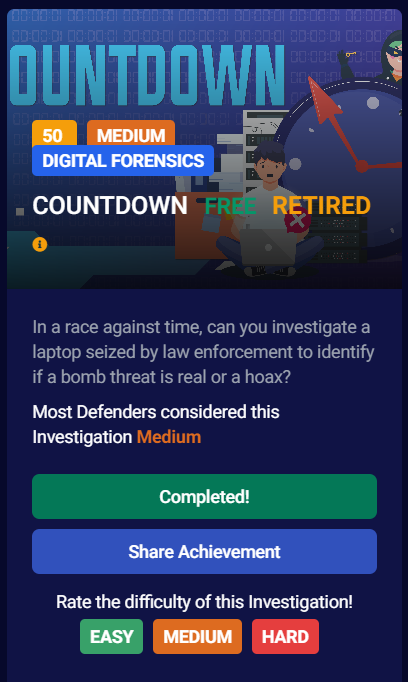
* * *