# [Blue Team Labs Online - Deep Blue](https://blueteamlabs.online/home/investigation/deep-blue-a4c18ce507)
Created: 11/05/2024 13:26
Last Updated: 14/05/2024 11:18
* * *
<div align=center>


</div>

>A Windows workstation was recently compromised, and evidence suggests it was an attack against internet-facing RDP, then Meterpreter was deployed to conduct 'Actions on Objectives'. Can you verify these findings?

>**Tags**: DeepBlueCLI, PowerShell, Event Viewer, T1133, T1078.003, T1136.001, T1543.003
* * *

**Scenario**
A Windows workstation was recently compromised, and evidence suggests it was an attack against internet-facing RDP, then Meterpreter was deployed to conduct 'Actions on Objectives'. Can you verify these findings?

You have been provided with the Security.evtx and System.evtx log exports from the compromised system - you should analyze these, NOT the Windows logs generated by the lab machine (when using DeepBlueCLI ensure you're providing the path to these files, stored inside `\Desktop\Investigation\`.

**Reading Material:**
https://github.com/sans-blue-team/DeepBlueCLI
* * *
## Investigation Submission
> Using DeepBlueCLI, investigate the recovered Security log (Security.evtx). Which user account ran GoogleUpdate.exe?

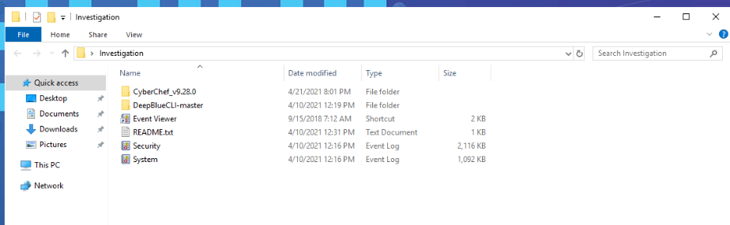
Once we connected to the system lab, there is an "Investigation" folder on the desktop, and after examining this folder we got 3 tools (CyberChef, DeepBlueCLI) for investigation and 2 event log files ("System.evtx" and "Security.evtx")

Then to run DeepBlueCLI we need to open PowerShell as administrator then `cd C:\Users\BTLOTest\Desktop\Investigation\DeepBlueCLI-master` to navigate to DeepBlueCLI powershell script

Then we use `.\DeepBlue.ps1 ..\Security.evtx` to process Security log file
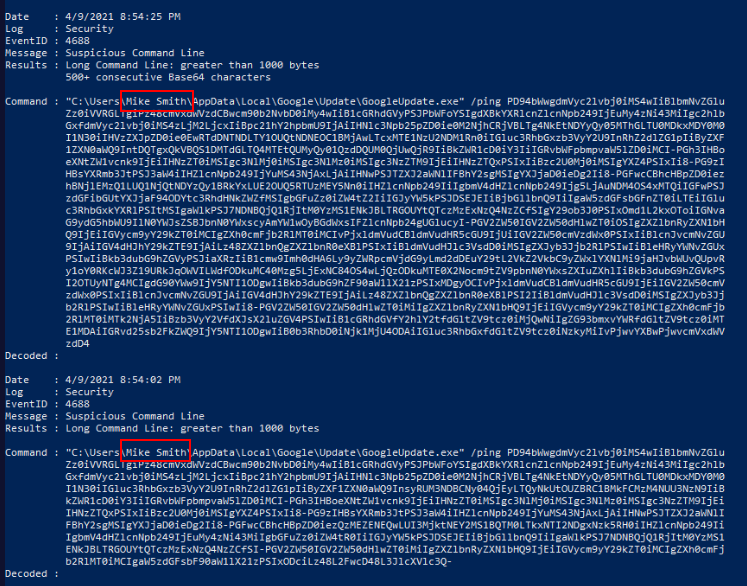
As you can see that "GoogleUpdate.exe" was executed from "Mike Smith" Downloads folder

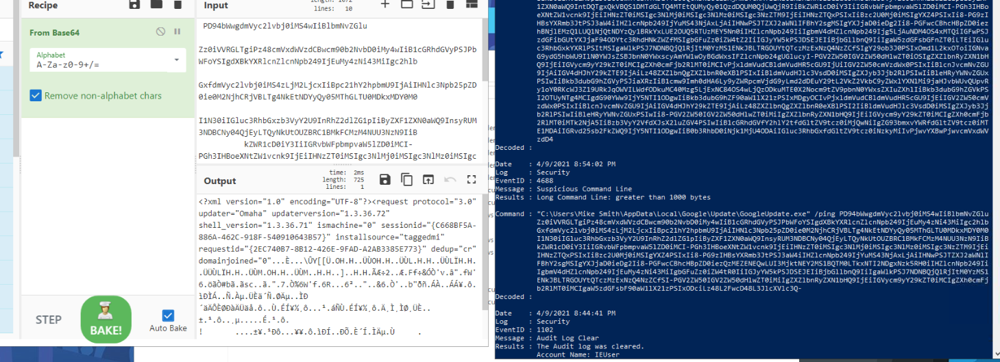
After encoded, its not look so suspicious at this point

```
Mike Smith
```

> Using DeepBlueCLI investigate the recovered Security.evtx log. At what time is there likely evidence of Meterpreter activity?

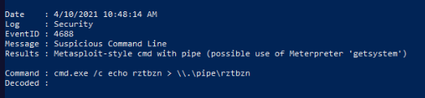
Scrolling up and down for a bit then you will see this event that DeepBlueCLI considered it as a command from meterpreter
```
4/10/2021 10:48:14
```

> Using DeepBlueCLI investigate the recovered System.evtx log. What is the name of the suspicious service created?

Using `.\DeepBlue.ps1 ..\System.evtx` command to process System log file
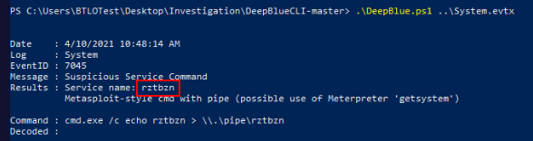
There is not much event here so the first event will eventually catch our eyes and its a metasploit activity to create a service

```
rztbzn
```

>Investigate the Security.evtx log in Event Viewer. Process creation is being audited (event ID 4688). Identify the malicious executable downloaded that was used to gain a Meterpreter reverse shell, between 10:30 and 10:50 AM on the 10th of April 2021. 


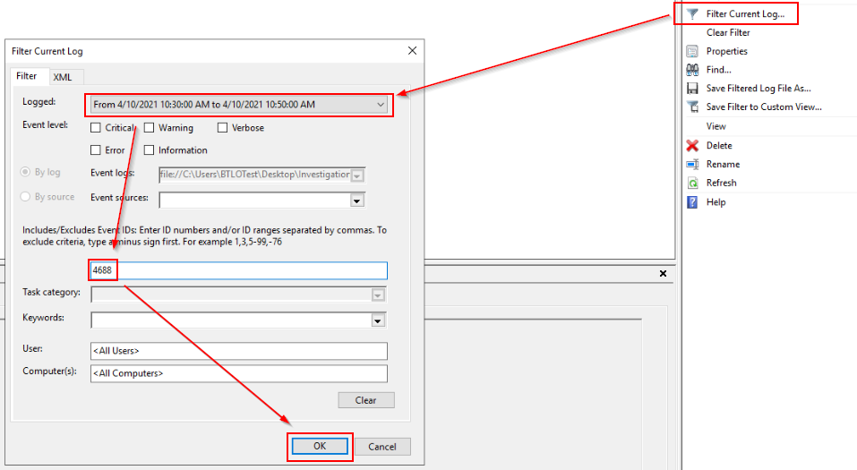

"4/10/2021 10:48:14 AM"
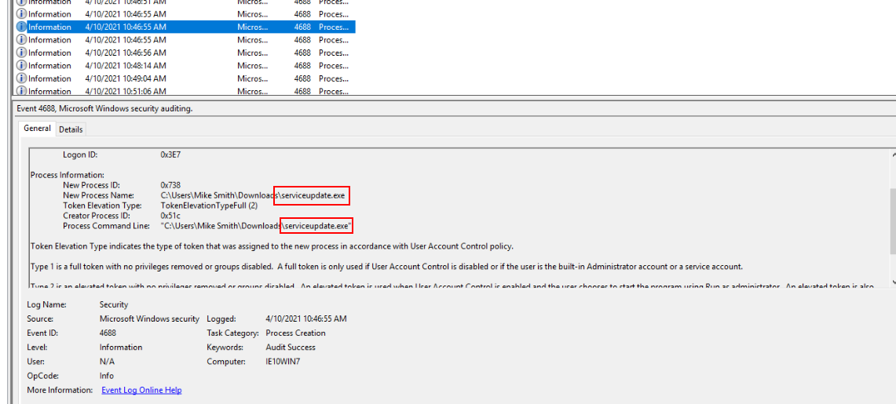
```
Mike Smith, serviceupdate.exe
```

>It's also believed that an additional account was created to ensure persistence between 11:25 AM and 11:40 AM on the 10th April 2021. What was the command line used to create this account? (Make sure you've found the right account!)

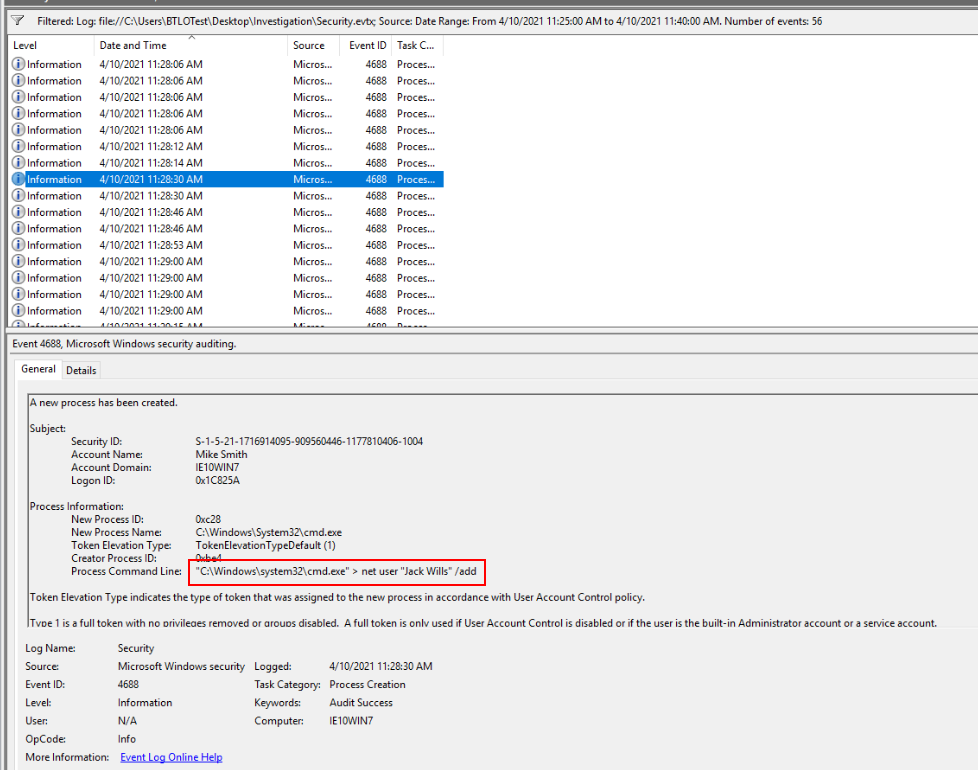
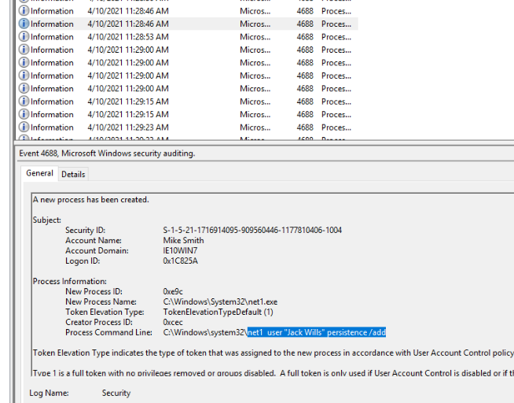
But look like this is not the right one 

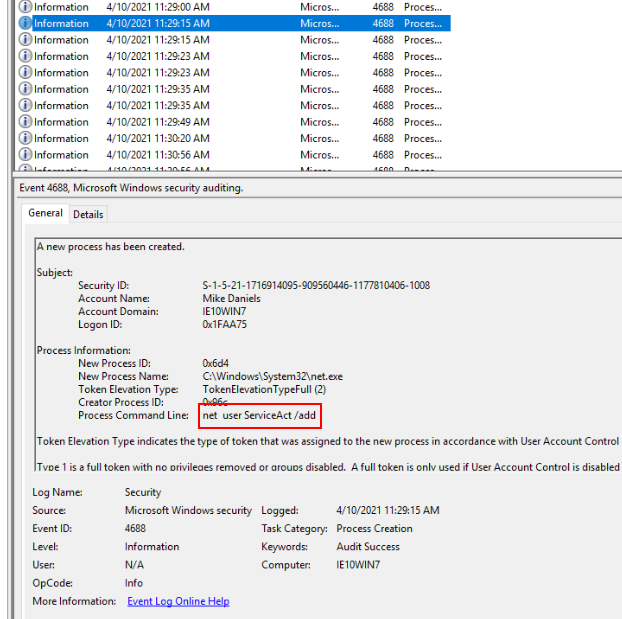
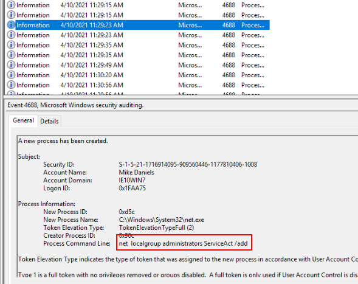

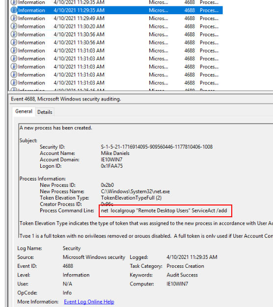
```
net user ServiceAct /add
```

> What two local groups was this new account added to?
```
administrators, Remote Desktop Users
```

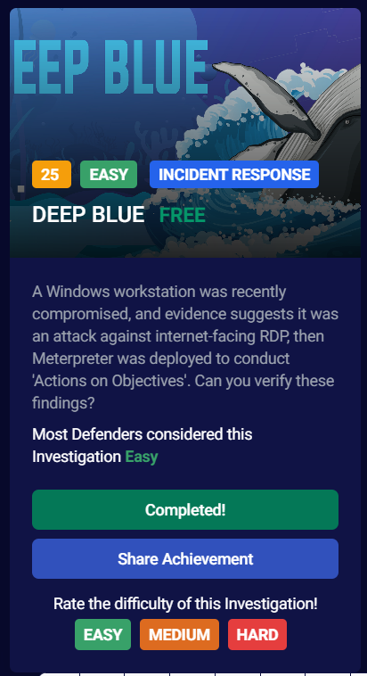
* * *