# [Blue Team Labs Online - Foxy](https://blueteamlabs.online/home/investigation/foxy-45e69136ae)
Created: 14/05/2024 11:21
Last Updated: 02/06/2024 17:13
* * *
<div align=center>


</div>

>As an Intelligence Analyst you are tasked with assisting the SOC Analysts with their investigations, providing additional context and information.

>**Tags**: Linux CLI, Gnumeric, Text Editor, OSINT, T1204.002, T1566
* * *

**Scenario**
As an Intelligence Analyst you are tasked with assisting the SOC Analysts with their investigations, providing additional context and information.

We recommend using Gnumeric to open CSV files, or use linux CLI commands from within the exports folder.
* * *
## Investigation Submission
>The SOC recently observed network connections from 3 internal hosts towards hxxp://45.63.126[.]199/dot.gif (URL has been sanitized). What is this activity likely related to?

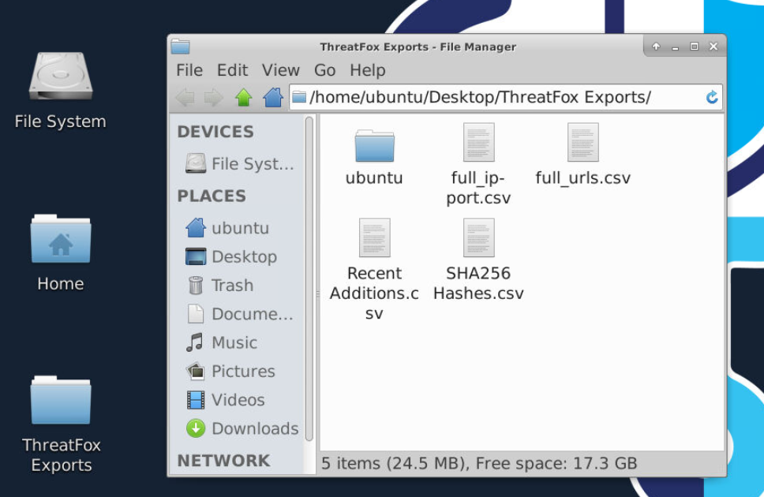
We got 4 csv files here and it seems like to answer this question, we will have to use "full_urls.csv"
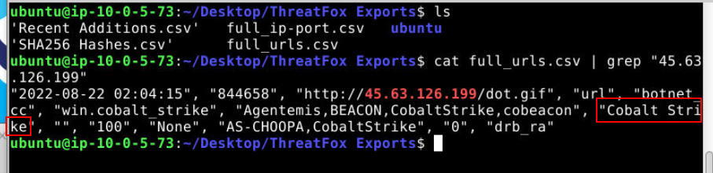
So I just filtered for IP address using this `cat full_urls.csv | grep "45.63.126.199"` command.

Looking at confidence level, its 100 sure that this is Cobalt Strike beacon

```
Cobalt Strike
```

>How many URLs are using the same endpoint 'dot.gif', across all export files? (include duplicates)

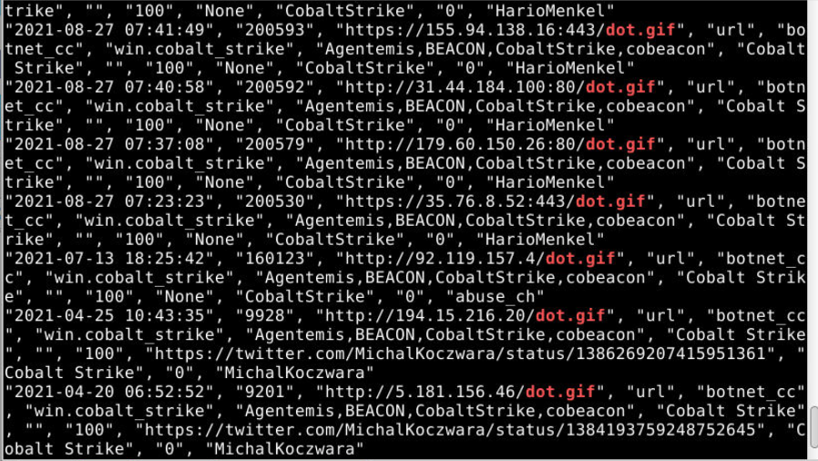
Filtered for  "dot.gif" using `grep 'dot.gif' *`, there are tons of them
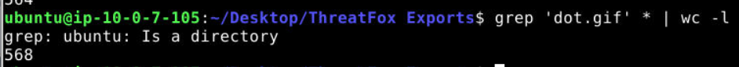
so lets use wordcount command to count them for us (`grep 'dot.gif * | wc -l'`)

```
568
```

>The SHA256 hash of a file was detected and quarantined on one of the Executives old android phones. We are trying to work out what this file does so we can take next steps. The hash value is `6461851c092d0074150e4e56a146108ae82130c22580fb444c1444e7d936e0b5`. Is this file associated with malware? If so, what is the malware name? (as stated by Malware Bazaar)

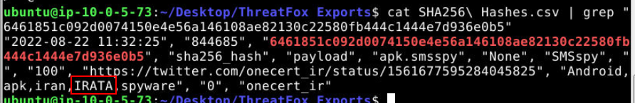
After searching this hash on "SHA256 Hashes.csv" using `cat SHA256\ Hashes.csv | grep "6461851c092d0074150e4e56a146108ae82130c22580fb444c1444e7d936e0b5"` command, we can see that this malware is IRATA (Iranian Remote Access Tool Android) malware 
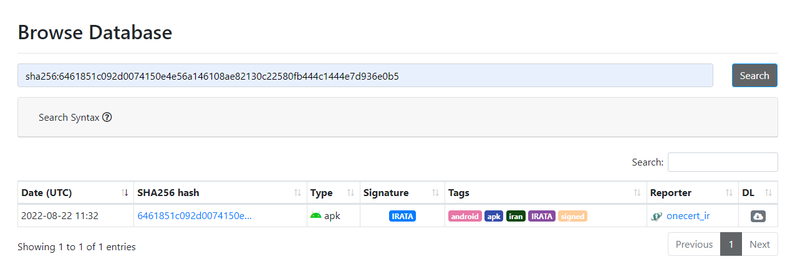
If you searched for this hash on Malware Bazaar, you will also obtain the same answer

```
IRATA
```

>Investigate the reference link for this SHA256 hash value. Submit the threat name (acronym only), the C2 domain, IP, and the domain registrar.

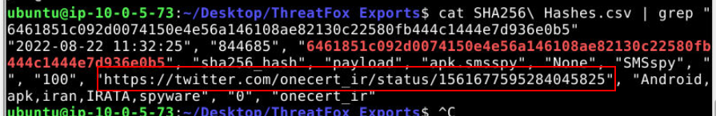
lets follow [twitter/x link](`https://twitter.com/onecert_ir/status/1561677595284045825`)

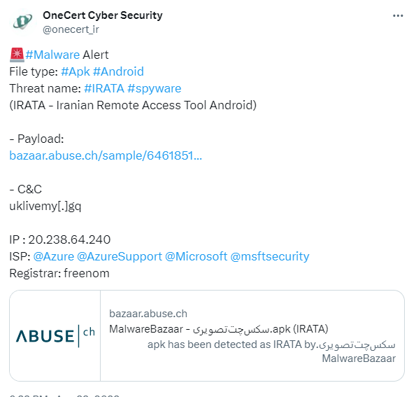
We got all of them in 1 post
```
IRATA, uklivemy.gq, 20.238.64.240, freenom
```

>View the bazaar.abuse.ch link in the Tweet and navigate to the JoeSandbox analysis link. Download the report, choosing the Reduced Reports - HTML Report Light. Investigate the MITRE ATT&CK Matrix to understand the Collection activities this file can take, and what the potential impact is to the Executives work mobile phone. Submit the Technique names in alphabetical order.

Lets go to [bazaar link](https://bazaar.abuse.ch/sample/6461851c092d0074150e4e56a146108ae82130c22580fb444c1444e7d936e0b5/) 

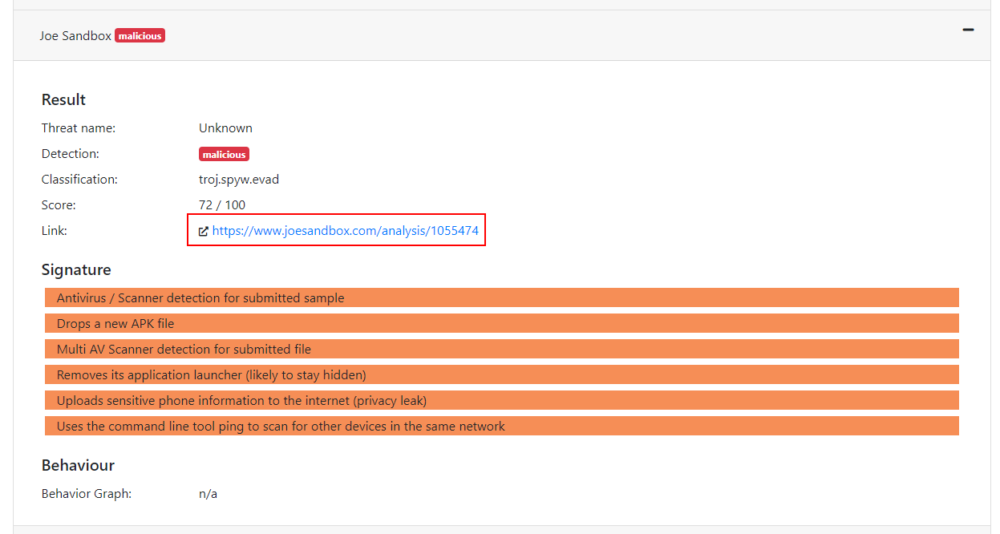
But when I went to this Joe Sandbox link, look like it is no longer avaliable

I have to find another way and wayback machine didn't work neither

My last resort is to look for write-up and there is one
https://medium.com/@himanshugidwani08/btlo-write-up-foxy-39e8563fff41

It sucks that resource is no longer avaliable so we have to rely on write-up for this investigation

** When I re-write this write-up, I went back to dig some more on Joe Sandbox which I found this URL 
https://www.joesandbox.com/analysis/1319345/1/html
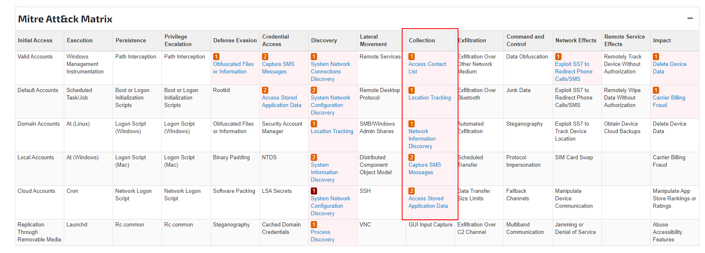
Since its the same malware (despite different hash), it still has the right MITRE ATT&CK for us to solve this question

```
Access Control List, Access Stored Application Data, Capture SMS Messages, Location Tracking, Network Information Discovery
```


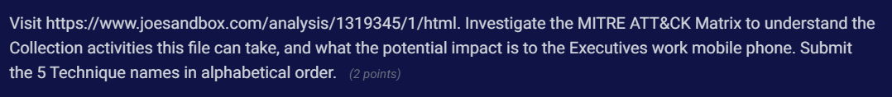
After I reported this issue and provided report I found, now they used this report instead of death one 
Probs to SBT Team!

>A junior analyst was handling an event that involved outbound connections to a private address and didn't perform any further analysis on the IP. What are the two ports used by the IP 192.236.198.236?

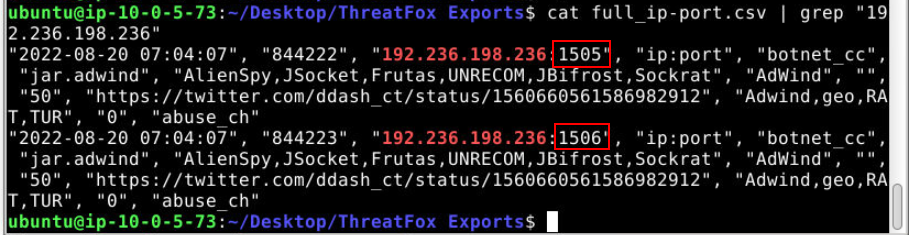
Look like we can find this IP address on "full_ip-port.csv" so I used `cat full_ip-port.csv | grep "192.236.198.236"` to catch them and we got both ports and 1 twitter link for later questions

```
1505, 1506
```

>Use the reference to help you further research the IP. What is the C2 domain?

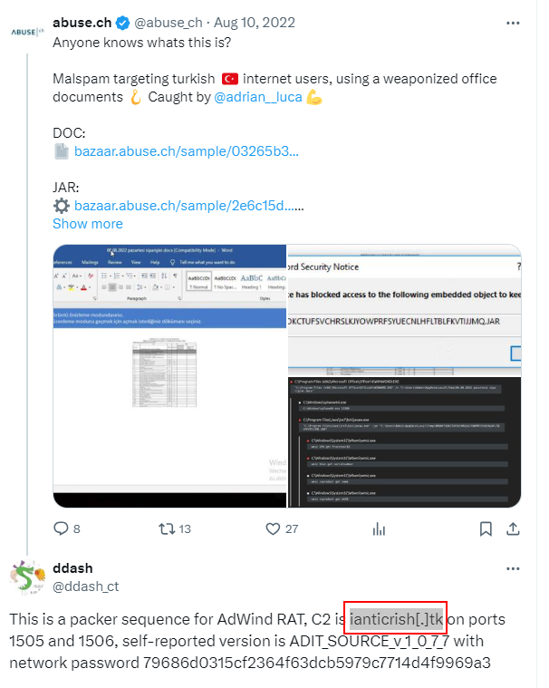
Follow the [link](https://twitter.com/ddash_ct/status/1560660561586982912) we got from previous question, an answer is there
```
ianticrish.tk
```

>What is the likely delivery method into our organization? Provide the Technique name and Technique ID from ATT&CK.

From twtter link, go to [bazaar link](https://t.co/Dna8cwSjam) for the report
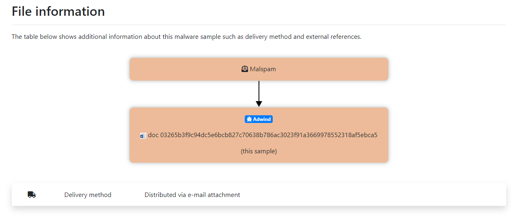
Scroll down a little bit and we can see that this file was distributed via email attachment so its probably a phishing attack
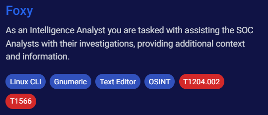
I took a look at this investigation tag again, we have 2 MITRE ATT&CK techniques here
- [T1566](https://attack.mitre.org/techniques/T1566/) is Phishing 
- [T1204.002](https://attack.mitre.org/techniques/T1204/002/) is User Execution: Malicious File

so an answer is T1566
```
Phishing, T1566
```

>Investigate further and try to find the name of the weaponized Word document, so we can use our EDR to check if it is present anywhere else within the organization. 

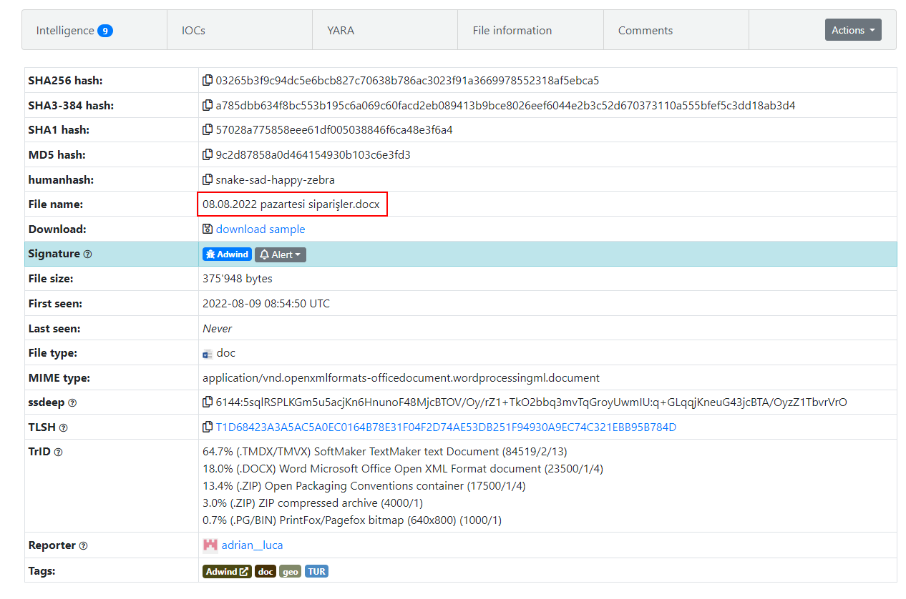
Still on the report, scroll up and we will eventually find a file name there
```
08.08.2022 pazartesi siparişler.docx
```

>What is the name of the .JAR file dropped by the Word document? 

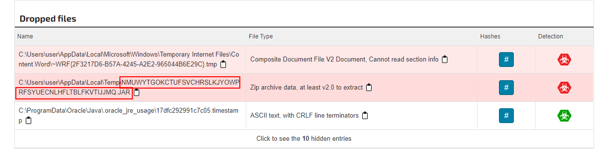
Use any Vendor Threat Intelligence and you will see malicious jar file was dropped on Temp folder
```
NMUWYTGOKCTUFSVCHRSLKJYOWPRFSYUECNLHFLTBLFKVTIJJMQ.JAR
```

>Executives have expressed concern about allowing employees to visit Discord on the corporate network because of online reports that it can be used for malware delivery and data exfiltration. Investigate how Discord can be abused for malicious file storage/distribution! What is the URL of the Discord CDN, ending with /attachments/?

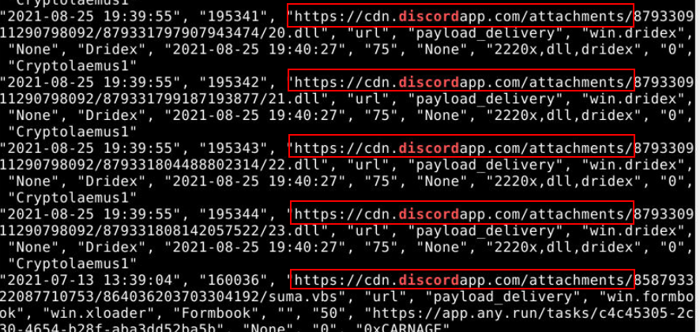
Lets search for "discord" from "full_urls.csv" file using `cat full_urls.csv | grep "discord"` command

After examined the result, its an obvious answer here 
We've all become familiar with this CDN already I think
```
https://cdn.discordapp.com/attachments/
```

>Looking at all export files, how many rows reference this URL? (include duplicates)

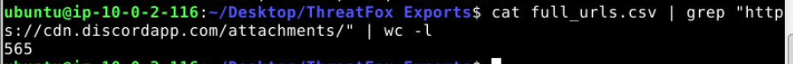
There are tons of records here so we need to use wordcount to help us again (`cat full_urls.csv | grep "https://cdn.discordapp.com/attachments/" | wc -l`)

```
565
```

>Based on this information, what is the name of the malware family that is being widely distributed via Discord?

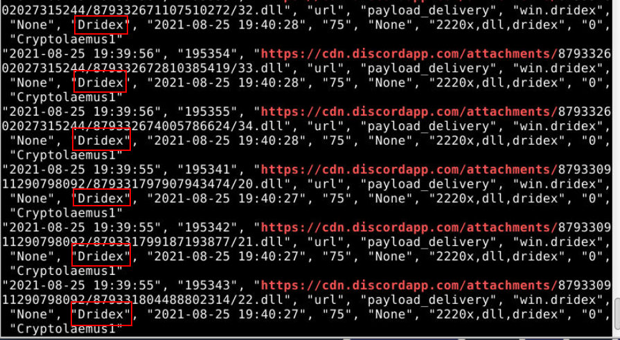
Searching for Discord CDN again, you will find the same name appearing constantly. 
```
Dridex
```

>We can proactively use indicators from threat feeds for detection, or for prevention via blocking. When it comes to blocking indicators, it is crucial that they are from a reputable source and have a high level of confidence to prevent blocking legitimate entities. How many rows in the full_urls.csv have a confidence rating of 100, and would likely be safe to block on the web proxy?

This question have to be solved using Gnumeric so open "full_urls.csv" on Gnumeric
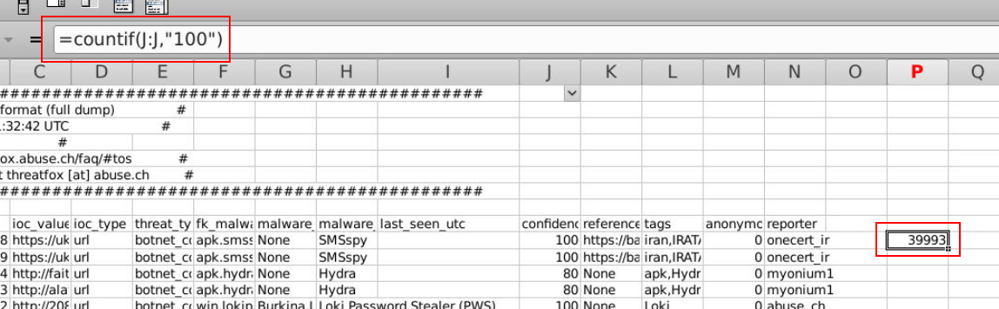
Then use formula `=countif(j:j,"100"` to count if value in column J (confidence) equal 100 then you will get this answer
```
39993
```

>An analyst has reported activity coming from an IP address using source port 8001, but they don't understand what this IP is trying to achieve. Looking at full_ip-port.csv in Gnumeric, filter on malware_printable = Unknown malware, and find an IP that is using port 8001. What is the IP address value?

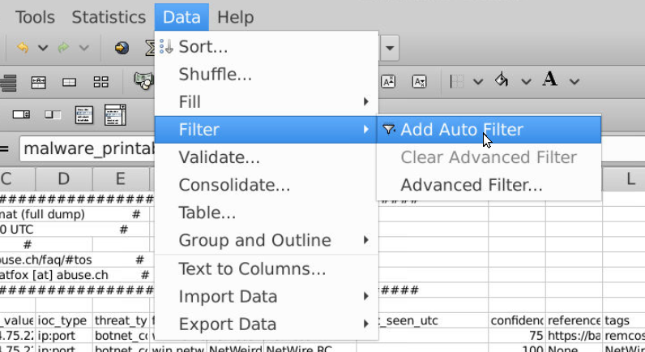
After opened "full_ip-port.csv" in Gnumeric, go to Data -> Filter -> Add Auto Filter then you can filter for "Unknown malware" now
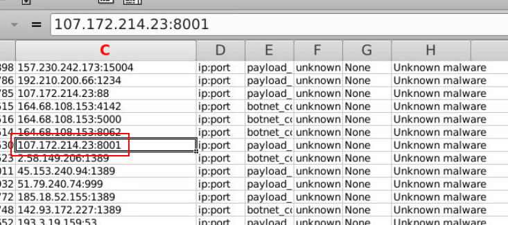
Find port 8001 then you will eventually get an IP address
```
107.172.214.23
```

>Investigating the reference material, what is the CVE ID of the vulnerability that this IP has been trying to exploit? And what is the industry nickname for this vulnerability?

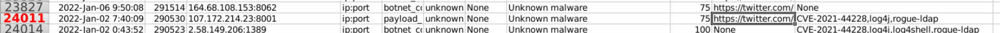
We didn't have to follow the reference material, just details from csv file is enough 

It's a log4j vulnerability (CVE-2021-44228)

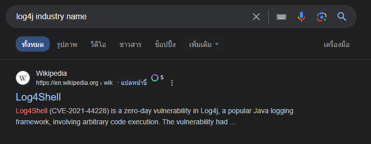
Which have Log4Shell as industry nickname
```
CVE-2021-44228,Log4Shell
```

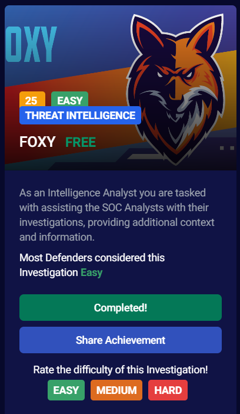
* * *