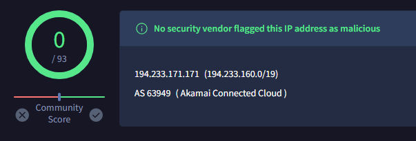

# [Blue Team Labs Online - Piggy](https://blueteamlabs.online/home/investigation/piggy-aij2bd8h2)
Created: 10/06/2024 12:20
Last Updated: 10/06/2024 13:48
* * *
<div align=center>


</div>

>Investigate some simple network activity in Wireshark!

>**Tags**: Wireshark, ATT&CK, OSINT
* * *

**Scenario**
Investigate some simple network activity in Wireshark! You can launch Wireshark in a terminal with the command 'wireshark'. The questions are mapped to the four PCAPs on the Desktop.

* * *
## Investigation Submission
>PCAP One) What remote IP address was used to transfer data over SSH? (Format: X.X.X.X)


Open PCAP ONE file then filter for SSH then we will have this external IP address communicating with internal IP address

```
35.211.33.16
```

>PCAP One) How much data was transferred in total? (Format: XXXX M)


Open Conversations Statistics then we can see how many bytes were transfer on this conversation.

```
1131 M
```

>PCAP Two) Review the IPs the infected system has communicated with. Perform OSINT searches to identify the malware family tied to this infrastructure (Format: MalwareName)


Open Conversations Statistics and search all external IP addresses on VirusTotal


Then we will have this IP address that were used for Trickbot C2

```
trickbot
```

>PCAP Three) Review the two IPs that are communicating on an unusual port. What are the two ASN numbers these IPs belong to? (Format: ASN, ASN)


Open Endpoints Statistic and go to TCP, we can see that last 2 IP addresses were communicating on port 8000 and 8080




I couldn't find ASN number on Wireshark so I have to get them from VirusTotal

```
14061, 63949
```

>PCAP Three) Perform OSINT checks. What malware category have these IPs been attributed to historically? (Format: MalwareType) 


Find those uncommon ports to inspect which kind of data that were being transferred then we can see it does look like they were communicating with json 

Another indicator is mining which mean it could be cryptominer malware.


Search for these 2 IP addresses on Google then I found there is a blog list containing both of them.


Confirmed that this IP address associated with cryptominer

```
miner
```

>PCAP Three) What ATT&CK technique is most closely related to this activity? (Format: TXXXX)


Cryptomining will use resource on infected machine to mine cryptocurrency so MITRE ATT&CK technique that perfectly described this is Resource Hijacking

```
T1496
```

>PCAP Four) Go to View > Time Display Format > Seconds Since Beginning of Capture. How long into the capture was the first TXT record query made? (Use the default time, which is seconds since the packet capture started) (Format: X.xxxxxx)


I used Find Packet to find for TXT record query directly

```
8.527712
```

>PCAP Four) Go to View > Time Display Format > UTC Date and Time of Day. What is the date and timestamp? (Format: YYYY-MM-DD HH:MM:SS)


```
2024-05-24 10:08:50
```

>PCAP Four) What is the ATT&CK subtechnique relating to this activity? (Format: TXXXX.xxx)


We can see this weird domain were in TXT record which probably indicate that it was used for C2 communication or DNS tunneling


```
T1071.004
```


* * *