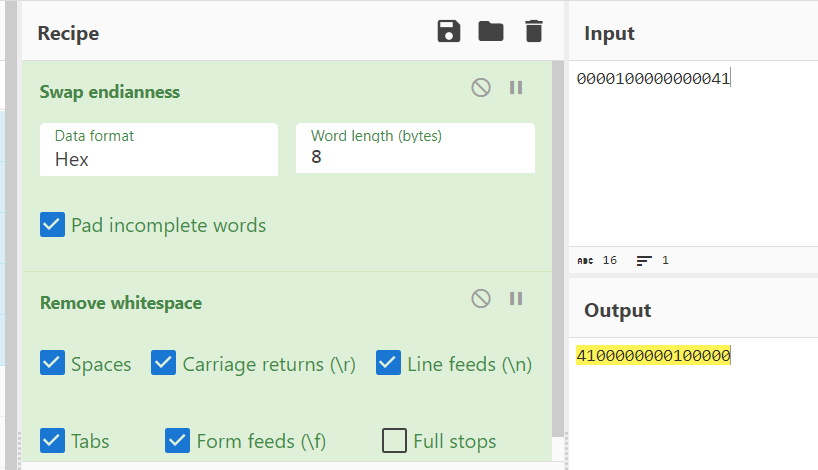
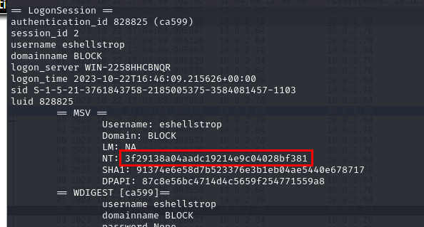

# [TryHackMe - Block](https://tryhackme.com/r/room/blockroom)

Encryption? What encryption?
***
Created: 17/08/2024 16:30
Last Updated: 17/08/2024 20:38
***
One of your junior system administrators forgot to deactivate two accounts from a pair of recently fired employees.
We believe these employees used the credentials they were given in order to access some of the many private files from our server, but we need concrete proof.
The junior system administrator only has a small network capture of the incident and a memory dump of the Local Security Authority Subsystem Service process.
Fortunately, for your company, that is all you need.

>What is the username of the first person who accessed our server?


We got lsass dump and a pcap file so we have to investigate this incident on Wireshark which you can see that the first SMB session was created for `WORKGROUP\mrealman` user and look like he tried to get something from client network share.

```
mrealman
```

>What is the password of the user in question 1?


Since we have lsass dump then we can use `pypykatz lsa minidump lsass.DMP` to get NT hash of all users logged on during the time that this process was dumped and here is the NT hash of `mrealman` user


We can use `john` or `hashcat` to crack it but I always try with CrackStation.net first and the result was not disappointing.

```
Blockbuster1
```

>What is the flag that the first user got access to?

We need to decrypt SMB3 if we want to retrieve a flag accessed by this user


I did some google search and found this [medium blog](https://medium.com/maverislabs/decrypting-smb3-traffic-with-just-a-pcap-absolutely-maybe-712ed23ff6a2) talking about generate random session key from 
- User’s password or NTLM hash 
- User’s domain
- User’s username
- NTProofStr
- Encrypted Session Key

And even provided us with a python script for it

We already know domain, username and password and what left are NTProofStr and Encrypted Session Key


Inspect packet 11 (Session Setup Request of the first user) then go to "SMB2 (Server Message Block Protocol version 2)" > "Session Setup Request (0x01)" > "Security Blob..." > "GSS-API..." > "Simple Protected Negotiation" > "NTLM Secure Service Provider" which you can obtain NTProofStr and Encrypted Session Key from here.


I asked ChatGPT for a little bit transformation from python 2 to python 3 (my kali can not installed pycryptodomex for python 2) but do not worry all functions are still the same

So we can proceed with `python3 random_session_key_calc_py3.py -u mrealman -d WORKGROUP -p Blockbuster1 -n 16e816dead16d4ca7d5d6dee4a015c14 -k fde53b54cb676b9bbf0fb1fbef384698` to get random session key.


Now what left is to get Session Id from here and swap endianness of it before import it.



We can do it manually or we can use Cyberchef, its a fair game 

Now these are both values we need to import to our Wireshark.
`4100000000100000:20a642c086ef74eee26277bf1d0cff8c`


Go to "Edit" > "Preferences" > "Protocols" > "SMB2" > "Secret Session Key for decryption" and "Edit..." to import our session and after click "OK", We should be able to export file that was accessed by the first user.


Go to "File" > "Export Objects" > "SMB..." then we can see that the SMB3 traffic of the first user are decrypted and we can export this csv file to get our flag


```
THM{SmB_DeCrypTing_who_Could_Have_Th0ughT}
```

Note: This is me after obtained a second flag of this challenge, turn out we can just go to "Edit" > "Preferences" > "Protocols" > "NTLMSSP" and insert NT Password then Wireshark will be able to decrypt SMB2 traffic for `mrealman` user just fine


>What is the username of the second person who accessed our server?


After we're done with the first user, the other user that accessed to client network share is this user

```
eshellstrop
```

>What is the hash of the user in question 4?



Lets look up for NT hash of this user from lsass dump again


This question does not need to submit password but I still tried it with Crackstation anyway which turns out there is no match for this hash on this site.

```
3f29138a04aadc19214e9c04028bf381
```

>What is the flag that the second user got access to?

After struggled for a while because I could not crack the hash, I found another [medium blog](https://medium.com/tenable-techblog/decrypt-encrypted-stub-data-in-wireshark-deb132c076e7) that changed everything! and turn out we can use Kerberos key (keytab file) to decrypt kerberos blobs which will also decrypt SMB3 traffic of that particular user and we do not even need to crack NT hash for it


Get a script to create Kerberos key [here](https://github.com/dirkjanm/forest-trust-tools/blob/master/keytab.py) then edit tuple inside `keys` list right here


Execute a script with `python3 keytab.py keytab.kt` then we will have keytab file ready to be imported


Go to "Edit" > "Preferences" > "Protocols" > "KRB5" then check for "Try to decrypt Kerberos blobs" and browse our keytab file then click Okay


After imported keytab file now we should be able to export another csv file that stores second flag.


```
THM{No_PasSw0Rd?_No_Pr0bl3m}
```

***