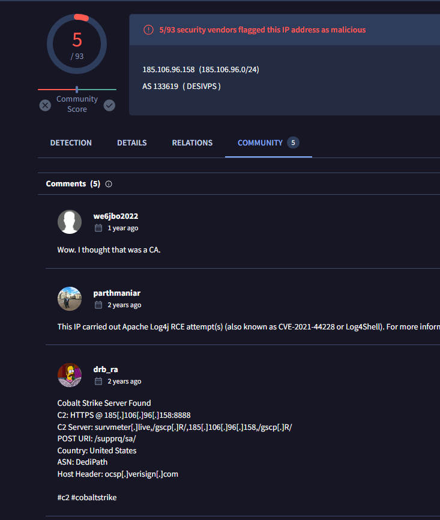

# [TryHackMe - Carnage](https://tryhackme.com/r/room/c2carnage)

Apply your analytical skills to analyze the malicious network traffic using Wireshark.
***
Created: 16/08/2024 13:49
Last Updated: 16/08/2024 15:24
***
Eric Fischer from the Purchasing Department at Bartell Ltd has received an email from a known contact with a Word document attachment.  Upon opening the document, he accidentally clicked on "Enable Content."  The SOC Department immediately received an alert from the endpoint agent that Eric's workstation was making suspicious connections outbound. The pcap was retrieved from the network sensor and handed to you for analysis. 

**Task**: Investigate the packet capture and uncover the malicious activities. 

>What was the date and time for the first HTTP connection to the malicious IP? <br>
(answer format: yyyy-mm-dd hh:mm:ss)


Opened sample pcap file then use `http` filter which will filter all other protocols and focus only on HTTP traffic then we will see that packet number 1735 is the first packet from this specific IP address but we did not know yet if this IP address is really malicious


Searched this IP address on VirusTotal, and also inspected the request which turn out this IP address is really malicious IP address that hosted a zip file that contains malicious document file.

```
2021-09-24 16:44:38
```

>What is the name of the zip file that was downloaded?


And this is the name of zip file that was downloaded to victim host, Go to "File" > "Export Objects" > "HTTP" then export it out 

```
documents.zip
```

>What was the domain hosting the malicious zip file?
```
attirenepal.com
```

>Without downloading the file, what is the name of the file in the zip file?


Since we already exported zip file, lets open it which we can see that it contains an xls file (which likely to be malicious document).

```
chart-1530076591.xls
```

>What is the name of the webserver of the malicious IP from which the zip file was downloaded?


Inspect this conversation then you can see that this server is using PHP and we could get a name of this webserver right there

```
LiteSpeed
```

>What is the version of the webserver from the previous question?
```
PHP/7.2.34
```

>Malicious files were downloaded to the victim host from multiple domains. What were the three domains involved with this activity?


We will have to use `dns` filter for this one and find DNS queries that happened after zip file was downloaded, we can use VirusTotal to confirm the maliciousness of each domain then we will have these 3 pair queries hence 3 domains we are looking for.

```
finejewels.com.au,thietbiagh.com,new.americold.com
```

>Which certificate authority issued the SSL certificate to the first domain from the previous question?


We have to inspect TLSv1.2 traffic to the first domain and we will see that the CA that issued SSL certificate for this domain is GoDaddy

```
GoDaddy
```

>What are the two IP addresses of the Cobalt Strike servers? Use VirusTotal (the Community tab) to confirm if IPs are identified as Cobalt Strike C2 servers. (answer format: enter the IP addresses in sequential order)


We already know the victim IP address and we could guess that C2 servers most likely to be contacted with TCP so we can use `tcp && ip.addr == 10.9.23.102` to open Conversations statistic and go through each of them that match answer format of this question


This is the first C2 server we found, Community tab got us cover here 


And here is the second C2 server

```
185.106.96.158,185.125.204.174
```

>What is the Host header for the first Cobalt Strike IP address from the previous question?



On the first domain, I also came across other comment in the community tab on VirusTotal which the commenter thought it was CA and the comment from `drb_ra` telling us the Host Header of this C2 but we need to confirm it on our pcap file first


We can use `tcp && ip.addr == 185.106.96.158` to filter for TCP traffic to this C2 which we can see that the Host Header is the same as we found on VirusTotal

```
ocsp.verisign.com
```

>What is the domain name for the first IP address of the Cobalt Strike server? You may use VirusTotal to confirm if it's the Cobalt Strike server (check the Community tab).


We can use `dns` filter again for this one and find for the response that contains C2 IP address and we will obtain this domain from packet number 6511

```
survmeter.live
```

>What is the domain name of the second Cobalt Strike server IP?  You may use VirusTotal to confirm if it's the Cobalt Strike server (check the Community tab).


 
We're still using `dns` filter but this time, we just have to search for second C2 IP address 

```
securitybusinpuff.com
```

>What is the domain name of the post-infection traffic?


From the beginning of this investigation, we can see that there are multiple POST requests to specific web server and the Request URL does look like base64 encoded but what we will focus on right now is the domain name of this server which we can obtain it from Host Header.

```
maldivehost.net
```

>What are the first eleven characters that the victim host sends out to the malicious domain involved in the post-infection traffic?


At first, I thought this question is asking for first 11 characters/bytes but turns out its asking for the path of this request right here. 

```
zLIisQRWZI9
```

>What was the length for the first packet sent out to the C2 server?


We can get the length of this packet here

```
281
```

>What was the Server header for the malicious domain from the previous question?


We can get the answer of this question here

```
Apache/2.4.49 (cPanel) OpenSSL/1.1.1l mod_bwlimited/1.4
```

>The malware used an API to check for the IP address of the victim’s machine. What was the date and time when the DNS query for the IP check domain occurred? (answer format: yyyy-mm-dd hh:mm:ss UTC)


Back to our `dns` filter again then we can use "Find Packet" to find for `api` or `ip` which we will come across this domain which is the one we are looking for 

```
2021-09-24 17:00:04
```

>What was the domain in the DNS query from the previous question?
```
api.ipify.org
```

>Looks like there was some malicious spam (malspam) activity going on. What was the first MAIL FROM address observed in the traffic?


For this one, we have to use `smtp` filter for SMTP protocol then inspect MAIL FROM packet to get an email address of malspam sender.

```
farshin@mailfa.com
```

>How many packets were observed for the SMTP traffic?


When we are using `smtp` filter, look at the bottom which we can see how many SMTP packets were displayed (total SMTP packets on this pcap)

```
1439
```


***