# [TryHackMe - Disk Analysis & Autopsy](https://tryhackme.com/r/room/autopsy2ze0)

Ready for a challenge? Use Autopsy to investigate artifacts from a disk image.
***
Created: 14/09/2024 12:59
Last Updated: 14/09/2024 23:46
***
>What is the MD5 hash of the E01 image?

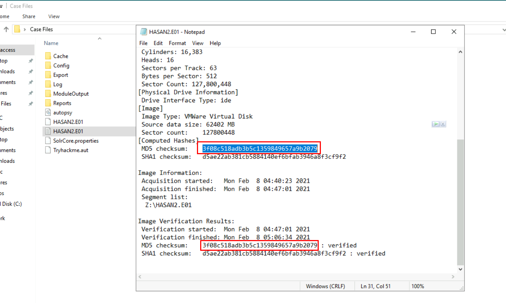

Alright, lets get straight to the `Case Files` folder on the desktop which we can see that it contains autopsy case file and E01 disk image file along with log file from FTK Imager, FTK imager will also do hash checksum at the end of evidence collection so we can obtain MD5 hash from there without doing it with cmd or PowerShell.

```
3f08c518adb3b5c1359849657a9b2079
```

>What is the computer account name?

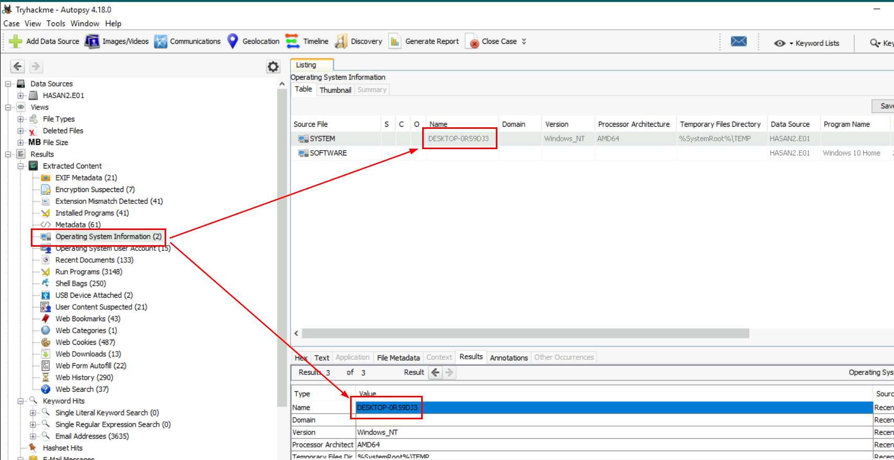

Now lets open Autopsy case file and browse for OS information here, Autopsy already extracted some useful information for us and we need to find them according to the question which as you can see that Autopsy already extracted computer name from SYSTEM registry hive right here.

```
DESKTOP-0R59DJ3	
```

>List all the user accounts. (alphabetical order)

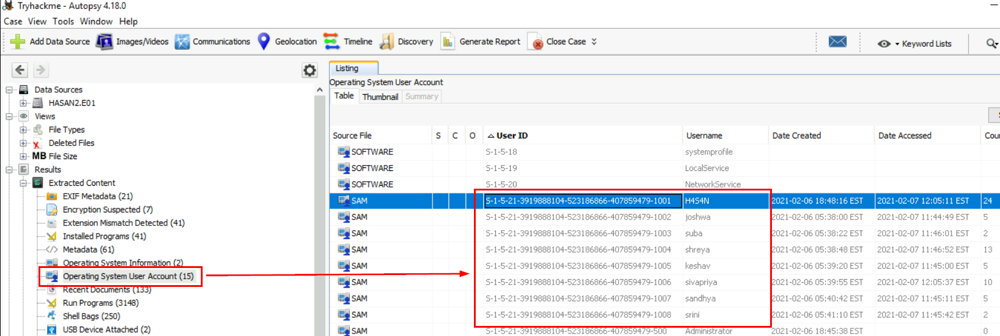

Go to "Operating System User Account" then sort by "User ID" first so we can distinguish which are user accounts and which are service accounts (user account will have RID start with 100x) and as you can see there are 8 user accounts on this system so we can copy them and sort it elsewhere (or you can sort it on Autopsy now by "Username") then answer the question. 

```
H4S4N,joshwa,keshav,sandhya,shreya,sivapriya,srini,suba
```

>Who was the last user to log into the computer?

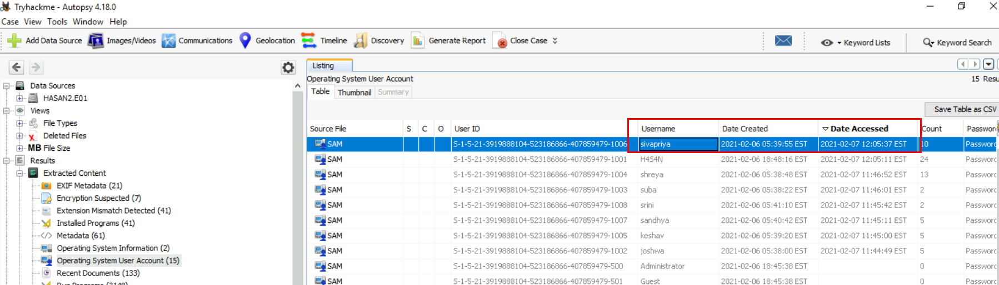

We just need to sort by "Date Accessed" time to find out which user is the last one who logged into the computer.

```
sivapriya
```

>What was the IP address of the computer?

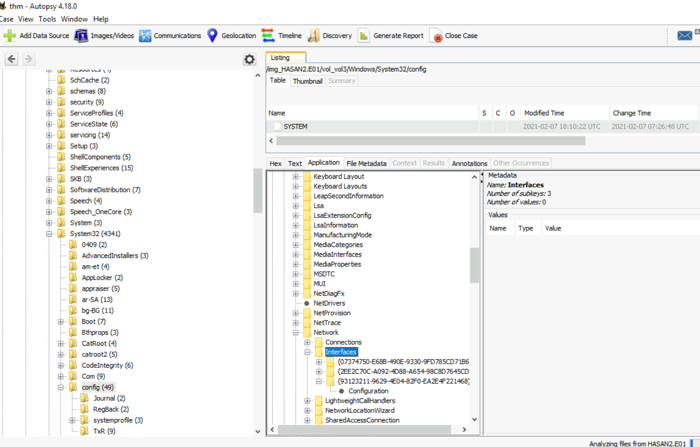

I tried to get the IP address from Network Interface registry keys but there is nothing there so we will have to find another way

*Notice case name changed? because I could not use "Application" function on the registry hive on provided case so I made a new one which solved this issue for me.

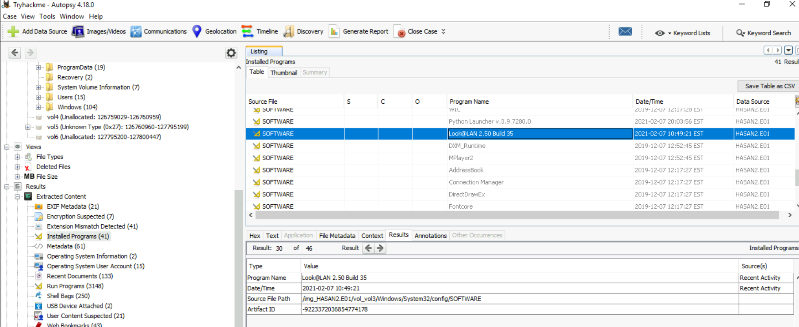

Upon inspecting installed program, notice that there is one program that might has something to do with networking.

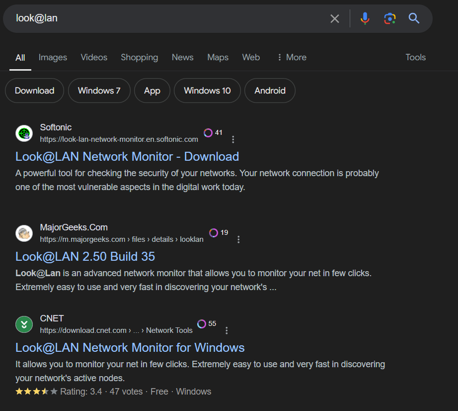

Sure enough, its network monitor tool so we will have to dig into install location of this program to find config file or initial (.ini) file that could store some useful information that might help us.

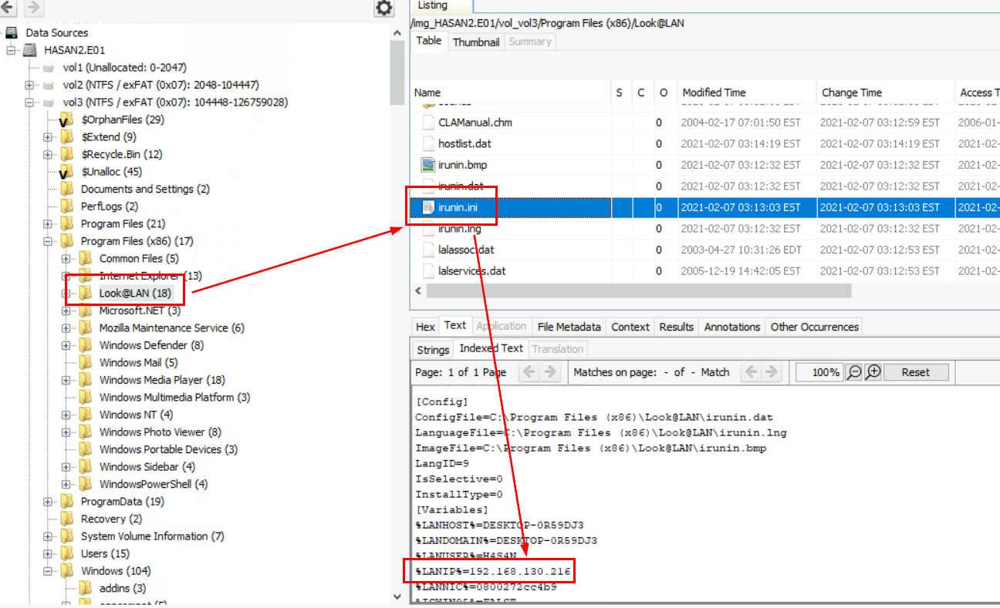

And there it is, `irunin.ini` under `\Program Files (x86)\Look@LAN` actually stores an IP address and MAC address of this computer.

```
192.168.130.216
```

>What was the MAC address of the computer? (XX-XX-XX-XX-XX-XX)

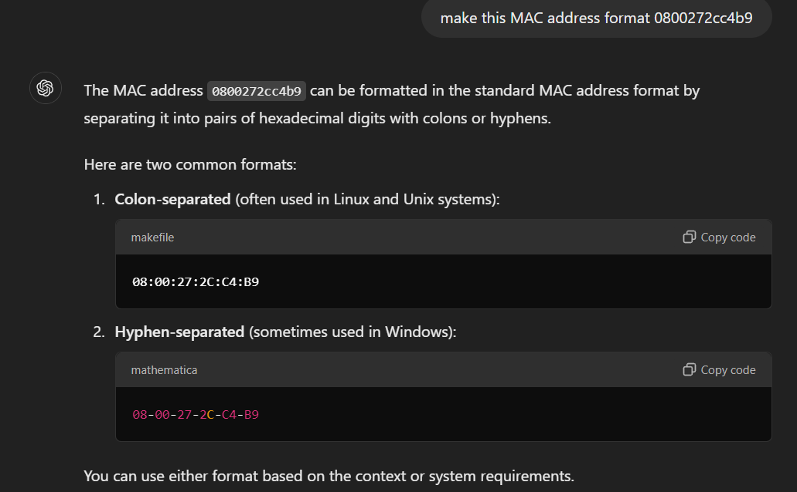

I was so lazy to format it myself so I made ChatGPT reformat this MAC for me, it worked btw.

```
08-00-27-2C-C4-B9
```

>What is the name of the network card on this computer?

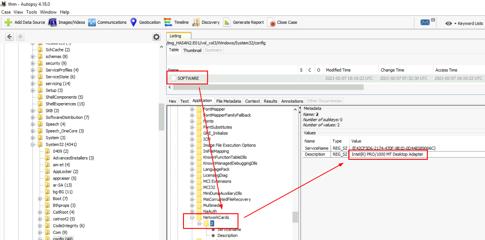

For this one, we have to go to `HKEY_LOCAL_MACHINE\SOFTWARE\Microsoft\Windows NT\CurrentVersion\NetworkCards` to get an answer.

```
Intel(R) PRO/1000 MT Desktop Adapter
```

>What is the name of the network monitoring tool?
```
Look@LAN
```

>A user bookmarked a Google Maps location. What are the coordinates of the location?

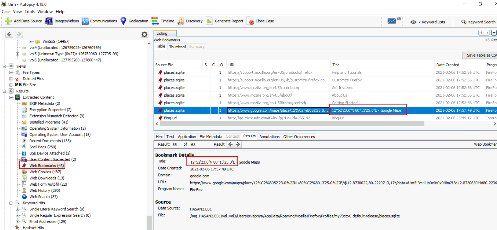

Autopsy already parsed browser artefacts for us so we just have to dig into "Web Bookmarks" which we will see that there is 1 Google Maps Location that was bookmarked right here.

```
12°52'23.0"N 80°13'25.0"E
```

>A user has his full name printed on his desktop wallpaper. What is the user's full name?

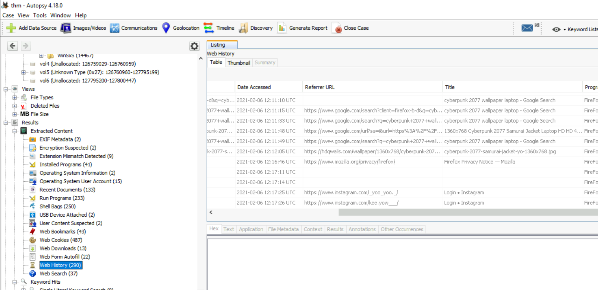

Upon inspecting "Web History", I noticed that at least 2 users downloaded desktop wallpaper from the internet so we can reduce the scope of finding to only 2 users.

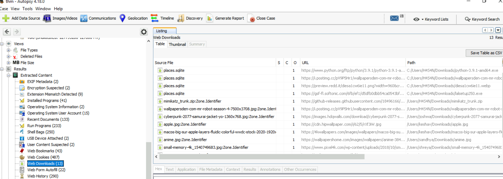

And by checking "Web Downloads", we got path that these wallpaper got downloaded 

Notice that mimikatz was also downloaded, we will keep that in mind.

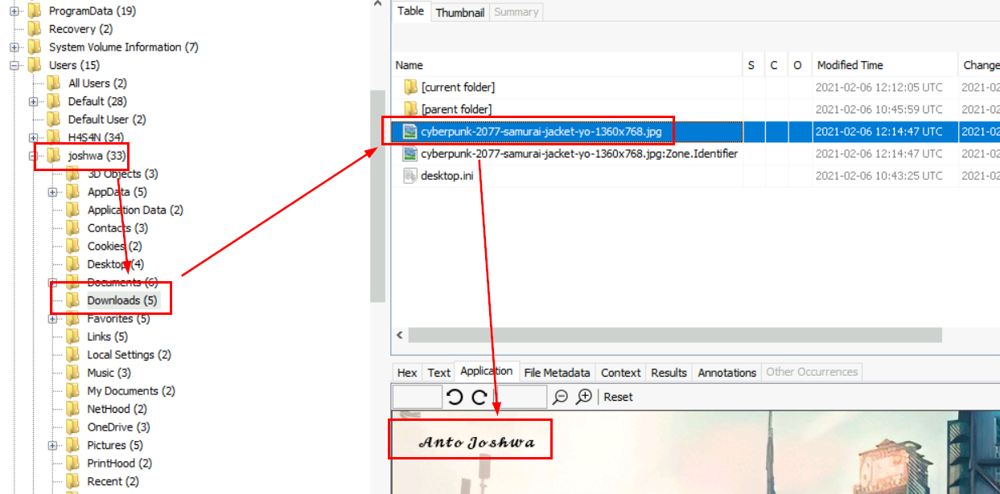

The answer of this question lies in user joshwa's download folder right here.

```
Anto Joshwa
```

>A user had a file on her desktop. It had a flag but she changed the flag using PowerShell. What was the first flag?

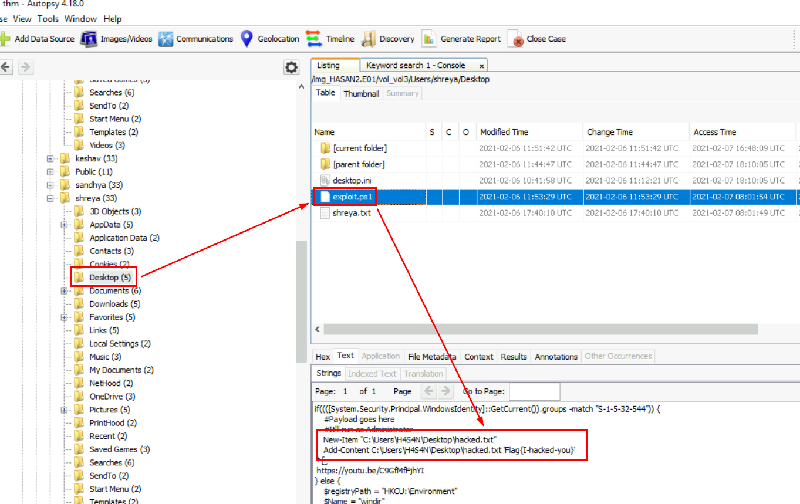

I went to check for each user desktop first which I found this PowerShell exploit script on shreya desktop and we could see that this script also create a new file contains a flag on H4S4N desktop but this should be the latest flag (answer of the next question) so we have to get PowerShell History log to find out the old flag.

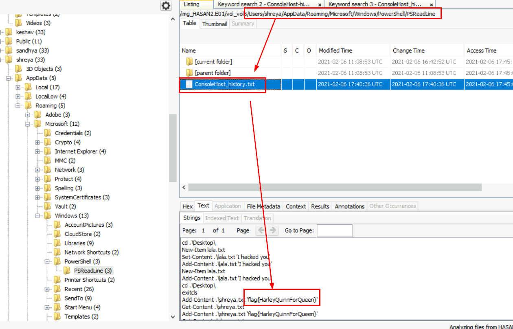

It is indeed different from the latest one we found earlier.

```
flag{HarleyQuinnForQueen}
```

>The same user found an exploit to escalate privileges on the computer. What was the message to the device owner?
```
Flag{I-hacked-you}
```

>2 hack tools focused on passwords were found in the system. What are the names of these tools? (alphabetical order)

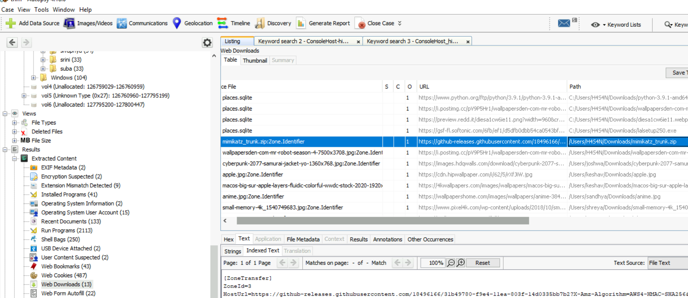

We already know that one of them is mimikatz but what is the other one?

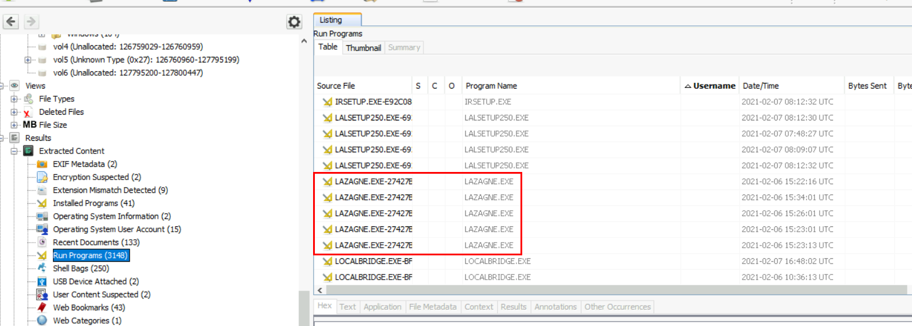

I did not find anything from PowerShell history log but since this is Windows so maybe that tool is also an executable file and when an executable file is executed on Windows, Prefetch file will be created and Autopsy already parased those prefetch files for us which we can see that [LaZange](https://github.com/AlessandroZ/LaZagne) is the other tool focused on passwords.

```
Lazagne,Mimikatz
```

>There is a YARA file on the computer. Inspect the file. What is the name of the author?

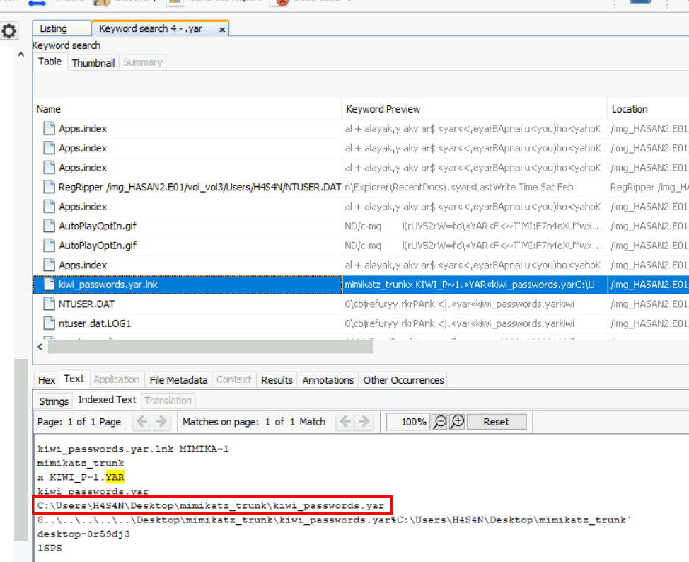

We know that YARA file has `.yar` extension so I searched for this extension which we can see that `kiwi_passwords.yar` is the file we're looking for.

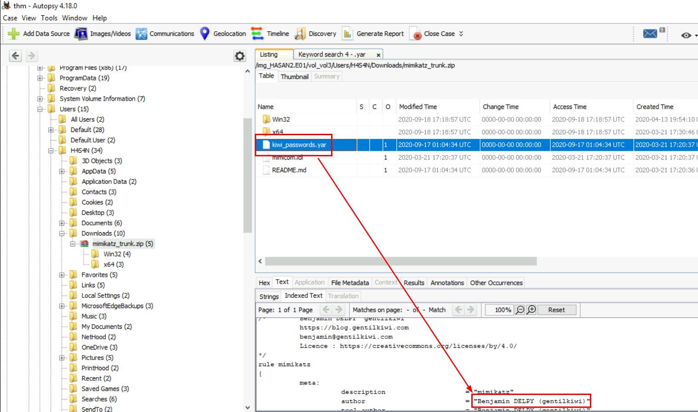

I could not find mimikatz folder, maybe it was deleted but we still have zip file that store this YARA file so we can read YARA rule from this file and answer the question.

```
Benjamin DELPY (gentilkiwi)
```

>One of the users wanted to exploit a domain controller with an MS-NRPC based exploit. What is the filename of the archive that you found? (include the spaces in your answer)

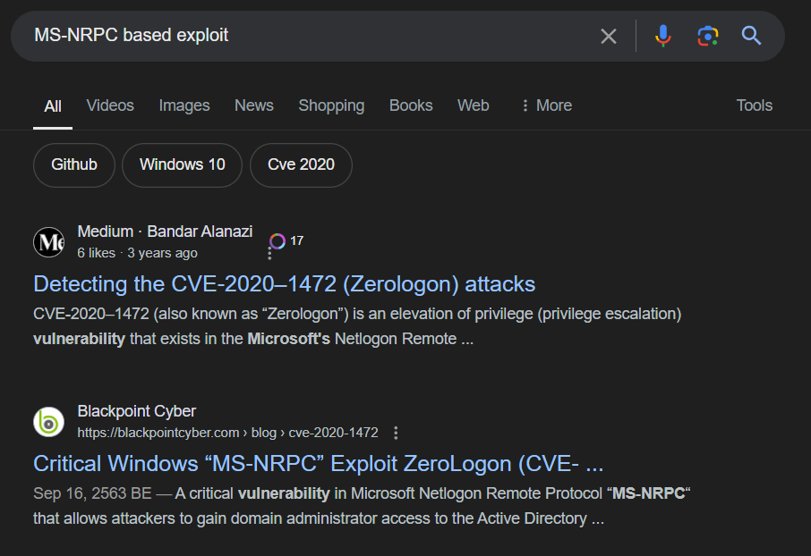

I started by searching on Google to find any clue about this exploit which give me a name of the vulnerability which is ZeroLogon.

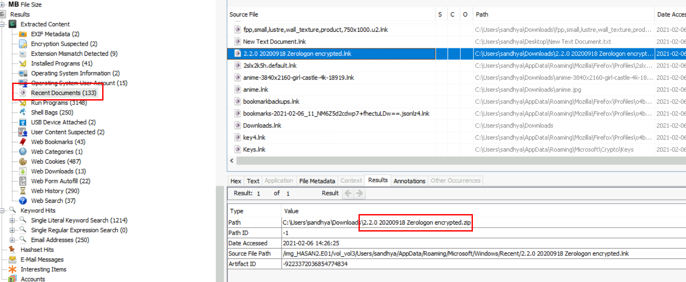

And I found the file name of this archive from "Recent Documents".

```
2.2.0 20200918 Zerologon encrypted.zip
```

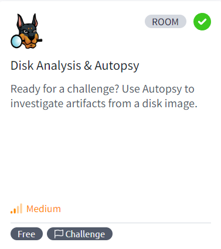
***