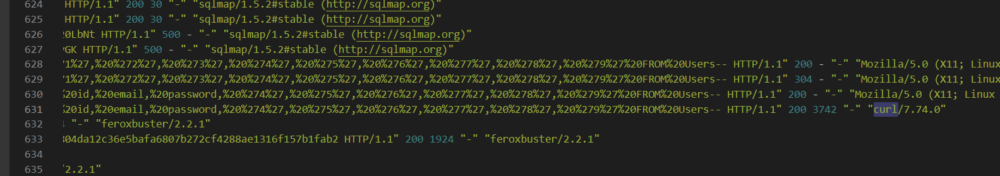

# [TryHackMe - Juicy Details](https://tryhackme.com/r/room/juicydetails)

A popular juice shop has been breached! Analyze the logs to see what had happened...
***
Created: 09/08/2024 18:20
Last Updated: 10/08/2024 17:37
***
You were hired as a SOC Analyst for one of the biggest Juice Shops in the world and an attacker has made their way into your network. 

Your tasks are:
- Figure out what techniques and tools the attacker used
- What endpoints were vulnerable
- What sensitive data was accessed and stolen from the environment

An IT team has sent you a **zip file** containing logs from the server. Download the attached file, type in "I am ready!" and get to work! There's no time to lose!

## Reconnaissance
Analyze the provided log files.

Look carefully at:
- What tools the attacker used
- What endpoints the attacker tried to exploit
- What endpoints were vulnerable

>What tools did the attacker use? (Order by the occurrence in the log)


Lets start with `access.log` which is web server log and the indicator that we will looking for is User-Agent of each request made to web server and as we can see that the first tool that used on this web server is `nmap`


After that, The attacker found `/rest/user/login` could be brute-forced so `hydra` was used for this purpose


After that the attacker moved to `/rest/products/search` and used `sqlmap` on `q` variable 



Then after done with `sqlmap`, the attacker manually exploited SQL Injection attack using `curl` and finally, the attacker used `forexbuster` possibly to find hidden content/directories on this webserver that not supposed to be found

```
nmap, hydra, sqlmap, curl, feroxbuster
```

>What endpoint was vulnerable to a brute-force attack?


```
/rest/user/login
```


>What endpoint was vulnerable to SQL injection?


```
/rest/products/search
```

>What parameter was used for the SQL injection?
```
q
```

>What endpoint did the attacker try to use to retrieve files? (Include the /)


After directory fuzzing with `forexbuster`, the attacker found `/ftp` directory that stores 2 backup files and as we can see that the attacker tried to download them but failed

```
/ftp
```

## Stolen data
Analyze the provided log files.

Look carefully at:
- The attacker's movement on the website
- Response codes
- Abnormal query strings

>What section of the website did the attacker use to scrape user email addresses?


Before the attacker used `hydra` to brute-force on login page, we can see that there are some sort of recon on product review section of this website and after reviewing each path then we might notice that there are some different indicating each user review hence each user email address so the attacker might scrape them from this section

```
product review
```

>Was their brute-force attack successful? If so, what is the timestamp of the successful login? (Yay/Nay, 11/Apr/2021:09:xx:xx +0000)


Most of `hydra` request resulted in 401 HTTP Status Code but this one is 200 so this is the timestamp of successfully logged in or the time that the attacker noticed that that specific credential could be used on this website

```
Yay, 11/Apr/2021:09:16:31 +0000
```

>What user information was the attacker able to retrieve from the endpoint vulnerable to SQL injection?


From previous section, we noticed that the attacker manually exploited SQL Injection vulnerability with `curl` after done with `sqlmap` and we might also notice that the attacker used `UNION` to query `id`, `email` and `password` from `Users` table 

```
email, password
```

>What files did they try to download from the vulnerable endpoint? (endpoint from the previous task, question #5)


```
coupons_2013.md.bak, www-data.bak
```

>What service and account name were used to retrieve files from the previous question? (service, username)


We know that the attacker found 2 backup files on `ftp` so lets review `vsftpd.log` which we will see that the attacker successfully downloaded with `anonymous` login

```
ftp, anonymous
```

>What service and username were used to gain shell access to the server? (service, username)


`auth.log` were also given so I'm 100% sure it is ssh but which user? after reviewing failed password attempt, we can see which user that was brute-forced.


And the attacker successfully logged in as this user

```
ssh, www-data
```


***