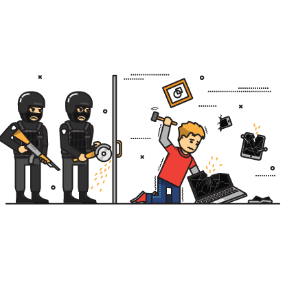
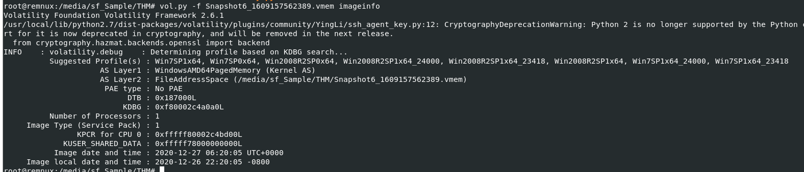
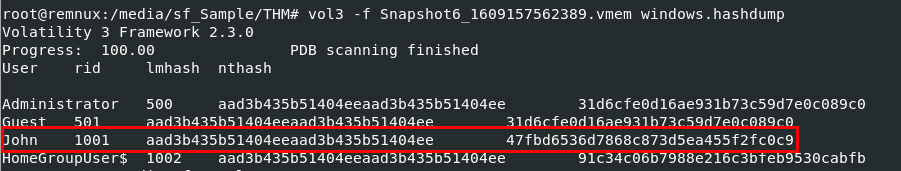
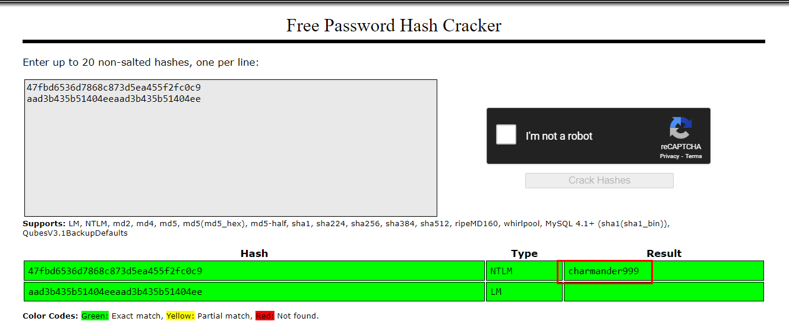
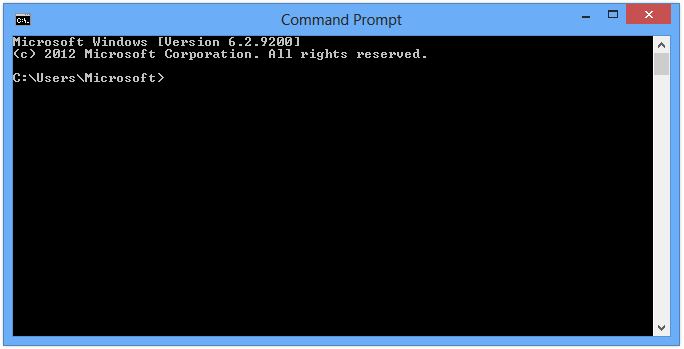
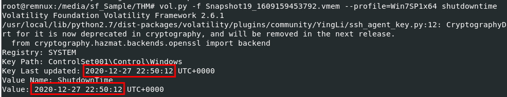
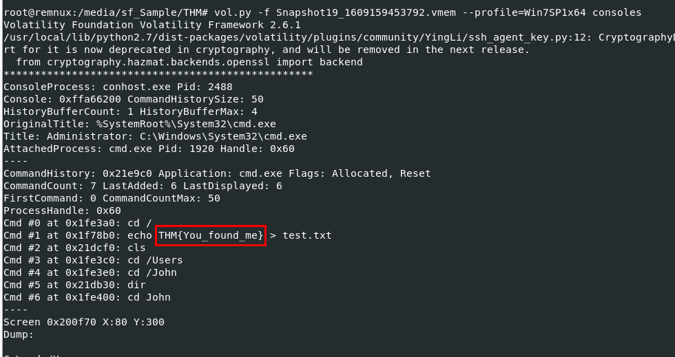
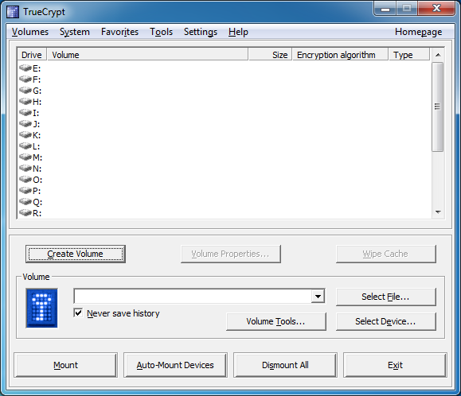
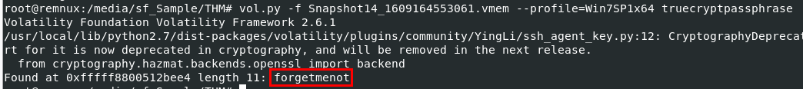
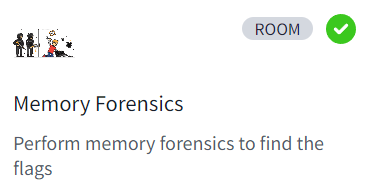

# [TryHackMe - Memory Forensics](https://tryhackme.com/r/room/memoryforensics)

Perform memory forensics to find the flags
***
Created: 26/07/2024 18:06
Last Updated: 28/07/2024 15:48
***
## Login
The forensic investigator on-site has performed the initial forensic analysis of John's computer and handed you the memory dump he generated on the computer. As the secondary forensic investigator, it is up to you to find all the required information in the memory dump.

**Task File**: `Snapshot6_1609157562389.vmem`

>What is John's password?



Lets start by determine which profile is the most suitable for this memory image with `vol.py -f Snapshot6_1609157562389.vmem imageinfo`

Note that on this challenge, we will get 3 different memory images from the same system because it was captured from 3 different times 

so even if we got suitable profile for this one, we need to run `imageinfo` or `kdbgscan` on every memory image again since volatility do not know that it was captured from the same system.



After determined which profile is the most suitable one, we can proceed with `vol3 -f Snapshot6_1609157562389.vmem windows.hashdump` to dump all NTLM hashes using `hashdump` plugin



Then we can use online rainbow table service such as https://crackstation.net/ or if you prefered `john`, you crack it with `john` too

```
charmander999
```

## Analysis

On arrival a picture was taken of the suspect's machine, on it, you could see that John had a command prompt window open. The picture wasn't very clear, sadly, and you could not see what John was doing in the command prompt window.

To complete your forensic timeline, you should also have a look at what other information you can find, when was the last time John turned off his computer?

**Task File**: `Snapshot19_1609159453792.vmem`

>When was the machine last shutdown?



We can use `vol.py -f Snapshot19_1609159453792.vmem --profile=Win7SP1x64 shutdowntime` to let volatility plugin extract shut down time from System registry of this memory image

```
2020-12-27 22:50:12
```

>What did John write?



Lets assume that "John" wrote something using command prompt than we can use `vol.py -f Snapshot19_1609159453792.vmem --profile=Win7SP1x64 consoles` to display console history of this memory image then we can see that "John" wrote a flag to a text file

```
You_found_me
```

## TrueCrypt

A common task of forensic investigators is looking for hidden partitions and encrypted files, as suspicion arose when TrueCrypt was found on the suspect's machine and an encrypted partition was found. The interrogation did not yield any success in getting the passphrase from the suspect, however, it may be present in the memory dump obtained from the suspect's computer.

**Task File**: `Snapshot14_1609164553061.vmem`

>What is the TrueCrypt passphrase?



Volatility 2 already have a plugin that will get TrueCrypt passphrase that stored in memory so we can use `vol.py -f Snapshot14_1609164553061.vmem --profile=Win7SP1x64 truecryptpassphrase` to get it and finish this challenge

```
forgetmenot
```


***