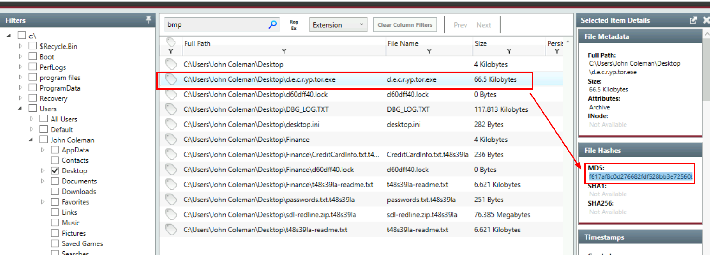

# [TryHackMe - REvil Corp](https://tryhackme.com/r/room/revilcorp?ref=blog.tryhackme.com)

You are involved in an incident response engagement and need to analyze an infected host using Redline.
***
Created: 15/08/2024 23:00
Last Updated: 16/08/2024 00:42
***
**Scenario**: One of the employees at Lockman Group gave an IT department the call; the user is frustrated and mentioned that all of his files are renamed to a weird file extension that he has never seen before. After looking at the user's workstation, the IT guy already knew what was going on and transferred the case to the Incident Response team for further investigation.

**You** are the incident responder. Let's see if you can solve this challenge using the infamous Redline tool. Happy Hunting, my friend!

>What is the compromised employee's full name?


After we got accessed to the machine, open redline memory file then go to "System Information" which we will see an information about system including OS and User

```
John Coleman
```

>What is the operating system of the compromised host?
```
Windows 7 Home Premium 7601 Service Pack 1
```

>What is the name of the malicious executable that the user opened?


Lets assume that user downloaded a ransomware from the internet (its likely to be the case in our real life) so we can go to "File Download History" then we can see that there is one particular executable file that was downloaded from a web server hosted in private network and this file is the one we are looking for

```
WinRAR2021.exe
```

>What is the full URL that the user visited to download the malicious binary? (include the binary as well)
```
http://192.168.75.129:4748/Documents/WinRAR2021.exe
```

>What is the MD5 hash of the binary?


To obtain an MD5 hash of the file we just found, lets go to "File System" and search for it then "Show Detail" of the file that we are interested in


After confirmed with VirusTotal, we can see that its REvil ransomware as the name of this room.

```
890a58f200dfff23165df9e1b088e58f
```

>What is the size of the binary in kilobytes?
```
164
```

>What is the extension to which the user's files got renamed?


While searching for MD5 of an executable file, we came across files with weird extension and it should be an extension ransomware generated for this host.

```
.t48s39la
```

>What is the number of files that got renamed and changed to that extension?

For this one, we can not just search for an extension we found from previous question but since we will find 24 files that not the answer of this question 


Luckily, we can use "Timeline" and select for Files "Modified" and "Changed" and search for the extension again, we will have 48 (double of 24) files in total

```
48
```

>What is the full path to the wallpaper that got changed by an attacker, including the image name?


For this one, we need to search for bmp (bitmap file) that was created after a ransomware was executed which we will see one bmp file on user temporary folder which is the correct answer of this question

```
C:\Users\John Coleman\AppData\Local\Temp\hk8.bmp
```

>The attacker left a note for the user on the Desktop; provide the name of the note with the extension.


When we searched for ransomware executable file, we also came across ransom note which has the name start with an extension of all encrypted files

```
t48s39la-readme.txt
```

>The attacker created a folder "Links for United States" under C:\Users\John Coleman\Favorites\ and left a file there. Provide the name of the file.


Search for this folder, then we will eventually find this one the is the most fit for an answer format of this question.

```
GobiernoUSA.gov.url.t48s39la
```

>There is a hidden file that was created on the user's Desktop that has 0 bytes. Provide the name of the hidden file.


We can go back to "File System" then find any file on user's desktop that has 0 bytes and there is only 1 file so we did not have to go back to "Timeline" to correlated timeline.

```
d60dff40.lock
```

>The user downloaded a decryptor hoping to decrypt all the files, but he failed. Provide the MD5 hash of the decryptor file. 



There is a decryptor executable on the desktop so we can get the hash there


But after I searched this hash on VirusTotal, its not the "decryptor" but its actually another "REVil" ransomware executable.

```
f617af8c0d276682fdf528bb3e72560b
```

>In the ransomware note, the attacker provided a URL that is accessible through the normal browser in order to decrypt one of the encrypted files for free. The user attempted to visit it. Provide the full URL path. 


Go to "Browser URL History" and find any URL that remotely closed to a site that would associated with this ransomware which we will eventually found this URL which is the correct answer of this question.

```
http://decryptor.top/644E7C8EFA02FBB7
```

>What are some three names associated with the malware which infected this host? (enter the names in alphabetical order)
```
REvil,Sodin,Sodinokibi
```


***