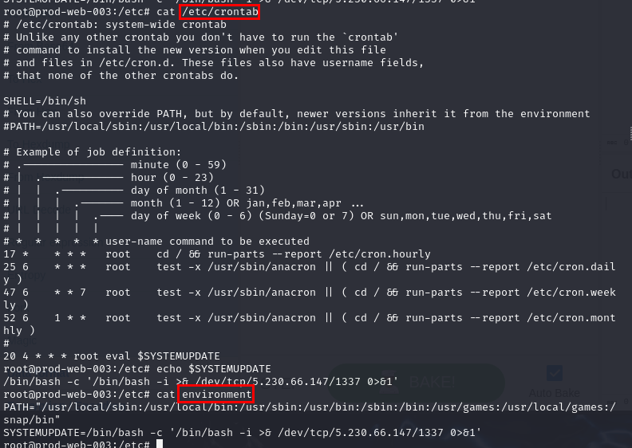

# TryHackMe - APIWizards Breach

Investigate a security breach at APIWizards Inc.
***
[toc]
***
You were hired as a dedicated external DFIR specialist to help the APIWizards Inc. company with a security incident in their production environment. APIWizards develop REST APIs on demand and hosts them on separate Ubuntu servers. The company suspects that one of its servers is compromised.

**APIWizards CISO**:

*"This is our third breach for this year: we see strange web requests in Nginx logs, then some unexpected changes in system files, and after a few days, we see our data in Telegram! We tried cleaning infected files, but hackers are always one step forward.”*

*“Yesterday, we observed a similar web scan on our newly deployed API server, and suspect it might be the same threat actors. We quickly isolated the server from the network and desperately hope for your help!”*
***
## Initial Access
*“We host our applications in home user directories and serve them via Nginx. This time, we deployed a simple API to get the date and time by specifying a timezone. Is there anything strange going on?”*

>Which programming language is a web application written in?


After connected to the server, there is one directory that stores files related to API service so after reviewing files inside this directory, we can see that web application was written in python.

```
python
```


Lets take a closer look into each file, we can see the `api.py` store each directories/endpoints that could interacted with user and both `/zone` and `/time` will execute OS command passed into `cmd` variable but the problem is in `/time` since anyone could pass arbitrary command to `tz` variable which will be parsed into `cmd` then execute it.

>What is the IP address that attacked the web server?


Since we already know that `/time` could lead to command injection vulnerability so we can use `grep -E "time" access.log.1` to confirm it which we can see that this one particular IP address actually executed arbitrary commands on this endpoint.


We can paste these command to ChatGPT and let it beautify things for us, now we can see that the attacker exploited this vulnerability and added SSH public key to dev's `authorized_keys` file so the attacker could access this system via SSH as dev.

```
149.34.244.142
```

>Which vulnerability was found and exploited in the API service?
```
os command injection
```

>Which file contained the credentials used to privesc to root?


Since dev is our current user so I checked `.bash_history` which we can see that the attacker uploaded `config.py` to C2 server and changed to root user using `sudo su` so we could guess that exfiltrated file contains user credential.


There it is.

```
/home/dev/apiservice/src/config.py
```

>What file did the hacker drop and execute to persist on the server?


Now lets switch to root and get content of `.bash_history`.


From `.bash_history`, we can see that the attacker did several things included
- Downloading a file from `transfer.sh` then executed it 
- Uploaded `.dump.json` C2 server
- Conducted port scanning with netcat (found port 8080 and backup file)
- Downloaded backup file
- Cleared log
- Checked `nginx` and `apiservice` service status (we might want to look into these 2 services later)

```
/tmp/rooter2
```

>Which service was used to host the “rooter2” malware?
```
transfer.sh
```

* * *
## Further Actions
*“No way it was so easy to exploit! While we are calling the developer, please check if there are any backdoors left by the hackers. They were extremely clever the previous two times, so be vigilant!”*

>Which two system files were infected to achieve cron persistence?



After checking for `/etc/crontab` file, we could see that root user will execute what whatever stores in `$SYSTEMUPDATE` variable at 4:20 AM every day so after checking `/etc/environment` next, then it is confirmed that the attacker compromised these 2 files to stay persistence and it receive reverse shell connection from this cron job everyday. 

```
/etc/crontab, /etc/environment
```

>What is the C2 server IP address of the malicious actor?
```
5.230.66.147
```

>What port is the backdoored bind bash shell listening at?

Cron job from the above is reverse shell but there is more bind shell? lets check it with `pstree -a`


Now we could see that there is netcat listener on port 3578 triggered by bash command so our next mission is to find out how this command got executed.

```
3578
```

>How does the bind shell persist across reboots?


I searched for this command with `grep -R 'nc -l' /etc/systemd/system 2>/dev/null` because I suspected that it has to be a service if not in cron job which we can see that `socket.service` is the service that responsible for this command so bind shell shall persist across reboot.

```
Systemd Service
```

>What is the absolute path of the malicious service?
```
/etc/systemd/system/socket.service
```

* * *
## Even More Persistence
*“We finally reached the developer and he said he would need two weeks to fix the vulnerability! Meanwhile, can you please proceed with the DFIR? We need every malicious indicator you can find to hunt for them on other APIWizards servers.”*

>Which port is blocked on the victim's firewall?


To list all Linux firewall rules, we can use `iptables -L` which we can see that there is one rule that will drop any packet send to port 3578 (bind shell port) but wait... if this is the case then no one can make a connection to this backdoor? well lets find out on the next question.

```
3578
```

>How do the firewall rules persist across reboots?


There is another persistence that will make things persist across reboots which is `.bashrc` file and after checking all the rules that will be added to `iptables` then its totally making sense since packet drop on port 3578 will be the latest one on this list and only this IP address can make a connection to the backdoor.

```
/root/.bashrc
```

>How is the backdoored local Linux user named?


After checking for potential malicious user from `/etc/passwd` file, we can see that there is one more user other than dev on this machine which is `support` and upon checking authentication log, we could see that this user was also added to `sudo` group so this user has to be the one we are looking for.

```
support
```

>Which privileged group was assigned to the user?
```
sudo
```

>What is the strange word on one of the backdoored SSH keys?


Lets check for `authorized_key` file of root user which we can see that only 1 public key on this file and the strange word has to be `ntsvc`.

```
ntsvc
```

>Can you spot and name one more popular persistence method? Not a MITRE technique name.


I toggled hint for this one, first word is special permission to executable files is `SUID` and the second word is `Binary` which make sense that this method can be abused for privilege escalation and also used for persistence.

```
SUID Binary
```

>What are the original and the backdoored binaries from question 6?


Now lets find out where is the SUID binary that the attacker abused with `find / -perm -u=s -type f 2>/dev/null`, the one that raise my suspicion is `clamav` one


So I tried to check the legitimacy of this binary which totally match `bash` binary so we found backdoored binary that can be used for privilege escalation and persistence.

```
/usr/bin/bash, /usr/bin/clamav
```

>What technique was used to hide the backdoor creation date?

A technique that changed timestamp of a file is called [Timestomping](https://attack.mitre.org/techniques/T1070/006/) and it can make backdoor file look like legitimate file if it can modify creation date of backdoor file to creation date of other legitimate binaries on this machine. 

```
Timestomping
```

* * *
## Final Target 
*“That’s a lot of persistence! But why would the hackers reveal all their techniques? Maybe to use the server as an entry point to our cardholder data environment? Please check for any traces of lateral movement or data exfiltration; perhaps dumps are still there.”*

>What file was dropped which contained gathered victim information?


We already know that `.dump.json` was exfiltrated so after checking content inside this file, we can see that it contains public IP address, OS with kernel information and internal IP addresses so no doubt that this file is a file that contained gathered victim information.

```
/root/.dump.json
```

>According to the dropped dump, what is the server’s kernel version?
```
5.15.0-78-generic
```

>Which active internal IPs were found by the “rooter2” network scan?
```
192.168.0.21, 192.168.0.22
```

>How did the hacker find an exposed HTTP index on another internal IP?


Remember netcat command that used to conduct port scanning and retrieve backup file from found port, yes its that one.

```
nc -zv 192.168.0.22 1024-10000 2>&1 | grep -v failed
```

>What command was used to exfiltrate the CDE database from the internal IP?
```
wget 192.168.0.22:8080/cde-backup.csv
```

>What is the most secret and precious string stored in the exfiltrated database?


Print out content of the backup file then we can see a flag of this room so now we can submit and complete this room.

```
pwned{v3ry-secur3-cardh0ld3r-data-environm3nt}
```


* * *