# CyGenixCTF Write-up (10/24 solved)
[toc]
***
Hello everyone, I tried to put myself out there on any CTF that I could participate and this time its is CyGenixCTF organized by Cybergenix Security partnered with YCF team

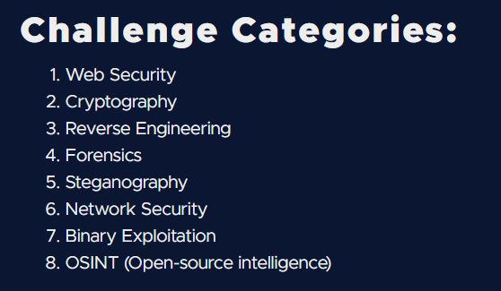

This CTF consists of 24 challenges separated by 8 categories that let us solve within 24 hours which I only solved 10 challenges by the end of this event (yes, i'm really that noob when it came to CTF).

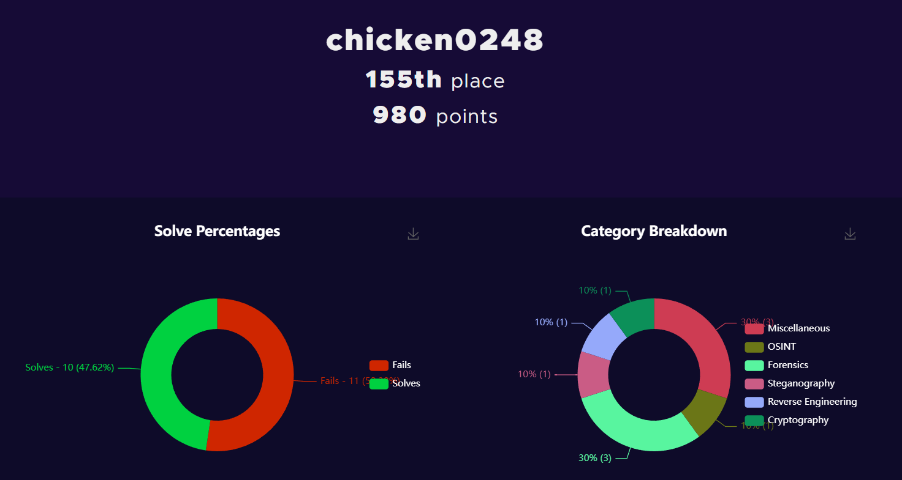

But I still want to share how I solved them nonetheless so without further ado, lets dive in!
***
## Forensics
### SUS Image (50)
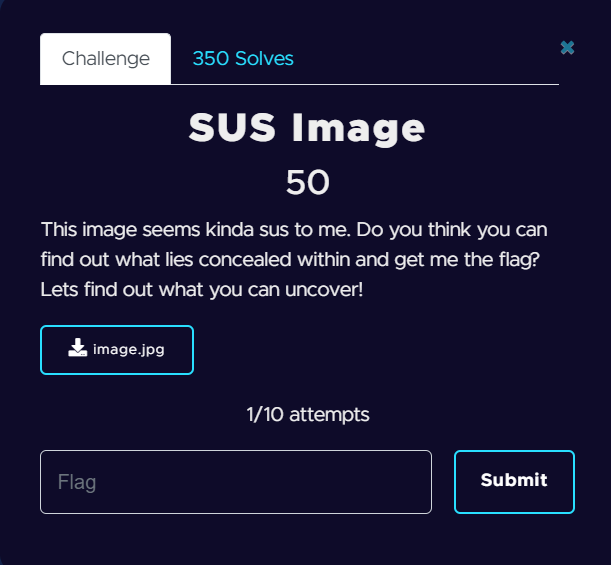

This image seems kinda sus to me. Do you think you can find out what lies concealed within and get me the flag? Lets find out what you can uncover!
***


On this challenge, we were provided with an image file of a minion with some text.

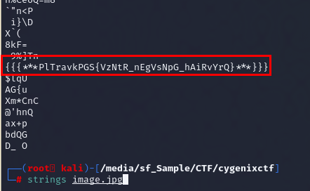

At first, I tried to extract some useful information with `exiftool` and determine if there is some file was embbeded with `steghide` but got no luck but then I used `strings` and found this weird string that does look like a decoded flag with ROT. 

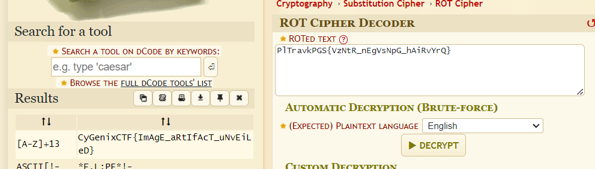

Then I went to https://www.dcode.fr/rot-cipher to bruteforce ROT Cipher then we can see that a flag was encoded with ROT13 and now we got a flag to submit

```
CyGenixCTF{ImAgE_aRtIfAcT_uNvEiLeD}
```

***
### Espionage (100)
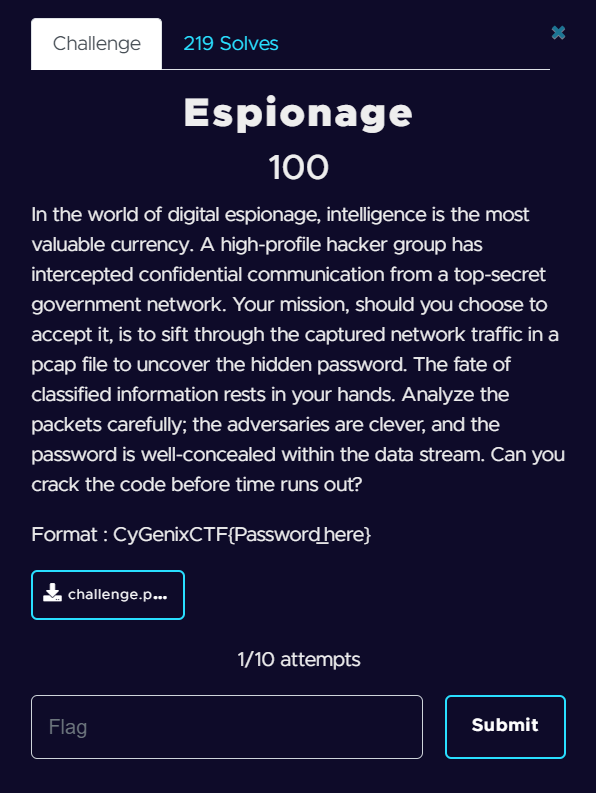

In the world of digital espionage, intelligence is the most valuable currency. A high-profile hacker group has intercepted confidential communication from a top-secret government network. Your mission, should you choose to accept it, is to sift through the captured network traffic in a pcap file to uncover the hidden password. The fate of classified information rests in your hands. Analyze the packets carefully; the adversaries are clever, and the password is well-concealed within the data stream. Can you crack the code before time runs out?

Format : CyGenixCTF{Password_here}
***

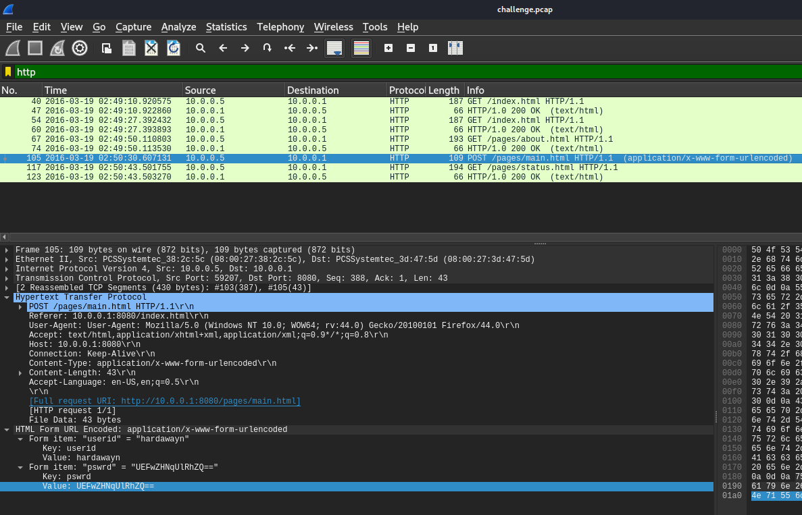

So the first thing we could do is to open provided pcap file with Wireshark and as you might notice that there is 1 HTTP POST request to `/pages/main.html` and password that was sent is base64 encoded.

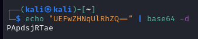

We can use any tool we like to decode it, `base64` binary in terminal was the quickest and easiest way at the time so I did just that and turned in a flag

```
CyGenixCTF{PApdsjRTae}
```

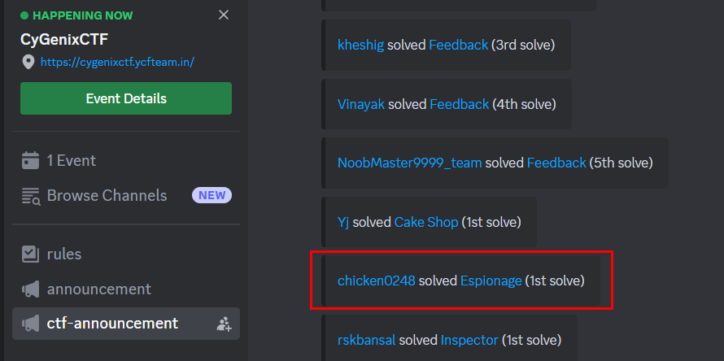

And somehow, I took the first blood of this challenge!
***
### Unmask (150)
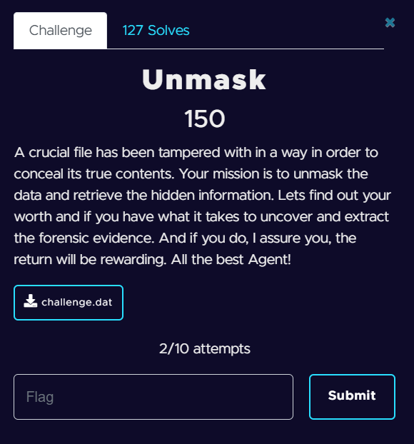

A crucial file has been tampered with in a way in order to conceal its true contents. Your mission is to unmask the data and retrieve the hidden information. Lets find out your worth and if you have what it takes to uncover and extract the forensic evidence. And if you do, I assure you, the return will be rewarding. All the best Agent!

***

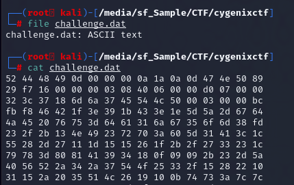

Its a file recovery challenge, so first thing I did was to check file type and content of this file which I did not recognize what it could be at first.

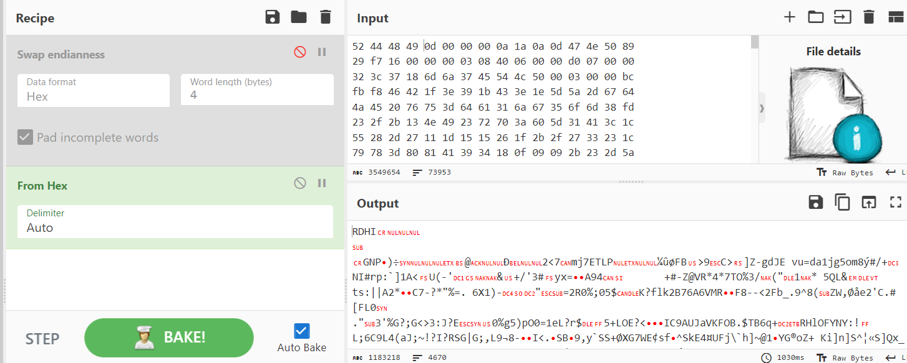

So I went to Cyberchef and use "From Hex" to make it a little bit easier for me to pick up some clues and as you might notice already, its a PNG image but the endianess was swapped.

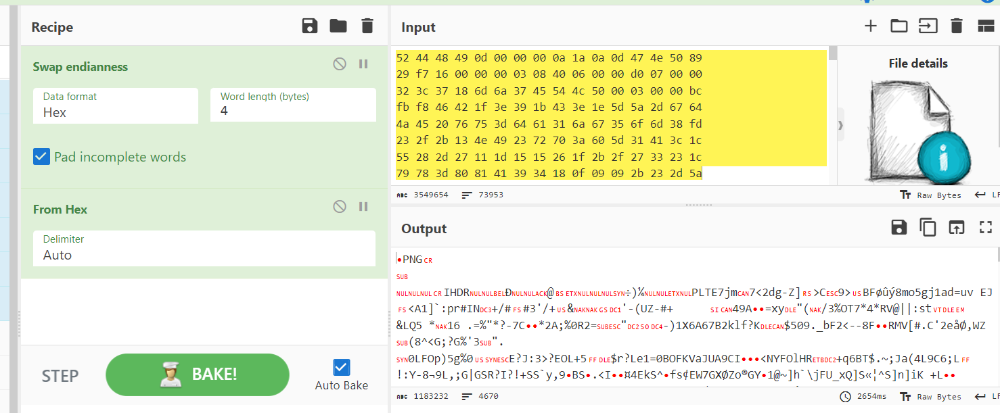

Then I used "Swap endianness" by 4 bytes to piece it back to PNG file again and save an output.

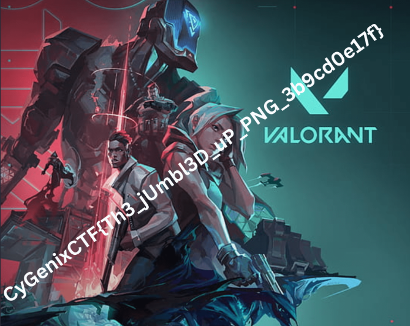

Here is an image file that was downloaded, magic number was really crucial for this challenge 

```
CyGenixCTF{Th3_jUmbl3D_uP_PNG_3b9cd0e17f}
```

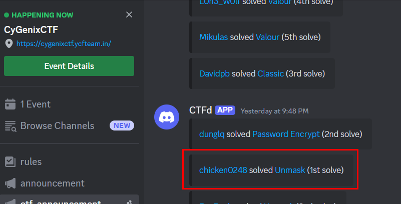

I also took first blood on this challenges too!

***
## Miscellaneous
### Sanity check (10)
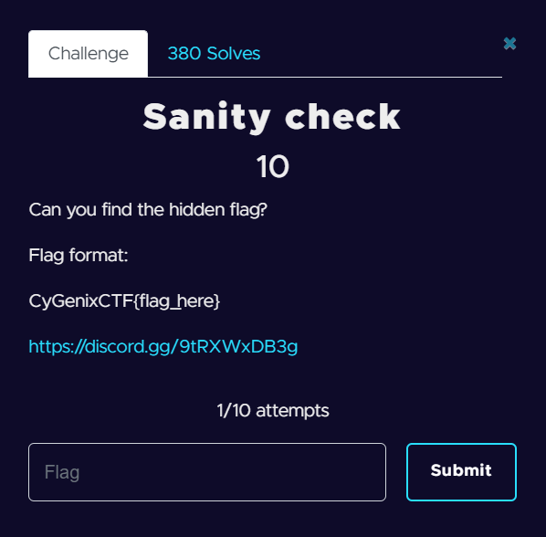

Can you find the hidden flag?

Flag format: CyGenixCTF{flag_here}
***

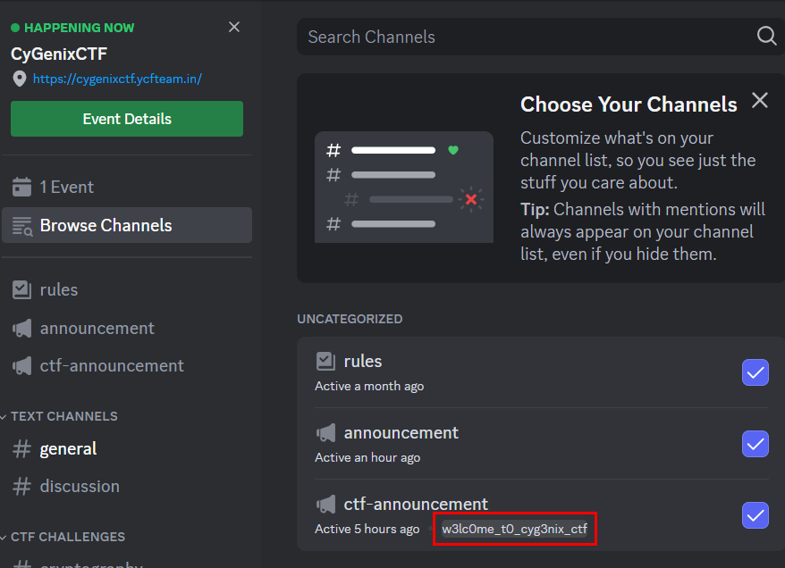

This one is considered very easy compared to other CTF I've ever particiated, I just need to join their discord for this challenge and browser for "ctf-announcement" channel description, a flag is right here

```
CyGenixCTF{w3lc0me_t0_cyg3nix_ctf}
```

***
### Whistleblower (100)
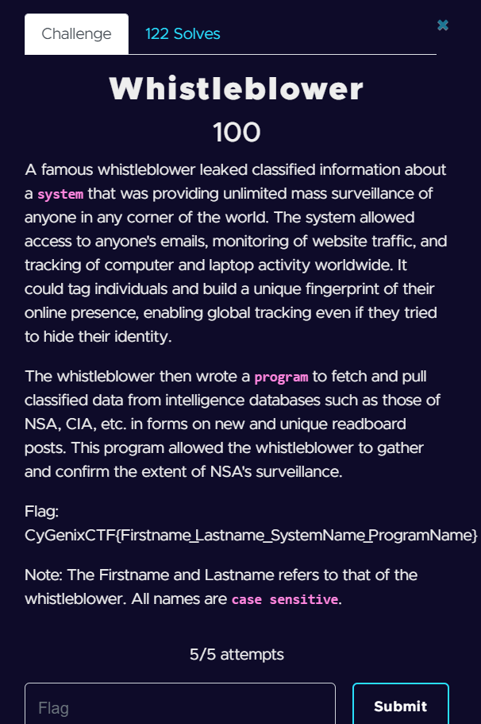

A famous whistleblower leaked classified information about a system that was providing unlimited mass surveillance of anyone in any corner of the world. The system allowed access to anyone's emails, monitoring of website traffic, and tracking of computer and laptop activity worldwide. It could tag individuals and build a unique fingerprint of their online presence, enabling global tracking even if they tried to hide their identity.

The whistleblower then wrote a program to fetch and pull classified data from intelligence databases such as those of NSA, CIA, etc. in forms on new and unique readboard posts. This program allowed the whistleblower to gather and confirm the extent of NSA's surveillance.

Flag: CyGenixCTF{Firstname_Lastname_SystemName_ProgramName}

Note: The Firstname and Lastname refers to that of the whistleblower. All names are case sensitive.
***
There is only 1 person that popped up in my mind after reading this and he is Edward Snowden!

At first I wasted 4 attempts on PRISM and XKeyscore because these are popular names constantly showed up but at my last attempt, I told myself to calm down and carefully review challenge description again

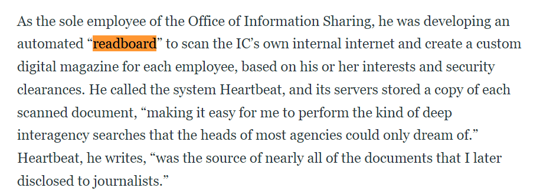

So I started by searching with "readboard" and tried to find any articles or news that mentions this things which lead me to https://www.thedailybeast.com/edward-snowden-is-exposing-his-own-secrets-this-time and then you can see that Snowden developed "Heartbeat" program himself to automated "readboard".

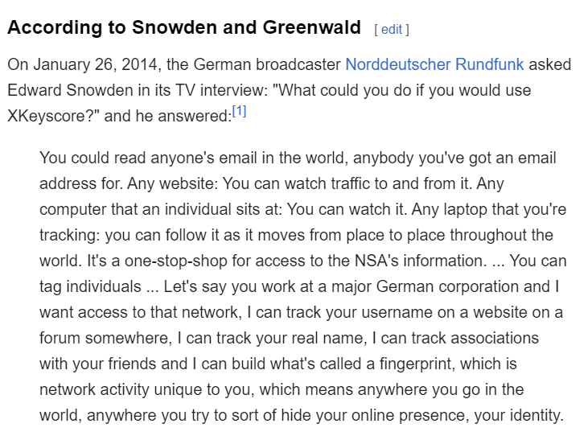

So we got Firstname, Lastname and ProgramName, what left is SystemName and this one should not be that hard since it became talk of the town then Snowden leaked NSA classified document which also leaked this https://en.wikipedia.org/wiki/XKeyscore system and if you watched "Snowden", a movie made to uncover what Snowden did and experienced when he worked for NSA then you will got this thing right in an instant.

```
CyGenixCTF{Edward_Snowden_XKeyscore_Heartbeat}
```
***
## Cryptography
### DH-900 (150)
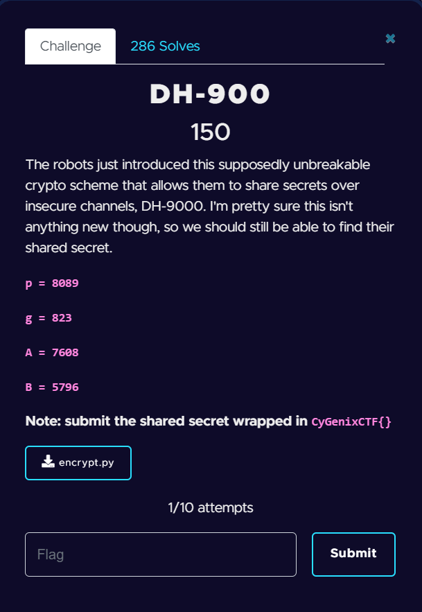

The robots just introduced this supposedly unbreakable crypto scheme that allows them to share secrets over insecure channels, DH-9000. I'm pretty sure this isn't anything new though, so we should still be able to find their shared secret.

p = 8089

g = 823

A = 7608

B = 5796

Note: submit the shared secret wrapped in CyGenixCTF{}
***
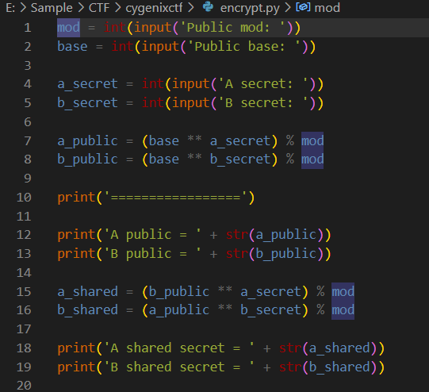

From these variables provided on challenge description and a script provided, we can determine that it is Diffie-Hellman problem so I asked ChatGPT to make a script for me

```
from sympy import mod_inverse

def find_private_key(g, A, p):
    for a in range(p):
        if pow(g, a, p) == A:
            return a
    return None

def compute_shared_secret(A, B, a, p):
    return pow(B, a, p)

# Given values
p = 8089
g = 823
A = 7608
B = 5796

# Find private key for Alice
a_private = find_private_key(g, A, p)
if a_private is not None:
    # Compute shared secret
    shared_secret = compute_shared_secret(A, B, a_private, p)
    print(f'CyGenixCTF{{{shared_secret}}}')
else:
    print('Private key not found')
```

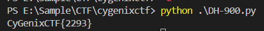

Then I executed it and submit this as a flag

```
CyGenixCTF{2293}
```
***
## Reverse Engineering
### Easy Peasy Apk (150)
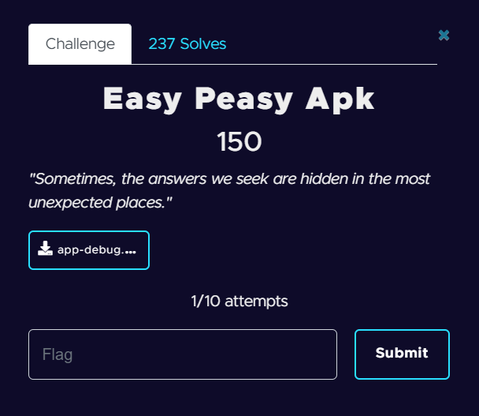
*"Sometimes, the answers we seek are hidden in the most unexpected places."*
***
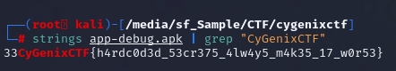

This challenge provided an apk file so I guess a legitimate way is to use android studio and find a flag inside of it but since I already know flag format then I tried using `strings` and accidently(?) found a flag right here

```
CyGenixCTF{h4rdc0d3d_53cr375_4lw4y5_m4k35_17_w0r53}
```
***
## Steganography
### Valour (100)
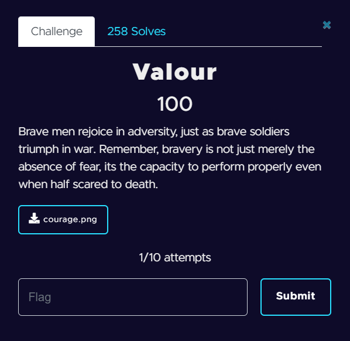

Brave men rejoice in adversity, just as brave soldiers triumph in war. Remember, bravery is not just merely the absence of fear, its the capacity to perform properly even when half scared to death.
***
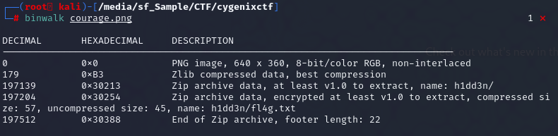

This challenge gave us png image file so when it comes to PNG file in steganography, first thing I always start with is `binwalk` which I hit a jackpot here as we can see that there is a zip file at 0x30254 (`h1dd3n/fl4g.txt`)

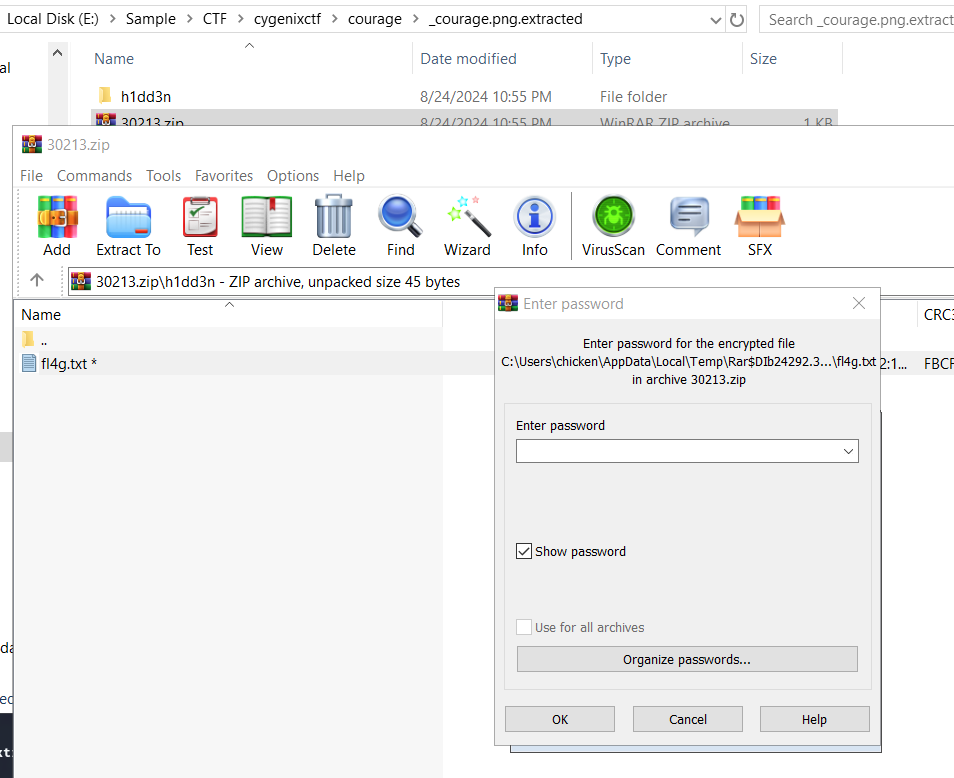

After extract it with `binwalk -e courage.png`, I got stuck with a password 

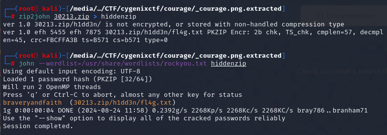

I tried to use `exiftool` to read metadata of an image file for some hint but there is none so I resorted to use `zip2john` and `john` with `rockyou.txt` wordlist then finally cracked a password for this zip

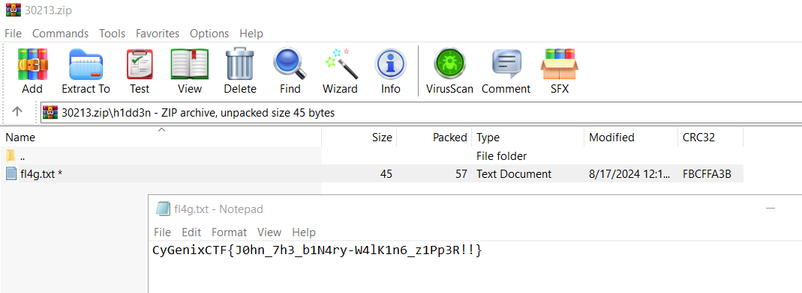

Then I used that password to open flag file then submitted it

```
CyGenixCTF{J0hn_7h3_b1N4ry-W4lK1n6_z1Pp3R!!}
```
***
## OSINT
### Cake Shop (150)
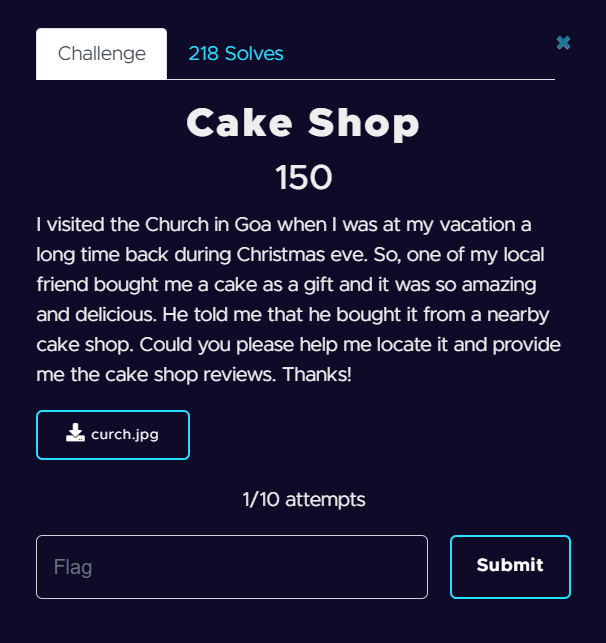

I visited the Church in Goa when I was at my vacation a long time back during Christmas eve. So, one of my local friend bought me a cake as a gift and it was so amazing and delicious. He told me that he bought it from a nearby cake shop. Could you please help me locate it and provide me the cake shop reviews. Thanks!
***
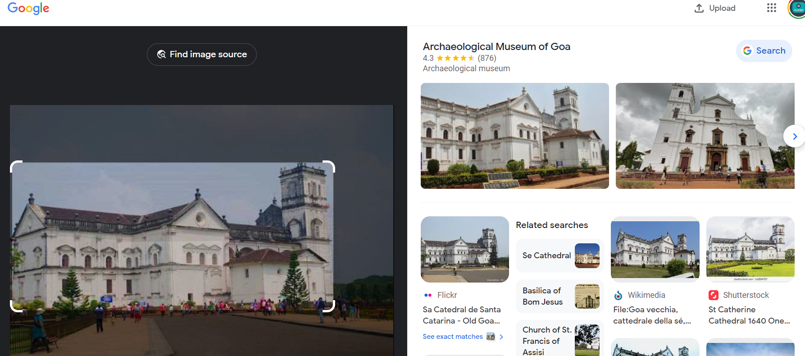

I started with Google Image Search to get a name of this place which is Archeological Museum of Goa

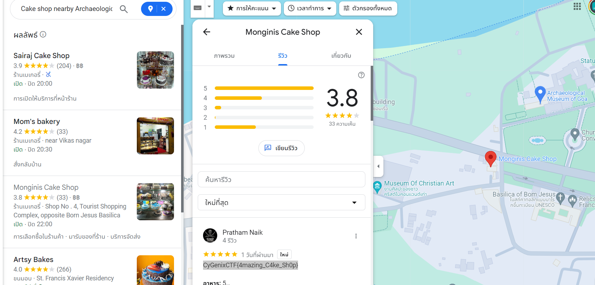

Then I used Google Maps to find the nearest cake shop to this place which I found a review in flag format right here 

```
CyGenixCTF{4mazing_C4ke_Sh0p}
```
***
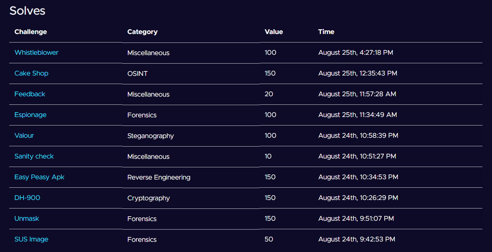

There are more challenges that I had an idea on how to solve them but I could not solve it in time due to my "skill issues" but I learned a lot after this CTF is done, a lot of people started sharing their solutions on discord and it was wonderful and delighted to learn from them!
***

